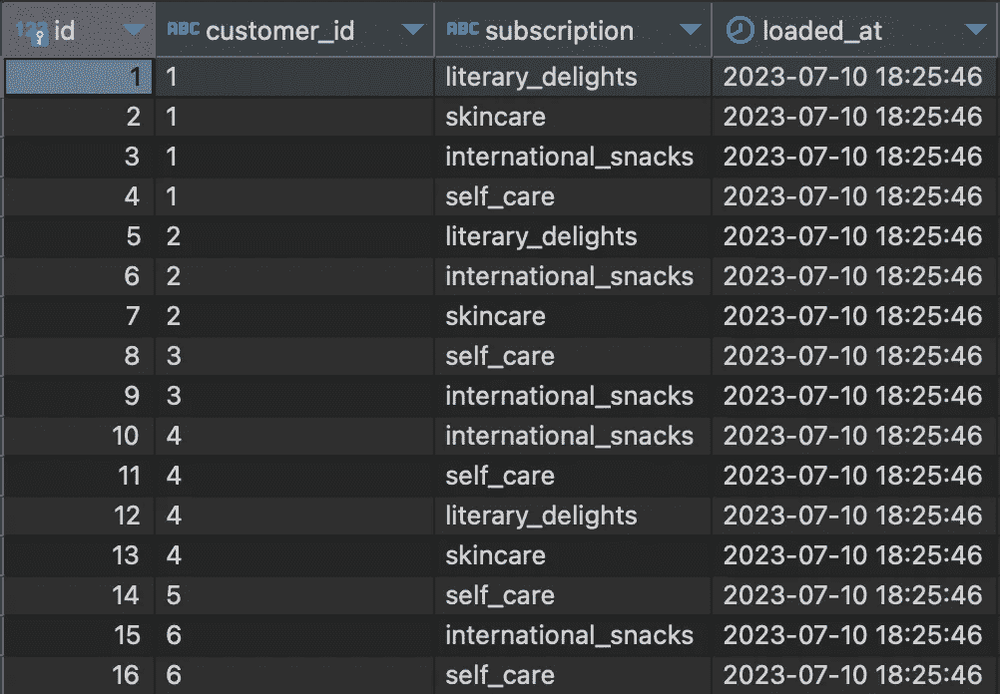

# 破解 MySQL 的 JSON_ARRAYAGG 函数以创建动态、多值维度

> 原文：[`towardsdatascience.com/hacking-mysqls-json-arrayagg-function-to-create-dynamic-multi-value-dimensions-211074115d28?source=collection_archive---------9-----------------------#2023-07-25`](https://towardsdatascience.com/hacking-mysqls-json-arrayagg-function-to-create-dynamic-multi-value-dimensions-211074115d28?source=collection_archive---------9-----------------------#2023-07-25)

## 补偿 MySQL 的一个不太为人知的不足

[](https://medium.com/@dakotasmithdata?source=post_page-----211074115d28--------------------------------)[](https://towardsdatascience.com/?source=post_page-----211074115d28--------------------------------) [Dakota Smith](https://medium.com/@dakotasmithdata?source=post_page-----211074115d28--------------------------------)

·

[关注](https://medium.com/m/signin?actionUrl=https%3A%2F%2Fmedium.com%2F_%2Fsubscribe%2Fuser%2Fdcadf2cebe12&operation=register&redirect=https%3A%2F%2Ftowardsdatascience.com%2Fhacking-mysqls-json-arrayagg-function-to-create-dynamic-multi-value-dimensions-211074115d28&user=Dakota+Smith&userId=dcadf2cebe12&source=post_page-dcadf2cebe12----211074115d28---------------------post_header-----------) 发布于 [Towards Data Science](https://towardsdatascience.com/?source=post_page-----211074115d28--------------------------------) ·9 分钟阅读·2023 年 7 月 25 日[](https://medium.com/m/signin?actionUrl=https%3A%2F%2Fmedium.com%2F_%2Fvote%2Ftowards-data-science%2F211074115d28&operation=register&redirect=https%3A%2F%2Ftowardsdatascience.com%2Fhacking-mysqls-json-arrayagg-function-to-create-dynamic-multi-value-dimensions-211074115d28&user=Dakota+Smith&userId=dcadf2cebe12&source=-----211074115d28---------------------clap_footer-----------)

--

[](https://medium.com/m/signin?actionUrl=https%3A%2F%2Fmedium.com%2F_%2Fbookmark%2Fp%2F211074115d28&operation=register&redirect=https%3A%2F%2Ftowardsdatascience.com%2Fhacking-mysqls-json-arrayagg-function-to-create-dynamic-multi-value-dimensions-211074115d28&source=-----211074115d28---------------------bookmark_footer-----------)

图片由 [Azamat E](https://unsplash.com/fr/@esen_aza?utm_source=medium&utm_medium=referral) 拍摄，刊登于 [Unsplash](https://unsplash.com/?utm_source=medium&utm_medium=referral)。感谢 Azamat！

# 介绍

让我们假设我们是一个订阅盒子公司的数据团队成员。在 MySQL 数据库中，购买的事务记录被写入名为 `subscriptions` 的表中。除了元数据之外，该表包含一个 `customer_id` 和 `subscription` 字段，类似于这样：



订阅表。（注意：所有图像，除非另有说明，均由作者提供）

*请注意，在这个示例场景中，一个客户可以有多个订阅。每条记录的唯一性由客户 ID 和订阅共同定义，即没有客户可以拥有相同的订阅两次。如果你想将这些测试数据加载到自己的数据库中，你可以在* [*这里*](https://github.com/dakotaleesmith/pyProjects/blob/main/tutorials/mysql_json_arrayagg_tutorial/create_table.sql)*找到相应的代码。*

作为一个订阅盒子公司，我们的目标是销售更多的订阅盒子。为此，产品团队最近指出我们当前的所有客户都拥有不止一个订阅。他们对这表明的客户行为感到好奇。他们要求我们的团队提供一个数据模型，展示用户购买的订阅组合，以及哪些组合最为常见。

市场营销团队对这个模型也表现出了兴趣。他们认为这些结果可能对市场营销捆绑产品促销、客户画像以及定向电子邮件活动有用。出于这些相同的原因，他们还希望查看每个客户购买的最常见*订阅数量*。

简而言之，请求的数据模型希望回答一些重要的问题，理想情况下这些问题将最终导致更高的订阅盒子销售。问题是，我们应该如何准确执行？

在这篇文章中，我们将解决一个独特的数据建模挑战，以弥补 MySQL 的一个不太为人所知的缺陷。我们将讨论定性聚合、JSON 数据类型，以及如何强制 MySQL 以一种产生独特、多值维度的方式对值进行排序。

## 目录

+   聚合作为维度

+   MySQL 中 JSON 数据类型的简要概述

+   JSON_ARRAYAGG

+   使用 ROW_NUMBER 强制值的排序

+   回顾

# 聚合作为维度

从概念上讲，我们需要做的事情相对简单：我们需要按客户对订阅进行捆绑（分组）。然后，我们需要查看这些捆绑，看看哪些最为常见，以及它们包含了多少订阅。

在数据建模术语中，我们关注的是某种形式的聚合：具体来说，是按客户对订阅进行聚合。

通常会想到定量意义上的聚合函数（`SUM`、`COUNT`等），这主要是因为 SQL 中大多数聚合函数的功能。但我们也可以将拼接的字符串值聚合成更长的、类似列表的字符串。

然而，这个挑战在于访问、操控或评估这些连接字符串中的值。MySQL 会将`foo, bar, hello, world`的值视为文本，而不是列表。

这有什么相关性？主要是因为在我们的假设场景中，我们想要计算每个组合中的订阅数量。我们不希望得到一个长的以逗号分隔的字符串，我们希望得到一个更真正的列表形式。

在 Python 中解决这个问题会很简单——使用 pandas，也许是 polars，甚至只是 Python 本身的数据结构。但有许多情况下这不是一个选项。也许数据团队只使用 dbt；或者更常见的是，你在一个 IT 部门严密锁定本地环境的公司工作。

无论如何，如果你只有 SQL 可以使用，你需要一个能够提供最可读代码和最灵活结果的解决方案。实现这一点并不直观。例如，我遇到这个问题时的第一反应是使用`GROUP_CONCAT`，这是一个根据你定义的分组连接字符串的函数：

```py
WITH
  subscriptions_grouped AS (
  SELECT
    customer_id,
    GROUP_CONCAT(subscription) AS subscriptions
  FROM 
    subscriptions
  GROUP BY customer_id
  )
SELECT
  subscriptions,
  COUNT(*) AS num_accounts
FROM subscriptions_grouped
GROUP BY subscriptions
;
```


查询结果

正如你所看到的，聚合*有效*，从技术上讲，但它并没有按照我们的业务逻辑工作。请查看第一行和最后一行。组合“international_snacks, self_care”的订阅与“self_care, international_snacks”是相同的组合。（第二行和第四行也是如此。）

我们可以在`GROUP_CONCAT`中使用`ORDER BY`子句来解决这个特定问题：

```py
WITH
  subscriptions_grouped AS (
  SELECT
    customer_id,
    GROUP_CONCAT(subscription ORDER BY subscription) AS subscriptions
  FROM 
    subscriptions
  GROUP BY 1
  )
SELECT
  subscriptions,
  COUNT(*) AS num_accounts
FROM subscriptions_grouped
GROUP BY subscriptions
;
```


查询结果

但这仍然留下了一个问题：如何计算每个组合中的订阅数量。

这样做是可行的。但我认为不仅复杂且不太易读，而且还伴随着一些不太明显的陷阱。

关于如何计算 MySQL 中以逗号分隔的字符串中的值数量的快速搜索找到了一个[解决方案](https://stackoverflow.com/a/7020024/16018746)，对我们来说，相当于这个（`subscriptions_grouped` CTE 除外）：

```py
SELECT
  subscriptions,
  LENGTH(subscriptions) - LENGTH(REPLACE(subscriptions, ',', '')) + 1 AS num_subscriptions,
  COUNT(*) AS num_accounts
FROM subscriptions_grouped
GROUP BY subscriptions
;
```

这本质上是计算逗号的数量，然后将结果加 1。这是可行的。但这个答案不仅难以一眼理解，还引入了一个潜在的错误：`LENGTH`和`CHAR_LENGTH`函数[计算的内容不同](https://stackoverflow.com/a/1734340/16018746)。

正如你可能猜到的，这篇文章详细描述了我在工作中遇到的障碍，当时我发现自己处于类似的情况。

最终，解决方案是使用本地 MySQL JSON 数据类型的某种黑客式但非常易懂的变通方法。

# MySQL 中 JSON 数据类型的简要概述

MySQL 中的 JSON 数据类型是在 5.7.8 版本中新增的，提供了许多对存储和建模非常有用的功能。

在 JSON 数据类型的伞下（官方称为“JSON 文档”）有两种不同的数据结构：JSON 数组和 JSON 对象。

JSON 数组可以简单地被看作是一个数组（如果你是 Python 爱好者的话，就是一个列表）：值用方括号 `[ ]` 括起来，并用逗号分隔。

+   一个 MySQL JSON 数组值的示例：`[“foo”, “bar”, 1, 2]`

JSON 对象可以被看作是一个哈希表（或者用 Python 的术语说，就是一个字典）：键值对，用逗号分隔，并用花括号 `{ }` 括起来。

+   一个 MySQL JSON 对象值的示例：`{“foo”: “bar”, 1: 2}`

[MySQL 提供了许多函数来处理这两种格式](https://dev.mysql.com/doc/refman/5.7/en/json-function-reference.html)—几乎没有函数执行任何形式的聚合。

不过幸运的是，有两个函数是可以的。它们都返回 JSON 文档，这意味着我们可以使用 MySQL 内置的函数来访问其中的值。

# JSON_ARRAYAGG

MySQL 函数 `JSON_ARRAYAGG` 很像 `GROUP_CONCAT`。最大的区别是它返回一个 JSON 数组，而这个 JSON 数组带有多个有用的内置函数，如上所述。

JSON 数组数据类型以惊人的简单性解决了我们面临的两个问题中的一个：可靠计算组合中订阅数量的问题。这是通过使用 `[JSON_LENGTH](https://dev.mysql.com/doc/refman/5.7/en/json-attribute-functions.html#function_json-length)` 函数完成的。语法非常简单：

```py
SELECT JSON_LENGTH(JSON_ARRAY("foo", "bar", "hello", "world"));
-- JSON_ARRAY function used here just to quickly create an example array
```

这个语句的结果是 4，因为生成的 JSON 数组中有 4 个值。

但让我们回到订阅的组合。不幸的是，`JSON_ARRAYAGG` 不具备 `GROUP_CONCAT` 的排序功能。在基查询之前即使在 CTE 中排序 `subscription` 值，也无法返回期望的结果：

```py
WITH
  subscriptions_ordered AS (
  SELECT
    customer_id,
    subscription
  FROM subscriptions
  ORDER BY subscription 
  )
  , subscriptions_grouped AS (
  SELECT
    customer_id,
    JSON_ARRAYAGG(subscription) AS subscriptions,
    JSON_LENGTH(JSON_ARRAYAGG(subscription)) AS num_subscriptions
  FROM 
    subscriptions_ordered
  GROUP BY customer_id
  )
SELECT
  subscriptions,
  COUNT(*) AS num_accounts
  num_subscriptions
FROM subscriptions_grouped
GROUP BY subscriptions
;
```


查询结果

每个组合中的订阅数量是存在的，这要归功于 `JSON_LENGTH` 函数——但由于它们的顺序，相同的组合再次被错误地标记为不同的。

## 使用 ROW_NUMBER 强制值的排序

`ROW_NUMBER` 是一个窗口函数，用于创建索引。索引必须被定义；也就是说，你需要告诉它从哪里开始，如何递增（方向），以及在哪里结束。

我们可以通过应用 `ROW_NUMBER` 函数并告诉它按 `subscription` 字段排序来快速查看一个例子：

```py
SELECT 
  customer_id, 
  subscription, 
  ROW_NUMBER() OVER(ORDER BY subscription) AS alphabetical_row_num
FROM subscriptions
;
```


查询结果

仔细查看结果。***尽管我们在查询的最后没有使用*** `ORDER BY` ***语句，但数据还是根据*** `ORDER BY` ***在*** `OVER` ***子句中的顺序进行了排序。***

当然，这还不是我们想要的。接下来我们需要在窗口函数中添加一个 `PARTITION BY` 子句，以便结果的排序与每个客户 ID 相关（实际上是受每个客户 ID 的限制）。如下所示：

```py
SELECT 
  customer_id, 
  subscription, 
  ROW_NUMBER() OVER(PARTITION BY customer_id ORDER BY subscription) AS alphabetical_order
FROM subscriptions
;
```


查询结果

你可能已经看出接下来会发生什么了。

如果我们在 CTE 中对这些结果执行 `JSON_ARRAYAGG` 函数，我们会看到重复的组合现在看起来完全一样，这要归功于 `ROW_NUMBER` 函数强制按字母顺序排序的订阅：

```py
WITH 
  subscriptions_ordered AS (
  SELECT 
    customer_id, 
    subscription, 
    ROW_NUMBER() OVER(PARTITION BY customer_id ORDER BY subscription) AS alphabetical_order
  FROM subscriptions
  )
SELECT
  customer_id,
  JSON_ARRAYAGG(subscription) AS subscriptions
FROM subscriptions_ordered
GROUP BY 1
ORDER BY 2
;
```


查询结果

现在我们只需在执行 `ROW_NUMBER` 的 CTE 后添加分组 CTE，并修改基本查询即可：

```py
WITH 
  subscriptions_ordered AS (
  SELECT 
    customer_id, 
    subscription, 
    ROW_NUMBER() OVER(PARTITION BY customer_id ORDER BY subscription) AS alphabetical_order
  FROM subscriptions
  )
  , subscriptions_grouped AS (
  SELECT
    customer_id,
    JSON_ARRAYAGG(subscription) AS subscriptions,
    JSON_LENGTH(JSON_ARRAYAGG(subscription)) AS num_subscriptions
  FROM subscriptions_ordered
  GROUP BY customer_id 
  )
SELECT
  subscriptions,
  COUNT(*) AS num_customers,
  num_subscriptions
FROM subscriptions_grouped
GROUP BY subscriptions
ORDER BY num_customers DESC
;
```

这不仅提供了准确的独特订阅组合，还显示了购买这些组合的客户数量，以及每个组合包含的订阅数量：


查询结果

看这里！

# 总结

+   我们想知道有多少客户购买了不同组合的订阅，以及每种组合中包含了多少个订阅。这提出了两个问题：如何最好地获取后者，以及如何生成准确独特的订阅组合。

+   为了获取每个组合中的订阅数量，我们选择了 MySQL 的 JSON 函数之一 `JSON_ARRAYAGG`。结果的聚合以 JSON 数据类型返回给我们，允许我们使用 `JSON_LENGTH` 函数。

+   我们接着需要强制 JSON 数组内部值的排序，以免重复的组合被错误地认为是不同的。为此，我们在基本查询之前使用了 `ROW_NUMBER` 窗口函数，在 CTE 中按客户 ID 分区，并按字母顺序（升序）排序订阅。

+   这最终使我们能够准确地聚合独特的订阅组合；通过这个方法，我们能够使用简单的 `COUNT` 函数查看每种组合有多少客户购买。

## 感谢阅读！🤓

*我希望这对你有所帮助！如果你知道 SQL 中的其他聪明技巧/变通方法（无论方言如何），我很想听听。SQL 长期以来一直是转换结构化数据的事实上的通用语言，但它并不完美。我总是喜欢了解针对现实世界挑战的创新和/或聪明的解决方案。🔥*

*我定期撰写有关数据工程和分析主题的文章——目标始终是尽可能清晰简洁。如果本文中的任何内容让你感到困惑，请在评论中告诉我。如果你有兴趣阅读更多类似的文章，欢迎* [*关注我*](https://medium.com/@dakotasmithdata) *和/或* [*在 LinkedIn 上联系我*](https://www.linkedin.com/in/dakotaleesmith/)*。*
