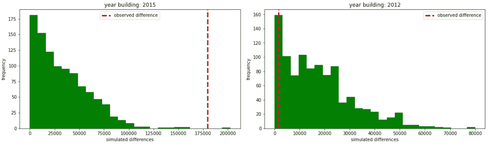

# 黑客统计显著性：使用机器学习方法进行假设检验

> 原文：[`towardsdatascience.com/hacking-statistical-significance-hypothesis-testing-with-ml-approaches-74ff102c5ff1`](https://towardsdatascience.com/hacking-statistical-significance-hypothesis-testing-with-ml-approaches-74ff102c5ff1)

## 在任何上下文中无假设地测试统计显著性

[](https://medium.com/@cerlymarco?source=post_page-----74ff102c5ff1--------------------------------)[](https://towardsdatascience.com/?source=post_page-----74ff102c5ff1--------------------------------) [Marco Cerliani](https://medium.com/@cerlymarco?source=post_page-----74ff102c5ff1--------------------------------)

·发表于[Towards Data Science](https://towardsdatascience.com/?source=post_page-----74ff102c5ff1--------------------------------) ·阅读时间 7 分钟·2023 年 1 月 10 日

--


照片由[Christian Stahl](https://unsplash.com/@woodpecker65?utm_source=medium&utm_medium=referral)提供，发布在[Unsplash](https://unsplash.com/?utm_source=medium&utm_medium=referral)

数据分析的重要性在各个领域都很清楚。从商业到学术，进行适当的分析是达到前沿结果的关键。在这方面，正确地操作和提取数据中的有意义见解是至关重要的。**数据分析师/科学家负责填补理论假设与实际证据之间的差距**。

**为所有可能提出的问题提供分析答案是一个昂贵且艰难的过程**。将问题/需求转化为分析语言是开始进行的第一步。这类操作的好坏至关重要，因为它会影响最终结果的正确性。在初步阶段，理解分析目标并指出最佳的数据源、框架和参与人员，以达到最佳结果，是非常重要的。

大多数情况下，**分析性地回答问题是通过进行统计检验来完成的**。许多统计检验如下所示：

+   陈述一个原假设，这是描述世界的默认选项。

+   陈述一个替代且补充的假设。

+   计算检验统计量（数据的函数）并概述最终结果。

**已知检验统计量的分布后，可以轻松计算观察到任何值的概率（p 值）**。如果 p 值小于预设的（通常为 0.01 或 0.05）显著性水平，则拒绝原假设，接受替代假设。

统计测试本身没有问题，但**我们需要注意一些隐藏的陷阱**：

+   **对数据的严格假设**。大多数时候，基础数据必须遵循正态或已知的分布。正如我们所知，现实世界的现象并不遵循正态分布。

+   **对我们不感兴趣的数量/统计的限制**。如果我们想测试一些定制的或更复杂的内容，可能会遇到困难。

在这篇文章中，我们介绍了一些时髦且简单的方法来测试假设并从我们手头的数据中提取有意义的见解。**我们不使用标准统计测试得出结论，而是通过模拟和排列来实现**。

# 数据准备

为了说明这些方法，我们使用一个包含金县（美国）房屋销售记录的数据集。该数据集可以从[Kaggle](https://www.kaggle.com/datasets/harlfoxem/housesalesprediction)访问，并且在[CC0 公共领域许可证](https://creativecommons.org/publicdomain/zero/1.0/)下提供。它包含了 2014 年 5 月到 2015 年 5 月之间的房屋销售价格数据，涉及金县（包括西雅图）。

数据集包含大约 20,000 条销售房屋的记录，具有不同的数值属性：*销售价格、卧室数量、浴室数量、生活空间的平方英尺、楼层数、纬度/经度、建筑年份*，等等。

在一个标准的预测应用中，预测房屋的销售价格，考虑到它们的特征，会是一个有趣的问题。这里我们并不关注这种应用。**我们希望通过一种不同于传统统计测试的方法来分析数据，从而回答一些问题，这种方法同样高效（或者可能更灵活）**。

# 模拟

让我们假设我们对房屋的建筑年份和销售价格之间是否存在关联感兴趣。

销售价格的分布与正态分布相差较大。正如我们所预期的，价格和建筑年份之间并不存在明确的线性关系。


价格分布（左）。价格与建筑年份（右）[作者提供的图片]

中位销售价格为 45,000 美元。2015 年建造的房屋（根据我们的数据集，较新的房屋）有更高的中位价格。这似乎是合理的，但**了解这种效果是否“由于偶然”会很有趣**。


每年的最低和最高中位销售价格 [作者提供的图片]

所谓“由于偶然”，指的是**我们仅观察到整个总体的一个样本**。我们手头的数据仅限于 2014 年至 2015 年间在金县发生的所有房屋交易的一部分。在此期间可能还有更多 2015 年建造的房屋被售出，但未记录在我们的数据集中。

在这种情况下，我们能做的最好的是注意到局限性，并尝试**估计真实的中位数**。我们可以通过**模拟**来做到这一点。

作为第一步，我们计算并存储 2015 年建造的房屋的中位数销售价格与我们掌握的所有数据的中位数销售价格之间的观察到的差异。这个值（*观察到的差异*）代表了我们可以观察到的价格差异，并且我们希望验证这一点。

```py
year = 2015

y = df[df['yr_built'] == year]['price'].agg(['count','median'])

observed_diff = abs(y['median'] - df['price'].median())
```

此时，我们希望检查我们的*观察到的差异*是否可能被任何随机销售子组所记录。我们随机抽取与 2015 年房屋相同大小的组，并计算它们的中位数价格与数据集中中位数价格之间的差异。

```py
n_simulation = 1_000

sampling = lambda x,y: x['price'].sample(n=int(y['count']))

sim_diffs = np.asarray([
    abs(sampling(df,y).median() - df['price'].median()) 
    for i in tqdm(range(n_simulation))
])
```

最后，我们验证模拟价格差异高于我们的*观察到的差异*的次数。这个值可以解释为成功的概率，并代表我们的估计的*p 值*。

```py
p_value = np.mean(sim_diffs >= observed_diff)
```

具有较低的 p 值，我们更有信心拒绝原假设并接受替代假设。在我们的情况下，我们更有信心拒绝 2015 年房屋与其他房屋之间没有价格差异的假设。



2015 年和 2012 年的模拟结果 [作者提供的图片]

根据我们的需求，我们可以对所有感兴趣的建筑年份进行测试。下图显示了所有年份的测试结果。


所有建筑年份及其中位数销售价格的模拟结果 [作者提供的图片]

# 多变量模拟

这是一个令人难以置信的结果！**只需几行代码，我们就可以测试和验证任何实证问题**。我们的研究验证了不同年份建造的房屋销售价格差异的存在。这是否意味着 2015 年建造的房屋与 80 年代建造的房屋不同？并不完全，因为我们仅验证了价格差异的可能性。可能有很多因素会区分不同年份建造的房屋。希望我们的数据集中还有许多其他特征，我们可以用来进一步验证可能的差异。

如前所述，我们希望检查 2015 年建造的房屋与其他房屋之间是否存在差异。现在我们不仅仅关注销售价格，还考虑所有可用的特征。为了有效地进行这种多维度测试，我们拟合一个二分类模型来区分 2015 年的房屋和其他房屋。我们记录 ROC-AUC 作为一个度量指标（*观察到的分数*）。

```py
year = 2015

cv_scoring = lambda x,y: np.mean(cross_val_score(
    RandomForestClassifier(10), 
    x, y, cv=5, scoring='roc_auc', n_jobs=-1, 
    error_score='raise'
))

observed_score = cv_scoring(
    df.drop(['yr_built','date','id'], axis=1), 
    (df['yr_built'] == year).astype(int)
)
```

然后我们检查我们的*观察到的分数*是否可能被任何随机的房屋销售子组所记录。我们随机抽取与 2015 年房屋相同大小的组，拟合一个二分类器来区分它们，并记录获得的 ROC-AUC。

```py
n_simulation = 1_000

sim_scores = np.asarray([
    cv_scoring(
        df.drop(['yr_built','date','id'], axis=1), 
        (df['yr_built'] == year).sample(frac=1).astype(int)
    )
    for i in tqdm(range(n_simulation))
])
```

最后，我们可以像之前一样验证*观察到的分数*是否高于模拟值，并计算相对的 p 值。

```py
p_value = np.mean(sim_scores >= observed_score)
```

在我们的案例中，我们更有信心拒绝认为 2015 年房屋与其他房屋之间没有整体差异的假设。


2015 年和 2012 年的模拟结果 [作者提供的图片]

# 总结

在这篇文章中，我们展示了一种基于模拟的方法来回答观察数据时可能出现的任何问题。所提出的方法的灵活性使其适用于任何背景，并且没有特别的前提假设。我们还提出了一种多变量泛化方法，以测试数据子组之间的差异，进一步证明了该方法可以在任何领域扩展，以验证任何假设。

[**查看我的 GitHub 仓库**](https://github.com/cerlymarco/MEDIUM_NoteBook)

保持联系: [Linkedin](https://www.linkedin.com/in/marco-cerliani-b0bba714b/)
