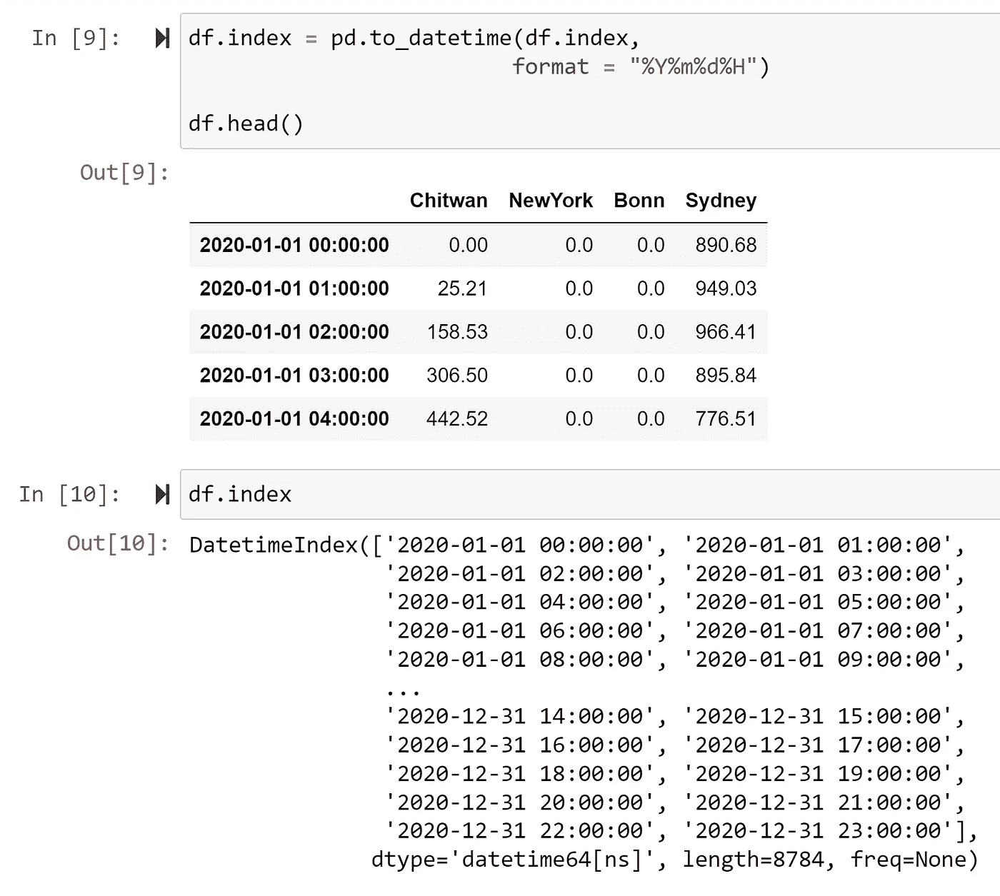

# 使用 Python 处理时区

> 原文：[`towardsdatascience.com/handling-time-zones-with-python-a100bfc7f6df?source=collection_archive---------3-----------------------#2023-04-21`](https://towardsdatascience.com/handling-time-zones-with-python-a100bfc7f6df?source=collection_archive---------3-----------------------#2023-04-21)

[](https://medium.com/@himalaya.birshrestha?source=post_page-----a100bfc7f6df--------------------------------)[](https://towardsdatascience.com/?source=post_page-----a100bfc7f6df--------------------------------) [Himalaya Bir Shrestha](https://medium.com/@himalaya.birshrestha?source=post_page-----a100bfc7f6df--------------------------------)

·

[关注](https://medium.com/m/signin?actionUrl=https%3A%2F%2Fmedium.com%2F_%2Fsubscribe%2Fuser%2Fba33e6d0d27b&operation=register&redirect=https%3A%2F%2Ftowardsdatascience.com%2Fhandling-time-zones-with-python-a100bfc7f6df&user=Himalaya+Bir+Shrestha&userId=ba33e6d0d27b&source=post_page-ba33e6d0d27b----a100bfc7f6df---------------------post_header-----------) 发表在 [Towards Data Science](https://towardsdatascience.com/?source=post_page-----a100bfc7f6df--------------------------------) ·10 分钟阅读·2023 年 4 月 21 日

--

[](https://medium.com/m/signin?actionUrl=https%3A%2F%2Fmedium.com%2F_%2Fbookmark%2Fp%2Fa100bfc7f6df&operation=register&redirect=https%3A%2F%2Ftowardsdatascience.com%2Fhandling-time-zones-with-python-a100bfc7f6df&source=-----a100bfc7f6df---------------------bookmark_footer-----------)

本文通过对 2020 年四个城市的小时太阳辐射数据在不同时间区的比较评估，展示了在 Python 中处理时区的功能。

# 时区

当我在德国波恩的工作开始的第一天，十月的早上 9 点时，我在尼泊尔奇旺的家乡已经是下午 12:45。我在澳大利亚悉尼的朋友当天已经在晚上 6 点结束了他的工作安排。另一个在美国纽约的朋友还在睡觉，因为那里的时间是凌晨 3 点。这表明这四个地方有不同的**时区**。


世界各地的不同时间区插图。地图 © [OpenStreetMap contributors](https://www.openstreetmap.org/copyright)，依据 [Open Data Commons Open Database License (ODbl)](https://opendatacommons.org/licenses/odbl/) 由 [OpenStreetMap foundation](https://opendatacommons.org/licenses/odbl/) 授权（OpenStreetMap，2023）。标签由作者添加。

[时区](https://en.wikipedia.org/wiki/Time_zone) 是一个区域，该区域为了法律、社会或商业目的而观察统一的标准时间。世界并不是根据经度均匀划分成不同的时区。时区往往根据国家之间和国家内部的边界进行划分。

所有时区都定义为相对于**协调世界时 (UTC)** 的偏移量。这些值范围从 UTC-12:00 到 UTC+14:00。虽然偏移量通常是整数小时，但有些时区的偏移量还额外增加了 30 分钟或 45 分钟。例如，尼泊尔的时区偏移量为 UTC+05:45。全球共有 [38 个时区](https://www.timeanddate.com/time/current-number-time-zones.html)。

如果我有尼泊尔、德国、澳大利亚和美国四个城市的太阳辐射数据，并且这些数据是基于 UTC 时区的，这并不反映每个国家同一时刻的数据。在这篇文章中，我将讨论如何处理数据的时区，以便在 Python 中处理日期时间对象，包括 pandas 数据框。

为此，我将下载这四个城市/国家的 2020 年太阳辐射数据，并在以下情况下对数据进行比较和分析：

1.  每个国家的数据都在 UTC 时区中

1.  数据指的是相应国家的时区。

让我们开始吧。


图片由 [Luis Cortes](https://unsplash.com/@luiscortestamez) 提供，来自 [Unsplash](https://unsplash.com/)。

## 地理编码以检索四个城市的坐标

在第一步中，我检索了四个国家四个城市的坐标，因为我需要这些坐标来提取太阳辐射数据。通过提供地点名称来提取地理坐标的过程称为地理编码。

如下所示，我编写了一个使用 [geopy](https://geopy.readthedocs.io/en/stable/) 包进行地理编码的函数。该函数利用了 [Nominatim](https://nominatim.org/)，这是一个开源的地理编码服务，使用 [OpenStreetMap](https://www.openstreetmap.org/#map=6/26.037/85.024) 数据通过名称和地址查找地球上的位置。

```py
from geopy.geocoders import Nominatim
geolocator = Nominatim(user_agent="app")

def get_coordinates(place):
    """Return the latitude and longitude of the place."""
    place_details = geolocator.geocode(place)
    coordinates = (place_details[1][0], place_details[1][1])

    return coordinates
```

我使用该函数提取了各个城市的坐标，并创建了一个 pandas 数据框，如下图所示。


创建了一个包含四个城市的纬度和经度值的数据框。插图由作者提供。

## 使用 NASA Power API 访问数据

美国宇航局 Power 的应用程序编程接口（API）[服务](https://power.larc.nasa.gov/docs/services/api/)允许检索分析就绪数据（NASA Power, 2023a）。对于这篇文章，我从 NASA Power 数据（NASA Power, 2023b）下载了**四个**城市的**每小时**分辨率的太阳辐射数据。我使用的参数是**2020**年的全天空表面短波下行辐射量（`ALLSKY_SFC_SW_DWN`），其详细描述见下节。

数据以**UTC 时区**格式调用，尽管[每小时 API](https://power.larc.nasa.gov/docs/services/api/temporal/hourly/#:~:text=POWER%20provides%20two%20different%20time,middle%20longitude%20of%20the%20swath.)默认也允许以本地太阳时间（LST）格式调用数据。

`base_url`配置如下所示：

```py
base_url = r”https://power.larc.nasa.gov/api/temporal/hourly/point?parameters=ALLSKY_SFC_SW_DWN&community=RE&time-standard=UTC&longitude={longitude}&latitude={latitude}&format=JSON&start=2020&end=2020"
```

接下来，我遍历由地理编码定义的每个地点的经纬度，这些地点在一个名为`places`的列表中，并请求 2020 年的每小时太阳辐射数据。该步骤的完整代码如下所示：

## 参数描述

> 太阳辐射数据指的是在所有天空条件下，每小时每单位面积（Wh/m²）从太阳获得的总功率（直接+漫射），位于地球表面上的水平面上（NASA Power, 2023c）。

该参数，也称为**全球水平辐射（GHI）**，用于计算满足给定电力需求所需的太阳光伏模块尺寸，如下方公式所示：


方程 1 和 2 指的是计算太阳光伏模块和电池尺寸的公式，以满足给定的电力需求，基于太阳辐射量和其他技术参数。由作者说明。

## 给定数据的基本统计


下载的全球水平辐射数据，涵盖四个城市。由作者说明。

下载的数据如上图所示。数据显示悉尼在年初和年末的太阳辐射量较高，而在年中较低。这一模式在其他三个城市中正好相反，这可以通过悉尼位于南半球而其他城市位于北半球来解释。


从下载的数据中得到的统计信息。由作者说明。

观察到 2020 年，尼泊尔的奇特旺接收到的年太阳辐射量最高（1669 kWh/m²），其次是澳大利亚悉尼（1631 kWh/m²）、美国纽约（1462 kWh/m²），而德国波恩接收到的最少（1193 kWh/m²）。

然而，特定小时接收到的最大太阳辐射量最高的是悉尼（1061.3 W/m²），其次是奇特旺（997 W/m²）。

每个城市的最小太阳辐射量和第 25 百分位值为零，因为夜间没有太阳辐射。

## 时区处理

## 1\. 默认的 pandas 数据框，没有“datetime”格式索引

由于 2020 年是闰年，有 366 天，因此数据获取了 8784 小时。

当数据首次下载时，其索引是整数（**int64**）类型，如下所示：


数据最初从 NASA Power 网站下载。作者插图。

## 2\. 将整数类型索引转换为“原始”日期时间索引

可以使用`pd.to_datetime()`并指定格式`%Y%m%d%H`将数据框架索引转换为日期时间类型，分别对应年、月、日和小时。



将整数索引转换为日期时间索引。作者插图。

当数据框绘制时也反映了这一变化，因为 2020 年 1 月至 12 月的月份在 xticks 中可见，如下所示：


用“原始”日期时间索引绘制 pandas 数据框显示了 2020 年 1 月至 12 月的月份在 x 轴上。作者插图。

尽管此数据框具有日期时间索引，但没有任何关于时区和夏令时的信息。因此，数据框索引是一个**原始**的日期时间对象。通过检查 pandas 数据框架的一个索引的时区信息可见。


检查数据框架第一个日期时间索引的时区信息。作者插图。

## 3\. 将“原始”日期时间对象本地化为“时区感知”日期时间对象

Python 的 datetime [模块](https://docs.python.org/3/library/datetime.html#module-datetime)可用于访问、检索和操作日期和时间信息。

默认情况下，`datetime.now()`函数返回当前的“本地”日期和时间信息。但是，由于下面代码段中的`time_now.tzinfo`返回 None，这意味着它是一个**原始**的日期时间对象。

截至目前（2023 年 4 月 21 日），我在尼泊尔。因此，我使用[**pytz**](https://pypi.org/project/pytz/)包的`timezone.localize()`模块将当前时间本地化为“Asia/Kathmandu”时区。现在，`time_in_nepal`是一个**时区感知**的日期时间对象。

要获取德国当前本地时间，可以使用`time_in_nepal.astimezone(timezone("Europe/Berlin"))`，这也是一个**时区感知**的日期时间对象。


第一个单元格显示当前本地时间`time_now`作为一个没有时区信息的原始日期时间对象。第二个单元格显示将`time_now`本地化为尼泊尔时区。第三个单元格显示将尼泊尔本地时间转换为德国本地时间。作者插图。

## 4\. 本地化 pandas 数据框的时区

接下来，我使用`df.tz_localize(tz = "UTC")`将 pandas 数据框的原始索引本地化为 UTC 时区，如下图所示。


将原始数据框索引本地化为 UTC 时区。作者插图。

观察到`df`的索引从天真的索引转换为 UTC 时区的时区感知索引，如上所示。

## 5\. 所有可能的时区地址列表

所有可以参考的可能时区地址列表可通过 pytz 包的`all_timezones`模块获得。共有 594 个这样的地址。一些地址可以指向相同的时区。例如，Europe/Berlin、Europe/Amsterdam、Europe/Copenhagen 都指向相同的时区。


使用 pytz 模块参考的可能地址列表。插图由作者提供。

## 6\. 为每个城市创建新的数据框，并将 UTC 时区转换为相应的本地时区

`df`包含四个城市的 UTC 时区的太阳辐射数据。在这一步中，我从`df`的每一列创建了四个数据框。然后，我将新数据框的时区从 UTC 转换为它所属城市或国家的本地时区。例如，`df_chitwan`的时区转换使用

`df_chitwan.tz_convert(tz = "Asia/Kathmandu")`。


从`df`的每一列创建不同的数据框。新数据框的时区从 UTC 转换为相应国家/城市的时区。

> 需要注意的是，对于有夏令时的国家，这在时区转换中会自动考虑。例如，尼泊尔时间全年与 UTC + 05:45 保持一致。然而，对于悉尼，Python 会自动处理夏令时，因为与 UTC 时区的偏移可以根据年份的不同为 10 小时或 11 小时。

## 7\. 比较不同时间区的太阳辐射数据图

在最后一步中，我想比较四个城市的数据在下列情况下的太阳辐射情况：

a. UTC 时区和

b. 每个城市的本地时区。

在下面的代码片段中，我创建了两个子图来绘制四个城市的太阳辐射。在左侧子图中，绘制了基于 UTC 时区的 2020 年 10 月 1 日的太阳辐射数据。在右侧子图中，绘制了基于每个城市本地时间的 2020 年 10 月 1 日的太阳辐射数据。

```py
fig, (ax1, ax2) = plt.subplots(1, 2, figsize = (20, 6))
fig.suptitle("Solar irradiance on October 1, 2020")

ax1.plot(df.loc["2020–10–01"])
ax1.set_title("Based on UTC time zone")
ax1.xaxis.set_ticks(ticks = df.loc["2020–10–01"].index[::4], labels = np.arange(0, 24, 4))

cities = df.columns.tolist()
handles = ax1.get_legend_handles_labels()[0]
ax1.legend(handles, labels = cities, loc = "upper right")
ax1.set_xlabel("Hour of day")
ax1.set_ylabel("W/m$²$")

ax2.plot(df_chitwan.loc["2020–10–01"].values.tolist())
ax2.plot(df_newyork.loc["2020–10–01"].values.tolist())
ax2.plot(df_bonn.loc["2020–10–01"].values.tolist())
ax2.plot(df_sydney.loc["2020–10–01"].values.tolist())
ax2.xaxis.set_ticks(ticks = np.arange(0, 24, 4), labels = np.arange(0, 24, 4))

handles = ax2.get_legend_handles_labels()[0]
ax2.legend(handles, labels = cities)
ax2.set_title("Based on local time zone of each city/country")
ax2.set_xlabel("Hour of day")
ax2.set_ylabel("W/m$²$")

plt.savefig("output/solar irradiance on october 1.jpeg",
 dpi = 300)
plt.show()
```

图形如下所示：


2020 年 10 月 1 日的太阳辐射。左图：基于 UTC 时区。右图：基于每个城市/国家的本地时区。插图由作者提供。

截至 2020 年 10 月 1 日，与 UTC 时区相比，四个城市的时区如下：奇特旺（UTC+05:45）、纽约（UTC-04:00）、波恩（UTC+02:00）和悉尼（UTC+10:00）。因此，我们可以看到在左图中，奇特旺、纽约、波恩和悉尼的太阳辐射峰值分别出现在 UTC 时区的凌晨 4 点、下午 3 点、上午 10 点和凌晨 3 点。

右侧的图表显示了各城市的太阳辐射在每天的本地时间内有相似的形状。太阳辐射在每天的 5 或 6 点左右开始从零增加，在中午达到峰值，然后在 5 或 6 点前继续下降，最后再次达到零。在这一年的这一天，悉尼接收到的太阳辐射量最高，其次是奇特旺、纽约和波恩。

# 结论

在本文中，我演示了在处理日期时间对象（包括数据框）时如何处理时区的方法。我使用了四个城市的太阳辐射数据作为示例。这些方法在处理时间序列数据时非常有用，特别是当时区很重要时，例如气象数据。我总结了从本文中学习到的处理 Python 中时区的关键技术，列在以下编号的要点中：

1.  可以使用**tzinfo**模块检查日期时间对象的时区。

2\. 当日期时间对象不包含任何关于时区和夏令时的信息时，它被称为**naive**日期时间对象。

3\. 使用**pytz**包的**timezone**模块，可以将**naive time**转换为**local time**。例如，

```py
time_in_nepal =  timezone("Asia/Kathmandu”).localize(datetime.now()) 
```

4\. 新对象现在是**时区感知**的。可以使用日期时间对象的`astimezone`模块获取不同时区的时间。例如，

```py
german_timezone = timezone(“Europe/Berlin”)
time_in_germany = time_in_nepal.astimezone(german_timezone)
```

5\. 在处理时间序列数据时，将 pandas 数据框的索引转换为日期时间索引是有意义的。

6\. 使用`df`中的`tz_localize`模块和指定的时区可以对 naive 数据框索引进行本地化。例如，

```py
df_utc = df.tz_localize(tz = “UTC”)
```

7\. 数据框对象也可以使用`df`的`tz_convert`模块转换为不同的时区。

```py
df_nepal = df_utc.tz_convert(tz = “Asia/Kathmandu”)
```

本文的数据、代码和输出图表可以在此 GitHub [代码库](https://github.com/hbshrestha/Data_Analytics)中的`notebooks/Timezone_handling`文件夹中找到。感谢您的阅读！

**参考文献**

OpenStreetMap, 2023. [版权和许可](https://www.openstreetmap.org/copyright)。

NASA Power, 2023a. [NASA Power APIs](https://power.larc.nasa.gov/docs/services/api/)。

NASA Power, 2023b. [POWER|数据访问查看器](https://power.larc.nasa.gov/data-access-viewer/)。

NASA Power, 2023c. [参数定义](https://power.larc.nasa.gov/docs/tutorials/parameters/)。
