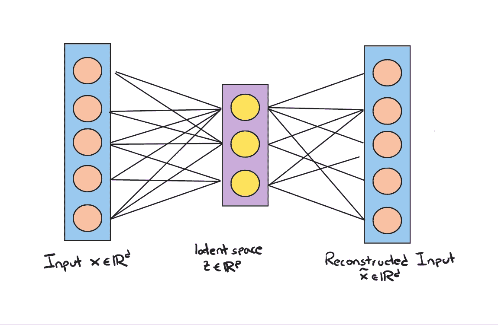
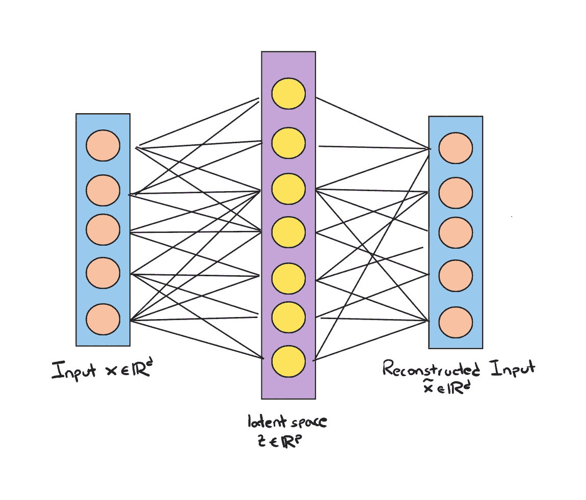
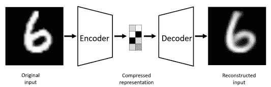

# 使用 Python 实现生成式 AI：自编码器

> 原文：[`towardsdatascience.com/hands-on-generative-ai-with-gans-using-python-autoencoders-c77232b402fc`](https://towardsdatascience.com/hands-on-generative-ai-with-gans-using-python-autoencoders-c77232b402fc)


图片由 [GR Stocks](https://unsplash.com/@grstocks?utm_source=medium&utm_medium=referral) 提供，来源于 [Unsplash](https://unsplash.com/?utm_source=medium&utm_medium=referral)

## 从自编码器开始，更好地理解 GANs

[](https://medium.com/@marcellopoliti?source=post_page-----c77232b402fc--------------------------------)[](https://towardsdatascience.com/?source=post_page-----c77232b402fc--------------------------------) [Marcello Politi](https://medium.com/@marcellopoliti?source=post_page-----c77232b402fc--------------------------------)

·发表于 [Towards Data Science](https://towardsdatascience.com/?source=post_page-----c77232b402fc--------------------------------) ·阅读时间 6 分钟·2023 年 3 月 21 日

--

## 介绍

最近几年，由于人工智能能够生成几乎与真实数据难以区分的合成实例，生成模型变得越来越受欢迎。你可能对能够生成文本的神经网络 Chat GPT 和能够生成完全原创图像的 DALLE 比较熟悉。

网站 [thispersondoesnotexist.com](https://this-person-does-not-exist.com/en) 是一个著名的生成网络例子，每次你访问这个链接时，都会显示一个不存在的人的 AI 生成图像。这只是生成式人工智能惊人可能性中的一个例子。

随着时间的推移，生成式人工智能已经发展，随着研究的推进，出现了许多架构来解决各种应用场景。但要开始学习生成式人工智能，你需要熟悉一种架构：生成对抗网络（GANs）。

## GANs 概述

生成网络的最终**目标是生成与其训练集具有相同分布的新数据**。生成网络通常被视为机器学习中的无监督学习的一部分，因为它们不需要标记数据。生成对抗网络（GAN）概念由 Ian Goodfellow 于 2014 年提出，相关论文是“[*Generative Adversarial Nets*](https://arxiv.org/pdf/1406.2661.pdf)”。

最初，GAN 的架构基于全连接层，旨在**生成低分辨率图像**，如手写数字。从那时起，GAN 经历了众多改进和应用。它们已被用于图像到图像的转换、图像超分辨率和图像修补等任务，其中网络学习重建图像的缺失部分。

GANs 也可以用于监督学习和半监督学习任务。例如，条件 GANs 可以根据某些条件生成数据，如根据用户输入生成不同动物的图像。半监督 GANs 使用标记数据来提高生成数据的质量。

GANs 的应用远不止于图像生成。这些模型已被应用于 NLP（自然语言处理）、音乐生成甚至药物发现！生成模型的潜力巨大，随着技术的不断进步，我们可以期待更多创新应用的出现。

GANs 很有吸引力，因为它们可以生成与训练数据分布相同的数据。

## 自编码器与 GANs

要完全理解这些生成对抗网络的工作原理，首先了解自编码器是很有帮助的。自编码器是一种可以压缩和解压训练数据的神经网络类型，使其在数据压缩和特征提取方面非常有用。

**标准自编码器无法生成新数据**，但它们作为理解 GANs 的有用起点。自编码器由两个串联的网络组成——编码器网络和解码器网络。编码器网络接收**d 维输入特征 x，并将其编码为 p 维向量 z**。换句话说，编码器的角色是学习如何建模函数 z = f(X)。**向量 z 也称为潜在向量**。通常，潜在向量的维度低于原始输入向量，因此**p < d**

**解码器**网络**接收**编码后的向量**z 并重建原始输入特征 x**。**自编码器的目标是最小化原始输入特征与重建特征之间的差异**。通过这样做，**自编码器学习在压缩和解压输入数据的同时保留其本质特征**。

让我们看看一个表示自编码器架构的图片。



自编码器架构（图像由作者提供）

**虽然自编码器可以用于数据压缩和特征提取，但它们无法像 GANs 那样生成新数据。**

在这个简单的例子中，编码器和解码器都是简单的线性层，用于压缩和解压空间。**更复杂的架构可以包含多个层，并且可能包含不同类型的层，例如在应用于图像模型时使用卷积层。**

让我们看看在 PyTorch 中自编码器的一个简单实现。

```py
class AutoEncoder(nn.Module):
    def __init__(self, **kwargs):
        super().__init__()
        self.encoder = nn.Linear(
          in_features=kwargs["input_shape"], out_features=128
        )
        self.decoder = nn.Linear(
            in_features=128, out_features=kwargs["input_shape"]
        )

    def forward(self, x):
        latent_vector = torch.relu(self.encoder(x))
        reconstructed = torch.relu(self.decoder(latent_vector))
        return reconstructed
```

AutoEncoder 类像往常一样继承 nn.Module，包括一个编码器和一个解码器，它们都是线性层，接受一个大小为 input_shape（例如 784）的输入向量 x，将其减少到大小为 128 的潜在空间，最终重建原始大小的向量。

## 其他类型的 AutoEncoders

我们已经看到，通常潜在向量的大小小于输入向量的大小，因此发生压缩，即 **p<d**。这类 autoencoders 被称为 **undercomplete**。

但我们可以创建一个比输入向量更大的潜在向量，**p>d**。当然，**overcomplete autoencoders**！但它们的用途是什么？它们可以用于 **降噪**。

在这些网络的训练过程中，输入数据中会添加噪声，例如模糊的图像，网络必须能够重建无噪声的图像。这种特定的架构称为去噪 autoencoder。



基本去噪架构（图片作者）

## Autoencoder 的实际示例

现在让我们看一个如何使用 PyTorch 实现更复杂的 Autoencoder 的例子，该 Autoencoder 用于生成类似于 MNIST 数据集的合成数据。

首先，像往常一样，我们安装并导入所需的库。

```py
!pip install torchvision
!pip install torch

from torchvision import datasets
from torchvision import transforms
import torch
import matplotlib.pyplot as plt
```

现在我们只需导入数据集。在 Pytorch 中这非常简单，因为库提供了快速下载数据集的方法。所以我们实例化数据集，然后是我们需要训练网络的 dataloader。我们还定义了一个转换，将图像在被网络处理时转换为张量。

```py
dataset = datasets.MNIST(root = "./data",
      train = True,
      download = True,
      transform = tensor_transform)

loader = torch.utils.data.DataLoader(dataset = dataset,
         batch_size = 64,
         shuffle = True)

tensor_transform = transforms.ToTensor()
```

现在是时候创建 AutoEncoder 类了，就像之前一样。但在这种情况下，编码器和解码器都会更深，因为它们将由更多的层组成，以更好地捕捉图像特征。

```py
class AutoEncoder(torch.nn.Module):
 def __init__(self):
  super().__init__()

  self.encoder = torch.nn.Sequential(
   torch.nn.Linear(28 * 28, 128),
   torch.nn.ReLU(),
   torch.nn.Linear(128, 64),
   torch.nn.ReLU(),
   torch.nn.Linear(64, 36),
   torch.nn.ReLU(),
   torch.nn.Linear(36, 18),
   torch.nn.ReLU(),
   torch.nn.Linear(18, 9)
  )

  self.decoder = torch.nn.Sequential(
   torch.nn.Linear(9, 18),
   torch.nn.ReLU(),
   torch.nn.Linear(18, 36),
   torch.nn.ReLU(),
   torch.nn.Linear(36, 64),
   torch.nn.ReLU(),
   torch.nn.Linear(64, 128),
   torch.nn.ReLU(),
   torch.nn.Linear(128, 28 * 28),
   torch.nn.Sigmoid()
  )

 def forward(self, x):
  encoded = self.encoder(x)
  decoded = self.decoder(encoded)
  return decoded
```

如你所见，它并没有比最初看到的简单例子复杂多少。

正如我们训练模型时总是这样，我们实例化类，并定义一个损失函数和一个优化器。在这里是 MSELoss 和 Adam。

```py
model = AutoEncoder()
loss_function = torch.nn.MSELoss()
optimizer = torch.optim.Adam(model.parameters(),
       lr = 1e-1,
       weight_decay = 1e-6)
```

训练网络的时刻来了。我们必须遍历我们的 dataloader，并调整输入以匹配模型架构。然后计算输出和获得的损失，并将所有内容保存到一个列表中，以便在训练结束时绘制。

```py
epochs = 25
losses = []
for epoch in range(epochs):
 for (image, _) in loader:

   image = image.reshape(-1, 28*28)
   reconstructed = model(image)

   loss = loss_function(reconstructed, image)
   optimizer.zero_grad()
   loss.backward()
   optimizer.step()

   losses.append(loss)

plt.style.use('fivethirtyeight')
plt.xlabel('Iteration')
plt.ylabel('MSE-Loss')
plt.plot(losses[-100:])
```

好了，我们的网络已经训练完成！现在我们可以将原始图像与网络重建的图像进行对比。

```py
plt.imshow(dataset[0])
plt.imshow(model(dataset[0].reshape(-1, 28, 28))
```



原始 vs 重建（来源: [`arxiv.org/pdf/2003.05991.pdf`](https://arxiv.org/pdf/2003.05991.pdf)）

# 最终思考

学习自编码器对于理解生成对抗网络（GANs）的工作原理非常有帮助。在这篇文章中，我们了解了一些关于这些架构的理论，然后看到它们如何用于重构 MNIST 图像的输出。使用它们非常有趣，而且它们也有各种用途，其中一些包括压缩和解压输入或去噪图像，正如我们所见。**在下一篇文章中，我将解释自编码器如何与 GANs 相关，并且我们将看到如何实现它们。** 关注我以获取未来的文章

# 结束

*Marcello Politi*

[Linkedin](https://www.linkedin.com/in/marcello-politi/), [Twitter](https://twitter.com/_March08_), [CV](https://march-08.github.io/digital-cv/)
