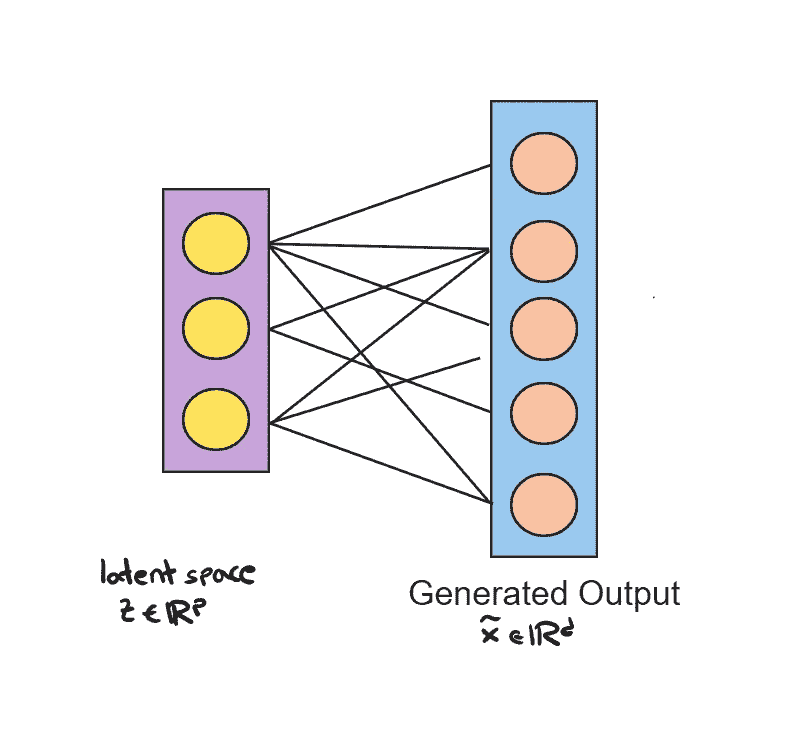

# 使用 Python 和 GANs 进行生成式 AI 实践：图像生成

> 原文：[`towardsdatascience.com/hands-on-generative-ai-with-gans-using-python-image-generation-9a62e591c7c6`](https://towardsdatascience.com/hands-on-generative-ai-with-gans-using-python-image-generation-9a62e591c7c6)


作者提供的图像

## 学习如何使用 PyTorch 实现 GANs 以生成合成图像

[](https://medium.com/@marcellopoliti?source=post_page-----9a62e591c7c6--------------------------------)[](https://towardsdatascience.com/?source=post_page-----9a62e591c7c6--------------------------------) [Marcello Politi](https://medium.com/@marcellopoliti?source=post_page-----9a62e591c7c6--------------------------------)

·发表于 [Towards Data Science](https://towardsdatascience.com/?source=post_page-----9a62e591c7c6--------------------------------) ·7 分钟阅读·2023 年 3 月 27 日

--

## **介绍**

在我的 [上一篇文章](https://medium.com/towards-data-science/hands-on-generative-ai-with-gans-using-python-autoencoders-c77232b402fc)中，我们了解了自编码器，现在让我们继续讨论生成式 AI。目前每个人都在谈论它，并且对已经开发出的实际应用感到兴奋。但我们将一步步地继续探讨这些 AI 的基础。

有几个机器学习模型可以构建生成式 AI，例如变分自编码器（VAE）、自回归模型甚至正则化流模型。然而，本文将重点讨论 GANs。

## 自编码器与 GANs

在上一篇文章中，我们讨论了自编码器，并了解了它们的架构、用途和在 PyTorch 中的实现。

简而言之，自编码器接收输入 x，将其压缩为一个较小的向量 z，称为潜在向量，然后从 z 以或多或少的近似方式重构 x。

在自编码器中，我们没有数据生成，而只是对输入的近似重构。现在假设我们将自编码器分成两部分，并仅考虑第二部分，即从潜在向量 z 重构图像的部分。



输出生成（作者提供的图像）

在这种情况下，我们可以说架构是生成式的。实际上，给定一个数字向量作为输入，这会创建一幅图像！本质上，这就是生成式 AI 的作用。与自编码器的主要区别在于，我们清楚地知道我们从中获取潜在向量 z 的概率分布。例如，一个*Gaussian(0,1)*。

因此，我们有了一种从高斯分布中的随机数生成图像的方法，改变这些随机数将改变我们输出的图像。


生成模型（图片由作者提供）

## GANs 架构

前一张图片中显示的橙色网络可以定义为一个 G 函数，给定输入 z 生成合成输出 *x_cap*，因此 *x_cap = G(z)*。

网络将以随机权重初始化，因此最初它无法生成看起来真实的输出，只能生成包含噪声的图像。因此，我们需要进行一些训练来提高网络的性能。

所以让我们设想一下，每当我们得到输出时，有一个人工标注员告诉我们这些输出是否良好，是否看起来真实。


朝向 GANs（图片由作者提供）

显然，我们不能进行网络训练，期望一个人对输出进行持续判断。那么我们可以做什么呢？

如果你考虑一下标注员所做的工作，在这种情况下就是二元分类！而我们在机器学习中非常擅长开发分类器。因此，我们可以简单地训练一个分类器，我们称之为鉴别器，并用函数 D()表示，它必须被训练来识别合成（虚假）图像与真实图像。因此我们将同时输入虚假图像和真实图像。

所以这就是我们的架构如何变化的。


GANs 架构（图片由作者提供）

简而言之，架构并不复杂。困难在于训练这两个网络 G 和 D 时。

很明显，如果在训练过程中，这两个网络必须一起改进，它们需要找到某种平衡。因为例如，如果 D 在区分虚假图像与真实图像方面变得过于优秀，而 G 在生成图像方面尚未提升，那么 G 永远不会变得更好，我们的生成器也永远无法准备好使用。

所以这两个网络被称为在玩一个对抗游戏，其中 G 必须欺骗 D，而 D 不能被 G 欺骗。

## GANs 目标函数

如果我们想更精确一点，可以说 D 和 G 有两个互补的目标。假设我们想生成图像。

我们用 D(x)定义 x 是真实图像的概率。显然，鉴别器想要最大化其识别真实输入与虚假输入的概率。因此，当 x 从我们的真实图像分布中抽取时，我们想要最大化 D(x)。

相比之下，生成器 G 的目的是欺骗鉴别器。因此，如果 *G(z)* 是由 G 生成的虚假图像， *D(G(z))* 是 D 将虚假图像识别为真实图像的概率。那么 *1-D(G(z))* 是 D 正确识别虚假图像为虚假的概率。因此 G 的目标是最小化 *1-D(G(z))*，因为它确实想要欺骗 D。

所以最终我们可以将这种最大化和最小化的游戏总结到原始论文中的公式里（公式看起来更具概念性，但我们已经看过这个概念）：


目标函数（来源：[`arxiv.org/pdf/1406.2661.pdf`](https://arxiv.org/pdf/1406.2661.pdf)）

## GANs 实现

我们现在实现一个能够自动生成 MNIST 图像的 GAN。

和往常一样，我将我的代码运行在基于云的环境 Deepnote 中，但你也可以使用 Google Colab，这样即使没有 GPU 的用户也可以运行这段代码。

我们首先检查一下我们的硬件是否确实有 GPU。

如果你在使用 Colab，你可以连接到 Google Drive。

```py
from google.colab import drive
drive.mount('/content/drive/')
```

让我们导入所需的库。

现在我们需要创建定义我们网络的函数，即生成器和判别器。

MNIST 图像有 784 个像素（因为图像是 28x28）。因此，生成器输入一个长度为 20 的随机 z 向量，将输出一个 784 的向量，这就是我们的伪造图像。

相反，判别器将接收一个 28x28 = 784 像素的图像作为输入，它将有一个输出神经元来将图像分类为真实或伪造。


生成器（图片由作者提供）

这个函数用于实例化生成器。每一层将使用 LeakyReLU（ReLU 的一种变体，在 GANs 中表现最佳）作为其激活函数，除了输出层后接一个双曲正切（Tanh）函数，使得输出范围为[-1,1]。


判别器（图片由作者提供）

相反，这个函数定义了判别器网络，其特殊功能是在隐藏层之后使用 dropout（在基本情况下只有一个隐藏层）。输出通过一个 sigmoid 函数，因为它必须给出图像是真实的还是伪造的概率。

现在我们还下载了我们要使用的 MNIST 数据集。MNIST 数据集的范围是[0,255]，但我们希望它在范围[-1,1]，这样它会类似于生成器网络生成的数据。因此，我们还对数据进行了预处理。

现在我们来到最重要的部分。我们需要创建定义我们网络训练的函数。我们已经提到过，我们应该将判别器与生成器分开，因此我们将有两个函数。

判别器将同时在假数据和真实数据上进行训练。当我们在真实数据上训练时，标签将始终是*“real” = 1*。因此，我们创建一个全为 1 的向量，即*d_labels_real = torch.ones(batch_size, 1, device = device)*。然后，我们将输入 x 送入模型，并使用*Binary Cross Entropy*计算损失。

我们通过输入伪数据做同样的事情。这里的标签将全部为零，*d_labels_fake = torch.zeros(batch_size, 1, device = device)*。输入则是伪数据，即生成器的输出 *g_output = gen_model(input_z)*。我们以相同的方式计算损失。

最终损失将是两个损失的总和。

对于生成器训练函数，实施略有不同。生成器的输入是判别器的输出，因为它需要查看 D 是否已识别出图像是真实还是伪造的。基于此，它计算其损失。

现在我们可以初始化我们的两个网络了。

让我们定义一个函数来创建网络生成的样本，这样随着训练周期的增加，我们可以看到伪图像的改进。

现在我们终于可以训练网络了！我们每次将损失保存到一个列表中，以便后续绘图。

训练应该大约需要一个小时，具体取决于你使用的硬件。但最后，你可以打印出你的伪数据，得到类似这样的结果。

在我的情况下，我训练了几个周期，所以结果并不理想，但你开始可以看到网络正在学习生成类似 MNIST 的图像。


伪数据（图片由作者提供）

# 最后的想法

在这篇文章中，我们更详细地探讨了 GAN 的架构。我们研究了它们的目标函数，并实现了一个能够生成 MNIST 数据集图像的网络！这些网络的操作并不复杂，但它们的训练确实很困难。因为我们需要找到一个平衡点，让两个网络都能学习。如果你喜欢这篇文章，请关注我，阅读下一篇关于 DCGAN 的文章。[😉](https://emojipedia.org/it/apple/ios-15.4/faccina-che-fa-l-occhiolino/)

# 结束

*Marcello Politi*

[Linkedin](https://www.linkedin.com/in/marcello-politi/)，[Twitter](https://twitter.com/_March08_)，[Website](https://marcello-politi.super.site/)
