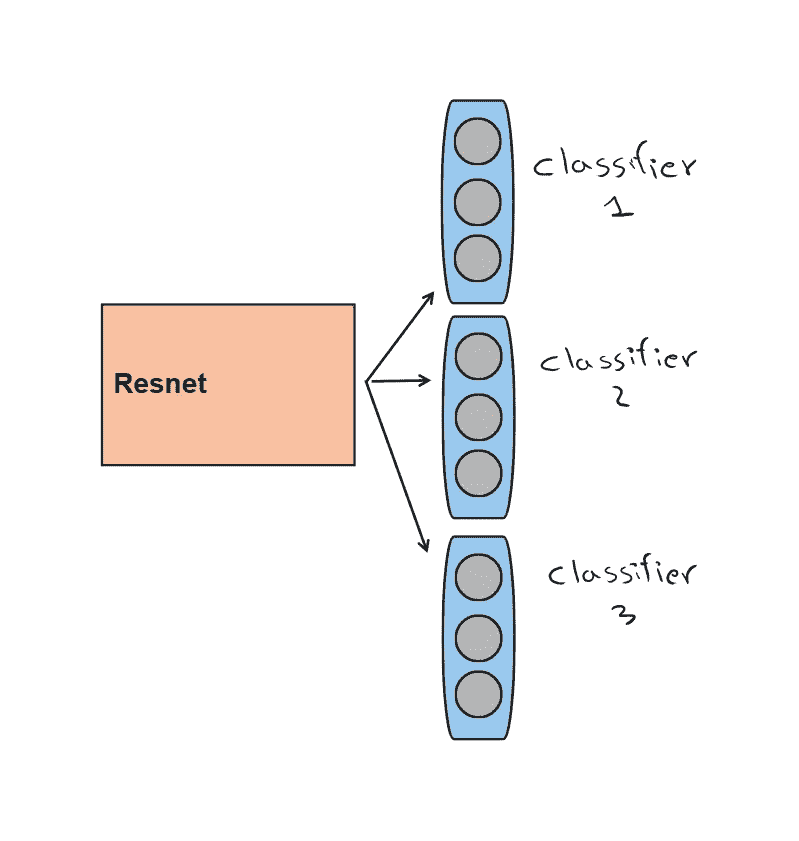

# 使用 Python 进行实践性的多目标分类

> 原文：[`towardsdatascience.com/hands-on-multitarget-classification-using-python-1ac439aac708`](https://towardsdatascience.com/hands-on-multitarget-classification-using-python-1ac439aac708)


[Christin Hume](https://unsplash.com/@christinhumephoto?utm_source=medium&utm_medium=referral) 摄影，图片来源于 [Unsplash](https://unsplash.com/?utm_source=medium&utm_medium=referral)

## 方法概述、评估指标和最佳实践

[](https://medium.com/@marcellopoliti?source=post_page-----1ac439aac708--------------------------------)[](https://towardsdatascience.com/?source=post_page-----1ac439aac708--------------------------------) [Marcello Politi](https://medium.com/@marcellopoliti?source=post_page-----1ac439aac708--------------------------------)

·发表于 [Towards Data Science](https://towardsdatascience.com/?source=post_page-----1ac439aac708--------------------------------) ·阅读时间 9 分钟·2023 年 1 月 2 日

--

## 介绍

最近我在开发一个能够识别建筑物中不同类型损坏的机器学习算法。这些损坏并不相同，每种损坏都有不同的原因和风险，因此我们识别出了大约 4 种不同类型的裂缝。然后，该算法将部署在无人机上，无人机会自动拍摄建筑物的照片，并能够判断建筑物中存在的损坏及其严重程度。

显然，在无人机拍摄的照片中，可能会出现不同类型的损坏，因此，无人机拍摄的照片必须能够识别出照片中存在的所有不同类型的损坏，而不仅仅是其中之一。这就是我开始研究所谓的**多目标分类任务**的原因。我在这里写这篇文章，希望它对你也有帮助。

## 什么是多目标分类？

多目标分类是一种机器学习任务，涉及对单个样本预测多个标签。与传统的二分类或多分类不同，其中每个样本被分配到一个单独的类别，**多目标分类允许一个样本同时属于多个类别**。这在单个样本可能有多个相关标签的情况下非常有用，例如一个新闻文章可以同时被分类为政治、体育和娱乐。

让我们看一个例子来理解不同类型的分类。


分类类型（图片来源于作者）

解决多目标分类问题有几种方法，包括使用二分类器、多类别分类器和多任务学习。本文将探讨不同类型的多目标分类，并讨论它们的优缺点。我们还将查看多目标分类的评估指标。最后，我将提供一些个人见解和结论，关于多目标分类的优势和局限性，以及成功的最佳实践。

# 多目标分类的类型

针对多目标分类有几种方法，每种方法都有其优点和局限性。

## 二分类器


多二分类（图像来源于作者）

**多目标分类的一种方法是使用多个二分类器，每个分类器被训练以预测一个单独的标签**。例如，如果我们有一个包含三个标签（A、B 和 C）的多目标分类问题，我们可以训练三个独立的二分类器，一个用于预测标签 A，一个用于预测标签 B，另一个用于预测标签 C，然后运行这三个模型来对实例进行分类。这种方法简单易实现，但如果标签数量较多可能效率低下。此外，分类器的性能可能受到训练数据中标签分布不平衡的影响。

## 多类别分类器

另一种多目标分类的方法是使用多类别分类器，这种分类器旨在同时预测多个标签。有几种类型的多类别分类器，包括一对其余和一对一。

+   **一对其余（OvR）** 分类器被训练以对每个标签做出二分类决策，将所有其他标签视为负类。例如，在 **三个标签**（**A、B** 和 **C**）的情况下，OvR 分类器将被训练以预测 **标签 A 对 非-A**、**标签 B 对 非-B** 和 **标签 C 对 非-C**。**所以你将遇到如前所述的多二分类情况**。这种方法简单高效，但可能受到标签分布不平衡的影响，并且可能未考虑标签之间的依赖关系。

+   **一对一（OvO）** 分类器被训练以对每对标签做出二分类决策。例如，在三个标签（A、B 和 C）的情况下，OvO 分类器将被训练以预测 **A 对 B**、**A 对 C** 和 **B 对 C**。这种方法比 OvR 计算量更大，但可以处理不平衡的标签分布，并捕捉标签之间的依赖关系。

# 多任务学习

多任务学习是一种机器学习方法，它涉及训练一个模型以同时预测多个任务。在多目标分类的背景下，**多任务学习包括训练一个模型来预测样本的所有标签**。

**如果任务相似**，例如，你需要分类不同类型的缺陷，或者你需要分类是否有汽车、自行车和卡车，**这种方法比使用多个二分类或多分类分类器更高效**，但它**需要大量标记数据和强假设任务相关**。

## **让我们编码吧！**

让我们看看如何在计算机视觉领域实现多任务学习算法，同时采用迁移学习方法。

我想做的是拿一个**在图像识别上预训练的网络，如 Resnet**（当然，你也可以使用其他网络），**并将其修改为能够同时解决多个任务**。

在多分类情况下，通常的做法是使用**Resnet，并在其顶部附加一个具有与数据集中类别数量相等的输出神经元的分类器**，从而为每个实例获得一个类别。

然而，我们希望不仅仅识别一个类别，而是同时识别多个类别，因此**我们只是简单地在 Resnet 顶部附加多个分类器（线性层）**。

但在我们的情况下，**每个分类器是一个二分类器**，它只需要告诉我们是否存在汽车、自行车或卡车。

创建一个二分类器，我们只需要一个输出神经元来回答“否/是”。所以网络结构非常简单。


使用 Resnet 进行多目标分类（图片由作者提供）

在需要 3 个多分类分类器的更一般情况下，架构应该是这样的。



使用 Resnet 进行多目标分类（图片由作者提供）

让我们看看如何使用 PyTorch 实际实现这样的网络。

```py
 class ResnetBasedModel(nn.Module):
    def __init__(self, pretrained, clf_in_features,  labels_nr:int, freeze:bool = True):
        super().__init__()

        self.pretrained_model = pretrained
        #model without last layer
        self.model_wo_fc = nn.Sequential(*(list(self.pretrained_model.children())[:-1])) 

        if freeze:
            for param in self.model_wo_fc.parameters():
                param.requires_grad = False

        self.classifiers = nn.ModuleDict()

        for i in range(labels_nr):
            self.classifiers[f'clf_{i}'] = nn.Sequential(
                nn.Dropout(p=0.2),
                nn.Linear(in_features = clf_in_features, out_features = 1)
            )

    def forward(self, x):
        x = self.model_wo_fc(x)
        x = torch.flatten(x, 1)

        return {name: classifier(x) for name, classifier in self.classifiers.items()}
```

之前的代码实现了一个**继承 nn.Module**的 Python 类，这是创建基于神经网络的模型的经典方式。

模型以预训练网络（如 Resnet）（*pretrained*）作为输入，接受预训练网络倒数第二层的输出神经元数量（*clf_in_features*），例如，在 Resnet34 中这个数字是 512，而在 Resnet50–101 中是 2048。

该类还接受输出二分类器的数量（*labels_nr*），以及我们是否希望解冻预训练网络的参数（*freeze*）。

让我们更详细地看看这个类是如何工作的。

以下循环用于解冻预训练网络的参数，以便我们只保留输出分类器，这将大大加快我们的训练速度。

```py
if freeze:
    for param in self.model_wo_fc.parameters():
        param.requires_grad = False
```

之后，我会创建与参数中指定数量相同的分类器，并将它们保存在字典中。

```py
for i in range(labels_nr):
      self.classifiers[f'clf_{i}'] = nn.Sequential(
          nn.Dropout(p=0.2),
          nn.Linear(in_features = clf_in_features, out_features = 1)
      )
```

最终，在前向方法中，我将每个输入 x 传递给预训练网络和字典中的每个分类器，并返回字典中每个元素（分类器）的输出。

```py
def forward(self, x):
        x = self.model_wo_fc(x)
        x = torch.flatten(x, 1)

        return {name: classifier(x) for name, classifier in self.classifiers.items()}
```

现在你可以使用你的网络进行多目标分类。请记住，要实例化一个预训练网络并将其作为输入传递给类，你只需要使用 PyTorch Torchvision 模块。

```py
from torchvision import models

resnet34 = models.resnet34(weights=models.ResNet34_Weights.DEFAULT)
```

要训练模型，你需要为每个分类器实例化一个损失函数，并将这些损失加总。得到结果后，你可以更新整个模型。

```py
def criterion(y, yhat):
    '''y : is a dict with keys 'labels' and 'path'''
    losses = 0
    device = torch.device('cuda' if torch.cuda.is_available() else 'cpu')
    for _, key in enumerate(yhat):
        losses += loss_func(yhat[key], y[f'label_{key}'].float().unsqueeze(1).to(device))
return losses
```

## 多目标分类的评估指标

评估多目标分类模型的性能可能具有挑战性，因为需要考虑多个标签以及不同的组合方式。以下是一些用于多目标分类的常见评估指标：

**汉明损失**：该指标衡量错误预测标签的比例。它的计算方法是将错误分类的标签数量除以标签总数。

这是我倾向于用来评估模型的指标，这里是汉明损失的实现。

```py
def hamming_error(yhat:list, y:list) -> float:
    loss = sum([yhat_i != y_i for yhat_i, y_i in zip(yhat, y)])
    avg_loss = loss/len(yhat) 

    return avg_loss
```

在这个片段中，两个数组的元素成对比较，返回发现的平均不匹配数。可以轻松地将此代码推广到一次比较整个批次。

让我们快速了解一下该领域使用的其他指标。

+   **排名损失**：该指标衡量样本中错误排序的标签的平均数量。例如，如果一个样本的标签是 A、B 和 C，而模型预测的顺序是 C、B、A，则排名损失为 2（因为 B 和 C 被错误排序）。

+   **杰卡德指数**：该指标衡量预测标签和真实标签之间的重叠程度。它的计算方法是将交集的大小除以并集的大小。

+   **F1 分数**：该指标是在精度和召回率之间的平衡，其中精度是正确预测标签的比例，召回率是被预测的真实标签的比例。它是精度和召回率的调和均值。要使用 F1 分数进行多目标分类，你需要分别计算每个标签的精度和召回率，然后对所有标签的分数取平均以获得总体 F1 分数。该指标相对于之前的指标对不平衡标签分布更为敏感。

```py
F1 = 2 * (precision * recall) / (precision + recall)
```

+   **平均精度**：该指标衡量数据集中每个召回值的精度。它的计算方法是对第一个假阳性、第二个假阳性等的精度取平均。

```py
Average precision = (1/n) * Σ(precision at each recall value)
```

要计算多个标签的平均精度，你可以简单地对每个标签的平均精度取平均。例如，如果你有三个标签（A、B 和 C），你可以使用上述公式计算每个标签的平均精度，然后将这些分数平均以获得总体平均精度。这也对不平衡分布非常敏感。

## 评估多目标分类模型的挑战

评估多目标分类模型可能具有挑战性，因为有多个标签需要考虑以及不同的组合方式。以下是一些用于多目标分类的常见评估指标：

+   不平衡的标签分布：某些标签可能比其他标签更常见，这会影响模型的性能。例如，如果某个标签稀少，模型可能没有足够的示例进行学习，导致性能较差。

+   标签之间的依赖关系：某些标签可能比其他标签更可能一起出现，这会影响模型的性能。例如，如果一个模型被训练来预测标签 A 和 B，但标签 A 总是由标签 B 在前面，模型可能很难在不预测标签 B 的情况下预测标签 A。

+   多标签评估指标：多目标分类有多种评估指标，每种指标都有其优点和局限性。选择正确的指标可能很困难，因为这取决于问题的具体要求和数据的特点。

# 最终思考

多目标分类是解决涉及对单个样本预测多个标签的问题的强大工具。它可以应用于广泛的现实世界应用，例如文本分类、图像标注和推荐系统。

多目标分类有多种方法，包括二分类器、多分类器和多任务学习。选择方法取决于问题的具体要求和数据的特点。

评估多目标分类模型的性能可能很具挑战性，原因包括标签分布不平衡、标签之间的依赖关系以及可用的多种评估指标。选择正确的评估指标并将模型的性能与基线进行比较非常重要。

# 结束

*马塞洛·波利提*

[Linkedin](https://www.linkedin.com/in/marcello-politi/)、[Twitter](https://twitter.com/_March08_)、[CV](https://march-08.github.io/digital-cv/)
