# 亲自动手实现 Otsu 阈值分割算法，用于图像背景分割，使用 Python

> 原文：[`towardsdatascience.com/hands-on-otsu-thresholding-algorithm-for-image-background-segmentation-using-python-9fa0575ac3d2?source=collection_archive---------7-----------------------#2023-03-20`](https://towardsdatascience.com/hands-on-otsu-thresholding-algorithm-for-image-background-segmentation-using-python-9fa0575ac3d2?source=collection_archive---------7-----------------------#2023-03-20)

## 从理论到实践，使用 Otsu 阈值分割算法

 [Piero Paialunga](https://piero-paialunga.medium.com/?source=post_page-----9fa0575ac3d2--------------------------------)

·

[关注](https://medium.com/m/signin?actionUrl=https%3A%2F%2Fmedium.com%2F_%2Fsubscribe%2Fuser%2F254e653181d2&operation=register&redirect=https%3A%2F%2Ftowardsdatascience.com%2Fhands-on-otsu-thresholding-algorithm-for-image-background-segmentation-using-python-9fa0575ac3d2&user=Piero+Paialunga&userId=254e653181d2&source=post_page-254e653181d2----9fa0575ac3d2---------------------post_header-----------) 发表在 [Towards Data Science](https://towardsdatascience.com/?source=post_page-----9fa0575ac3d2--------------------------------) ·8 分钟阅读·2023 年 3 月 20 日

--

图片由 [Luke Porter](https://unsplash.com/@lukeporter?utm_source=unsplash&utm_medium=referral&utm_content=creditCopyText) 提供，来源于 [Unsplash](https://unsplash.com/photos/SZOfKAaQYLI?utm_source=unsplash&utm_medium=referral&utm_content=creditCopyText)

让我从一个非常技术性的概念开始：

> 图像将被视作、处理、分析和处理为二维信号。

以及一些恰当的定义：

+   **信号**是一个在空间或时间上变化的量，可用于传递某种信息。

+   **图像**无非是光线照射到光学系统上，即相机或你正在绘画的画布。

从这个意义上说，图像不过是一个 2D 信号，一个携带某些信息的电磁信号，这些信息由物理系统获取。

因此，既然我们已经确定图像确实是一个信号，我们可以考虑将**信号处理**技术应用于**图像处理**任务。这样我们可以停止讨论**哲学**，开始进入**技术**部分。

说到哲学。我们来看这张**图像**：

照片由 [Tingey Injury Law Firm](https://unsplash.com/it/@tingeyinjurylawfirm?utm_source=unsplash&utm_medium=referral&utm_content=creditCopyText) 在 [Unsplash](https://unsplash.com/photos/9SKhDFnw4c4?utm_source=unsplash&utm_medium=referral&utm_content=creditCopyText) 提供

图片中有位哲学家在思考他的工作。然后是这个非常白的背景，我们其实并不在乎。**我们能去掉它吗？** 我们能得到这样的东西吗？

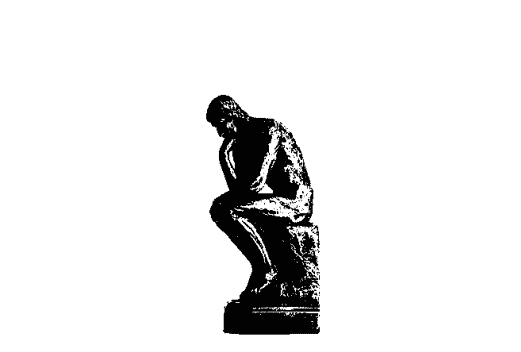

图片由作者提供

如果我问你，这意味着我们可以。 😅

每个人只要懂一点***Photoshop***就可以做到这一点，但如何用 Python 自动完成呢？再说一遍，是的。

让我给你展示一下 🚀

# 0\. 想法

所以让我们拿一个简单的例子。

没错。一个小方块在一个大方块里面。这是一个极其简单的情况。我们想做的是将小方块中的所有值设置为 1，而外面的所有值设置为 0。

我们可以用以下代码提取两个值：

然后做一些类似于：

这将图像从两个值转换为 1 和 0。

这非常简单，对吧？让我们把它变得有些复杂。

现在我们将做的是在大方块内的小方块**但两个方块都有一些噪声。**

我的意思是，我们不仅仅有 2 个值，而是理论上可以有**从 0 到 255 之间的所有值**，这就是编码中的整个值范围。

我们如何处理这个问题？

好的，我们首先要做的是**扁平化**图像（2D 信号），并将其转换为 1D 图像。

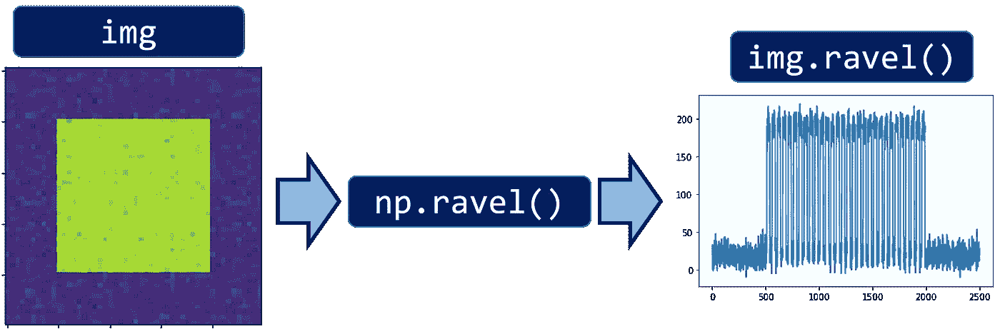

图片由作者提供

图像是 50x50 的，我们得到了一个“展开”的 50x50=2500 长度的 1D 信号。

现在如果我们研究 1D 信号的分布，我们得到这样的东西：

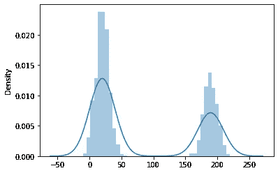

正如我们所见，我们有 **两个正态分布**。这正是 Otsu 算法表现最佳的地方。其基本思想是 **背景** 和 **图像中的主体** 具有两种不同的性质和两个不同的 **领域**。例如，在这种情况下，第一个高斯钟形曲线与背景相关（从 0 到 50），而第二个高斯钟形曲线则与较小的方块相关（从 150 到 250）。

假设我们决定将所有大于 100 的值设为 1，将所有小于 100 的值设为 0：

结果是以下 **背景** 和 **主体** 之间的掩码：

就是这样。这就是 Otsu 算法的整个思路：

+   **导入/读取**图像作为 2D 信号

+   **将**图像展平为 1D 向量

+   选择一个 **阈值**

+   **将**低于该阈值的所有内容设为 0，将高于该阈值的所有内容设为 1

很简单，对吧？

那么我们如何选择合适的阈值呢？最佳阈值是什么？让我们谈谈 **数学**。

# 1\. 理论介绍

让我们稍微形式化一下这个概念。

我们有一个图像的 **领域**。整个领域从 0 到 255（白到黑），但它不必那么宽（例如可以是 20 到 200）。

当然，多个点可以具有相同的像素强度（我们可以在同一图像中有两个黑色像素）。假设我们有 3 个强度为 255 的像素，在一个有 100 个像素的图像中。那么在该图像中强度为 255 的概率是 3/100。

一般来说，我们可以说图像中像素 i 的概率是：

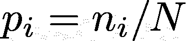

图片由作者提供

现在假设我们进行分割的像素是像素 k（在我们之前的示例中，k 是 100）。这 **分类** 了数据点。所有 **k 之前的点属于类别 0**，所有 **k 之后的点属于类别 1**。

这意味着从类别 0 中选择一个点的概率如下：

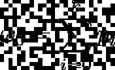

图片由作者提供

而从类别 1 中选择一个点的概率如下：

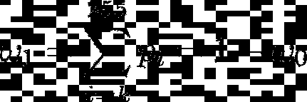

图片由作者提供

正如我们所见，这两个概率显然依赖于 k。

现在，我们还可以计算每个类别的 **方差：**

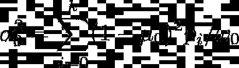

图片由作者提供

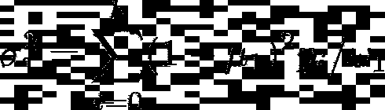

图片由作者提供

其中：

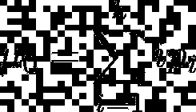

图片由作者提供

和

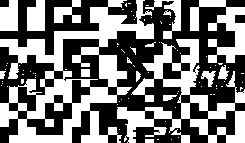

图片由作者提供

sigma 值是每个类别的 **方差**，即该类别在均值 mu_0 和 mu_1 周围的 **扩散** 程度。

从理论上讲，目的是找到一个值，这个值形成了我们之前在图片中看到的小 **凹谷**：

但我们使用的方法稍有不同且更为严格。通过使用[线性判别分析](https://en.wikipedia.org/wiki/Linear_discriminant_analysis#Fisher's_linear_discriminant)（LDA）的相同思路。在（Fisher）LDA 中，我们希望找到一个超平面，将两个分布分开，使得类别**之间**的方差尽可能大（这样两个均值之间的距离尽可能远），而类别**内部**的方差尽可能小（这样两个类别数据点之间的重叠最少）。

在这种情况下，我们没有任何超平面，我们设置的阈值（我们的 k）甚至不是一条线，而更像是一个概率值，用于区分数据点并对其进行分类。

可以证明（完整证明见原始[论文](https://ieeexplore.ieee.org/stamp/stamp.jsp?tp=&arnumber=4310076)），**最佳分割**在**背景**和**主体**之间（假设背景的域与主体的域不同）是通过最小化该数量来获得的：

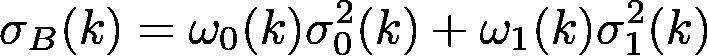

作者提供的图片

这意味着我们可以尝试所有不同的 k，并选择其中最小的 k。

# 2\. 实践操作

理论可能看起来复杂且难以理解，但实现起来非常简单，由三个块组成：

## 2.1 导入库

我们首先需要导入 4 个基本库。

## 2.2 阈值函数

一旦找到完美的阈值，这就是如何将其应用到您的图像中：

## 2.3 Otsu 准则

将计算该数量的函数：

作者提供的图片

是以下内容：

## 2.4 最佳阈值计算

另一个函数会遍历所有可能的 k，并根据上述准则找到最佳值。

## 2.5 整个过程

所以我们使用的图像是以下这个：

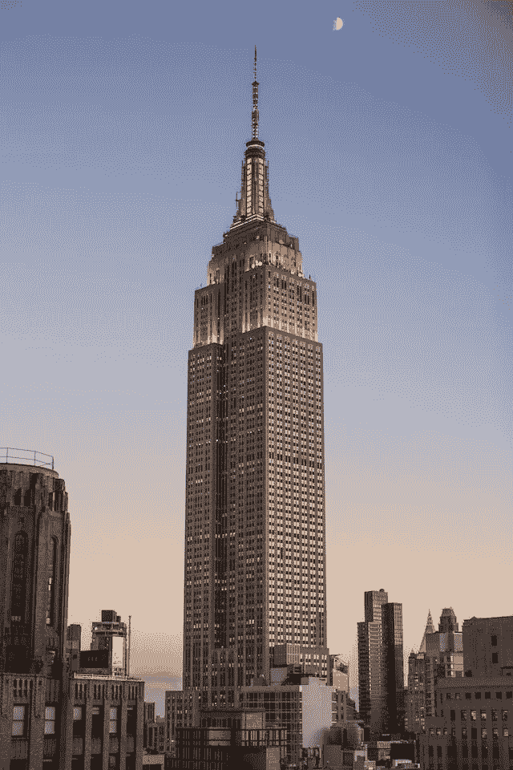

由[Ben Dumond](https://unsplash.com/@bendumond?utm_source=unsplash&utm_medium=referral&utm_content=creditCopyText)拍摄的照片，来源于[Unsplash](https://unsplash.com/photos/VedK8_UlmkY?utm_source=unsplash&utm_medium=referral&utm_content=creditCopyText)

如果我们将该图像保存在路径中并应用 Otsu 算法，我们得到：

如果我们比较 im（原始图像）和 im_otsu（算法处理后的图像），我们得到：

正如我们所见，图像右上部分的黑色区域被误解为主体，因为它与一些主体有相同的色调。人们不完美，算法也一样🙃

# 3\. 总结

感谢您在整个 Otsu 算法教程中与我同行。

在这篇简短的文章中，我们看到：

1.  **图像**可以被视为**二维信号**，然后可以使用信号处理技术进行分析

1.  **Otsu 算法**的假设是图像的**背景**和**主体**具有两个连续的、互不重叠的、明确区分的领域。

1.  如何在给定 Otsu 算法的情况下找到图像的**最佳**背景和主体的区分。我们如何将 Otsu 算法解释为 Fisher 线性判别。

1.  如何使用**Python**实现 Otsu 算法。

1.  如何在实际**图像**中**应用**此算法。

# 4\. 结论

如果你喜欢这篇文章，想了解更多关于机器学习的内容，或只是想问我一些问题，你可以：

A. 在[**Linkedin**](https://www.linkedin.com/in/pieropaialunga/)上关注我，我会在上面发布我的所有故事。

B. 订阅我的[**新闻通讯**](https://piero-paialunga.medium.com/subscribe)。它将让你了解最新故事，并给你机会通过短信与我联系，获取所有的更正或解答你可能有的疑问。

C. 成为[**会员**](https://piero-paialunga.medium.com/membership)，这样你就不会有“每月故事数量上限”的限制，可以阅读我（以及成千上万的其他机器学习和数据科学顶级作家）关于最新技术的文章。
