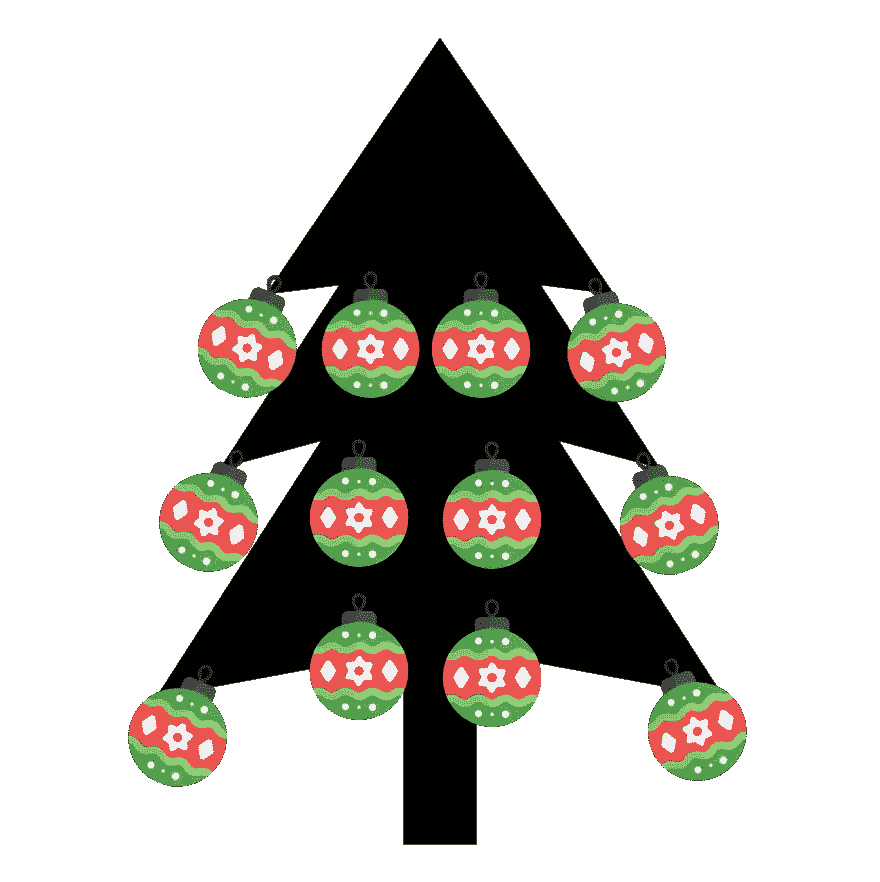
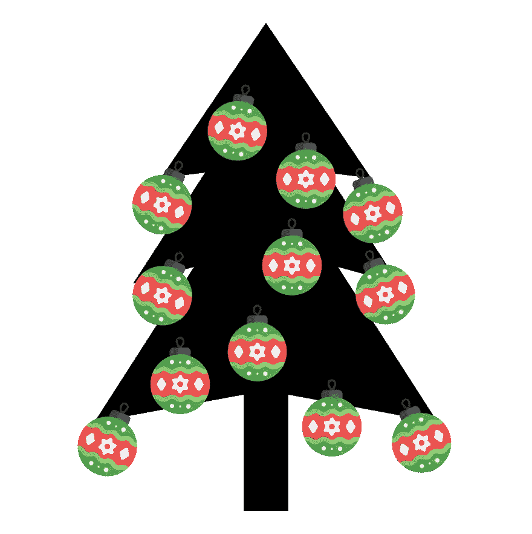

# 在 Python 中的采样技术与比较

> 原文：[`towardsdatascience.com/hands-on-sampling-techniques-and-comparison-in-python-6342c70f2099?source=collection_archive---------8-----------------------#2023-12-01`](https://towardsdatascience.com/hands-on-sampling-techniques-and-comparison-in-python-6342c70f2099?source=collection_archive---------8-----------------------#2023-12-01)

## 这是一个逐步教程，教你如何使用 Python 高效地对数据集进行采样

 [Piero Paialunga](https://piero-paialunga.medium.com/?source=post_page-----6342c70f2099--------------------------------)

·

[关注](https://medium.com/m/signin?actionUrl=https%3A%2F%2Fmedium.com%2F_%2Fsubscribe%2Fuser%2F254e653181d2&operation=register&redirect=https%3A%2F%2Ftowardsdatascience.com%2Fhands-on-sampling-techniques-and-comparison-in-python-6342c70f2099&user=Piero+Paialunga&userId=254e653181d2&source=post_page-254e653181d2----6342c70f2099---------------------post_header-----------) 发表在 [Towards Data Science](https://towardsdatascience.com/?source=post_page-----6342c70f2099--------------------------------) ·8 分钟阅读·2023 年 12 月 1 日

--

作者提供的图像

我和妻子一起布置圣诞树。我们去了地下室，拿了树，把它带到楼上，从底部开始搭建。这总是一个神奇的时刻🎄

然后到了把球放在树上的时候。我立即想到：把球放在树上至少有三种方式。

+   **均匀地**：将球均匀地放在树上，就像这样

作者提供的图像，制作使用了 [Freepik](https://www.freepik.com/)

+   **随机**：将球随机放置在树上，闭上眼睛，把球放在你感觉合适的地方（我开始这样做时，我妻子气疯了）

作者提供的图片，制作使用了[Freepik](https://www.freepik.com/)

+   **拉丁超立方体**：将树分成 N 个部分，并在每个部分中随机提取。很难在不运行任何代码的情况下绘制，但一个可能的拉丁超立方体看起来是这样的：
