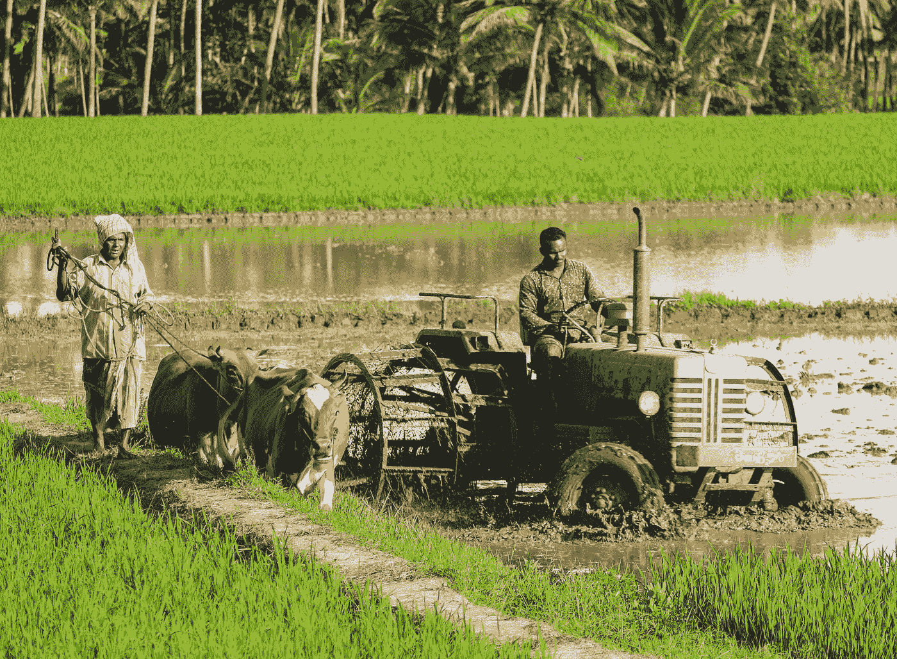

# 利用人工智能创造更美好的世界

> 原文：[`towardsdatascience.com/harnessing-ai-for-a-better-world-e3357cc73b09`](https://towardsdatascience.com/harnessing-ai-for-a-better-world-e3357cc73b09)

狮子家族。图像由作者使用 Dall·E 创作。

## 发现 5 个由人工智能赋能的激励性话题

 [Hennie de Harder](https://hennie-de-harder.medium.com/?source=post_page-----e3357cc73b09--------------------------------)

·发表于 [Towards Data Science](https://towardsdatascience.com/?source=post_page-----e3357cc73b09--------------------------------) ·阅读时间 8 分钟·2023 年 10 月 7 日

--

**有许多例子显示人工智能被错误使用，正如引人深思的书籍** [**《数学毁灭武器》**](https://www.amazon.com/Weapons-Math-Destruction-Increases-Inequality/dp/0553418815)**所强调的。** [**人工智能的风险**](https://builtin.com/artificial-intelligence/risks-of-artificial-intelligence) **也不容小觑。人工智能伦理和治理已成为我们快速发展的技术环境中的紧迫问题，许多公司现在设有专门部门，专注于解决这些问题。然而，在这些挑战中，也有鼓舞人心的故事，展示了数学和人工智能如何被用于造福社会。**

这篇文章旨在激励您，并展示人工智能如何帮助应对复杂的全球挑战，从气候变化到人权侵犯。所选的倡议和公司在大规模上取得了显著成果，我相信它们值得被关注。这只是一个选择，因为还有许多其他例子。如果您发现我遗漏了什么，请随时在这篇文章中发表评论！

> 分享这篇文章的另一个动机是 10 月 4 日庆祝的世界动物日。 🐈‍⬛

# 难民安置

数学优化通常用于在各种情境下最大化利润或最小化成本。然而，也有一些特殊情况，其中它服务于崇高的目的，如此处所示。

当难民在接待国寻求庇护时，将难民家庭安置到合适的住所可以深刻[影响他们在就业、教育和整体福祉方面的长期前景](https://www.aeaweb.org/articles?id=10.1257%2Fapp.3.2.67)。许多难民处于脆弱状态，因此将他们安置在一个安全的环境中以便他们可以开始重建新生活是很重要的。同样，对于寄养家庭来说，将他们的偏好与他们接待的难民对接也是至关重要的。例如，如果一位年长的女性希望照顾难民，却最终接待了一个五人男性家庭，情况可能会令人不堪重负。通过优化匹配过程，可以显著改善安置结果。

[Annie MOORE](https://project.nek.lu.se/publications/workpap/papers/wp18_23.pdf) 是一个在 2018 年开发的软件系统，专注于解决这个问题。该软件由总部位于美国的安置机构 HIAS 使用。Annie 利用机器学习和数学优化来推荐寄养家庭与难民之间的匹配。该软件显著提高了 HIAS 安置的难民的就业结果，数据从 22%到 38%不等。

更进一步地创新，新平台 RUTH（Refugees Uniting Through HIAS）增强了安置过程。RUTH 结合了难民和接待家庭的偏好，使得迁移过程更快、更透明。伍斯特理工学院的运营和工业工程副教授 Trapp 博士通过以下声明强调了 RUTH 的重要性：

> “这是第一次系统地将难民的偏好和接待方的优先事项应用于安置过程中。”

RUTH 帮助安置了[来自乌克兰的难民](https://hias.org/news/how-innovative-algorithm-helps-ukrainian-refugees-find-new-homes/)到美国，在俄罗斯入侵期间。

[Julie Ricard](https://unsplash.com/@jricard?utm_source=medium&utm_medium=referral) 的照片，来源于 [Unsplash](https://unsplash.com/?utm_source=medium&utm_medium=referral)

# 保护野生动物

人工智能在保护和保育濒危物种和野生动物方面发挥着重要作用。通过先进的图像识别和预测建模，人工智能驱动的系统彻底改变了我们监测动物行为、跟踪迁徙模式和打击偷猎威胁的方式（是的，偷猎者仍然存在）。这些技术使保育工作者和执法机构能够迅速作出反应，保护世界生物多样性并保存我们的自然遗产。

在网络上可以找到许多出色的例子。让我们来看一些。

挽救物种免于灭绝是计算机视觉和其他机器学习技术可以帮助实现的目标。跟踪物种的一个可能方法是计算国家公园中的动物数量。 [Appsilon](https://appsilon.com/data-for-good/mbaza-ai/)开发了一款名为 Mbaza AI 的工具。该工具基本上是一个专注于野生动物的图像分类工具。澳大利亚的一个濒危物种是考拉，因火灾和动物袭击而面临威胁。 [这一倡议](https://conservationai.net)利用 AI 来定位和拯救幸存的考拉。微软 AI 与雪豹信托基金会合作，致力于[雪豹的检测和识别](https://snowleopard.org/how-ai-helps-us-understand-protect-snow-leopards/)，帮助保护雪豹。Google AI 利用[鲸鱼的歌声](https://blog.google/technology/ai/tale-whale-song/)来定位和保护鲸鱼。

不幸的是，全球仍有盗猎者猎杀动物。但幸运的是，AI 让他们的工作变得更加困难。 [黑客地球](https://www.hack-the-planet.io/project/ai-camera-trap)有一个倡议，可以在盗猎者出现时提醒护林员。这非常好，因为护林员可以直接追踪盗猎者，而不是不断查看监控录像。 [另一个项目](https://www.gamerangersinternational.org/resourceprotection)监控每一艘进出赞比亚公园的船只，以防止非法捕鱼。借助 AI 监控的其他动物有[灰熊、大象和企鹅](https://news.microsoft.com/on-the-issues/2019/08/06/ai-endangered-species/)。

图片由[Adrian Pereira](https://unsplash.com/@adrianluisp10?utm_source=medium&utm_medium=referral)提供，来自[Unsplash](https://unsplash.com/?utm_source=medium&utm_medium=referral)

# 应对气候变化

气候变化是一个重大问题。我们必须应对气候变化的负面影响，如海平面上升、极端天气事件、健康风险增加、食物短缺和人口迁移。

对抗气候变化的战斗需要数据驱动的洞察力和可持续的解决方案。AI 擅长处理大量数据集，并识别出可指导气候政策和资源管理的模式。从优化可再生能源生产到预测极端天气事件，AI 有助于缓解气候变化的影响，并促进我们星球的可持续未来。

准确的天气预报对保护生命和财产至关重要。 [LEAP](https://leap.columbia.edu)（利用 AI 和物理学学习地球）是一个致力于改善短期气候预报的科技中心。他们通过将传统气候科学与先进的机器学习结合来实现这一目标。LEAP 结合了两种方法的优点，并构建了下一代 AI 模型。

正如你可能知道的，碳排放对地球有影响。许多倡议表明，减少碳排放是可能的。一个利用人工智能减少碳足迹的公司是[Eugenie.ai](https://eugenie.ai/about-us)，它帮助制造商实现运营脱碳。[Mortar IO](https://www.mapmortar.io)发现减少现有建筑碳排放的方法，他们的愿景是成为脱碳房地产的数据基础设施。建筑物的碳足迹等于[全球能源相关碳排放的 39%](https://worldgbc.org/advancing-net-zero/embodied-carbon/#:~:text=Buildings%20are%20currently%20responsible%20for,11%25%20from%20materials%20and%20construction.)，所以这是一个相当不错的倡议。

一个可能会引起你注意的有趣问题是：人工智能本身的排放足迹如何？人工智能是相当[大宗消费者](https://aclanthology.org/P19-1355/)（在[这篇文章的第一个图表](https://www.technologyreview.com/2019/06/06/239031/training-a-single-ai-model-can-emit-as-much-carbon-as-five-cars-in-their-lifetimes/)中可见），而且可以大幅减少排放，[正如 HuggingFace 用 BLOOM 模型所证明的](https://www.technologyreview.com/2022/11/14/1063192/were-getting-a-better-idea-of-ais-true-carbon-footprint/)。新技术可以帮助减少碳足迹，包括人工智能的碳足迹。也许减少排放的最佳方式是研发性能与大模型相当的小型模型。

废物是另一个在思考气候变化时出现的话题。人们的消费行为对甲烷排放有着[巨大的影响](https://www.catf.us/2022/09/how-our-trash-contributes-to-climate-change/#:~:text=The%20waste%20sector%20is%20one,human%2Ddriven%20methane%20emissions%20globally.)。一个处理时尚产业废物的酷炫倡议是[Refiberd](https://refiberd.com)。他们利用人工智能来对纺织品进行回收应用的分类。

# 帮助发展中国家的农民

在发展中国家，小规模农民常常面临在最大化作物产量和有效管理资源方面的挑战。基于人工智能的应用程序通过提供有关作物选择、灌溉和害虫控制的量身定制建议，提供了宝贵的支持。通过为农民提供这些工具，我们赋予他们改善生计和为社区的食品安全做出贡献的能力。

一个在全球范围内用于检测作物疾病并提供解决方案的应用是 [Plantix](https://plantix.net/en/)。它帮助最大化作物产量，并使用人工智能进行检测。[Hello Tractor](https://hellotractor.com) 是一个提供将农民与拖拉机拥有者连接起来的平台，用于耕作和其他农业活动的公司。他们利用数学优化和机器学习来优化拖拉机的分配和调度，使发展中国家的小农户能够更负担得起机械化农业。另一个具体的例子是 [Apollo Agriculture](https://www.apolloagriculture.com)。这家公司不仅在农业方面帮助肯尼亚和赞比亚的农民，还提供融资。Apollo 的机器学习部分专注于信用模型，以做出信用决策。

还有许多其他的倡议，比如 [AgriPredict](https://www.agripredict.com)、[Taranis](https://www.taranis.com) 和 [Farmshine](https://www.farmshine.io)（为农民提供天气预报、作物病害诊断和市场准入的平台）。

由 [Rajesh Ram](https://unsplash.com/@rajesh_ram?utm_source=medium&utm_medium=referral) 拍摄，来源于 [Unsplash](https://unsplash.com/?utm_source=medium&utm_medium=referral)

# 揭露人权虐待和战争罪行

许多人权组织因人工智能的风险而反对它。查看 [国际特赦组织](https://www.amnesty.org/en/latest/news/2023/09/eu-ai-act-must-ban-dangerous-ai-powered-technologies-in-historic-law/)、[人权观察](https://www.hrw.org/news/2023/05/03/pandoras-box-generative-ai-companies-chatgpt-and-human-rights) 和 [Bellingcat](https://www.bellingcat.com/resources/2023/07/14/can-ai-chatbots-be-used-for-geolocation/) 的最新帖子。除了批评，人工智能是否也能在这个领域发挥积极作用？

实际上，它可以：人工智能可以筛选大量的数据，包括图像、视频和文本信息，以识别和记录侵犯行为。这是通过图像和视频分析、自然语言处理、面部识别和预测分析来完成的。此外，人工智能可以汇总和交叉参考来自不同来源的数据，构建事件和人权侵犯的全面图景。这包括汇总来自目击者的证词、社交媒体帖子和官方报告的信息。

Syrian Archive 是一个利用开源情报、数字取证和人工智能记录叙利亚人权侵犯的组织。他们收集和验证视觉证据，如照片和视频，以追究罪犯的责任。你可以在 [方法和工具](https://syrianarchive.org/en/about/methods-tools) 上了解他们使用的更多信息。

另一个例子是法医建筑学。这个研究机构结合空间和建筑分析、AI 和机器学习，调查人权侵犯和国家暴力。他们经常与其他组织合作，提供有价值的见解。[这些例子](https://forensic-architecture.org/methodology/machine-learning) 展示了机器学习技术应用的不同案例。

最后但同样重要的是，[信息复原中心](https://www.info-res.org) 是一个致力于揭露人权侵犯和战争罪行的非营利社会企业。此外，他们还反击虚假信息和有害的在线行为。他们使用数据科学（主要是分析和可视化）的一个例子是 [Eyes on Russia map](https://eyesonrussia.org)。这是一个自俄罗斯入侵乌克兰以来重要事件的时间轴。

希望更多类似的倡议能够出现，以善用 AI。

# 结论

尽管 AI 的伦理挑战不可否认，但认识到其带来积极变化的潜力至关重要。这里讨论的例子表明，当 AI 和数学负责任地运用并承诺伦理原则时，它们可以成为解决全球紧迫问题并改善世界的强大工具。

如果你喜欢志愿服务或为某些项目和公司工作，其中一些确实有职业机会！你可以访问他们的网站进行搜索。

## 相关内容

## 机器学习项目中的伦理考量

### 在构建 AI 系统时不要忘记这些主题

## 结合数学优化和机器学习的五种方法

### 结合两种力量的实际例子。

## 任何机器学习模型的模型无关解释方法

### 解释方法概述：置换特征重要性、部分依赖图、LIME、SHAP 等。

关于模型无关解释方法的概述
