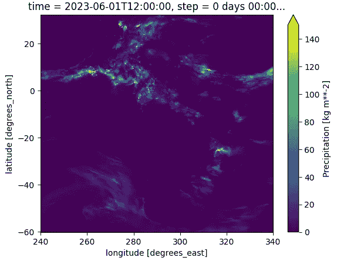
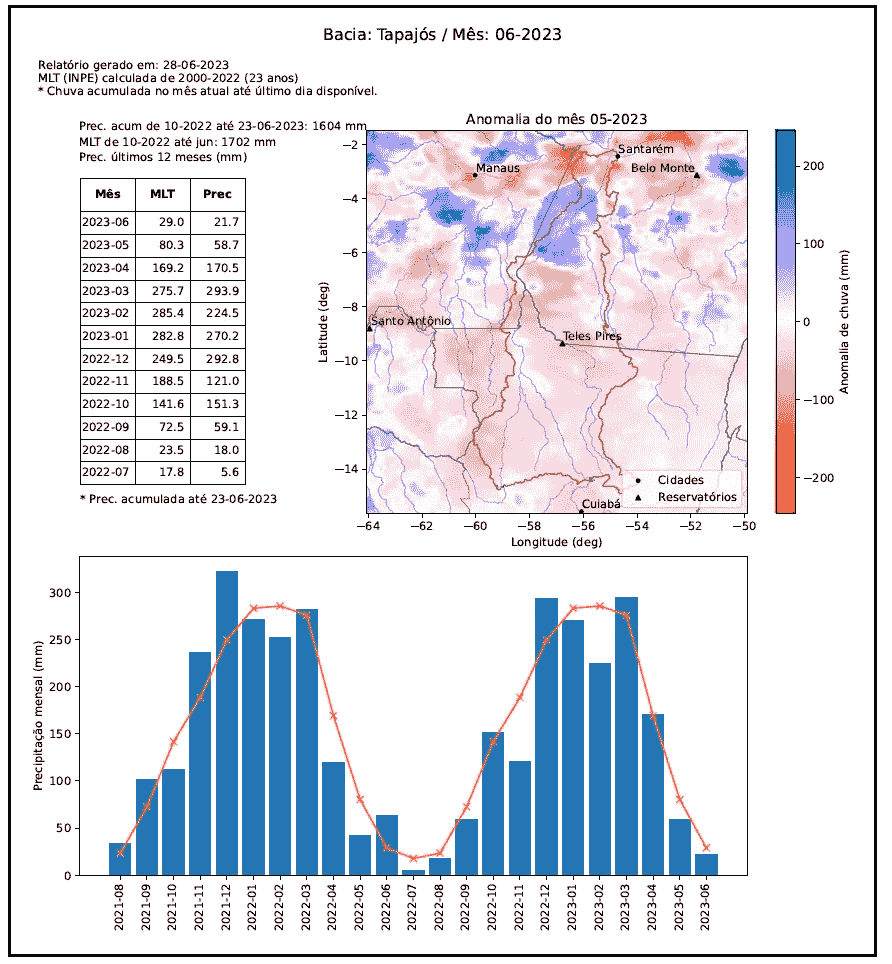

# 利用南美洲的降水量和气象栅格数据

> 原文：[`towardsdatascience.com/harnessing-precipitation-and-climatological-raster-data-in-south-america-18ec36d683?source=collection_archive---------11-----------------------#2023-06-29`](https://towardsdatascience.com/harnessing-precipitation-and-climatological-raster-data-in-south-america-18ec36d683?source=collection_archive---------11-----------------------#2023-06-29)

## 如何使用 Google Colab 访问 MERGE 降水量和 INPE 的其他气象产品，以获得全面的天气洞察

[](https://cordmaur.medium.com/?source=post_page-----18ec36d683--------------------------------)[](https://towardsdatascience.com/?source=post_page-----18ec36d683--------------------------------) [Maurício Cordeiro](https://cordmaur.medium.com/?source=post_page-----18ec36d683--------------------------------)

·

[关注](https://medium.com/m/signin?actionUrl=https%3A%2F%2Fmedium.com%2F_%2Fsubscribe%2Fuser%2F8878c77fe1a3&operation=register&redirect=https%3A%2F%2Ftowardsdatascience.com%2Fharnessing-precipitation-and-climatological-raster-data-in-south-america-18ec36d683&user=Maur%C3%ADcio+Cordeiro&userId=8878c77fe1a3&source=post_page-8878c77fe1a3----18ec36d683---------------------post_header-----------) 发表在 [Towards Data Science](https://towardsdatascience.com/?source=post_page-----18ec36d683--------------------------------) ·7 分钟阅读·2023 年 6 月 29 日[](https://medium.com/m/signin?actionUrl=https%3A%2F%2Fmedium.com%2F_%2Fvote%2Ftowards-data-science%2F18ec36d683&operation=register&redirect=https%3A%2F%2Ftowardsdatascience.com%2Fharnessing-precipitation-and-climatological-raster-data-in-south-america-18ec36d683&user=Maur%C3%ADcio+Cordeiro&userId=8878c77fe1a3&source=-----18ec36d683---------------------clap_footer-----------)

--

[](https://medium.com/m/signin?actionUrl=https%3A%2F%2Fmedium.com%2F_%2Fbookmark%2Fp%2F18ec36d683&operation=register&redirect=https%3A%2F%2Ftowardsdatascience.com%2Fharnessing-precipitation-and-climatological-raster-data-in-south-america-18ec36d683&source=-----18ec36d683---------------------bookmark_footer-----------)

图片由 [Max](https://unsplash.com/it/@notquitemax?utm_source=medium&utm_medium=referral) 提供，发布在 [Unsplash](https://unsplash.com/?utm_source=medium&utm_medium=referral)

# 介绍

随着 2023 年厄尔尼诺现象的加剧，气候和降水数据在解读其对全球或区域天气模式和气候动态的影响方面变得至关重要。在降水数据方面，有两个全球公认的数据集脱颖而出：由 USGS 提供的 CHIRPS（气候灾害组红外降水与站点数据）和由 NASA 开发的 IMERGE（集成多卫星检索用于 GPM），其中 GPM 表示全球降水测量任务。该任务利用一组卫星网络提供全面的全球降雨估计。尽管这些产品适用于全球模型，但它们并未专门针对南美洲的情境。

在这种情况下，巴西国家空间研究所（INPE）提供了专门为南美洲校准的每日降水光栅数据。这个产品称为 MERGE，依赖于 IMERGE/GPM 模型，但通过与成千上万的现场雨量计的校准，确保结果不偏不倚（Rozante et al. 2010，Rozante et al. 2020）。INPE 还提供其他气候数据，包括月平均值、日平均值等。

图 1 显示了 2015 年南美洲的总降水量（左侧），这是一个强厄尔尼诺现象的年份，以及与前一年（右侧）相比的降水异常，当时没有厄尔尼诺现象。


图 1：左侧为 2015 年南美洲的总降水量，右侧为 2015 年相对于 2014 年的降水异常，2014 年没有厄尔尼诺现象。图片由作者提供。

从图中我们可以注意到一个大范围的负异常区域，特别是在亚马逊生物群落中，与前一年相比降雨量减少了多达 2,000 毫米。

这些资源在各种应用中具有巨大价值，包括流域和水库管理、关键事件监测和精密农业。然而，下载和处理这些数据集的复杂性往往阻碍了它们的有效利用，限制了它们的使用主要集中在气象学家身上，使得水文学家和农业专家等其他专业人员的装备不足。这在我的组织（ANA）中也是一个挑战，水文学家和工程师经常难以访问特定流域的降水数据。

针对这一挑战，本文旨在指导读者如何使用`merge-downloader`包高效下载和处理这些数据，为更广泛的跨学科使用和洞察打开大门。

# 安装

`merge-downloader`是一个非官方库，旨在简化从 INPE 访问数据的过程，源代码可以在以下网址获得：[`github.com/cordmaur/merge-downloader`](https://github.com/cordmaur/merge-downloader)。

安装用于地理空间应用的 Python 库有时可能令人望而却步，因此我强烈建议使用 docker。我已经在之前发布的 TDS 故事中讨论过这个话题：

+   [为 Python 的空间分析配置最小化 Docker 镜像](https://medium.com/towards-data-science/configuring-a-minimal-docker-image-for-spatial-analysis-with-python-dc9970ca8a8a)

+   [为什么你应该为地理空间开发使用 Devcontainers](https://medium.com/towards-data-science/why-you-should-use-devcontainers-for-your-geospatial-development-600f42c7b7e1)

Docker Hub 上已经提供了 docker 镜像，可以使用以下命令在 shell 提示符下进行安装。

```py
> docker pull cordmaur/merge-downloader:v1
> docker run -it -p 8888:8888 merge-downloader:v1 bash 
```

进入容器后，你可以安装该软件包并启动 jupyter，通过`http://127.0.0.1:8888`在你的网页浏览器上访问。

```py
root@89fd8c332f98:/# pip install merge-downloader
root@89fd8c332f98:/# jupyter notebook --ip=0.0.0.0 --allow-root --no-browser
```

另一个更直接的选项是将`merge-downloader`安装在 Google Colab 上，这将是这里遵循的路径。

```py
# from a code cell
%pip install merge-downloader
```

# 下载资产

我们首先需要了解如何从 INPE 简单地下载降水和气候资产。可以使用以下命令获取`merge-downloader`可下载资产的列表：

```py
from mergedownloader.inpeparser import INPETypes

INPETypes.types()

result: 
DAILY_RAIN, 
MONTHLY_ACCUM_YEARLY, 
DAILY_AVERAGE, 
MONTHLY_ACCUM, 
MONTHLY_ACCUM_MANUAL, 
YEARLY_ACCUM, 
HOURLY_WRF, 
DAILY_WRF
```

每种类型的含义在 github 文档中有说明，并总结在下表中：


要下载任何资产，首先需要创建一个下载实例，指向 INPE 的 FTP 服务器，并设置一个本地文件夹来下载文件。

```py
from mergedownloader.downloader import Downloader
from mergedownloader.inpeparser import INPETypes, INPEParsers

# create a temporary folder to store the files
!mkdir ./tmp

downloader = Downloader(
    server=INPEParsers.FTPurl,
    parsers=INPEParsers.parsers,
    local_folder='./tmp'
)
```

一旦创建了下载器实例，我们来下载特定一天的降雨数据。我们可以使用`get_file`命令，如下所示：

```py
import xarray as xr

file = downloader.get_file(date='20230601', datatype=INPETypes.DAILY_RAIN)
file

result:
PosixPath('tmp/DAILY_RAIN/MERGE_CPTEC_20230601.grib2')
```

现在可以使用`xarray`库打开文件：

```py
rain = xr.load_dataset(file)
rain['prec'].plot(vmax=150)
```



代码结果：南美洲 2023 年 06 月 01 日的降雨量（毫米）。

# 打开多个资产

请注意，在之前的示例中，经度范围从 240 到 340 度东。这不是通常的用法，我们使用正负数字表示格林威治右侧和左侧的经度。当我们使用`Downloader`实例打开资产时，这种修正和其他小修正，例如正确的 CRS 定义，会自动完成。可以通过使用`open_file`代替`get_file`来实现。例如，我们打开表示 2023 年头四个月降雨的多个文件。此外，我们还将绘制南美国家作为空间参考。

```py
# open the countries dataset
countries = gpd.read_file(gpd.datasets.get_path('naturalearth_lowres'))
south_america = countries.query("continent == 'South America'")

# select the months to download
dates = ['2023-01', '2023-02', '2023-03', '2023-04']
monthly_rains = [downloader.open_file(date, datatype=INPETypes.MONTHLY_ACCUM_YEARLY) for date in dates]

# create a figure with the monthly precipitation
fig, axs = plt.subplots(2, 2, figsize=(12, 11))
for i, rain in enumerate(monthly_rains):
    ax = axs.reshape(-1)[i]
    rain.plot(ax=ax, vmax=1200)
    south_america.plot(ax=ax, facecolor='none', edgecolor='white')
```


代码结果：2023 年头四个月的月累计降雨量。

# 创建数据立方体

现在，假设我们需要评估 2023 年 6 月上半月在特定区域（例如亚马逊生物群落）发生的累积降水量。在这些情况下，与其逐个打开每个文件，裁剪区域，堆叠等，不如创建一个数据立方体并直接对其进行操作。这个立方体由沿 `time` 维度堆叠的多个栅格组成。

首先，让我们创建立方体。`Downloader` 类可以为给定的日期范围自动创建一个立方体。

```py
# create a cube for the first half of June
cube = downloader.create_cube(
    start_date='20230601',
    end_date='20230615',
    datatype=INPETypes.DAILY_RAIN
)

cube
```


接下来，我们需要执行两个操作。裁剪，将数据限制到所需区域，以及求和，累积所需天数的降水量。因此，在第一步中，我们将把立方体裁剪到亚马逊生物群落的范围内。我们可以通过 `GISUtil.cut_cube_by_geoms()` 方法来完成这一操作。然后我们在 `time` 轴上进行求和，最终得到一个二维层。我们一步步来看。

```py
from mergedownloader.utils import GISUtil

# open the amazon geometry
amazon = gpd.read_file('https://raw.githubusercontent.com/cordmaur/Fastai2-Medium/master/Data/amazon.geojson')

# cut the cube by the given geometry
amazon_cube = GISUtil.cut_cube_by_geoms(
    cube=cube,
    geometries = amazon.geometry
)

# accumulate the rain along the time axis
amazon_rain = amazon_cube.sum(dim='time', skipna=False)

# plot the figure
fig, ax = plt.subplots(figsize=(8, 5))
amazon_rain.plot(ax=ax)
south_america.plot(ax=ax, facecolor='none', edgecolor='firebrick')
```


代码结果。2023 年 6 月上半月，亚马逊地区的降雨量。

# 创建时间序列

为特定区域创建时间序列可以提供有价值的见解，特别是考虑到降雨或历史气候数据。例如，你可能希望绘制 2015 年厄尔尼诺现象期间亚马逊的月降雨量，并与该地区每个月的长期平均降水量进行比较。

要开始，我们将创建两个立方体。一个是 2015 年 1 月到 12 月的月降水量，另一个是长期平均值。INPE 提供的长期平均值是从 2000 年到 2022 年（23 年的数据）计算的，在这种情况下，我们可以传递任何一年作为参考。

请注意以下代码，我们使用了 `reducer=xr.DataArray.mean`，这是用于汇总区域内每个像素值的方法，只保留 `time` 维度。

```py
# Create the cubes
cube_2015 = downloader.create_cube(
    start_date='2015-01',
    end_date='2015-12',
    datatype=INPETypes.MONTHLY_ACCUM_YEARLY
)

cube_lta = downloader.create_cube(
    start_date='2015-01',
    end_date='2015-12',
    datatype=INPETypes.MONTHLY_ACCUM
)

# Create the series
series_2015 = downloader.get_time_series(
    cube=cube_2015, 
    shp=amazon,
    reducer=xr.DataArray.mean
)

series_lta = downloader.get_time_series(
    cube=cube_lta, 
    shp=amazon,
    reducer=xr.DataArray.mean
)

# create a string index with just year and month
series_lta.index = series_2015.index = series_2015.index.astype('str').str[:7]

# plot the graph
fig, ax = plt.subplots(figsize=(12,6))

series_lta.plot(ax=ax, kind='line', color='orange', marker='x')
series_2015.plot(ax=ax, kind='bar')
```


# 结论

`merge-downloader` 包和 INPE 的降水和气候数据为环境分析应用提供了有效的资源。该包与成熟的库如 geopandas 和 xarray 的兼容性进一步提升了其适用性。

通过各种案例示例，包的功能范围从下载和绘制降水数据等简单任务到更高级的操作。这些包括生成数据立方体、实现空间裁剪和执行时间序列分析。用户可以根据具体需求应用这些工具，便于执行如环境变化追踪、气候事件监测或全面区域研究等任务。图 2 显示了一个完整的报告示例，使用了 `merge-downloader` 和其他 Python 地理空间工具。



图 2：使用 MERGE 数据为多个巴西流域生成的报告示例。图片由作者提供。

所提出的方法允许对降水数据进行评估，并与任何空间定义区域的气候参考进行比较，适用于多个领域。

# 保持联系

*如果你喜欢这篇文章，可以考虑成为* [*Medium 会员*](https://cordmaur.medium.com/membership) *，解锁像这样数千篇文章。*

[](https://cordmaur.medium.com/membership?source=post_page-----18ec36d683--------------------------------) [## 使用我的推荐链接加入 Medium - Maurício Cordeiro

### 作为 Medium 会员，你的部分会员费将用于支持你阅读的作者，你可以全面访问每一个故事…

cordmaur.medium.com](https://cordmaur.medium.com/membership?source=post_page-----18ec36d683--------------------------------)
