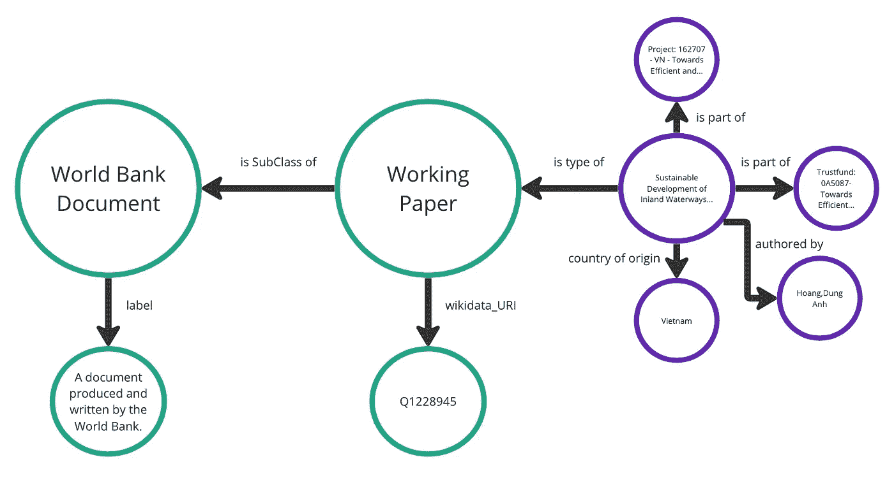
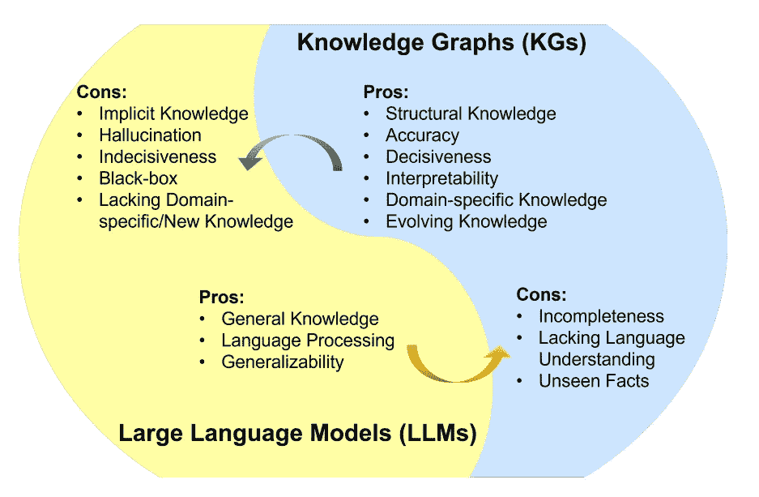
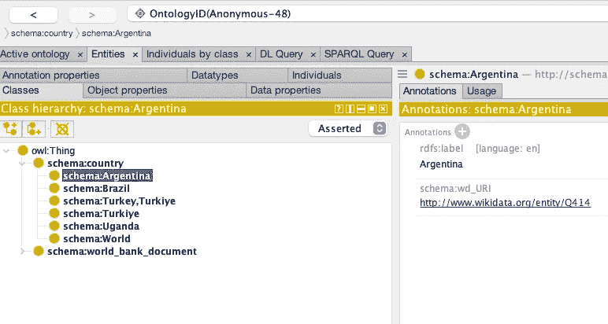
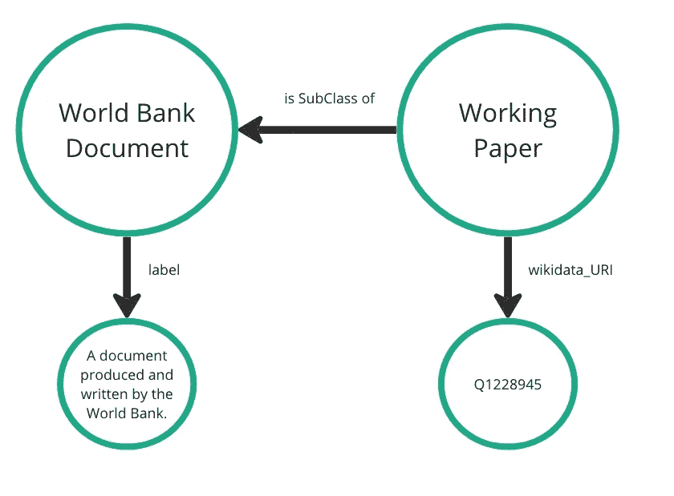
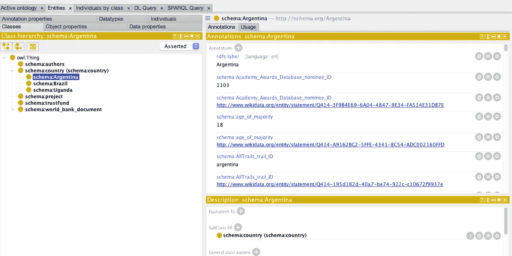
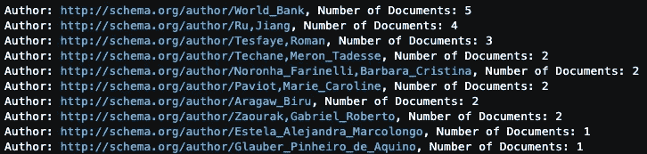

# 利用知识图谱的力量：用结构化数据丰富 LLM

> 原文：[`towardsdatascience.com/harnessing-the-power-of-knowledge-graphs-enriching-an-llm-with-structured-data-997fabc62386`](https://towardsdatascience.com/harnessing-the-power-of-knowledge-graphs-enriching-an-llm-with-structured-data-997fabc62386)



## 创建知识图谱并探索其增强 LLM 潜力的逐步指南

[](https://stevehedden.medium.com/?source=post_page-----997fabc62386--------------------------------)[](https://towardsdatascience.com/?source=post_page-----997fabc62386--------------------------------) [Steve Hedden](https://stevehedden.medium.com/?source=post_page-----997fabc62386--------------------------------)

·发表于[数据科学的前沿](https://towardsdatascience.com/?source=post_page-----997fabc62386--------------------------------) ·20 分钟阅读·2023 年 7 月 10 日

--

*有关代码，请参见笔记本* [*这里。*](https://github.com/SteveHedden/kg_llm/blob/main/SDKG.ipynb)

近年来，[大型语言模型](https://snorkel.ai/large-language-models-llms/)（LLMs）变得无处不在。也许最著名的 LLM 是 ChatGPT，它由 OpenAI 于 2022 年 11 月发布。ChatGPT 能够[生成创意](https://www.linkedin.com/pulse/generate-100-content-ideas-chat-gpt-mfon-akpan/)、[给出个性化推荐](https://bootcamp.uxdesign.cc/how-to-use-chatgpt-for-personalized-recommendations-840e01dcad89)、[理解复杂话题](https://medium.com/101-innovation-hacks/using-chatgpt-to-explain-complex-concepts-2ea6aba97cf3)、[充当写作助手](https://chatgptwriter.ai/)，或者[帮助你建立一个预测奥斯卡奖的模型。](https://medium.com/design-bootcamp/using-chatgpt-to-predict-the-oscars-c6d8cdb6b3a0) Meta 宣布了他们自己的 LLM 叫做[LLaMA](https://ai.meta.com/blog/large-language-model-llama-meta-ai/)，Google 有[LaMDA](https://blog.google/technology/ai/lamda/)，甚至还有一个开源替代品，[BLOOM。](https://huggingface.co/bigscience/bloom)

LLM 在自然语言处理（NLP）任务中表现出色，如上述所列，因为 LLM 历史上专注于[非结构化数据](https://en.wikipedia.org/wiki/Unstructured_data)——没有预定义结构的数据，通常以文本为主。我问 ChatGPT，“为什么 LLM 历史上专注于非结构化数据？”回答是：

> “LLMs 历史上专注于非结构化数据，因其丰富性、可获得性以及所带来的挑战。非结构化数据为训练语言模型提供了广泛的来源，使其能够学习模式、上下文和语义。LLMs 在处理非结构化数据的复杂性和细微差别方面表现出色，捕捉语言的细微之处，并利用其中丰富的上下文、观点和创造性表达。虽然正在努力弥合 LLMs 与结构化数据之间的差距，但对非结构化数据的历史性重视源于其独特特征和所提供的有价值信息，使 LLMs 能够提供更具人性化的回应。”

[结构化数据](https://www.ibm.com/cloud/blog/structured-vs-unstructured-data)通常是定量的，并且组织良好，通常是以行和列的形式呈现的。正如 ChatGPT 指出的那样，LLMs 与结构化数据之间仍存在差距。

知识图谱（KG）则在查询结构化数据方面表现出色。知识图谱是，

> “有向标记图，其中领域特定的意义与节点和边缘相关联。一个节点可以代表任何现实世界的实体，例如，人、公司、计算机等。边缘标签捕捉两个节点之间的兴趣关系，例如，两个人之间的友谊关系，公司和个人之间的客户关系，或两个计算机之间的网络连接等。” [(Chaudhri et al., 2022)](https://onlinelibrary.wiley.com/doi/10.1002/aaai.12033)。

KGs 允许集成异构数据源，包括结构化、半结构化和非结构化数据的组合。KGs 用于组织数据、推导推论、创建推荐和[语义搜索](https://www.stardog.com/blog/how-to-build-a-semantic-search-engine-using-a-knowledge-graph/)。

正如 Shirui Pan 等人在他们的论文“[统一大语言模型和知识图谱：路线图](https://arxiv.org/abs/2306.08302)”中指出的那样，这两种模型可以互补。LLMs 的一些主要弱点，如黑箱模型和对事实知识的困难，正是 KGs 的主要优势。KGs 本质上是事实的集合，它们是完全可解释的。



LLMs 和 KGs 如何互补。来源：Shirui Pan 等人，2023 年。<[`arxiv.org/abs/2306.08302`](https://arxiv.org/abs/2306.08302)>

Shirui 等人提出了 LLMs 和 KGs 互补的多种潜在方式。在本教程中，我将展示如何从结构化数据创建一个 KG，然后将这个 KG 作为 LLM 输入提示的一部分，这被称为上下文学习。我将比较在使用 KG 作为输入的一部分时 LLM 的回应与使用原始结构化数据作为输入提示时 LLM 的回应。

本教程的方法如下：

1.  使用[World Bank API](https://documents.worldbank.org/en/publication/documents-reports/api)下载一些关于世界银行文档的元数据

1.  使用文档的元数据构建本体

1.  用文档实例填充本体

1.  使用[Wikidata](https://www.wikidata.org/wiki/Wikidata:Main_Page)将额外的实体和关系引入图谱

1.  直接使用[SPARQL](https://www.ontotext.com/knowledgehub/fundamentals/what-is-sparql/)查询知识图谱

1.  比较与数据交互的不同方式：使用 SPARQL 查询 RDF，将原始元数据放入[LlamaIndex](https://www.llamaindex.ai/)，以及将 RDF 数据放入 LlamaIndex

如果你不想再阅读更多内容，我的总体收获是：

+   尽管可以直接使用结构化数据（以 CSV 或 RDF 文件形式），但利用上下文学习来增强 LLM 的结果并不理想。LLM 会遇到相同的问题：有时给出正确的答案，但有时出现幻觉（错误的事实），而且无法知道这些问题是如何/为什么发生的。

+   将结构化数据转换为知识图谱，通过构建本体并为每个数据实例分配适当的类别和属性，可以改善结果，但仍然存在幻觉和难以解释的不准确性。

+   如果你对个人结构化数据集中的特定查询感兴趣，并需要准确和可验证的答案，你应该使用正式查询，无论是使用 SPARQL 还是其他工具。SPARQL 查询可以比 LLM 更好地回答诸如“与该作者撰写的文档相关的所有项目是什么？”这样的问题，即使在通过 KG 进行上下文学习时也如此。

+   然而，LLM 可以帮助编写和完善 SPARQL 查询。如果 LLM 能够将提示翻译成 SPARQL 查询，那么用户仍然可以直接“聊天”与结构化数据，而无需编写自己的代码/查询。

+   LLM 在理解和解释非结构化数据方面表现出色。这种能力甚至扩展到*当非结构化信息嵌入其中时*的结构化数据。例如，如果结构化数据包含一个名为“摘要”的列，其中包含非结构化文本，LLM 可以利用这些数据生成有见地的结果。

+   使用原始元数据和知识图谱（KG）来增强 LLM 并没有改善结果。

+   Shirui 等人建议 KG 和 LLM 可以共同工作的其他方法：使用 LLM 将提示翻译成正式查询，使用 KG 验证 LLM 的响应，[使用 LLM 构建 KG](https://gpt-index.readthedocs.io/en/latest/reference/indices/kg.html)，以及使用 KG 训练 LLM。

# 1\. 使用世界银行 API 下载一些关于世界银行文档的元数据

首先我们需要一些世界银行文档的元数据。有关世界银行文档和报告 API 的完整文档，请访问[此处。](https://documents.worldbank.org/en/publication/documents-reports/api)

我选择世界银行文档元数据作为我们知识图谱的基础有几个原因。首先，世界银行提供了一个 API，可以访问他们的数据。此外，与世界银行文档相关的元数据是全面的，提供了有价值的信息。最后，我对这种数据类型的熟悉程度确保了对其结构和属性的更好理解。值得注意的是，构建知识图谱的灵活性适用于任何数据源，只要具备足够的领域知识以有效地构建它。

以下代码提供了最近 20 份标题中包含“可持续发展”一词的报告的元数据。

```py
import requests
import json
import pandas as pd

url = 'https://search.worldbank.org/api/v2/wds'
params = {
    'format': 'json',
    'display_title': '"sustainable development"',
    'rows': 20,
    'page': 1
}

metadata_list = []

for i in range(1):
    response = requests.get(url, params=params)
    data = json.loads(response.content)
    for doc_id in data['documents']:
        metadata = data['documents'][doc_id]
        metadata_list.append(metadata)

    params['page'] += 1

df = pd.DataFrame(metadata_list)
```

现在我们已经将元数据保存为 pandas 数据框（df）。

# 2\. 使用文档的元数据构建本体

现在我们可以建立我们的本体。那么，本体到底是什么？

> *“本体定义了一个共同的词汇，以便需要在某一领域共享信息的研究人员使用。它包括该领域基本概念及其相互关系的机器可解释定义，”* [*(Noy 和 McGuinness, 2001).*](https://protege.stanford.edu/publications/ontology_development/ontology101.pdf)

通过采用本体，我们能够连接不同的数据源。在本教程中，我们的主要关注点是世界银行数据，然而，如果我们要整合联合国数据，我们将面临诸如文档类型类别、日期格式和国家名称的差异等挑战。本体作为弥合这些差异和建立数据集之间连接的有价值工具。此外，我们可以通过整合来自 Wikidata 的数据来扩展我们的知识图谱，Wikidata 是一个广泛使用的公共知识图谱，与 Wikipedia 密切相关。将我们的数据本体与 Wikidata 的本体对齐，可以实现信息的无缝集成。

以下代码设置了我们的图谱

```py
from rdflib import Graph, RDF, RDFS, Namespace, URIRef, Literal
from rdflib.namespace import SKOS, XSD
from SPARQLWrapper import SPARQLWrapper, JSON
from tqdm import tqdm

# Create a new RDF graph
g = Graph()

schema = Namespace('http://schema.org/')
wd = Namespace('http://www.wikidata.org/entity/')

# Define namespaces
prefixes = {
    'schema': schema,
    'wd': wd,
    'skos': SKOS,
    'xsd': XSD
}
for p, ns in prefixes.items():
    g.bind(p, ns)
```

元数据中有一列叫做“count”，表示给定文档的原产国。我们希望利用这一列在我们的本体中创建一个“country”类，并为这一列中的每个独特国家创建子类。

```py
def create_subclass_country(column):
    newClass = URIRef(schema + "country")
    g.add((newClass, RDFS.label, Literal("country", lang='en')))
    df[column] = df[column].astype(str)
    for value in df[column].unique():
        if value != "nan":
            # Check Wikidata for a matching class
            sparql = SPARQLWrapper("https://query.wikidata.org/sparql")
            query = f"""
                SELECT ?class ?label WHERE {{
                    ?class wdt:P31 wd:Q6256 .
                    ?class rdfs:label "{value}"@en .
                    OPTIONAL {{ ?class skos:prefLabel ?label FILTER(lang(?label) = "en") }}
                    FILTER(REGEX(STR(?class), "^http://www.wikidata.org/entity/Q[0-9]+$"))
                }}
            """
            sparql.setQuery(query)
            sparql.setReturnFormat(JSON)
            results = sparql.query().convert()

            # If there is a match, use the Wikidata class as a subclass
            if results['results']['bindings']:

                #Get URI from Wikidata
                uri = results['results']['bindings'][0]['class']['value']

                #Get the 'Q ID' which is the unique ID at the end of the URI
                qid = uri.split('/')[-1]
                country_label = value

                #Create a subclass for each country under the country class
                subclass = URIRef(schema + country_label.replace(' ', '_'))
                g.add((subclass, RDF.type, RDFS.Class))
                g.add((subclass, RDFS.subClassOf, newClass))

                # Update the "country_URI" column with the URI for the current country
                df.loc[df[column] == value, "country_URI"] = uri
                uri = URIRef(uri)

                # Define the URI for the new Wikidata URI property
                wd_URI_property = URIRef(schema + "wd_URI")

                # Add the property to the RDF graph
                g.add((wd_URI_property, RDF.type, RDF.Property))

                # Add a label to the property
                label = Literal("Wikidata URI", lang="en")
                g.add((wd_URI_property, RDFS.label, label))

                #Add Wikidata URI as a property to each country class
                g.add((subclass, schema.wd_URI, uri))

                #Add label to each Wikidata Q ID code that it is the Q ID for this particular country
                g.add((uri, RDFS.label, Literal(f"{country_label} wikidata code", lang='en')))
                g.add((subclass, RDFS.label, Literal(value, lang='en')))
            else:    
                subclass = URIRef(schema + value.replace(' ', '_').replace('-','_'))
                g.add((subclass, RDF.type, RDFS.Class))
                g.add((subclass, RDFS.subClassOf, newClass))
                g.add((subclass, RDFS.label, Literal(value, lang='en')))
```

我使用 [protégé](https://protege.stanford.edu/)，一个免费的开源本体编辑器，来查看和有时手动调整我的本体。如果你想在创建本体时查看它，只需将图谱保存为 ttl 文件，并用 Protégé 打开。

```py
#Save graph as ttl file for use in protégé
g.serialize('worldBankKG.ttl',format='turtle',prefixes = prefixes, encoding='urf-8')
```

一旦你在 Protégé 中打开文件，它应该类似于这样：



从 Protégé 截图。图片由作者提供。

在世界银行数据的“count”列中，每个独特的国家将会在我们的本体下的“country”类中创建一个独特的子类。你可以看到每个国家还具有一个标签和一个 Wikidata URI。在这种情况下，阿根廷的 Wikidata URI 是：[`www.wikidata.org/entity/Q414`](https://www.wikidata.org/wiki/Q414)。

这也是阿根廷国家的 Wikidata 页面的链接。

现在我们需要为其他所有内容创建类和子类。我为文档类型、世界银行项目、世界银行信托基金、国家和作者创建了类。我没有把所有代码放在这个教程中，但请参见我的[笔记本](https://github.com/SteveHedden/kg_llm/blob/main/SDKG.ipynb)以获取创建所有这些类的代码。

# 3\. 用文档实例填充本体

本体是知识图谱的骨干，但现在我们需要用数据填充它。目前，本体定义了类、子类、类和子类的属性以及它们之间的关系。

例如，我们现在有一个世界银行文档的类和一个工作文件的子类。我们的本体确定了工作文件是世界银行文档的子类（或一种类型）。我们的本体为这些实体确定了标签和其他属性。例如，[工作文件](https://www.wikidata.org/wiki/Q1228945)是 Wikidata 中的一个实体，因此我们将 Wikidata URI 作为属性包含在本体中。



对本体中几个实体的概念化。图像由作者提供。

然而，在上面的示例中，并没有实际的世界银行工作文件，即没有工作文件的实例。我们已经建立了类，但尚未建立实例。

这是逐行遍历我们的 DataFrame 的代码，并为每一行创建一个文档实例，并分配适当的属性。请注意，要运行这段代码，你需要先创建所有这些类（再一次，请参见笔记本以获取完整代码）。

```py
#Create abstract property
df['abstracts'] = df['abstracts'].astype(str).str.replace('\n', '').replace('\\n','')
abstractIs_uri = URIRef(schema + "abstractIs")
g.add((abstractIs_uri, RDF.type, RDF.Property))
g.add((abstractIs_uri, RDFS.label, Literal("Short summary of the document.")))

#Create abstract class
abstract_class = URIRef(schema + "abstract")
g.add((abstract_class, RDFS.label, Literal("Short summary of a document.")))

#Create author properties
authoredBy_uri = URIRef(schema + "authoredBy")
authored_uri = URIRef(schema + "authored")
g.add((authoredBy_uri, RDF.type, RDF.Property))
g.add((authored_uri, RDF.type, RDF.Property))
g.add((authoredBy_uri, RDFS.label, Literal("This document was authored by this author.")))
g.add((authored_uri, RDFS.label, Literal("This author wrote this document.")))

#Define 'part of' property
isPartOf_uri = URIRef(schema + "isPartOf")
g.add((isPartOf_uri, RDF.type, RDF.Property))
g.add((isPartOf_uri, RDFS.label, Literal("This entity is a part of another entity")))

#Define 'countryOfOrigin' property
countryOfOrigin_uri = URIRef(schema + "countryOfOrigin")
g.add((countryOfOrigin_uri, RDF.type, RDF.Property))
g.add((countryOfOrigin_uri, RDFS.label, Literal("Country that this document is about.")))

# Create instances for each document and add author property
for index, row in tqdm(df.iterrows()):
    if not pd.isnull(row['id']) and not pd.isnull(row['docty']) and not pd.isnull(row['authors']):
        try:
            # Create the report instance
            instance = URIRef(schema + "doc/" + str(row['display_title']).replace(" ","_").replace("-","_"))
            g.add((instance, RDFS.label, Literal(str(row['display_title']), lang='en')))

            #Connect instances with types of documents
            doctype = URIRef(row['docty'])
            g.add((instance, RDF.type, doctype))

            #Connect instances with country of origin
            if row['count'] != "nan":
                country = URIRef(schema + str(row['count']).replace(" ","_").replace("-","_"))
                g.add((instance, countryOfOrigin_uri, country))

            #Connect instances with projects
            if row['projn'] != "nan":
                project = URIRef(schema + "project/" + str(row['projn']).replace(" ","_").replace("-","_"))
                g.add((instance, isPartOf_uri, project))

            #Connect instances with trustfund_keys
            if row['trustfund'] != "nan":
                tf_values = row['trustfund'].split(",")
                for tf in tf_values:
                    trustfund_uri = URIRef(schema + "trustfund/" + str(tf).replace(" ","_").replace("-","_"))
                    g.add((trustfund_uri, RDFS.label, Literal(f"Trustfund: {tf}")))
                    g.add((instance, isPartOf_uri, trustfund_uri))
                    g.add((trustfund_uri, countryOfOrigin_uri, country))

            #Connect instances with authors
            author_dict = ast.literal_eval(row['authors'])
            for author_dict_entries in author_dict.values():
                author_name = author_dict_entries['author']
                author_uri = URIRef(schema + "author/" + author_name.replace(" ", "_"))
                g.add((instance, authoredBy_uri, author_uri))
                g.add((author_uri, authored_uri, instance))

            #Add abstract
            if row['abstracts'] != "nan":
                abstract_uri = URIRef(schema + "abstract/" + str(row['display_title']).replace(" ","_").replace("-","_"))
                g.add((instance, abstractIs_uri, abstract_uri))
                g.add((abstract_uri, RDFS.label, Literal(str(row['abstracts']))))
                g.add((abstract_uri, RDF.type, abstract_class))
                g.add((abstract_uri, isPartOf_uri, abstract_uri))
        except:
            pass
```

现在我们有了一个实际的知识图谱。可以用以下方式可视化一个工作文件实例及其相关属性：


对填充了一些数据实例的本体的概念化。图像由作者提供。

你可以保存这个新文件，并在 protégé中打开，以确保所有实体都已被适当地纳入。

# 4\. 使用 Wikidata 将额外的实体和关系引入图谱

因为我们知识图谱中的许多实体都与 Wikidata 的 URI 关联，我们可以从 Wikidata 导入额外的数据到我们的知识图谱中。在这个演示中，我只对国家做了这些操作。在以下代码中，我们遍历国家列，查询 Wikidata 中的国家实体，并导入给定国家的所有属性及其值。*请注意，这段代码可能需要一段时间来运行——它必须查询 Wikidata 中每个国家的所有属性及其值，并将它们全部放入我们的图谱中。*

```py
import numpy as np

sparql = SPARQLWrapper("https://query.wikidata.org/sparql")

# Create a cache to store property code-label mappings
property_cache = {}
entity_cache = {}

# Prepare a list to collect triples for bulk graph update
triples = []

# Iterate over the URIs and add the properties to the RDF graph
for uri in tqdm(df['country_URI']):        
    if isinstance(uri, str) and uri.startswith('http://www.wikidata.org/entity/Q'):
        class_uri = URIRef(uri)
        country_column = df.loc[df['country_URI'] == uri, 'count'].iloc[0]
        country_column = URIRef(schema + str(country_column).replace(" ", "_"))

        # Construct the SPARQL query
        qid = uri.split('/')[-1]
        query = f"""
        SELECT ?prop ?value WHERE {{
          wd:{qid} ?prop ?value .
          OPTIONAL {{ ?prop rdfs:label ?label . FILTER(lang(?label) = 'en') }}
        }}
        """

        # Set the query and response format
        sparql.setQuery(query)
        sparql.setReturnFormat(JSON)

        # Execute the query and retrieve the results
        results = sparql.query().convert()

        # Iterate over the results and add them to the RDF graph
        for result in results["results"]["bindings"]:
            prop = result["prop"]["value"]
            value = Literal(result["value"]["value"])
            triple = (country_column, None, None)  # Placeholder for triple

            if prop.startswith('http://www.wikidata.org/prop'):
                property_code = prop.split('/')[-1]
                # Check if the property code is already in the cache
                if property_code in property_cache:
                    property_label = property_cache[property_code]
                else:
                    # If not in cache, query and retrieve the property label
                    property_label = get_property_label(property_code)
                    # Store the property code-label mapping in the cache
                    property_cache[property_code] = property_label

                property_label_URI = URIRef(schema + property_label.replace(" ", "_"))
                triple = (country_column, property_label_URI, value)

            if value.startswith('http://www.wikidata.org/entity/Q'):
                entity_code = value.split('/')[-1]
                # Check if the entity code is already in the cache
                if entity_code in entity_cache:
                    entity_label = entity_cache[entity_code]
                else:
                    # If not in cache, query and retrieve the entity label
                    entity_label = get_entity_label(entity_code)
                    # Store the entity code-label mapping in the cache
                    entity_cache[entity_code] = entity_label

                entity_label_URI = URIRef(schema + str(entity_label).replace(" ", "_"))
                triple = (country_column, property_label_URI, entity_label_URI)

            triples.append(triple)

    elif isinstance(uri, float) and np.isnan(uri):
        continue
    else:
        continue

# Add all collected triples to the RDF graph in bulk
for subject, predicate, object_ in triples:
    if predicate is not None:
        g.add((subject, predicate, object_)) 
```

现在我们有了一个用世界银行数据和来自 Wikidata 的额外数据填充的本体！如果你在 protégé中打开你的知识图谱，你可以探索我们导入的所有属性。下面是我们为阿根廷导入的一些属性的屏幕截图。这些数据也可以直接在 Wikidata 上查看，[这里](https://www.wikidata.org/wiki/Q414)。



从 Protégé截取的屏幕截图。作者提供的图片。

Wikidata 有如下数据：政府形式、国家元首、外交关系、预期寿命（以及许多其他发展指标）随时间变化、子区域/领土等。

# 5\. 直接使用 SPARQL 查询知识图谱

我们可以使用[SPARQL](https://www.ontotext.com/knowledgehub/fundamentals/what-is-sparql/)查询直接查询这个知识图谱（我们创建的 RDF 数据库的标准查询语言）。我们可以使用 Python 中的 SPARQL 封装器。

例如，如果想查看所有关于巴西的文档，我们可以运行以下代码：

```py
# Step 1: Find the URI of Brazil in your ontology
brazil_uri = "<http://schema.org/Brazil>"  # Replace with the actual URI

# Step 2: Find the most relevant documents related to Brazil
documents_query = f"""
PREFIX schema: <http://schema.org/>
SELECT ?document
WHERE {{
  ?document a/rdfs:subClassOf* schema:world_bank_document ;
      schema:countryOfOrigin {brazil_uri} .

}}
"""
qres = g.query(documents_query)
for row in qres:
    print(f"Document ID: {row.document}")
```

这将输出我们知识图谱中所有将‘巴西’列为国家来源的世界银行文档。

我们可以将 SPARQL 查询做得尽可能复杂，并包含来自世界银行元数据或我们导入的 Wikidata 的任何属性。例如，如果我们想知道哪位作者写了最多关于联邦共和国国家的文档呢？

```py
from rdflib import Graph, RDF, RDFS, URIRef

# Step 1: Find the URI of the basic_form_of_government you are interested in
government_form_uri = "<http://schema.org/federal_republic>"  # Replace with the actual URI

# Step 2: Query for authors who have written the most documents associated with countries having the basic_form_of_government as "federal_republic"
authors_query = f"""
PREFIX schema: <http://schema.org/>
PREFIX prop: <http://schema.org/property>
SELECT ?author (COUNT(?document) AS ?numDocuments)
WHERE {{
  ?document a/rdfs:subClassOf* schema:world_bank_document ;
            schema:countryOfOrigin [
                    schema:basic_form_of_government {government_form_uri}
            ] ;
            schema:authoredBy ?author .
}}
GROUP BY ?author
ORDER BY DESC(?numDocuments)
"""

# Execute the query
results = g.query(authors_query)

# Now you can process the results and present them as needed (e.g., using pandas DataFrames)
# For simplicity, here, I'm just printing the author names and the number of documents they wrote
for row in results:
    print(f"Author: {row.author}, Number of Documents: {row.numDocuments}")
```

输出将类似于下面这样：



我们可以看到“世界银行”作者已撰写了五篇关于 Wikidata 列出的联邦共和国国家的文档。在这种情况下，这些国家是巴西、科摩罗和埃塞俄比亚。这很重要，因为世界银行数据并未告诉我们任何国家的政府形式，这些信息来自 Wikidata。由于我们构建了与 Wikidata 对齐的本体，我们可以轻松地从 Wikidata 中纳入额外数据。

# 6\. 比较与数据交互的不同方式

我们知道可以使用 SPARQL 查询知识图谱并获得准确结果。但这要求我们编写 SPARQL 查询，这需要一些技术能力。我们能否将这种准确性与 LLM 的易用性相结合，从而直接与数据进行“对话”？[LlamaIndex](https://www.llamaindex.ai/)是一个强大的工具，允许你使用自己的数据（他们称之为上下文信息）来增强 LLM。[这里](https://gpt-index.readthedocs.io/en/latest/getting_started/starter_example.html)是一个 LlamaIndex 入门教程。我将使用 LlamaIndex 以两种方式将世界银行数据纳入 LLM：使用我们直接从世界银行 API 获得的原始 CSV 文件，以及使用我们用世界银行数据构建和填充的知识图谱。

## 使用我们直接从世界银行 API 获得的原始 CSV 文件

作为起点，让我们将来自世界银行的原始元数据加载到 LlamaIndex 中。这将作为一个基准，用来比较在整合知识图谱后结果的变化。来自世界银行的原始数据是 CSV 格式的，并且没有任何关联的本体。以下是设置 LlamaIndex 所需的所有代码。你需要一个 OpenAI API 密钥，可以从 OpenAI 网站获取。此代码直接从本地数据文件夹读取数据，我将我的文件夹命名为‘data’。你只需将 CSV 文件放入此文件夹中，LlamaIndex 将对其进行索引。

```py
from llama_index import GPTVectorStoreIndex, SimpleDirectoryReader, ServiceContext, LLMPredictor
from langchain import OpenAI
import os 
import openai

os.environ["OPENAI_API_KEY"] = <YOUR API KEY>  # replace with yours
openai.api_key = os.environ["OPENAI_API_KEY"]

documents = SimpleDirectoryReader('data').load_data()

query_engine = index.as_query_engine()
```

现在我们可以用基本的英语提问，就像我们对待 ChatGPT 一样。

```py
response = query_engine.query("Show me all of the World Bank documents in the context information about Brazil")
print(response)
```

这是响应：

`Brazil — LATIN AMERICA AND CARIBBEAN — P126452 — Rio Grande do Norte: Regional Development and Governance — Audited Financial Statement Brazil — LATIN AMERICA AND CARIBBEAN- P158000- Amazon Sustainable Landscapes Project — Procurement Plan`

这些文档实际上是关于巴西的世界银行文档，包含在上下文信息中。然而，还有许多其他文档未列出。

现在让我们尝试获取 Anna Corsi 编写的所有文档。

```py
response = query_engine.query("Based on the context information, what documents has Corsi,Anna written?")
print(response)
```

响应是：

`Corsi, Anna 没有根据上下文信息编写任何文档。`

这不正确。Anna Corsi 是数据中的一位作者。

让我们再试一次：

```py
response = query_engine.query("Tell me more about Anna Corsi")
print(response)
```

响应是：

`Anna Corsi 在给定的上下文信息中没有提及`

再次，这不正确。Anna Corsi 是我们数据中的世界银行作者之一。

## 使用知识图谱作为输入

现在大问题是——使用知识图谱作为我们的上下文信息是否改善了这些结果？我们将不再以相同的方式将 RDF 数据加载到 LlamaIndex 中，而是使用[ RDFReader](https://github.com/emptycrown/llama-hub/tree/main/llama_hub/file/rdf)。我发现这种将数据加载到 LlamaIndex 中的方法有些问题，所需时间较长，但它是将 RDF 数据纳入输入提示的推荐方式。RDFReader 要求知识图谱中的每个实体都必须有一个标签。因此，即使你在实体上添加了评论，也需要为评论添加一个标签。

```py
from llama_index import GPTVectorStoreIndex, download_loader

RDFReader = download_loader("RDFReader")
document = RDFReader().load_data(file="path to your file")

# Define LLM
llm_predictor = LLMPredictor(llm=OpenAI(temperature=0, model_name="text-davinci-002"))

# NOTE: set a chunk size limit to < 1024 tokens 
service_context = ServiceContext.from_defaults(llm_predictor=llm_predictor, chunk_size_limit=1012)

index = GPTVectorStoreIndex.from_documents(document, service_context=service_context)
```

***注意：*** *我仍在使用 GPTVectorStoreIndex 处理 RDF 数据，而不是 KnowledgeGraphIndex。我发现 KnowledgeGraphIndex 没有产生更好的结果，但它花费了更多的时间和成本。* [*其他人*](https://www.mikulskibartosz.name/llama-index-which-index-should-you-use/) *似乎也有类似的经历。我的理解是 RDFReader 用于使用预制的知识图谱，而 KGIndex 用于使用 LlamaIndex 创建知识图谱。*

一旦初始化，我们可以向这个 LLM 提出相同的问题，看看答案是否有所改进。对于第一个提示，“展示上下文信息中所有关于巴西的世界银行文档”，响应是：

```py
<Brazil - LATIN AMERICA AND CARIBBEAN - P107146 - Acre Social and Economic Inclusion and Sustainable Development Project - PROACRE - Audited Financial Statement>
<Disclosable Version of the ISR - Rio de Janeiro Adjustment and Sustainable Development Policy Loan - P178729 - Sequence No : 01>
<Grosso Fiscal Adjustment and Environmental Sustainability Development Policy Loan>
<Disclosable Version of the ISR - Matanza-Riachuelo Basin Sustainable Development Project - P105680 - Sequence No : 29>
<Disclosable Version of the ISR - Matanza-Riachuelo Basin Sustainable Development Project - P105680 - Sequence No : 30>
<Disclosable Restructuring Paper - Health Sustainable Development Goals Program-for-Results - P123531>
```

这部分是正确的。这些实体中有两个是关于巴西的文档，但有两个是关于阿根廷的，还有一个是关于埃塞俄比亚的。还有一些关于巴西的额外文档未在此列出。

现在让我们再问一个具体的作者：

```py
response = query_engine.query("Based on the context information, what documents has Corsi,Anna written?")
print(response)
```

回复是：

```py
Concept Project Information Document (PID) - Land administration infrastructure for green and sustainable development - P179217
```

这部分是正确的。安娜·科尔西确实写了这份文档，但她还在背景信息中写了另外三份未在此列出的文档。

```py
response = query_engine.query("Tell me more about Anna Corsi")
print(response)
```

回复是：

`‘安娜·科尔西是文档“概念项目信息文档（PID）——绿色和可持续发展的土地管理基础设施——P179217”的作者。该文档涉及一个支持土耳其大规模评估系统发展的项目，并为单个财产单位生成市场价值。科尔西还是“现在就是时候：乌兹别克斯坦如何利用城市化推动可持续发展？”的作者，该文档讨论了乌兹别克斯坦如何利用城市化促进可持续发展。’`

这部分是正确的。关于土耳其土地管理项目的第一部分是正确的。然而，安娜·科尔西并不是乌兹别克斯坦报告的作者。

语言模型明显在处理特定结构化数据问题时有困难。不过，正如我们开始时所说，语言模型擅长理解和生成类似人类的文本，捕捉复杂的语言模式，并产生上下文相关的回答。以下是如何利用语言模型的优势来处理这一数据集的示例。假设我们已经知道世界银行在土耳其有一个土地管理基础设施项目。我们可以要求语言模型用以下提示描述该项目：

```py
response = query_engine.query("Tell me more about World Bank's land management infrastructure project in Turkey")
print(response)
```

回复是：

`绿色和可持续发展土地管理基础设施项目的目标是提高土耳其土地管理信息的准确性和可及性。该项目有三个组成部分，第一个组成部分是创建 3D 城市模型和更新土地登记数据。该部分将支持：（i）基于在阿马斯亚试点中测试的成熟方法创建 3D 城市模型；（ii）完成对 600 万块地块的更新和验证（剩余的 1100 万块地块中有 19 块未包含在 LRCMP 中），包括城市和农村地区。作为土地登记数据更新活动的一部分，将与 TKGM 讨论如何更好地解决女性土地权利和所有权方面的挑战，以便在测量过程中作为公众咨询步骤的一部分进行。尽管土地登记数据的更新和验证活动将在城市和农村地区进行，但在创建 3D 城市模型时，项目将覆盖土耳其所有 81 个省份的主要城市区域（约 40,000 平方公里，几乎覆盖全国所有城市区域）。作为这些活动的一部分，项目将资助完成和更新`

这是我们数据库中文档的准确摘要。这些信息主要来自数据中的‘abstract’字段。

# 结论

总之，通过上下文学习将结构化数据直接纳入 LLMs 会产生次优结果，且偶尔出现幻觉和缺乏透明度等挑战仍然存在。虽然将结构化数据转换为知识图谱在一定程度上改善了 LLM 的表现，但像 SPARQL 这样的正式查询语言在特定查询中比 LLMs 更具优势。然而，LLMs 可以协助制定 SPARQL 查询，为用户提供无需编写正式查询的方式与结构化数据进行‘聊天’。

LLMs 在理解和解释非结构化数据方面展现了其强大能力，使其能够提供相关的响应。这种能力甚至扩展到了结构化数据，只要其中嵌入了非结构化信息。例如，如果结构化数据包含一个标记为‘abstracts’的列，其中包含非结构化文本，则 LLM 可以利用这些数据生成有洞察力的结果。

变革性协同作用如将 LLMs 用于将提示翻译成正式查询，或利用知识图谱对 LLMs 进行验证，为该领域的探索和进步提供了潜在途径。
