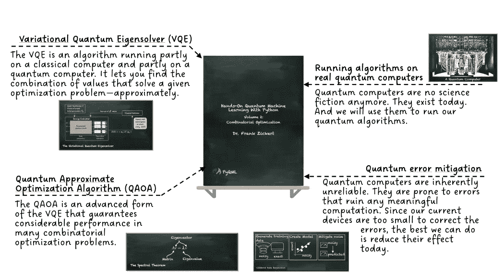

# 在理解量子机器学习时遇到困难吗？

> 原文：[`towardsdatascience.com/having-trouble-understanding-quantum-machine-learning-ce8a941d8c70`](https://towardsdatascience.com/having-trouble-understanding-quantum-machine-learning-ce8a941d8c70)

## 使用函数式编程实现量子近似优化算法

[](https://pyqml.medium.com/?source=post_page-----ce8a941d8c70--------------------------------)[](https://towardsdatascience.com/?source=post_page-----ce8a941d8c70--------------------------------) [Frank Zickert | Quantum Machine Learning](https://pyqml.medium.com/?source=post_page-----ce8a941d8c70--------------------------------)

·发表于[Towards Data Science](https://towardsdatascience.com/?source=post_page-----ce8a941d8c70--------------------------------) ·阅读时间 7 分钟·2023 年 3 月 2 日

--

想要开始量子机器学习吗？请查看[**动手量子机器学习与 Python**](https://www.pyqml.com/volume1?provider=medium&origin=troubleunderstanding)**。**

本文将解释量子近似优化算法（QAOA）中最重要的部分。QAOA 是一种机器学习算法，你可以用来解决组合优化问题。

特别之处在于，这个算法迎合了量子计算机的特性——一种承诺在解决问题上提供指数级加速的新型计算机。

尽管量子机器学习（QML）——即使用量子计算来解决机器学习算法——是最有前景的技术之一，**它也同样具有挑战性！**

因此，本文旨在以一种易于理解的方式解释 QAOA 的基本概念。

量子计算、优化和机器学习都在很大程度上依赖于数学。除非你是数学家，否则这将是一个令人望而生畏的任务。

幸运的是，一些 QML 库，比如 IBM Qiskit，解决了这个问题。它们提供了易于使用的接口，并将所有复杂性隐藏在你之外。

正如我在[我之前的帖子](https://medium.com/@pyqml/quantum-wildfire-fighting-e828497b7b89)中所展示的，它们甚至处理了问题的公式化。

在那篇帖子中，我使用了**量子近似优化算法**（QAOA）来解决一个组合优化问题——如何应对野火。


图片由作者使用 Stable Diffusion 生成

你唯一需要做的就是指定问题的个体值。

这简直太好了，不是吗？


尽管这些库让你可以使用量子机器学习而不必担心数学、量子力学或其他复杂的东西，但它们同样不会教你太多。

如果你想了解一个算法是如何工作的，你就会回到最初的地方。如果 Qiskit 库如此出色，为什么不查看他们的示例来理解 QAOA 是如何工作的呢？

下图展示了他们示例的一部分。


摘自 [Qiskit 文档](https://qiskit.org/textbook/ch-applications/qaoa.html)

我认为没有什么需要添加的，是吗？

…

也许一点点。

所以，让我给你提供一个替代的解释。一个不需要数学学位的解释。但一个利用函数式编程（在 Python 中）的表达力的解释。

函数式编程的故事讲起来很快。

函数式编程将应用程序分解为一组函数。理想情况下，函数只接收输入并产生输出，并且没有影响给定输入产生的输出的内部状态。

从这个意义上讲，QAOA 算法是一个通过`optimize`一组`params`来解决`problem`的函数。换句话说，我们的目标是找到这些`params`的最佳值。

为了决定哪些`params`最佳，我们根据从`compute`得到的结果来`assess`这些`params`，该结果来自使用这些`params`编码问题（`problem_circuit`）及其解决方案（`ansatz_circuit`）的（量子）`circuit`。

这就是 Qiskit 描述中提到的**变分算法**。它使用一种经典优化算法来向量子计算机发出查询。

这就是代码。

```py
def qaoa(
  problem, optimize, assess, compute,
  to_circuit, problem_circuit, ansatz_circuit):

    return optimize(
        lambda params: assess(
            problem,
            compute(to_circuit(
              problem, params,
              problem_circuit, ansatz_circuit
            ))
        )
    )
```

相当不错，不是吗？

让我们继续深入到最内层的函数`to_circuit`。

```py
from qiskit import QuantumCircuit

def to_circuit(problem, params, problem_circuit, ansatz_circuit):
    cnt_qubits = problem.size
    qc_qaoa = QuantumCircuit(cnt_qubits)

    # initial_state
    qc_qaoa.h(range(cnt_qubits))

    # append problem circuit
    qc_qaoa.append(problem_circuit(problem, params[0]), range(cnt_qubits))

    # append ansatz circuit
    qc_qaoa.append(ansatz_circuit(problem, params[1]), range(cnt_qubits))

    qc_qaoa.measure_all()
    return qc_qaoa
```

这个函数接收`problem`和`params`。我们使用`problem`的大小来确定量子电路中量子比特（qubits）的数量。

一个量子比特是量子计算机中的基本计算单位。尽管其内部状态非常复杂，但当你查看它时，它要么是 0，要么是 1——就像普通的比特一样。

我们从对所有量子比特应用 Hadamard 门（`h`）开始。这将量子比特置于一个状态，其中它们有相等的可能性产生 0 或 1。

然后，我们使用`problem_circuit`和`ansatz_circuit`函数附加两个子电路。这就是 Qiskit 解释中提到的*“单位矩阵 U(β,γ)具有特定的形式，并由两个单位矩阵 U(β)和 U(γ)组成……”*

第一个函数`problem_circuit`添加了一个量子电路，表示我们想要解决的问题。

```py
def problem_circuit(problem, gamma):
    qc_p = QuantumCircuit(problem.size)
    for i, j in problem.relations:
        qc_p.rzz(gamma, i, j)
        qc_p.barrier()

    return qc_p
```

在这种情况下，我们遍历`problem`中的所有`relations`。显然，我们期望一个`relation`由一对整数值（`i, j`）组成。我们在这些位置的两个量子比特上应用`rzz`门。`rzz`门是一个参数化（由参数`gamma`）的旋转门，绕着两个量子比特系统的 ZZ 轴旋转。

第二个函数`ansatz_circuit`添加了一个量子电路，表示我们问题的解决方案。

```py
def ansatz_circuit(problem, beta):
    qc_a = QuantumCircuit(problem.size)
    for i in range(problem.size):
        qc_a.rx(beta, i)

    return qc_a
```

这一次，我们遍历问题的所有部分，并在相应的量子比特上应用`rx`门。这是一个以参数`beta`为参数的绕 X 轴的旋转。

```py
from qiskit import Aer, execute

def compute(circuit):
  return execute(
    circuit,
    Aer.get_backend('qasm_simulator'),
    shots=1000
  ).result().get_counts()
```

本质上，这些电路使用两个`params`（称为`beta`和`gamma`）来创建一个量子电路，该电路产生 Qiskit 生动描述的特定量子态**|𝜓(𝛽,𝛾)⟩**。这里，𝜓（“psi”）是量子态的占位符。𝛽和𝛾是定义此状态的参数。

这个量子电路创建了一个状态，可能产生任何值，无论好坏。当然，我们希望生成有意义的结果。因此，我们需要一个“好坏”度量。这就是`assess`函数的目的。

```py
def assess(problem, result):
    avg = 0
    sum_count = 0
    for solution, count in result.items():
        performance = 0
        for i, j in problem.relations:
            if solution[i] != solution[j]:
                performance -= 1

        avg += performance * count
        sum_count += count
    return avg/sum_count
```

根据我们的`problem`，我们计算从执行量子电路得到的结果的`performance`。我们查看`problem`定义中的`relations`，并在量子比特表示的`relation`不相等时（`solution[i] != solution[j]`）降低（注意，这里较低为更好）性能。记住，量子比特的结果是 0 或 1。所以，`solution[i]`和`solution[j]`要么是 0，要么是 1。

现在，通过创建电路并评估其结果，我们可以输入一个经典优化算法。这个算法重复评估不同的值及其结果，并基于此向产生更好结果的值移动。

```py
from scipy.optimize import minimize

def optimize(f_params_to_problem):
    return minimize(
        # callable function
        f_params_to_problem,

        # initial guess on beta and gamma
        [1.0, 1.0],

        # optimization method
        method='COBYLA')
```

那么，让我们看看问题的结构。我们使用了它的两个特征：`size`和`relations`。因此，让我们创建一个`class`来存储这些数据。

```py
class Problem():
    def __init__(self, nodes, relations):
        self._nodes = nodes
        self._relations = relations

    @property
    def size(self) -> int:
        return len(self._nodes)

    @property
    def relations(self) -> int:
        return self._relations
```

最后，我们需要制定我们问题的实例并将其输入到`qaoa`算法中。

```py
problem = Problem([0, 1, 2], [(0, 1), (1, 2)])
result = qaoa(
  problem, optimize, assess, compute,
  to_circuit, problem_circuit, ansatz_circuit
)
```

我们定义问题由三个节点（`0, 1, 2`）和几个关系组成。节点`0, 1`和`1, 2`是连接的。以下列表表示输出。

```py
 fun: -1.632
   maxcv: 0.0
 message: 'Optimization terminated successfully.'
    nfev: 32
  status: 1
 success: True
       x: array([1.05618646, 2.28854173])
```

`nfev`表示迭代次数。最重要的是，`x`表示产生最佳结果的`params`值。

要了解这些值的意义，我们将这些值反馈到电路中并观察结果。

```py
from qiskit.visualization import plot_histogram

plot_histogram(compute(to_circuit(
  problem, result.x, problem_circuit, ansatz_circuit
)))
```


作者提供的图片

输出显示两个解决方案出现得更频繁：`010`和`101`。因此，这些表示了指定问题的解决方案。

当我们回顾`assess`函数时，我们看到如果两个连接的节点具有不同的值，我们将每个`relation`的值定为`-1`。此外，我们定义了`0, 1`和`1, 2`为连接的。

因此，最佳解决方案是那些连接节点具有不同值的方案。这些是`010`和`101`。

这个问题被称为 Max-Cut。这是 Qiskit 示例中解决的相同问题，可以被认为是组合优化的“Hello World”。

# 结论

本文解释了量子近似优化算法（QAOA）的基本部分。虽然这不是第一个也不是唯一的解释，但它不要求你先学习数学。

非数学性的解释有相当多的优点。

+   这对于我们大多数人来说要容易得多。

+   这是一门实践课程。我们直接用它解决了一个问题。

+   你可以看到算法的各个部分如何配合在一起。

想要开始量子机器学习吗？看看[**用 Python 实践量子机器学习**](https://www.pyqml.com/volume1?provider=medium&origin=troubleunderstanding)**。**


免费获取前三章 [点击这里](https://www.pyqml.com/volume1?provider=medium&origin=troubleunderstanding)。

全新**第 2 卷：组合优化**完全讲解了如何使用变分量子本征求解器和**量子近似优化算法**来解决优化问题。

[立即索取您的副本](https://www.pyqml.com/volume2?provider=medium&origin=troubleunderstanding)。


