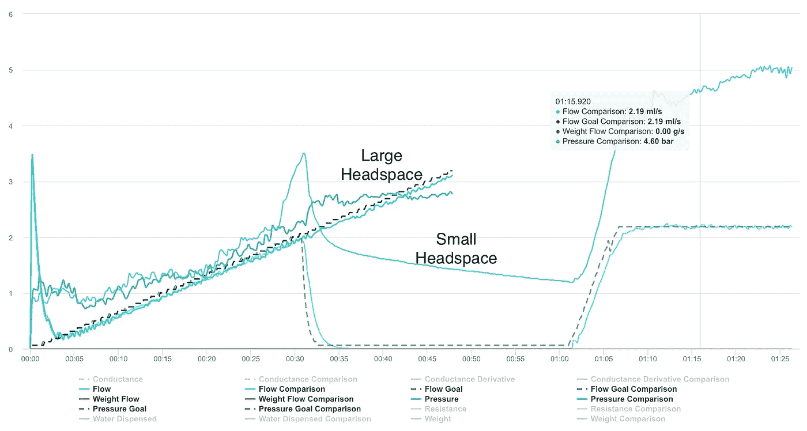
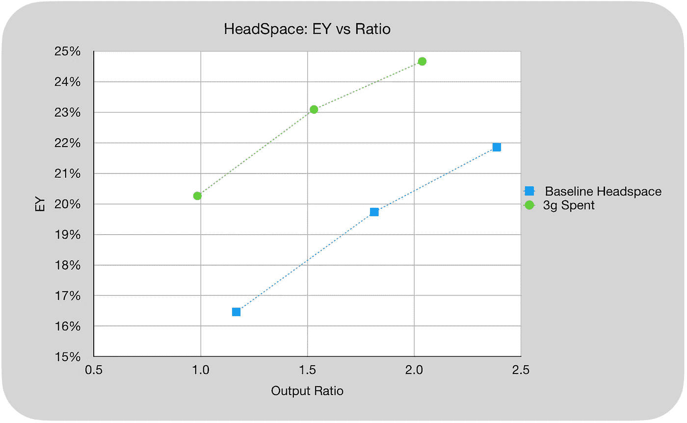
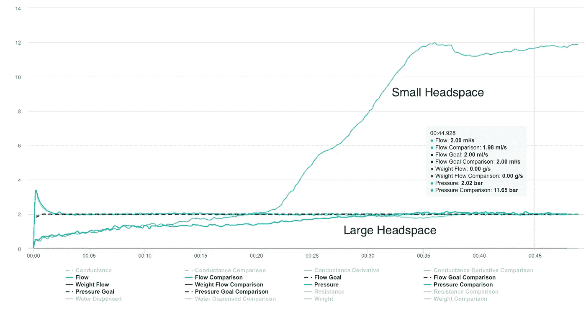
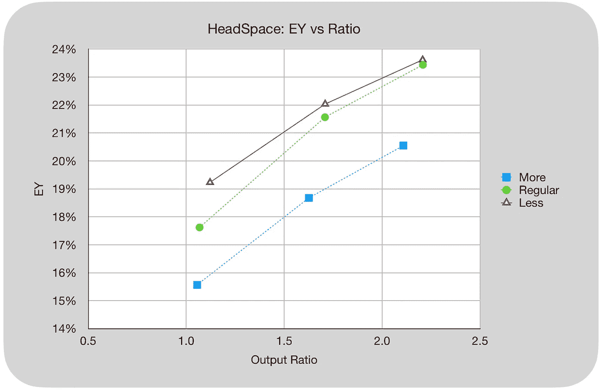

# 浓缩咖啡中的 Headspace：优化

> 原文：[`towardsdatascience.com/headspace-in-espresso-optimization-4990b24d8073?source=collection_archive---------5-----------------------#2023-04-21`](https://towardsdatascience.com/headspace-in-espresso-optimization-4990b24d8073?source=collection_archive---------5-----------------------#2023-04-21)

## 咖啡数据科学

## 另一个隔离 headspace 的实验

 [Robert McKeon Aloe](https://rmckeon.medium.com/?source=post_page-----4990b24d8073--------------------------------)

·

[关注](https://medium.com/m/signin?actionUrl=https%3A%2F%2Fmedium.com%2F_%2Fsubscribe%2Fuser%2Fae592466d35f&operation=register&redirect=https%3A%2F%2Ftowardsdatascience.com%2Fheadspace-in-espresso-optimization-4990b24d8073&user=Robert+McKeon+Aloe&userId=ae592466d35f&source=post_page-ae592466d35f----4990b24d8073---------------------post_header-----------) 发表在 [Towards Data Science](https://towardsdatascience.com/?source=post_page-----4990b24d8073--------------------------------) ·3 分钟阅读·2023 年 4 月 21 日

--

Headspace 是指在制作浓缩咖啡时，咖啡床顶部与喷头屏幕之间的空间量。它是与研磨度、剂量和压实压力互动的一个变量。更具体地说，headspace 是指咖啡饼在萃取过程中膨胀的空间，这会影响水和气体在咖啡中的流动。

优化 headspace 的挑战在于它与研磨度、剂量和压实压力相互交织。我通常发现较少的 headspace 是最优的，但我希望通过更好的实验来隔离变量。

> 进入用过的咖啡

我决定在新鲜咖啡上添加用过的咖啡，这样它在膨胀和水流方面的作用类似于咖啡，但不会干扰萃取。

我在 Decent Espresso 机器上使用了萨拉米测量萃取的射击。萨拉米射击可以用来测量萃取，并更好地理解不同的口味成分何时萃取到杯中。

我也使用了距离烘焙后 3 个月的咖啡，这是我最近一些测试的实验咖啡。目的是使用已经脱气的咖啡，在更理想的环境中专注于 TDS 和 EY 作为数据指标。

**总溶解固体（TDS）**是使用折射计测量的，结合杯中的输出重量和咖啡的输入重量，用于确定萃取到杯中的咖啡的百分比，称为**萃取收率（EY）**。

# 小头部空间 vs 大头部空间

我使用的第一个测试集是 Blooming Ramp 轮廓，该轮廓在达到一定压力（4 bar）后开始绽放 30 秒，然后以 2.2 ml/s 注入。然而，这个轮廓对于较大的空间效果不佳，因为在压力建立起来时，目标输出已经达到。

所有图片由作者提供

所以我认为结果并不公平，因为更大的空间（使用了 3 克已用咖啡）是因为基准没有一个花期。

# 平面轮廓

我重新使用了平坦的 2 ml/s 轮廓进行了实验。这控制了花期，并允许我们只关注头部空间。这表明较小的头部空间更有利于压力的建立。

这些萃取收率的结果更加清晰。

空间是一个易于改变且不需要任何特殊工具的变量。我希望这个小研究能激发人们尝试减少空间，因为数据表明较少的空间是最佳的参数选择。

如果你喜欢，可以在[Twitter](https://mobile.twitter.com/espressofun)，[YouTube](https://m.youtube.com/channel/UClgcmAtBMTmVVGANjtntXTw)，和[Instagram](https://www.instagram.com/espressofun/)关注我，我在那里发布不同机器的浓缩咖啡视频和相关内容。你也可以在[LinkedIn](https://www.linkedin.com/in/dr-robert-mckeon-aloe-01581595)找到我。你还可以在[Medium](https://towardsdatascience.com/@rmckeon/follow)上关注我并[订阅](https://rmckeon.medium.com/subscribe)。

# [我更多的阅读](https://rmckeon.medium.com/story-collection-splash-page-e15025710347)：

[我的书](https://www.indiegogo.com/projects/engineering-better-espresso-data-driven-coffee)

[我的链接](https://rmckeon.medium.com/my-links-5de9eb69c26b)

[浓缩咖啡文章集合](https://rmckeon.medium.com/a-collection-of-espresso-articles-de8a3abf9917?postPublishedType=repub)

[工作与学校故事合集](https://rmckeon.medium.com/a-collection-of-work-and-school-stories-6b7ca5a58318)
