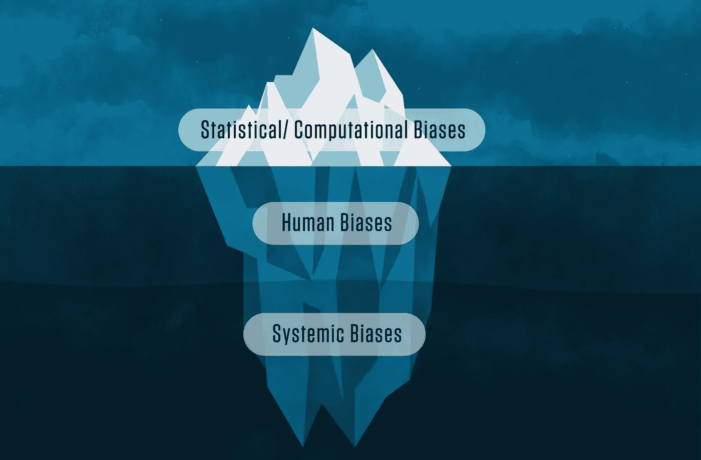

# 医疗数据本质上是有偏的

> 原文：[`towardsdatascience.com/healthcare-is-inherently-biased-b60bf00d4af7`](https://towardsdatascience.com/healthcare-is-inherently-biased-b60bf00d4af7)

## 这里是如何避免被它欺骗

 [Stefany Goradia](https://stefanygoradia.medium.com/?source=post_page-----b60bf00d4af7--------------------------------)

·发表于[Towards Data Science](https://towardsdatascience.com/?source=post_page-----b60bf00d4af7--------------------------------) ·10 分钟阅读·2023 年 1 月 19 日

--

通常，当你想到偏差时，你可能会想到一个人的信念如何无意中塑造他们的假设和方法。这当然是一个定义。

但偏差也指的是我们用来获得洞察的数据本身可能被无意中扭曲和不完整，扭曲了我们观察一切的视角。

## **许多——如果不是大多数——**我们在医疗领域使用的数据集本质上是有偏的，如果我们不小心，很容易使我们偏离正确的方向。

我将特别关注三个主要概念，这些概念困扰医疗数据，并且可能会低调地使你的整个分析失效。

由[Kaleb Nimz](https://unsplash.com/@kalebnimz?utm_source=medium&utm_medium=referral)拍摄，发布在[Unsplash](https://unsplash.com/?utm_source=medium&utm_medium=referral)

在早前的[文章](https://medium.com/towards-data-science/is-healthcare-analytics-right-for-you-320897b34409)中，我写到了我在医疗数据分析职业生涯中遇到的各种偏差类型，以及它们如何成为数据从业者面临的挑战。对我来说，最大的主题是：**个人偏差、数据偏差和确认偏差。**

在我发布那篇文章的四天后，一位导师给我发来了[这篇关于医疗索赔数据中抽样偏差的 JAMA 文章，以及它如何在某些地区因社会健康决定因素（SDOH）而加剧](https://jamanetwork.com/journals/jamanetworkopen/article-abstract/2800118)。

文章的结论确实引起了我的注意：

> [研究强调]了调查大型医疗索赔数据的抽样异质性的重要性，以评估抽样偏差如何影响结果的准确性和普遍性。
> 
> 重要的是，调查这些偏差或准确地重新加权数据将需要来自索赔数据库本身之外的外部数据源。

# TLDR:

> **在大型医疗保健数据集中，患者或成员的失衡可能使您的结果无法概括，甚至（在某些情况下）完全无效。**
> 
> **社会决定健康因素数据可能会有所帮助。**

# 让我们来解开这个谜题。

但首先，引用杰出的 Cassie Kozyrkov 的话：*“AI 偏差问题开始于——但并不止于——定义。‘偏差’是一个在不同背景下含义截然不同的过载术语。”* 进一步阅读她的文章和相关的其他文章：什么是偏差？

# 作为医疗保健分析师，我们需要注意：

## **1. 抽样/选择偏差。**

> **抽样偏差** 是 *当某些成员比其他成员更有可能被选入样本时。* **选择偏差** *可以通过选择[研究]* [*人群*](https://www.scribbr.com/methodology/population-vs-sample/) *的方式、[*抽样方法*](https://www.scribbr.com/methodology/sampling-methods/)* 或参与者的招募（即，选择包含内容的设计缺陷）而引入。[*[*1*](https://www.scribbr.com/research-bias/sampling-bias/)*]*

我使用这些术语有些口语化。在传统调查/样本/研究设计中，抽样/选择偏差的定义是有意义的。

> **但是……第一个警告：在数据中，“人口”有着非常特定的含义，在医疗保健中也是如此，虽然定义相似（但不同），它们可能相同，也可能不同，这取决于具体情况。**

在医疗保健的背景下，它们可以指如何构建我们的分析和我们的包含/排除，以了解某个特定的“人口”。在医疗保健中，我们使用关注的人群来指代根据研究的不同而涉及的多个兴趣组，例如：

+   业务线（LOB），如由政府支付者（医疗补助、医疗保险）覆盖的患者；商业保险线（雇主团体、零售或通过交换购买的保险）；自保（自筹资金团体，通常是大型雇主支付员工的医疗索赔）等。

+   子业务线或团体。例如，医疗补助可能包括多个子组，代表不同的资格、覆盖、福利或人群/他们为何符合该计划的类型（[临时援助计划 (TANF)](https://www.google.com/url?sa=t&rct=j&q=&esrc=s&cd=&cad=rja&uact=8&ved=2ahUKEwjZm4Xy-Mf8AhWIhIkEHUzVBaIQFnoECBQQAQ&url=https%3A%2F%2Fwww.acf.hhs.gov%2Fofa%2Fprograms%2Ftemporary-assistance-needy-families-tanf&usg=AOvVaw38iikaX9W0oCb2UgotU2hA) 与医疗补助扩展计划)

+   人口统计（特定群体、男性或女性、某些地区等）

+   条件（检查某些慢性病、关注的主要疾病状态或对系统成本最高的疾病、医疗保险关注的疾病等）

+   上述某些组合的子组，例如：医疗补助、临时援助、母亲与新生儿

+   对上述某些组合的跨组比较，例如：Medicaid、TANF、新妈妈及其成本/利用/结果趋势 vs. 商业、自保、新妈妈及其成本/利用/结果

+   上述任何子组合或交叉组合，加上更多内容

正如你所见，分析设计和“相关人群”可能会迅速变得复杂。这并不一定意味着数据不可用或结果总是会令人不安。它确实重申了，意识到这种偏差对于确保你从各个角度考虑和进行相应分析至关重要。

> **标记 #2：如果医疗行业的人说数据包含了所有感兴趣的群体……这真的是真的吗？也许……**

**对健康保险公司的一点警示：** 一个常见的讨论点是，健康保险公司可以分析他们的“整个群体”，因为他们接收了他们负责的每个成员的索赔，因此可以避免抽样偏差。根据使用案例，这可能*潜在地*是一个合理的讨论点。但总体来说，我会提醒你要记住，即使这些数据本身也具有固有的偏差，因为它：a) 只包括那些实际*发生了*事件/事故并且保险公司处理了后续索赔的成员/患者，b) 数据本身往往会过度/不足地代表那些更容易有慢性健康问题、 adverse social determinants of health、寻求医疗、反映你的组织倾向于服务的类型人群或你拥有更大业务量的群体等。更多内容请参见下面的文章总结。

## **2\. 覆盖不足偏差**

> ***覆盖不足偏差*** *发生在你的样本中排除了部分人群时。* *[*[*1*](https://www.scribbr.com/research-bias/undercoverage-bias/)*]*

再次强调，这一定义在传统的调查/抽样/研究设计中是合理的。在医疗背景下，如果我们不小心，它可能会以实际的方式影响我们（浪费金钱、浪费精力、羞耻、没有影响或改变结果，*或……* 以上所有）。 

除了上述最纯粹的定义外，我还考虑到这种情况，即看不到“你四面墙之外发生的任何事情。”我们（通常）只拥有我们组织生成的数据，这本质上只是整个情况的一部分。根据你所做的分析类型和原因，这可能不是决定性问题，但这是另一个需要注意的重要标记。我们的[患者/成员/员工/居民/等]可能不会以相似的方式行动，甚至不能代表[所有患者/其他群体/其他类型的雇主/其他地区/等]

> **标记 #3：你的数据仅显示了你的组织内部的行为，因此不能总是用来推断你的竞争对手的真实情况、你的社区的真实情况、患者在访问不同的医疗提供者（不是你）时的情况，或者任何一个健康计划成员的行为是否与另一个成员的行为相似，这些都可能受到个人、地区、社会、职业或行为差异（通常我们没有的数据）的影响。所有这些都必须在你寻求结论时予以考虑。**

随着更多的医疗保健组织将焦点转向更全面地改善其服务的**社区**（而不是仅关注具体的**患者**），我们可能会再次错过大量的数据拼图——这些数据告诉我们“我们四面墙外发生了什么。”

尽管如此，我们的一些分析可能并不完全依赖于了解这些情况。可以通过用来自我们四面墙外的外部数据来增强我们自己的内部数据，从而填补更多的图景来解决这些问题。我们中的一些人已经认识到这一点，并正在进行数据共享/合作，或利用额外的数据源，如健康信息交换（HIE）或购买的基准数据，以比较我们的人群，以便理解我们的情况有何不同或行为如何。请记住，这些数据集可能在更广泛的范围内存在相同的偏见（实际上可以参见那篇[JAMA 文章](https://jamanetwork.com/journals/jamanetworkopen/article-abstract/2800118)），但所有这些都是朝着至少理解和识别任何潜在“陷阱”的良好第一步。

## 3\. 历史偏见或系统性偏见。

> **历史偏见**发生在社会文化偏见和信仰反映到系统化的过程中[这些偏见随后会反映在数据中]。*[3]* **系统性偏见**来源于那些以不利于某些群体的方式运作的机构。*[2]*

当来自历史上有偏见的来源的数据用于数据科学模型或分析时，这就变得特别具有挑战性。尤其是在你分析历史上存在缺陷的系统时，比如医疗保健系统，这一点尤其重要。

这是一个非常热门的话题，以至于 NIST 正在开发一个[人工智能风险管理框架](https://www.nist.gov/itl/ai-risk-management-framework)。NIST 在他们的特别出版物中讨论了人类和系统偏见，[*朝向人工智能中的偏见识别与管理标准*](https://doi.org/10.6028/NIST.SP.1270)，这张图片来源于此：

*图片来源：N. Hanacek/NIST（公有领域）。*

在医疗保健领域，某些疾病（或者一般的病人，因为他们是医疗保健的主要消费群体）、人口统计学特征、某个群体或子群体、使用模式（或缺乏使用）、健康/质量/死亡率/参与度/满意度以及我们在医疗数据中看到的许多其他趋势或结果都反映了破碎的医疗保健系统的运作方式。这是一个高度复杂的话题，具有许多不同的方面，将在后续文章中深入探讨。但可以说：

> 标志#4：医疗保健系统已经破碎，现有的社会结构极大地影响了健康和结果、机会（或缺乏机会）、障碍和行为。这在医疗数据中以多种不同方式不可否认地反映出来。
> 
> 提到健康公平倡议。

# SDOH 数据如何提供帮助？

这部分并不是解决我所概述的所有问题的灵丹妙药，但我认为它足够有趣，值得特别指出，因为我们最近在健康分析中越来越多地讨论健康公平和 SDOH。

[JAMA 文章](https://jamanetwork.com/journals/jamanetworkopen/article-abstract/2800118)的作者试图理解大型商业数据库中潜在的偏见，这些数据库由多个商业保险公司汇总的索赔数据组成。这些类型的数据集通常被组织用于临床研究、竞争情报，甚至基准测试。作者分析了一个常见的数据集——[Optum Clinformatics 数据市场 (CDM)](https://www.optum.com/content/dam/optum/resources/productSheets/Clinformatics_for_Data_Mart.pdf)——该数据集来源于几个大型商业和医疗保险优势计划，并商业授权用于各种用途。

在邮政编码级别，作者分析了 CDM 中个人的代表性，与普查估计和这些邮政编码的 SDOH 变异性进行比较。我会指出，他们使用的数据集来自 2018 年；这是你能找到的大多数医疗数据的另一个主要问题，但另当别论。

文章发现：

> [即使在调整了州级变异后，我们的高级统计方法] 发现，CDM 中的纳入与拥有更富裕、更年长、更受教育且过度白人居民的邮政编码相关联。
> 
> 与索赔数据中过度代表相关的社会经济和人口统计特征也已被证明是在广泛的健康结果中起作用的修饰因子。
> 
> 重要的是，调查这些偏见或准确地重新加权数据将需要来自索赔数据库以外的外部数据来源。

# **TLDR（再说一遍）：**

> **索赔数据在代表更受教育、更富裕和更多白人的患者方面存在严重偏差。**
> 
> **影响邮政编码级别（及子邮政编码）人群的具体 SDOH 因素对健康结果的差异有着明确的影响。**
> 
> **重新加权/标准化数据需要除索赔之外的额外数据。**

有些人可能会称那些数据为“在你的四面墙之外”。

# 那么，现在怎么办？

# 你的第一个目标：意识。

我提出这些想法仅作为指导，帮助你*开始思考*潜在的“陷阱”。首先问自己和他人问题。在设计下一个分析时开始思考它。确保你完全理解结果将如何以及在哪里使用、意图是什么，并提前列出风险。开始理解不同类型的偏差及其可能对你的影响。如果你想了解 29 种其他类型的偏差，进一步细分为更多子类型，请查看这篇有用的[**Scribbr 上的研究偏差知识库文章**](https://www.scribbr.com/category/research-bias/)。

# 你的第二个目标：不要让这导致分析瘫痪。

虽然保持这些在心中很重要，但更重要的是我们不要被这些困扰到导致分析瘫痪。作为分析师，**了解细微差别并决定在沙滩上划出那条线**无疑是你工作的最难部分：决定哪些见解仍然有价值或有意义*尽管*存在这些细微差别，以及何时倾向于（或远离？）结论的可靠性，将对你的成功和组织的成功至关重要。

最有可能的是，结果可能会落在中间，所以你的目标是理解细微差别，清晰地传达它们，并在尽可能的范围内提供适当的指导，同时有效防范潜在的误解。

## 这篇文章突出了一个子集的偏差，这些偏差并非医疗保健所独有，但在医疗保健中应用的方式非常独特。

## 在你的医疗保健或分析职业中，你遇到过哪些其他类型的偏差？

## [Stefany Goradia](https://www.linkedin.com/in/stefanygoradia/)是[RS21](https://rs21.io/)健康实验室的副总裁，该公司是一家数据科学公司，拥有一个专注于医疗保健+社区的健康实验室。

她在医疗保健分析的前线工作，致力于为内部和外部客户提供价值。她撰写关于如何解读医疗保健数据、与利益相关者沟通，并利用数据支持知情决策和执行的文章。

## **喜欢健康数据和医疗保健分析？**

在[**Medium**](https://medium.com/@stefanygoradia)和[**LinkedIn**](https://www.linkedin.com/in/stefanygoradia/)上关注我。

## **喜欢我的风格？**

了解更多关于我的背景以及对数据的热情，请访问[**stefanygoradia.bio**](https://stefanygoradia.bio/)。

## 其他一些关于偏差的有用参考文章：

 [## [1] 研究中的偏差类型 | 定义与示例

### 研究偏差来源于任何偏离真相的情况，导致结果失真和错误结论。偏差可能会…

[## [2] NIST 报告强调：人工智能偏见不仅仅是偏见数据](https://www.scribbr.com/category/research-bias/?source=post_page-----b60bf00d4af7--------------------------------) 

### 作为提升我们识别和管理人工智能中偏见有害影响能力的一个步骤……

[## [3] 处理数据时最常见的 6 种偏见类型](https://www.nist.gov/news-events/news/2022/03/theres-more-ai-bias-biased-data-nist-report-highlights?source=post_page-----b60bf00d4af7--------------------------------) 

### 你正试图做出一个好的决定，并决定查看你的数据来帮助你做出判断。你已经有了……

[## 8 种可能毁坏你机器学习模型的数据偏见类型 - Statice](https://www.metabase.com/blog/6-most-common-type-of-data-bias-in-data-analysis?source=post_page-----b60bf00d4af7--------------------------------) 

### 偏见数据：你很可能对这个术语很熟悉。也许你自己就是对使用存在偏见的数据非常怀疑的人……

[## 数据驱动？再想想](https://www.statice.ai/post/data-bias-types?source=post_page-----b60bf00d4af7--------------------------------) 

### 大多数人缺乏的心理习惯，以及为什么你不能期望使用数据有效地指导你的行动……

[## 克服 COVID-19 期间的确认偏误](https://kozyrkov.medium.com/data-inspired-5c78db3999b2?source=post_page-----b60bf00d4af7--------------------------------) 

### 在疫情期间你的大脑如何干扰你以及你可以采取的应对措施

[## 人工智能偏见对代表性不足群体的影响](https://towardsdatascience.com/overcoming-confirmation-bias-during-covid-19-51a64205eceb?source=post_page-----b60bf00d4af7--------------------------------) 

### “无论许多人是否意识到，偏见都是人类思想和经验的普遍方面。然而，曾经的……

[## 人工智能偏见对代表性不足群体的影响](https://achonaonline.com/features/2020/11/ai-bias-causes-problems-for-underrepresented-groups/?source=post_page-----b60bf00d4af7--------------------------------)
