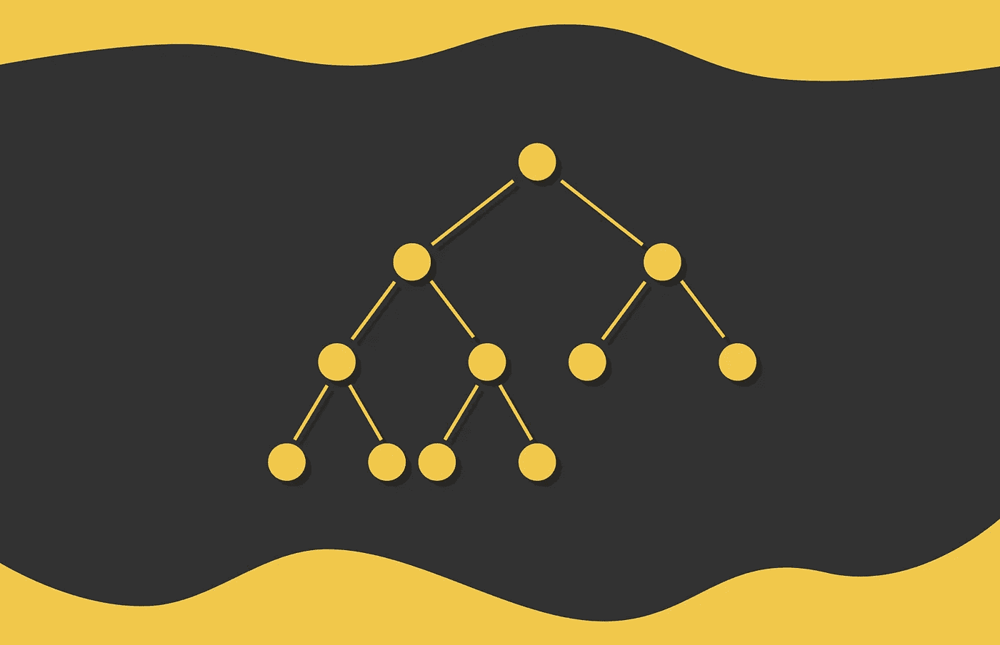
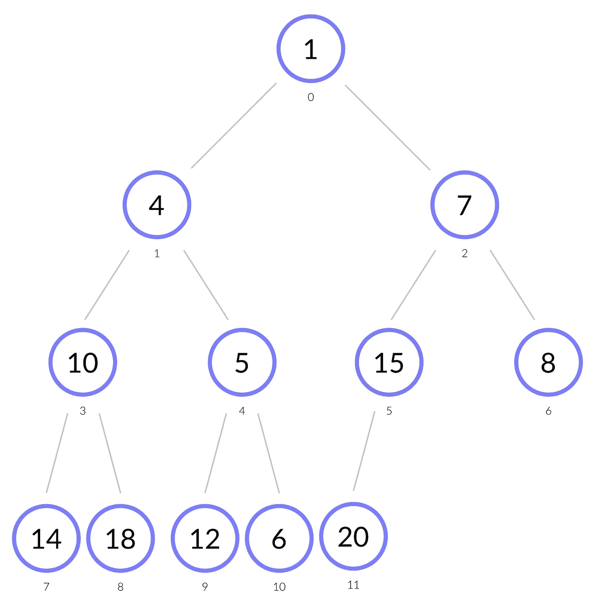
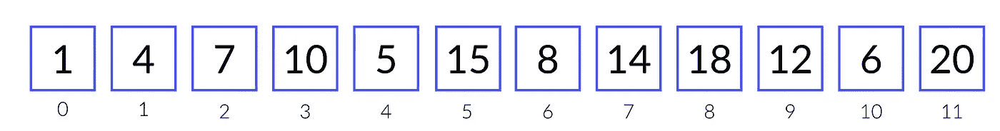
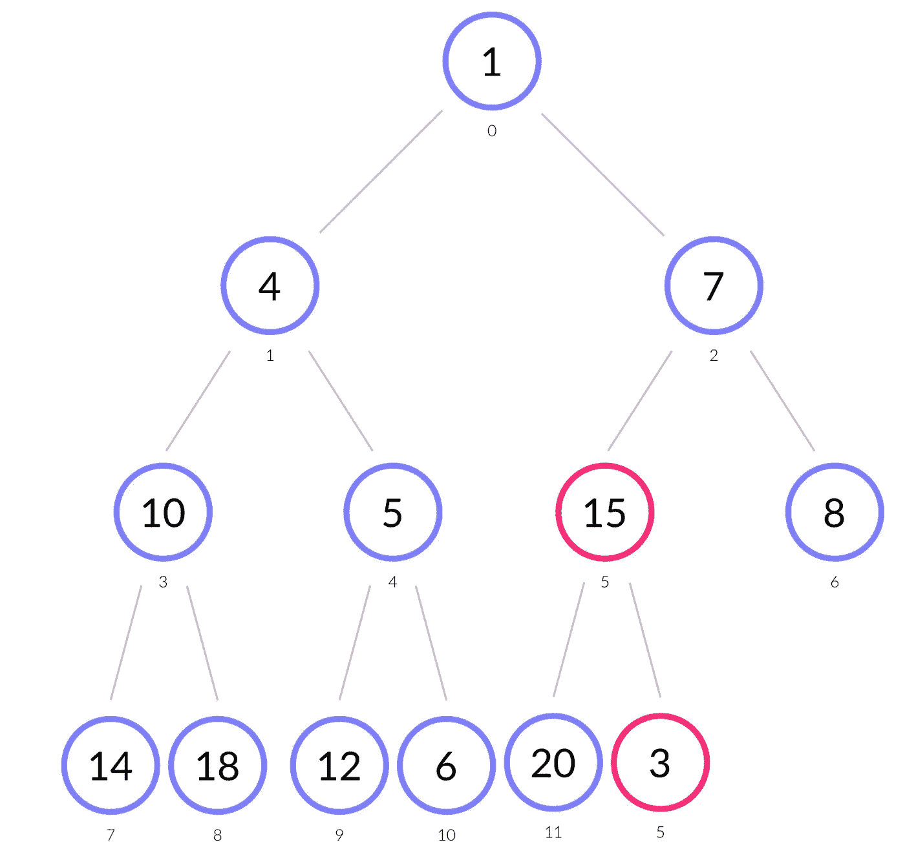
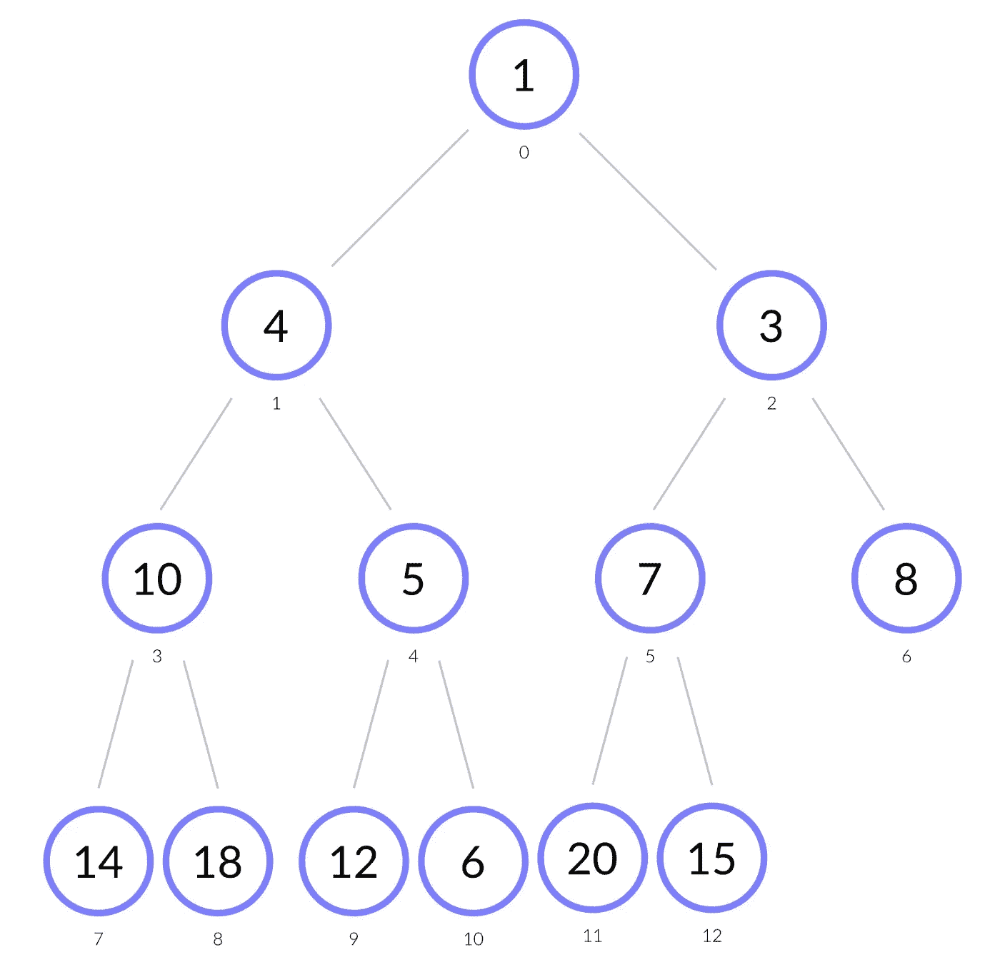
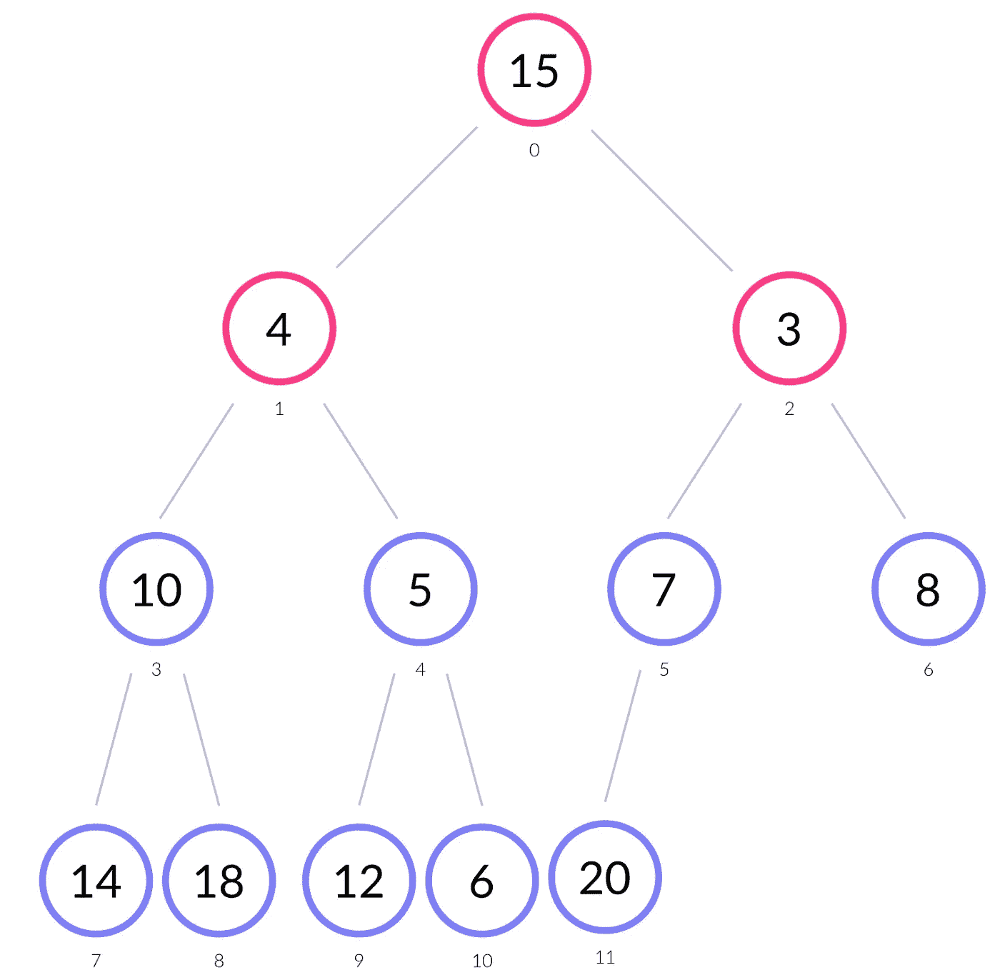
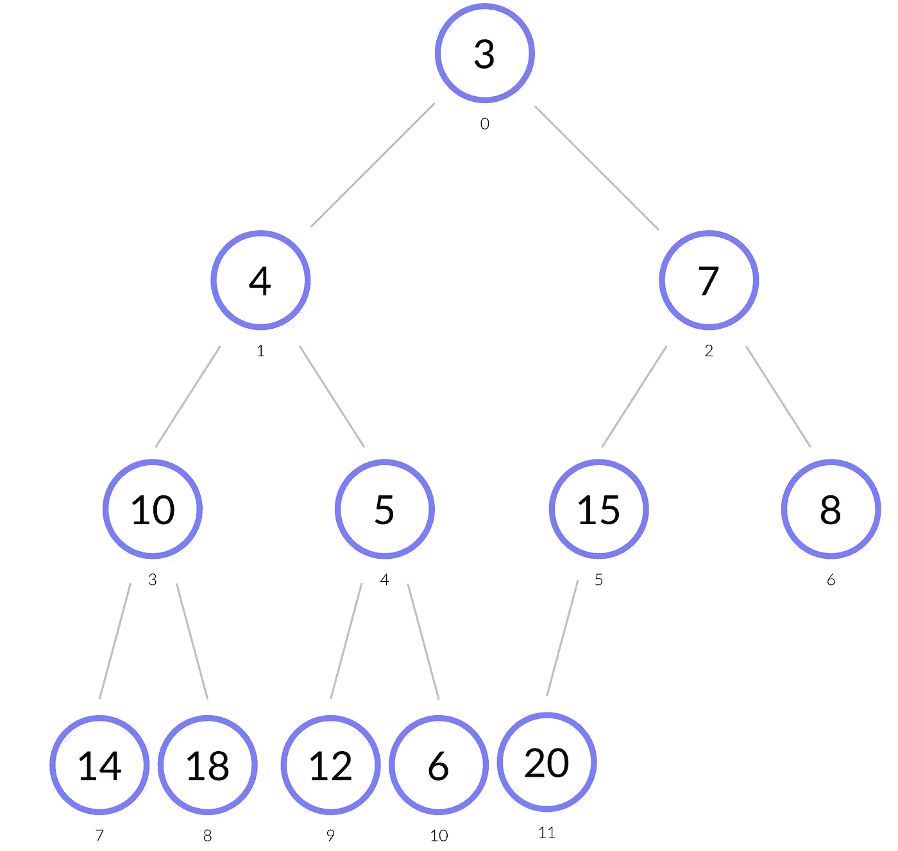

# 排序算法：堆排序

> 原文：[`towardsdatascience.com/heapify-with-heap-sort-5df23b5764c1?source=collection_archive---------19-----------------------#2023-01-03`](https://towardsdatascience.com/heapify-with-heap-sort-5df23b5764c1?source=collection_archive---------19-----------------------#2023-01-03)

## 了解堆数据结构及其在排序中的应用

[](https://medium.com/@slavahead?source=post_page-----5df23b5764c1--------------------------------)[](https://towardsdatascience.com/?source=post_page-----5df23b5764c1--------------------------------) [Vyacheslav Efimov](https://medium.com/@slavahead?source=post_page-----5df23b5764c1--------------------------------)

·

[关注](https://medium.com/m/signin?actionUrl=https%3A%2F%2Fmedium.com%2F_%2Fsubscribe%2Fuser%2Fc8a0ca9d85d8&operation=register&redirect=https%3A%2F%2Ftowardsdatascience.com%2Fheapify-with-heap-sort-5df23b5764c1&user=Vyacheslav+Efimov&userId=c8a0ca9d85d8&source=post_page-c8a0ca9d85d8----5df23b5764c1---------------------post_header-----------) 发表在 [Towards Data Science](https://towardsdatascience.com/?source=post_page-----5df23b5764c1--------------------------------) · 7 分钟阅读 · 2023 年 1 月 3 日[](https://medium.com/m/signin?actionUrl=https%3A%2F%2Fmedium.com%2F_%2Fvote%2Ftowards-data-science%2F5df23b5764c1&operation=register&redirect=https%3A%2F%2Ftowardsdatascience.com%2Fheapify-with-heap-sort-5df23b5764c1&user=Vyacheslav+Efimov&userId=c8a0ca9d85d8&source=-----5df23b5764c1---------------------clap_footer-----------)

--

[](https://medium.com/m/signin?actionUrl=https%3A%2F%2Fmedium.com%2F_%2Fbookmark%2Fp%2F5df23b5764c1&operation=register&redirect=https%3A%2F%2Ftowardsdatascience.com%2Fheapify-with-heap-sort-5df23b5764c1&source=-----5df23b5764c1---------------------bookmark_footer-----------)

# 介绍

堆是一种数据结构，表示以基于二叉树的格式组织的数组。堆对其结构施加了以下规则：

+   **完整性**。堆的每一层都被完全填满。然而，最后一层可能从左侧开始部分填满。

+   **堆规则**。任何父节点的值必须小于或等于其子节点的值。如果满足这一属性，则堆称为最小堆。还有一种最大堆变体，其中父节点的值必须大于子节点的值。

本文中的示例和代码将针对最小堆提供。最大堆的算法工作流程非常类似。下面展示了一个最小堆的示例。



堆通常以数组的形式存储。*如果一个父节点的索引是 i，那么其左子节点和右子节点的位置分别是 2 * i + 1 和 2 * i + 2。反之，如果一个非根节点的索引是* i*，那么其父节点的索引是* (i - 1) // 2*。遵循这一原则，我们得到上述堆的数组表示：



# 操作

堆支持多种操作：

+   插入一个节点

+   从数组构建堆

+   提取具有最小值的节点

+   排序

由于堆数据结构具有多个操作，实际中将其实现为一个类更为方便。目前，我们将实现其基础部分。每次操作后，将提供相应的代码片段。

```py
class Heap:

    def _swap(self, i, j):
        self.heap[i], self.heap[j] = self.heap[j], self.heap[i]

    def _number_of_children(self, i):
        if 2 * i + 2 < len(self.heap):
            return 2
        if 2 * i + 1 < len(self.heap):
            return 1
        return 0
```

+   *heap* 字段以堆的形式存储输入数组（稍后将实现）

+   *_swap()* 方法接受两个数组索引并交换其值。

+   *number_of_children()* 方法返回节点的子节点数量（0、1 或 2）

# 插入一个节点

新元素插入堆的最后位置。如果插入的元素低于父节点的值，可能会破坏堆规则。为避免此问题，新节点会递归向上传播，直到不违反堆规则为止。上述过程称为堆化（up）。

从上图中，我们插入了一个值为 3 的节点。



+   插入后，堆规则被破坏，因为 3 < 15（父节点）。我们交换元素 3 和 15。

+   现在节点 3 有了一个新父节点，值为 7。再次，堆规则未得到满足，因为 3 < 7。结果，我们交换了 3 和 7。

+   节点 3 位于索引 2，其父节点值为 1。由于 3 ≥ 1，堆规则是正确的。在这一阶段，插入过程结束。



让我们来探讨插入的时间复杂度。最坏的情况是需要将新节点从树的底部传播到顶部。由于任何树的高度与其元素总数 *N* 的对数关系成正比，而每次比较花费 *O(1)* 时间，最终估计结果为 *O(logN)* 时间。

```py
class Heap:

    def insert(self, value):
        self.heap.append(value)
        self._heapify_up(len(self.heap) - 1)

    def _heapify_up(self, i):
        if i != 0:
            parent_index = (i - 1) // 2
            if self.heap[i] < self.heap[parent_index]:
                self.swap(i, parent_index)
                self._heapify_up(parent_index)

    # ... #
```

+   *insert()* 方法将值附加到堆中，然后调用堆化方法。

+   *_heapify_up()* 方法递归调用自身，直到堆规则正确。

# 构建堆

对于输入数组的每个元素，调用插入过程。这就是构建堆的方法。

说到复杂度，可能会觉得构建一个堆需要 *O(N * logN)* *的时间，因为对于每个 N 元素，我们调用一个耗时 O(logN) 的函数。然而，可以改进这个估计，并通过数学证明总时间是 O(N)*。

```py
class Heap:

    def build(self, array):
        self.heap = []
        for value in array:
            self.insert(value)

   # ... #
```

+   对于传递给 *build()* 方法的数组，通过插入调用构建堆。

# 提取具有最小值的节点

最小节点位于堆的顶部。我们提取最小值，并用堆的最后一个节点替换顶部节点。由于违反了堆规则，我们将这个元素向下传播。该算法与我们上面使用的插入元素时相似（插入时元素是向上传播的）：在每一步中，我们将当前元素与具有最小值的子节点交换。此过程持续到堆规则不再被破坏或当前元素没有子节点为止。



在上图中，值为 1 的节点被提取，值为 15 的最后一个节点取代了它的位置。

+   由于节点 15 违反了堆规则，我们将其与其最小的子节点 3 交换。

+   然后节点 15 有子节点 7 和 8，它们都较小。我们再次将 15 与最小的子节点 7 交换。

+   之后，15 位于索引 5，并且只有一个子节点 20。由于 15 ≤ 20，我们停止堆化过程。



类似于插入部分的堆化算法，该算法具有相同的渐进复杂度，并在 *O(logN)* 时间内进行。

```py
class Heap:    

    def extract_min(self):
        self._swap(0, len(self.heap) - 1)
        min_element = self.heap.pop()
        self._heapify_down(0)
        return min_element

    def _heapify_down(self, i):
    if self._number_of_children(i) == 2:
        if self.heap[i] > self.heap[2 * i + 1] or self.heap[i] > self.heap[2 * i + 2]:
            if self.heap[2 * i + 1] < self.heap[2 * i + 2]:
                self._swap(i, 2 * i + 1)
                self._heapify_down(2 * i + 1)
            else:
                self._swap(i, 2 * i + 2)
                self._heapify_down(2 * i + 2)
    elif self._number_of_children(i) == 1 and self.heap[i] > self.heap[2 * i + 1]:
        self._swap(i, 2 * i + 1)
        self._heapify_down(2 * i + 1)

    # ... #
```

# 排序

排序是通过提取最小节点来实现的。当堆不为空时，我们调用 *extract_min()* 函数，并将每个最小元素附加到新数组中。这样，数组将由排序的元素组成。

由于堆包含 *N* 个节点，并且 *extract_min()* 的时间复杂度为 *O(logN)*，因此总排序时间为 *O(N * logN)*。

```py
class Heap:

    def sort(self):
        array = []
        while len(self.heap) > 0:
            array.append(self.extract_min())
        return array

    # ... #
```

# 结论

我们已经覆盖了堆的所有四个主要操作。要使用堆数据结构对数组进行排序，必须首先构建堆，然后调用排序方法。构建堆需要 *O(N)* 时间，而排序需要 *O(N * logN)* *时间，这最终导致堆排序的 O(N * logN)*渐进复杂度。

堆类的完整实现如下所示。

```py
class Heap:

    def __init__(self, array):
        self.build(array)

    def build(self, array):
        self.heap = []
        for value in array:
            self.insert(value)

    def insert(self, value):
        self.heap.append(value)
        self._heapify_up(len(self.heap) - 1)

    def sort(self):
        array = []
        while len(self.heap) > 0:
            array.append(self.extract_min())
        return array

    def extract_min(self):
        self._swap(0, len(self.heap) - 1)
        min_element = self.heap.pop()
        self._heapify_down(0)
        return min_element

    def _swap(self, i, j):
        self.heap[i], self.heap[j] = self.heap[j], self.heap[i]

    def _number_of_children(self, i):
        if 2 * i + 2 < len(self.heap):
            return 2
        if 2 * i + 1 < len(self.heap):
            return 1
        return 0

    def _heapify_down(self, i):
        if self._number_of_children(i) == 2:
            if self.heap[i] > self.heap[2 * i + 1] or self.heap[i] > self.heap[2 * i + 2]:
                if self.heap[2 * i + 1] < self.heap[2 * i + 2]:
                    self._swap(i, 2 * i + 1)
                    self._heapify_down(2 * i + 1)
                else:
                    self._swap(i, 2 * i + 2)
                    self._heapify_down(2 * i + 2)
        elif self._number_of_children(i) == 1 and self.heap[i] > self.heap[2 * i + 1]:
            self._swap(i, 2 * i + 1)
            self._heapify_down(2 * i + 1)

    def _heapify_up(self, i):
        if i != 0:
            parent_index = (i - 1) // 2
            if self.heap[i] < self.heap[parent_index]:
                self._swap(i, parent_index)
                self._heapify_up(parent_index)
```

执行示例：

```py
array = [14, 8, 1, 12, 6, 20, 7, 10, 18, 4, 5, 15]
heap = Heap(array)
sorted_array = heap.sort()
print(sorted_array) # [1, 4, 5, 6, 7, 8, 10, 12, 14, 15, 18, 20]
```

*除非另有说明，所有图片均由作者提供*
