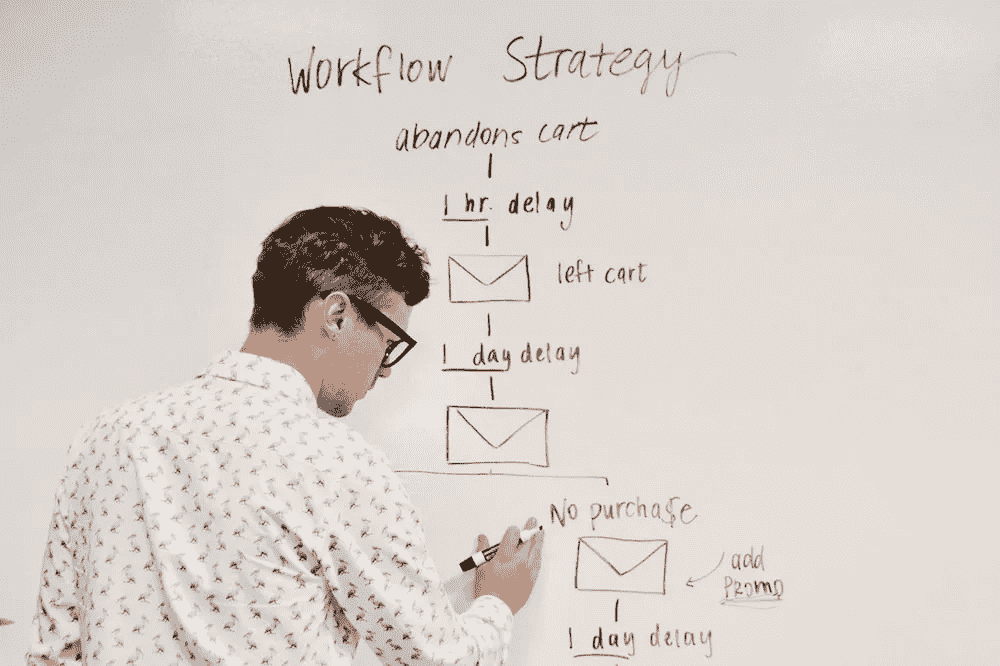

# 这是我的数据科学工作流程模板

> 原文：[`towardsdatascience.com/heres-my-data-science-workflow-template-caa83c1e3032?source=collection_archive---------13-----------------------#2023-02-22`](https://towardsdatascience.com/heres-my-data-science-workflow-template-caa83c1e3032?source=collection_archive---------13-----------------------#2023-02-22)

## 一份逐步的、快速的指南，专注于数据科学工作的方面

 [Matt Przybyla](https://datascience2.medium.com/?source=post_page-----caa83c1e3032--------------------------------)

·

[关注](https://medium.com/m/signin?actionUrl=https%3A%2F%2Fmedium.com%2F_%2Fsubscribe%2Fuser%2Fabe5272eafd9&operation=register&redirect=https%3A%2F%2Ftowardsdatascience.com%2Fheres-my-data-science-workflow-template-caa83c1e3032&user=Matt+Przybyla&userId=abe5272eafd9&source=post_page-abe5272eafd9----caa83c1e3032---------------------post_header-----------) 发表在 [Towards Data Science](https://towardsdatascience.com/?source=post_page-----caa83c1e3032--------------------------------) ·6 分钟阅读·2023 年 2 月 22 日

--

图片由 [Campaign Creators](https://unsplash.com/@campaign_creators?utm_source=unsplash&utm_medium=referral&utm_content=creditCopyText) 提供，在 [Unsplash](https://unsplash.com/photos/--kQ4tBklJI?utm_source=unsplash&utm_medium=referral&utm_content=creditCopyText) [1]。

# 目录

1.  介绍

1.  数据探索、数据聚合和特征工程

1.  算法比较

1.  摘要

1.  参考文献

# 介绍

虽然我已经写过一些涵盖整个数据科学过程的文章，包括业务理解和利益相关者协作等方面，但我想这次纯粹关注数据科学本身。在这篇文章中，我将提供一个任何数据科学家可以使用并在其基础上构建的模板。我假设更多中级和高级数据科学家已经遵循这种通用模式，因此，如果你是初级数据科学家、刚刚起步，或者对数据科学感兴趣，这篇文章将对你有所帮助。话虽如此，让我们更深入地探讨数据科学过程的主要部分，包括数据探索、数据汇总、特征工程和算法比较的步骤。

# 数据探索、数据汇总和特征工程
