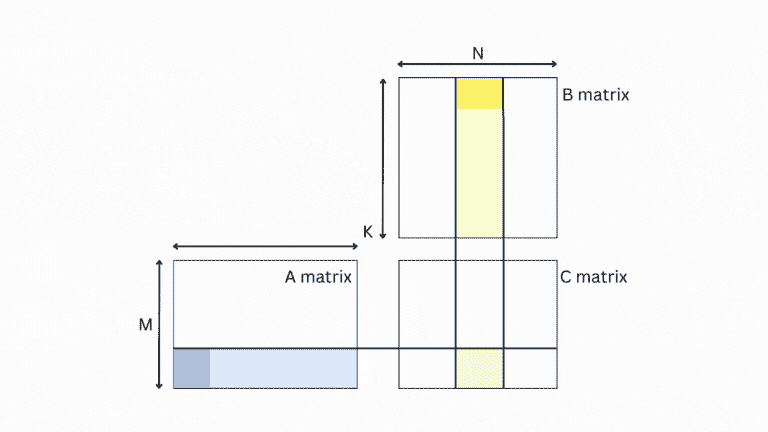

# 嘿，GPU，我的矩阵怎么了？

> 原文：[`towardsdatascience.com/hey-gpu-whats-up-with-my-matrix-cb7f6d7ae7d6`](https://towardsdatascience.com/hey-gpu-whats-up-with-my-matrix-cb7f6d7ae7d6)

## 了解 GPU 如何执行矩阵乘法的温和指南

[](https://thushv89.medium.com/?source=post_page-----cb7f6d7ae7d6--------------------------------)[](https://towardsdatascience.com/?source=post_page-----cb7f6d7ae7d6--------------------------------) [Thushan Ganegedara](https://thushv89.medium.com/?source=post_page-----cb7f6d7ae7d6--------------------------------)

·发表于 [Towards Data Science](https://towardsdatascience.com/?source=post_page-----cb7f6d7ae7d6--------------------------------) ·阅读时长 8 分钟·2023 年 6 月 13 日

--


图片来源：[Thomas Foster](https://unsplash.com/@thomasfos?utm_source=unsplash&utm_medium=referral&utm_content=creditCopyText) 在 [Unsplash](https://unsplash.com/photos/vWgoeEYdtIY?utm_source=unsplash&utm_medium=referral&utm_content=creditCopyText)

矩阵乘法；深度神经网络和现代语言理解巨头的圣杯。作为 MLE 或数据科学家，我们的手指太快了，以至于只需敲入 `tf.matmul` 或 `torch.matmul`，然后从未回头。但不要告诉我你从未对矩阵进入 GPU 时可能发生的情况感到过一丝兴奋！如果你有，那你来对地方了。跟随我，一起探索 GPU 内部那些迷人的复杂性。

我将向你解释这些计算强者是如何处理数字的。你将了解 GPU 在面对矩阵时做的三件鲜为人知的令人印象深刻的事情。在本文结束时，你将对 GPU 内部的矩阵乘法有一个清晰的理解。

# GEMM：一个真正的💎为 GPU 所用

GEMM 或广义矩阵乘法是当 GPU 执行矩阵乘法时运行的内核。

`C = a (A.B) + b C`

在这里，`a` 和 `b` 是标量，`A` 是一个 `MxK` 矩阵，`B` 是一个 `KxN` 矩阵，因此 `C` 是一个 `MxN` 矩阵。就是这么简单！你可能会好奇为什么会有那一个额外的加法。事实证明，这是一种在神经网络中非常常见的模式（例如，添加偏置、应用 ReLU、添加残差连接）。

# 技巧 #1：外积的效果出乎意料👽

如果你被要求从基本原理出发编写一个矩阵乘法算法，这里是你要做的（除非你天生聪慧，能用 GPU 代替大脑——那样不就能为 MLE 省下不少钱了！）。

```py
for (int i = 0; i < M; ++i)
    for (int j = 0; j < N; ++j)
        for (int k = 0; k < K; ++k) 
            C[i][j] += A[i][k] * B[k][j];
```

这里有一个动画视觉效果，可以展示这是什么效果。


基于内积的两个矩阵的乘法（由作者重现 — 灵感来源：[`www.adityaagrawal.net/blog/architecture/matrix_multiplication`](https://www.adityaagrawal.net/blog/architecture/matrix_multiplication)）

但你知道 GPU 讨厌这种实现吗🤔？要理解原因，你需要了解 GPU 内存架构，

> 所有比较和规格，我将使用 Nvidia A100 GPU 规格。

GPU 有三个主要的内存级别，

+   全局内存或 HBM（通常指的 GPU 内存，以及你在运行`nvidia-smi`时看到的内存）

+   共享内存（专门分配给一个流式多处理器[或 SM]的本地内存，并在该 SM 中运行的线程之间共享）

+   寄存器（分配给线程以执行其工作负载）

这就是它的样子，


GPU 的典型内存层次结构（为了简便，忽略 L0/L1/L2 缓存）

首先要注意的是，共享内存（从现在起称为 SRAM）比 HBM 小得多，更不用说寄存器了。所以你的矩阵不可能适合其中（在大多数情况下）。如果我们回到我们的动画，对于`A`的一行，需要检索`B`的所有列，并对`A`中的所有行重复此过程。这意味着，GPU 需要进行大量读取来计算输出。HBM（约 1.5TB/s）比 SRAM（约 19TB/s）慢几个数量级。

用数字来说，假设你想乘以一个`10x20`和`20x30`的矩阵，你需要读取`B`的列`10x30=300`次。有没有更好的方法呢？

事实证明一个简单的技巧能大有帮助！只需翻转循环的顺序，使`k`成为最外层的循环。就完成了！😮

```py
for (int k = 0; k < K; ++k) 
    for (int i = 0; i < M; ++i)
        for (int j = 0; j < N; ++j)
            C[i][j] += A[i][k] * B[k][j];
```

我们没有触及实际计算，只是调整了循环的顺序，因此结果应该和之前一样。现在矩阵乘法看起来是这样的！


基于外积的两个矩阵的乘法（由作者重现 — 灵感来源：[`www.adityaagrawal.net/blog/architecture/matrix_multiplication`](https://www.adityaagrawal.net/blog/architecture/matrix_multiplication)）

你看，我们一次只带来`A`的一个*列*和`B`的一个*行*，并且不会回头看。这需要的读取次数比原始实现少得多。唯一的区别是，我们之前计算的是两个向量之间的*内积*，现在我们计算的是*外积*。


绿色显示的两个向量（蓝色和黄色）之间的内积和外积的区别。

但仍然，我们需要整个`C`在 SRAM 中，这可能太大而无法容纳在 SRAM 中。那么 CUDA 是怎么做的呢？这就引出了第二个技巧。

# 技巧 #2：分而治之（并累积）

不用担心！我不会用复杂的数学或 Leetcode 算法轰炸你。主要要记住的是，矩阵是单独瓦片的二维布局。下面的动画很好地展示了我试图解释的内容。



你可以迭代 A 和 B 中的每个块，仍然可以计算 C 对应块的准确答案

绿色块💚的结果是浅蓝色的 A 条💙和浅黄色的 B 条💛。更进一步，为了计算输出，你可以一次带来一个 A 条的块和一个 B 条的块，计算输出并将结果累积在绿色框中。

这为我们提供了一个灵活的框架，我们可以加载任意大小的 A 和 B 的块（或瓦片），仍然能够计算最终的答案。我们不必止步于此，可以继续递归地将问题划分为更小的问题。即矩阵被拆分成瓦片，瓦片被拆分成片段，片段进一步拆分成单个值。


使用瓦片方法，问题可以递归地拆解。

这很好地适用于 GPU 中的过程执行架构。GPU 中的内核执行有三层。为了简化，我们说一个 SM 运行一个线程块（虽然实际上它们是并行执行的，以减少被称为[尾效应](https://docs.nvidia.com/deeplearning/performance/dl-performance-gpu-background/index.html#gpu-execution)的影响）。

+   线程

+   Warps（32 个线程的集合）

+   线程块（几个 warp 的集合）

线程块中的确切线程数量取决于特定的架构。例如，[A100 具有以下规格](https://developer.nvidia.com/blog/nvidia-ampere-architecture-in-depth/)。

+   每个 SM 最大支持 2048 个线程

+   每个块最大支持 1024 个线程

+   每个 SM 最大支持 32 个线程块

## 侧边栏 #2：2 的幂的魔力

回到瓦片方法，已发现（启发式地）每个线程块的矩阵瓦片大小为`256x128`在大多数问题中能提供合理的效率。因此，这是 CUDA 常用的瓦片大小。

你可能听说过将批处理大小、隐藏维度大小保持为 2 的幂的最佳实践。这就是来源！当你的矩阵维度是 2 的幂时，它将被完全划分为一组没有余数的瓦片。如果不是，这会使你的代码[效率更低](https://docs.nvidia.com/deeplearning/performance/dl-performance-matrix-multiplication/index.html#requirements-tc)。

> 当你的矩阵维度是 2 的幂时，GPU 计算会更高效

当不是 2 的幂时会发生什么？

## 侧边栏 #2：瓦片量化

这会导致一种叫做 [*tile quantization*](https://docs.nvidia.com/deeplearning/performance/dl-performance-matrix-multiplication/index.html#tile-quant) 的现象。换句话说，如果你的 tile 行维度为 128，但矩阵的行中有 257 个元素，你需要的不仅仅是两个，而是三个 tiles（即 256+1）。如下所示。


仅仅因为行中多了一个元素，我们不得不分配两个完整的线程块。

问题在于，无论线程块中有用的数据如何，线程块执行的计算量是相同的。因此，你会把执行有用计算的机会从 GPU 中拿走，导致效率低下。

类似的现象称为 wave 量化，即矩阵过大，SMs 无法一次性容纳。这时 GPU 需要进行 2 次“波”。不过，这对现代 GPU 影响较小，因为它们利用并发性来减少 wave 量化。

> 当线程块需要部分溢出数据时，就会发生 tile 量化；当 SMs 需要溢出数据时，就会发生 wave 量化。

# 技巧 #3：一个比两个好

最终的技巧是内核融合。通常情况下，将所有计算放在一个内核中要比一个接一个调用两个内核要快。为什么？因为一个内核需要将数据写入 HBM，另一个需要读取数据。我们已经讨论过这种操作有多慢。更好的方法是将两个操作合并为一个。以下是一些示例，

+   [matmul + bias + relu](https://github.com/tensorflow/tensorflow/blob/master/tensorflow/core/kernels/matmul_op_fused.cc)

+   [conv + bias + relu](https://github.com/tensorflow/tensorflow/blob/master/tensorflow/core/kernels/conv_ops_fused_impl.h)

+   [batchnorm + relu](https://github.com/tensorflow/tensorflow/blob/master/tensorflow/core/kernels/fused_batch_norm_op.h)

正如这里所看到的（我相信 Pytorch 也有类似的术语表），TensorFlow 提供了许多融合的内核，将便捷的操作合并到一个内核中。在代码中，这意味着类似于以下内容，

```py
for (int m = 0; m < M; m += Mtile) 
    for (int n = 0; n < N; n += Ntile)
        for (int k = 0; k < K; ++k)
            float tmp = 0
            for (int i = 0; i < Mtile; ++i)
                for (int j = 0; j < Ntile; ++j) 
                    int row = m + i;
                    int col = n + j;
                    tmp += A[row][k] * B[k][col];
                    // Do other things
                    C[row][col] = tmp
```

换句话说，我们会珍惜我们的 `tmp` 变量，直到完成所有计算后才将结果写回 `C`。

# 结论

就这些了，希望这次通过 GPU 的“丛林探险”对你有所帮助。如果你对音频视觉版本感兴趣，这里是我的 YouTube 视频的链接。

总结一下，我们讨论了三件使 GPU 在矩阵乘法中非常快速的事情。

+   GPUs 摒弃了更友好的内积实现，转而采用更高效的外积实现。

+   GPUs 将矩阵分割成更小的块（块再分割成碎片），并将计算负载分配到线程块、warp 和线程上。

+   GPUs 使用内核融合将常见的功能组合在一起，提高 GPU 效率。

如果你喜欢这个故事，可以随时[订阅](https://thushv89.medium.com/membership)Medium，这样你就会收到我的最新内容通知，并且能够解锁来自其他作者的成千上万的优质故事的完整访问权限。

[](https://thushv89.medium.com/membership?source=post_page-----cb7f6d7ae7d6--------------------------------) [## 通过我的推荐链接加入 Medium - Thushan Ganegedara

### 作为 Medium 会员，你的一部分会员费用将会支持你阅读的作者，并且你可以完全访问每一篇故事…

[`thushv89.medium.com/membership?source=post_page-----cb7f6d7ae7d6--------------------------------`](https://thushv89.medium.com/membership?source=post_page-----cb7f6d7ae7d6--------------------------------)

*除非另有说明，否则所有图片均由作者提供*

# 参考文献：

+   [`docs.nvidia.com/deeplearning/performance/dl-performance-matrix-multiplication/index.html`](https://docs.nvidia.com/deeplearning/performance/dl-performance-matrix-multiplication/index.html)

+   [`developer.nvidia.com/blog/cutlass-linear-algebra-cuda/`](https://developer.nvidia.com/blog/cutlass-linear-algebra-cuda/)

+   [`developer.nvidia.com/blog/nvidia-ampere-architecture-in-depth/`](https://developer.nvidia.com/blog/nvidia-ampere-architecture-in-depth/)
