# 分层 Transformer — 第一部分

> 原文：[`towardsdatascience.com/hierarchical-transformers-54f6d59fa8fc`](https://towardsdatascience.com/hierarchical-transformers-54f6d59fa8fc)

## 更高效的语言模型

 [Mina Ghashami](https://medium.com/@mina.ghashami?source=post_page-----54f6d59fa8fc--------------------------------)

·发表于 [Towards Data Science](https://towardsdatascience.com/?source=post_page-----54f6d59fa8fc--------------------------------) ·阅读时间 9 分钟·2023 年 10 月 4 日

--

图片来源于 [unsplash.com](https://unsplash.com/photos/x22UAIdif_k)

在本文中，我们将探讨分层 Transformer：它们是什么、如何工作、与标准 Transformer 的不同之处以及它们的好处。让我们开始吧。

# 什么是分层 Transformer

> “分层 Transformer”指的是在输入序列的多个尺度或分辨率上运行的 Transformer 架构。

## **我们为什么需要分层 Transformer？**

标准 Transformer 尽管非常出色，但在时间上非常消耗。Transformer 内部的注意力机制在处理 n 个标记的输入序列时需要 O(n²) 的时间。这意味着 Transformer 对于长序列不够实用。解决这种低效的一个方法是使用分层 Transformer。它是唯一的解决方案吗？不！另一个方法是提高注意力机制的效率。但这是另一个话题。

## 分层结构如何帮助 Transformer？

分层 Transformer 使模型能够在不同级别的输入上进行操作，例如单词、句子、段落等。这与人类处理文本的方式相匹配。这迫使注意力机制跨越不同的层次，以建模不同粒度的实体之间的关系。

分层 Transformer 有很多方法；在本文中，我们力图直观地解释其中一种方法。

# Hourglass Transformer

*Hourglass* [1] 网络是 OpenAI、Google Research 和华沙大学的共同研究成果。它是一种分层自回归 Transformer，接收一个输入序列，并形成从全分辨率到越来越小尺度的序列层次；在每个尺度上，它处理该分辨率内的序列，最后将序列扩展回全尺寸。这使得模型更加高效，因为较短的序列处理成本较低。

请注意，在自回归 Transformer 中，第一层和最后一层至少必须在输入的全尺度上操作。这是因为第一层处理输入，所以必须在全尺度上操作，最后一层（由于模型是自回归的）生成输出，因此必须再次在全尺度上操作。

让我们看看这个架构。下图展示了*沙漏：*

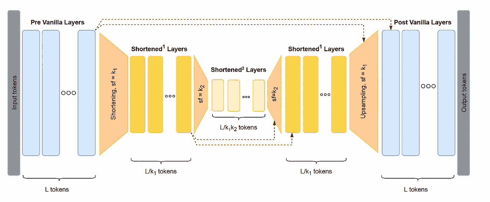

“沙漏”架构——图片来自[[1](https://arxiv.org/pdf/2110.13711.pdf)]

我们一步一步描述。我们从上面图片的左侧开始，其中输入令牌被表示为灰色框。

1.  模型首先使用标准的 Transformer 层处理完整的输入序列。因此，如果输入序列（显示为标题为“输入令牌”的灰色框）有 L 个令牌，则它们都通过标准 Transformer 层（用蓝色表示，称为*预处理层*）。这些层输出每个令牌的 L 个嵌入向量。

> 预先处理的层是对缩短前的完整令牌级序列进行操作的 Transformer 层。

因此，如果任务是“文本语言建模”，则输入到预处理层的是一个表示文本的子词令牌序列。如果任务是“图像生成”，则输入将是展平的像素值序列。

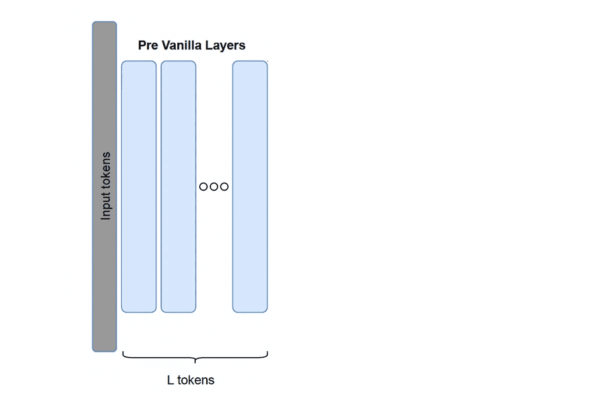

第 1 步——沙漏架构——图片来自[[1](https://arxiv.org/pdf/2110.13711.pdf)]，由作者修改

2\. 在第二步中，模型将序列从*L* 个令牌缩短为更少的令牌。这一步显示为橙色梯形，并且“缩短因子”表示为*sf = k₁*。注意*sf* 代表“缩短因子”，如果设置为*k₁*，则意味着每*k₁* 个令牌合并为 1 个令牌。缩短通过使用某种池化操作来实现，例如*平均池化*、*线性池化* 或 *注意力池化*。我们很快会讨论这些。此步骤的输出为*L/k₁* 个令牌。此步骤也称为下*下采样步骤*。

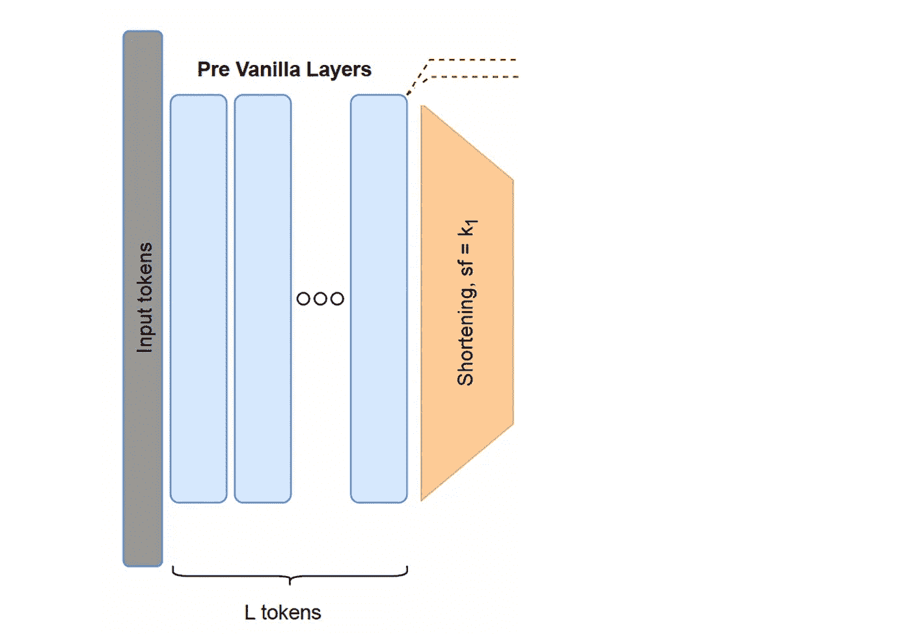

第 2 步——沙漏架构——图片来自[[1](https://arxiv.org/pdf/2110.13711.pdf)]，由作者修改

3\. 缩短的序列经过更多的 Transformer 层，称为*缩短层*。在图中，它们由黄色框表示。这些层输出更新后的令牌嵌入。

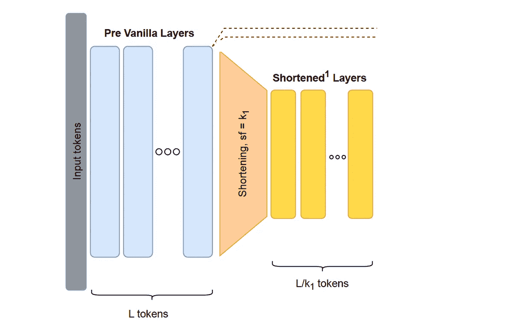

第 3 步——沙漏架构——图片来自[[1](https://arxiv.org/pdf/2110.13711.pdf)]，由作者修改

4\. 如果还有更多的缩短需要完成，我们简单地重复这个过程。在下图中，在第二个橙色梯形中，我们将输入序列缩短一个*sf = k₂*的因子。这将把每个*k₂* 个令牌合并为 1 个令牌，因此将输出*L/(k₁.k₂)* 个令牌。输出的令牌经过更多的*缩短层*，这些层用淡黄色表示。

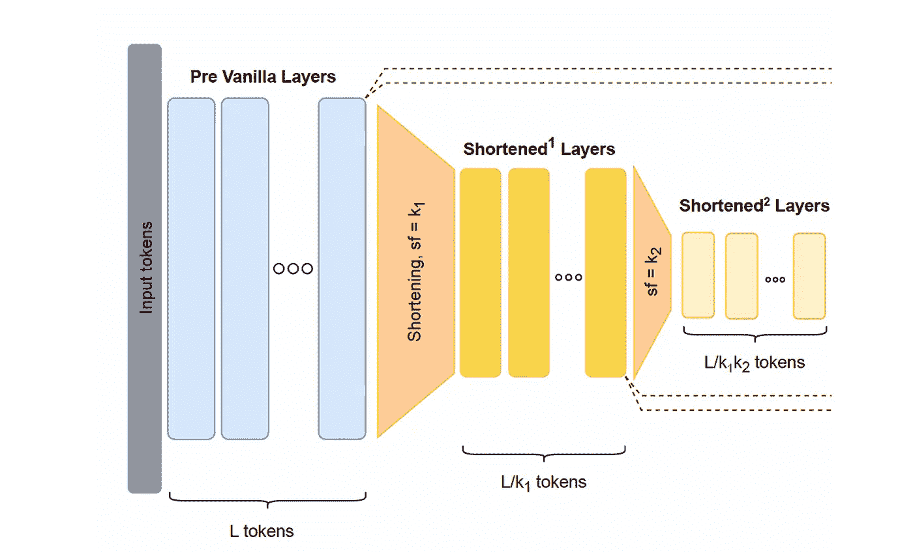

第 4 步——沙漏结构——图像来自[[1](https://arxiv.org/pdf/2110.13711.pdf)]，由作者修改

到现在，我们正处于架构的中间…

从这里，上采样开始了！

5. 上采样层用于将最短的序列扩展回原始的全分辨率。由于我们进行了两次下采样（一次从 L tokens 到*L/k₁*，第二次从*L/k₁* tokens 到*L/(k₁.k₂)* tokens），我们将执行两次上采样，将 token 数量恢复到*L* tokens。第一次上采样如下：

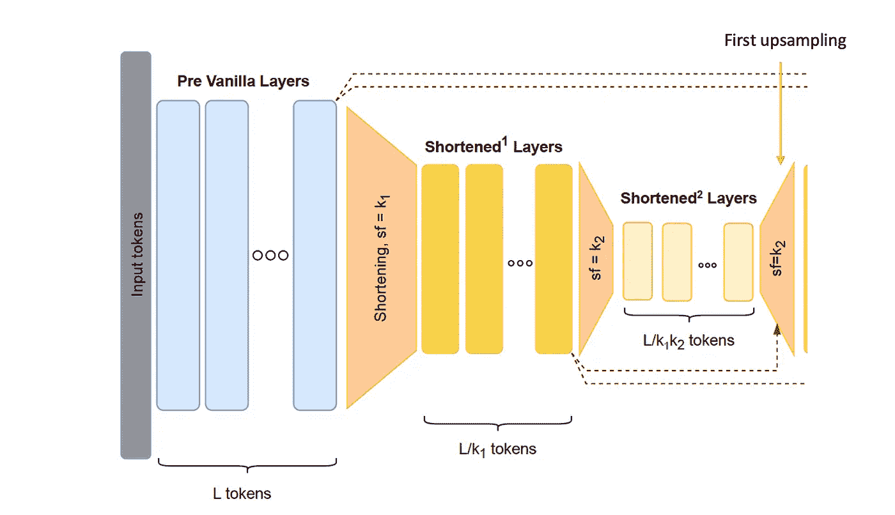

第 5 步（第一次上采样）——沙漏结构——图像来自[[1](https://arxiv.org/pdf/2110.13711.pdf)]，由作者修改

第二次上采样如下：

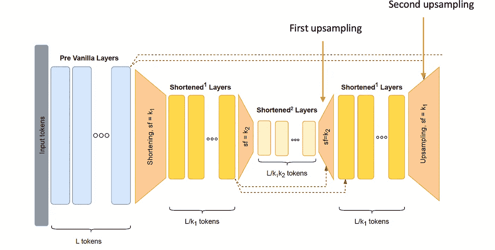

第 5 步（第二次上采样）——沙漏结构——图像来自[[1](https://arxiv.org/pdf/2110.13711.pdf)]，由作者修改

每次上采样操作后，我们将 token 嵌入通过 Transformer 层。在图像中，它们被称为 *缩短层* 或 *后置 vanilla 层*。

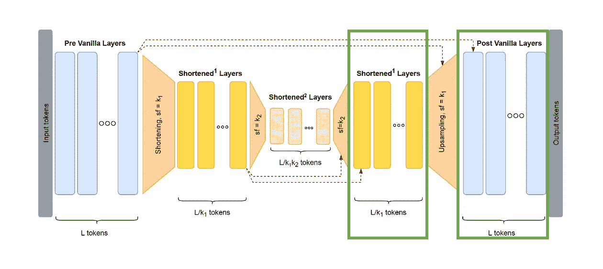

第 5 步——上采样涉及到 Transformer 层，无论是作为缩短层还是作为后置 vanilla 层——图像来自[[1](https://arxiv.org/pdf/2110.13711.pdf)]，由作者修改

最后的上采样通过*后置 vanilla 层*传递嵌入，从而输出下一个预测 token 的嵌入。

## 下采样步骤

下采样步骤（也称为论文中的缩短步骤）将输入序列缩短为更少的 token。此步骤通过使用各种池化操作将 tokens 合并为组来完成，例如：1）平均池化，2）线性池化和 3）注意力池化。

**1) 平均池化：** 从高层次来看，平均池化通过取平均值将 k 个相邻的 token 嵌入合并为单一的嵌入。这种方法有两个超参数：“池化大小”和“步幅”。

> “池化大小”是窗口的大小，“步幅”是窗口每次移动的步数。例如，在一个序列“ABCDEF”中，池化大小 = 步幅 = 2，前两个 token 组成第一个窗口，窗口每次移动 2 个 token。所以窗口将是：[AB]，[CD]，[EF]。

论文将“池化大小”和“步幅”设为相同的数字，并称之为“缩短因子 (sf)”。我们通过一个例子来看看：

如果输入序列是 *[x1, x2, x3, x4, x5, x6, x7, x8, x9, x10]*，且超参数为 *pool size=stride=3*，则**平均池化**将序列划分为大小为 3 的块，即 *[x1, x2, x3]，[x4, x5, x6]，[x7, x8, x9]，[x10]*，并对每个窗口中的 token 嵌入取平均值，以获得单一嵌入，如下：

*e1 = mean(x1, x2, x3)*

*e2 = mean(x4, x5, x6)*

*e3 = mean(x7, x8, x9)*

*e4 = x10*

因此，缩短后的序列将是 *[e1, e2, e3, e4]*。注意缩短后的序列长度是输入长度/sf = 10/3 = 3。

**2) 线性池化：**

这种方法设置步幅 = k，并将长度为 L 的输入序列划分为 L/k 个窗口。每个窗口包含 k 个 token，每个 token 具有一个维度为 d 的嵌入向量。然后，该方法将每个窗口展平为 k*d 维的向量，并形成以下矩阵：

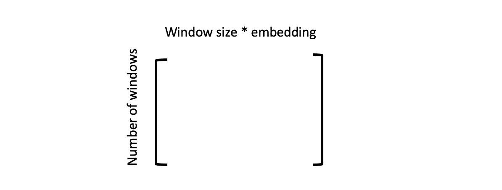

线性池化 — 第一部分 — 图片由作者提供

假设输入序列是 *[x1, x2, x3, x4, x5, x6, x7, x8, x9, x10]*，且步幅=3，则我们有以下窗口： *[x1, x2, x3] , [x4, x5, x6], [x7, x8, x9], [x10]*，如果每个 token 具有一个 100 维的嵌入向量，则上述矩阵变为：

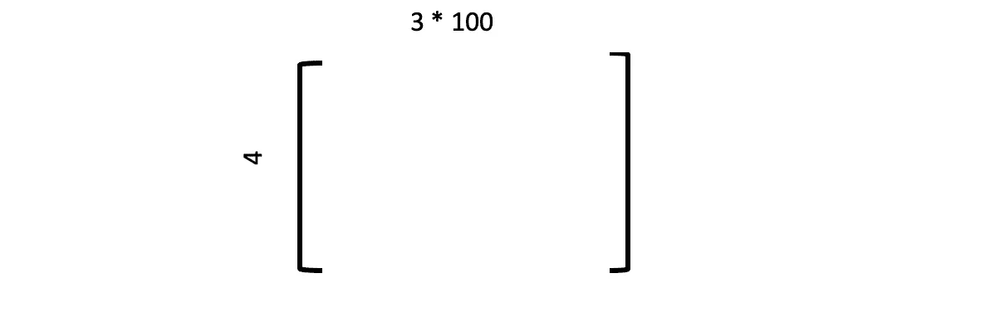

线性池化 — 第二部分 — 图片由作者提供

注意，现在我们已经将序列的长度从 10 缩短到 4，但现在每个新 token 的维度是 300 而不是 100！为了恢复到原始维度，线性池化将它们通过学习到的线性变换投影到 100 维空间中。线性变换是一个 300*100 的矩阵，由数据学习得出。

**3) 注意力池化：**

这种方法与上述两种方法类似开始：输入序列被划分为大小为 k 的窗口，然后在每个窗口内应用注意力，这使得窗口中的 token 可以相互关注。最后，由注意力产生的每个窗口的嵌入被加在一起。经过这一步后，在块嵌入上应用前馈层。

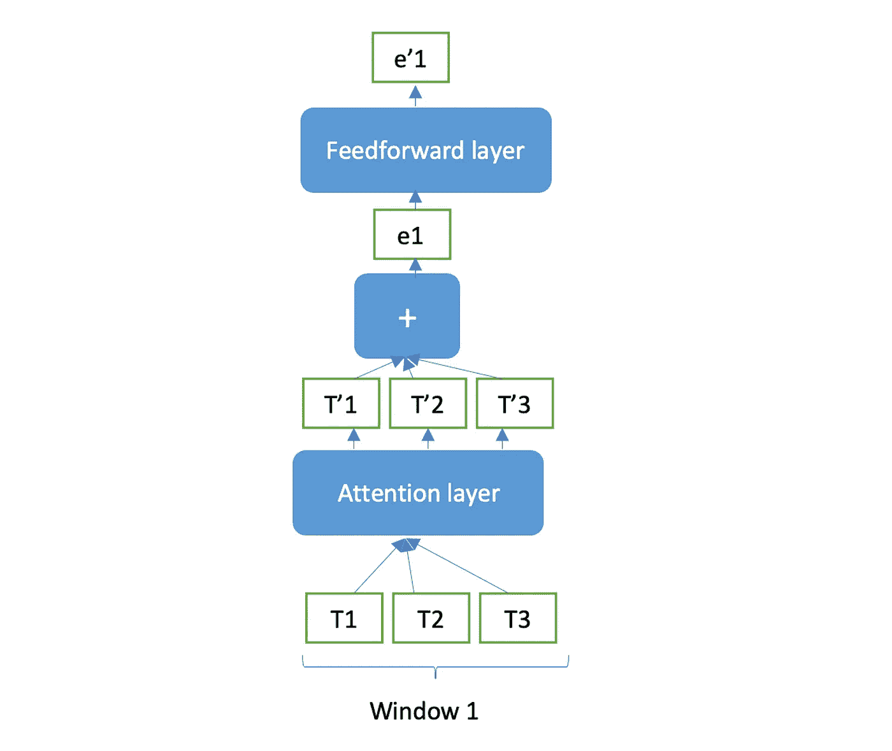

注意力池化 — 图片由作者提供

## 上采样步骤

上采样步骤将缩短的序列扩展回原始的完整长度。有两种简单的上采样方法：

1.  *重复扩展：* *重复扩展* 只是简单地多次复制每个嵌入。这在计算上非常高效。

1.  *线性扩展*。*线性扩展*将其投影到更高的维度，然后进行扩展。例如，如果缩短后的序列是 [e1, e2, e3, e4] 并且 *sf=k=3*，那么每个嵌入会线性投影到一个大小为 *k * d* 的向量，其中 *d* 是原始嵌入维度。投影权重矩阵是可学习的，并且与完整模型一起端到端地训练。

为了保持对原始输入序列的保真度，残差连接（如红色虚线所示）将缩短之前的输入序列添加到上采样序列中。可以将其视为通过多次缩短-扩展周期来获取声学上下文的一种方式。

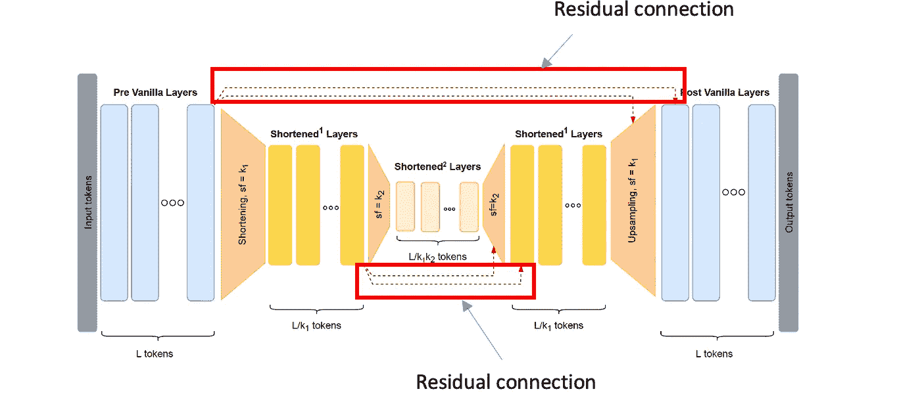

为了保持保真度添加的残差连接 — 图片来自 [[1](https://arxiv.org/pdf/2110.13711.pdf)]，由作者修改

还有一种更高级的上采样方法，称为 *注意力上采样*，其工作原理如下：

如果缩短的序列是[ e1, e2, e3, e4 ]，且*sf=k=3*，则首先应用线性或重复上采样将其扩展到原始长度。这将得到[ u1, u2, …, u12 ]。

设缩短前的嵌入为[ x1, x2, …, x12 ]；这些通过残差连接（红色虚线）添加到上采样的嵌入中，形成[ u1+x1, …, u12+x12 ]。现在，自注意力机制应用于这个序列，其中：

+   查询（Q）来自求和的嵌入[ u1+x1, …, u12+x12 ]。

+   键（K）和值（V）来自上采样的嵌入[ u1, u2, …, u12 ]。

这更新了求和的嵌入，这将是最终输出。对上采样序列的注意力有助于放大相关部分，并与预缩短的上下文进行结合。

## 实验

他们[1]在语言建模（使用 enwik8）和图像生成（使用 ImageNet-32/64）上评估了他们的模型。他们显示，相比于 Transformer-XL 基线，Enwik8 数据集上的困惑度提高了 10-15%；并且他们在 ImageNet-32 图像生成任务上实现了自回归变换器模型的新最先进水平。

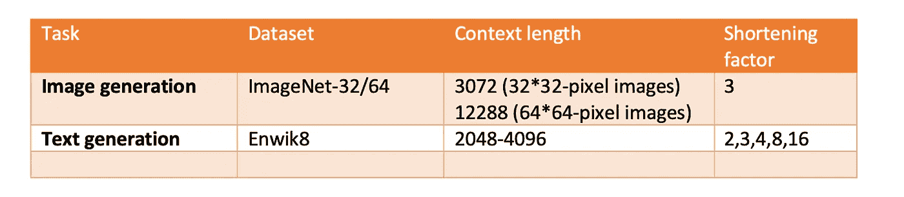

实验参数 — 作者提供的图片

这部分结束了沙漏网络的讨论。在下一篇文章中，我们将深入探讨其他层次化的变换器模型。

# 总结

在这篇文章中，我们回顾了一种改进效率并减少处理长序列时内存使用的变换器层次化架构。这种架构称为 Hourglass [1]，由两个主要组件组成：1）缩短或下采样，2）上采样。缩短是通过使用池化操作（如平均池化或线性池化）将令牌合并成组来完成的。网络中间层的序列长度由缩短因子 k 减少。上采样组件使用线性上采样或注意力上采样等方法将缩短的序列扩展回原始长度。Hourglass 模型相比于基线变换器如 Transformer-XL [1]，改善了困惑度。实际上，它在 ImageNet32 图像生成任务上达到了变换器模型的新最先进水平。

如果你有任何问题或建议，欢迎随时联系我：

邮箱: mina.ghashami@gmail.com

LinkedIn: [`www.linkedin.com/in/minaghashami/`](https://www.linkedin.com/in/minaghashami/)

# 参考文献

1.  [层次化变换器是更高效的语言模型](https://arxiv.org/pdf/2110.13711.pdf)

1.  [探索层次化注意力变换器在长文档分类中的高效性](https://arxiv.org/abs/2210.05529)
