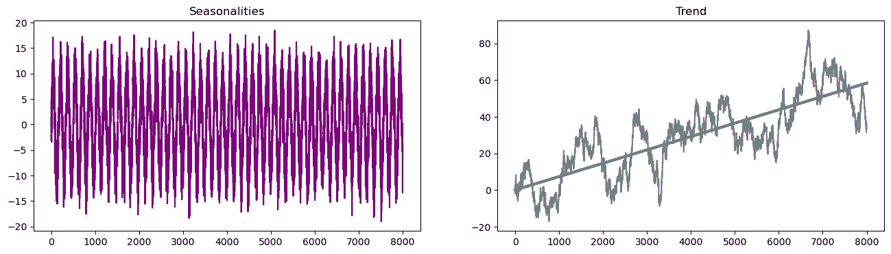
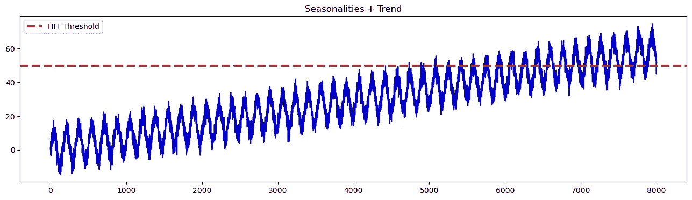
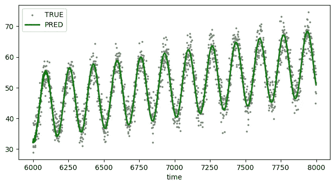
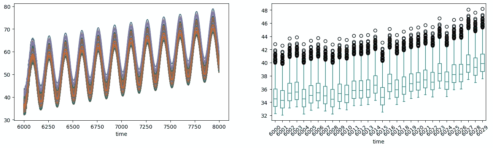
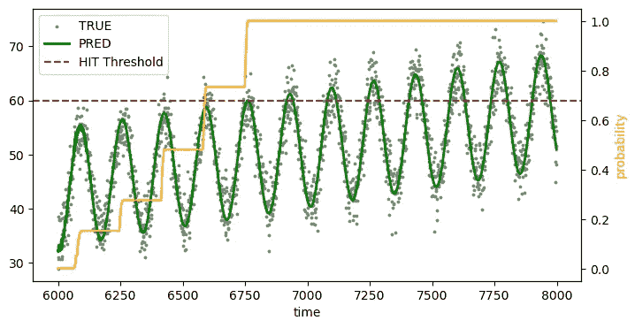

# 达到时间预测：时间序列概率预测的另一种方式

> 原文：[`towardsdatascience.com/hitting-time-forecasting-the-other-way-for-time-series-probabilistic-forecasting-6c3b6496c353`](https://towardsdatascience.com/hitting-time-forecasting-the-other-way-for-time-series-probabilistic-forecasting-6c3b6496c353)

## 需要多长时间才能达到一个特定值？

[](https://medium.com/@cerlymarco?source=post_page-----6c3b6496c353--------------------------------)[](https://towardsdatascience.com/?source=post_page-----6c3b6496c353--------------------------------) [Marco Cerliani](https://medium.com/@cerlymarco?source=post_page-----6c3b6496c353--------------------------------)

·发表于[Towards Data Science](https://towardsdatascience.com/?source=post_page-----6c3b6496c353--------------------------------) ·阅读时长 4 分钟·2023 年 6 月 27 日

--


由[Mick Haupt](https://unsplash.com/@rocinante_11?utm_source=medium&utm_medium=referral)拍摄，照片来源于[Unsplash](https://unsplash.com/?utm_source=medium&utm_medium=referral)

准确预测的能力对每个时间序列预测应用都是基础。为此，**数据科学家通常选择那些从点预测角度最小化误差的最佳模型**。这虽然正确，但可能并不总是最有效的方法。

数据科学家还应考虑开发概率预测模型。这些模型不仅会生成点估计，还会提供上限和下限的可靠性区间，未来的观测值很可能会落在这些区间内。尽管概率预测似乎是统计学或深度学习解决方案的特权，**任何模型都可以用来生成概率预测**。这一概念在我之前的[文章](https://medium.com/towards-data-science/time-series-forecasting-with-conformal-prediction-intervals-scikit-learn-is-all-you-need-4b68143a027a)中解释了，**我介绍了将符合性预测作为使用任何 scikit-learn 模型来估计预测区间的方法**。

点预测无疑更容易向非技术利益相关者传达。同时，能够生成关于我们预测可靠性的关键绩效指标（KPI）也是一种附加值。**概率输出可能提供更多的信息来支持决策**。告知未来几小时有 60%的降雨概率可能比报告降雨毫米数更具信息性。

在这篇文章中，**我们提出了一种称为预测到达时间的技术，用于估计特定事件或条件发生的时间**。它被证明是**准确的**，因为它基于合规预测，**可解释的**，因为它具有概率解释性，并且**可重复的**，与任何预测技术都适用。

# 介绍到达时间预测

**预测到达时间**是一个在各种领域常用的概念。它**指的是预测或估计特定事件或条件发生所需的时间**，通常是在达到特定阈值或水平的背景下。



模拟的季节性和趋势 [图片由作者提供]



模拟时间序列（季节性 + 趋势）示例 [图片由作者提供]

到达时间的最著名应用涉及可靠性分析和生存分析等领域。它包括估计系统或过程经历特定事件的时间，例如故障或达到特定状态。在金融领域，到达时间通常用于确定信号/指数朝向预期方向的概率。

总体而言，预测到达时间涉及对某一事件发生所需时间的预测，该事件遵循时间动态。

# 从点预测到概率预测

**要正确估计到达时间，我们必须从点预测开始**。作为第一步，我们选择所需的预测算法。对于本文，我们采用了来自[**tspiral**](https://github.com/cerlymarco/tspiral)的简单递归估计器，这种估计器在 scikit-learn 风格中易于获取。



预测值与实际数据点在测试集上的对比 [图片由作者提供]

```py
model = ForecastingCascade(
    Ridge(),
    lags=range(1,24*7+1),
    use_exog=False,
)
```

**我们的目标是为每个预测点生成预测分布，从中提取概率洞察**。这通过三步法完成，并利用合规预测的理论：

+   预测结果通过交叉验证在训练集上收集，然后进行平均。

```py
CV = TemporalSplit(n_splits=10, test_size=y_test.shape[0])

pred_val_matrix = np.full(
    shape=(X_train.shape[0], CV.get_n_splits(X_train)),
    fill_value=np.nan,
    dtype=float,
)

for i, (id_train, id_val) in enumerate(CV.split(X_train)):

    pred_val = model.fit(
        X_train[id_train], 
        y_train[id_train]
    ).predict(X_train[id_val])

    pred_val_matrix[id_val, i] = np.array(
        pred_val, dtype=float
    )

pred_val = np.nanmean(pred_val_matrix, axis=1)
```

+   合规性分数基于交叉验证预测和实际值的绝对残差在训练数据上计算。

```py
conformity_scores  = np.abs(
    np.subtract(
        y_train[~np.isnan(pred_val)], 
        pred_val[~np.isnan(pred_val)]
    )
)
```

+   未来的预测分布通过将合规性分数添加到测试预测中获得。

```py
pred_test = model.fit(
    X_train, 
    y_train
).predict(X_test)

estimated_test_distributions = np.add(
    pred_test[:, None], conformity_scores
)
```



测试数据上的预测分布 [图片由作者提供]

按照上述程序，我们得到一组可能的轨迹，这些轨迹是未来值可能遵循的路径。我们拥有所有需要的东西来提供预测的概率表示。

# 从概率预测到到达时间预测

对于每个未来的时间点，记录了**估计的测试分布中值超过预定义阈值（我们的击中目标水平）的次数**。这个计数被转化为一个概率，方法是通过估计测试分布中的值的数量进行归一化。

最后，对概率数组应用了一种转换，以获得一系列单调递增的概率。

```py
THRESHOLD = 40

prob_test = np.mean(estimated_test_distributions > THRESHOLD, axis=1)

prob_test = pd.Series(prob_test).expanding(1).max()
```



测试集上的预测数据点与实际数据点以及击中时间概率[作者提供的图片]

**无论我们尝试预测的事件是什么，我们都可以仅从点预测开始生成概率曲线**。解释仍然很直接，即对于每个预测的时间点，我们可以推导出目标序列达到预定义水平的概率。

# 总结

在这篇文章中，我们介绍了一种为预测模型提供概率结果的方法。这不需要应用奇怪且复杂的额外估计技术。从一个点预测问题出发，可以通过应用击中时间方法，添加任务的概率概述。

[**查看我的 GITHUB 仓库**](https://github.com/cerlymarco/MEDIUM_NoteBook)

保持联系：[Linkedin](https://www.linkedin.com/in/marco-cerliani-b0bba714b/)
