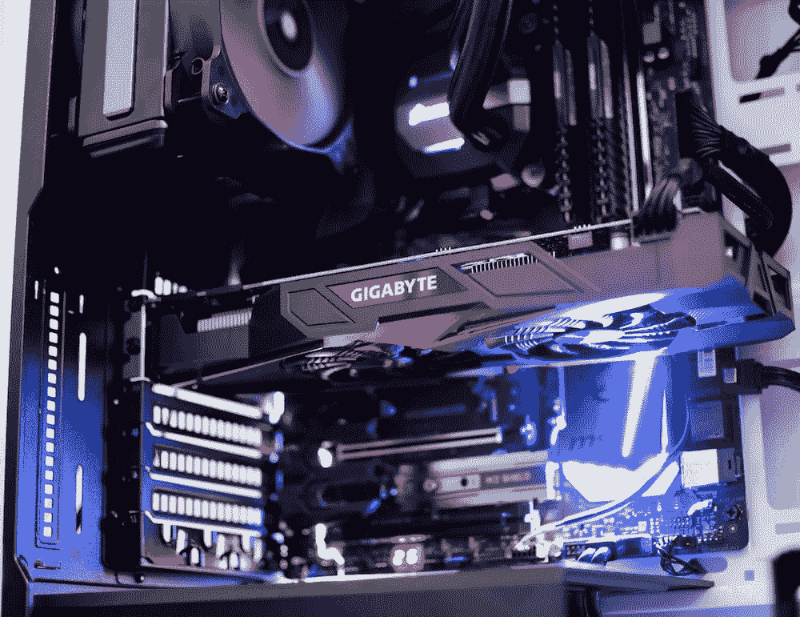

# 托管数百个 NLP 模型，利用 SageMaker 多模型端点和 GPU 实例

> 原文：[`towardsdatascience.com/host-hundreds-of-nlp-models-utilizing-sagemaker-multi-model-endpoints-backed-by-gpu-instances-1ec215886248?source=collection_archive---------8-----------------------#2023-09-22`](https://towardsdatascience.com/host-hundreds-of-nlp-models-utilizing-sagemaker-multi-model-endpoints-backed-by-gpu-instances-1ec215886248?source=collection_archive---------8-----------------------#2023-09-22)

## 将 Triton 推理服务器与 Amazon SageMaker 集成

 [Ram Vegiraju](https://ram-vegiraju.medium.com/?source=post_page-----1ec215886248--------------------------------)

·

[关注](https://medium.com/m/signin?actionUrl=https%3A%2F%2Fmedium.com%2F_%2Fsubscribe%2Fuser%2F6e49569edd2b&operation=register&redirect=https%3A%2F%2Ftowardsdatascience.com%2Fhost-hundreds-of-nlp-models-utilizing-sagemaker-multi-model-endpoints-backed-by-gpu-instances-1ec215886248&user=Ram+Vegiraju&userId=6e49569edd2b&source=post_page-6e49569edd2b----1ec215886248---------------------post_header-----------) 发表在 [Towards Data Science](https://towardsdatascience.com/?source=post_page-----1ec215886248--------------------------------) · 7 分钟阅读 · 2023 年 9 月 22 日

--

图片来自 [Unsplash](https://unsplash.com/photos/6b5uqlWabB0)

过去，我们探索了 SageMaker 多模型端点 (MME) 作为在单一端点后面托管多个模型的经济有效选项。虽然可以在 CPU 基础实例上托管较小的模型，但随着这些模型变得更大更复杂，有时可能需要 GPU 计算。

[由 GPU 支持的 MME](https://aws.amazon.com/about-aws/whats-new/2022/10/amazon-sagemaker-cost-effectively-host-1000s-gpu-multi-model-endpoint/) 实例是一个特定的 SageMaker 推理功能，我们将在本文中利用它展示如何在单一端点上高效地托管数百个 NLP 模型。请注意，在本文撰写时，SageMaker 上的 MME GPU 当前支持以下单 GPU 基础实例系列：p2、p3、g4dn 和 g5。

MME GPU 当前还由两个模型服务堆栈提供支持：

1.  [Nvidia Triton 推理服务器](https://aws.amazon.com/blogs/machine-learning/run-multiple-deep-learning-models-on-gpu-with-amazon-sagemaker-multi-model-endpoints/)

1.  [TorchServe](https://aws.amazon.com/blogs/machine-learning/run-multiple-generative-ai-models-on-gpu-using-amazon-sagemaker-multi-model-endpoints-with-torchserve-and-save-up-to-75-in-inference-costs/)

为了本文的目的，我们将利用 Triton 推理服务器与 PyTorch 后端在我们的 GPU 实例上托管基于 BERT 的模型。如果你对 Triton 不熟悉，我们会进行简单的介绍，但我建议你参考我的入门文章 这里。
