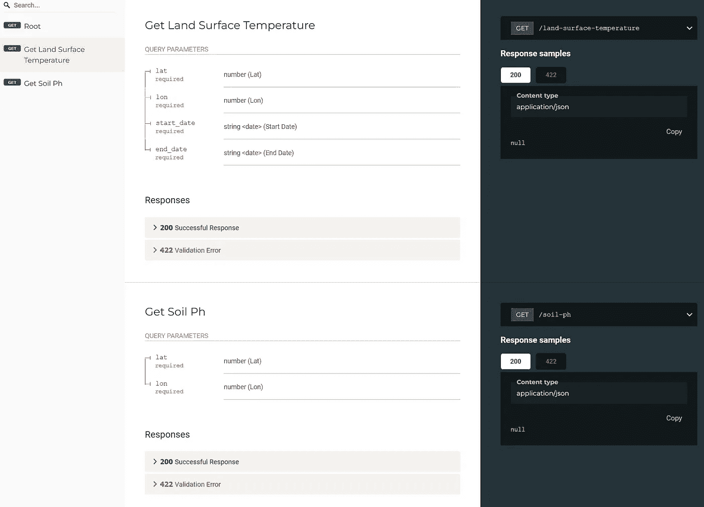

# 在 Colab 上免费托管你的 Google Earth Engine RESTful API

> 原文：[`towardsdatascience.com/host-your-google-earth-engine-restful-apis-on-colab-for-free-3a95abc729d0`](https://towardsdatascience.com/host-your-google-earth-engine-restful-apis-on-colab-for-free-3a95abc729d0)

## 使用 FastAPI 和 ngrok

[](https://dgg32.medium.com/?source=post_page-----3a95abc729d0--------------------------------)[](https://towardsdatascience.com/?source=post_page-----3a95abc729d0--------------------------------) [黄四兴](https://dgg32.medium.com/?source=post_page-----3a95abc729d0--------------------------------)

·发表于[Towards Data Science](https://towardsdatascience.com/?source=post_page-----3a95abc729d0--------------------------------) ·阅读时长 8 分钟·2023 年 1 月 6 日

--


图片由[NASA](https://unsplash.com/@nasa?utm_source=unsplash&utm_medium=referral&utm_content=creditCopyText)提供，[Unsplash](https://unsplash.com/images/nature/earth?utm_source=unsplash&utm_medium=referral&utm_content=creditCopyText)上的照片

地理空间数据的需求一直很高。它揭示了我们星球随时间变化的情况。当我们谈到地理空间时，我们会想到[Google Earth Engine](https://earthengine.google.com/) (GEE)。该服务有几个优势。它托管了跨度超过 37 年的大量数据集合。所有计算都在谷歌强大的云基础设施上运行。更重要的是，对于非营利项目，它是免费的。通过 GEE，我们可以免费研究[土地利用和土地覆盖](https://medium.com/geekculture/monitor-land-use-changes-with-google-earth-engine-65cd15e10c6c) (LULC)、[植被](https://medium.com/p/909a2ad51a48)、本地气候（[这里](https://medium.com/p/c6aa77fecdb1)和[这里](https://medium.com/p/ae21261854d6)），甚至[美国的农作物生产](https://medium.com/p/9cfd14813e99)。

然而，GEE 确实有较高的门槛。首先，必须精通 JavaScript 或 Python。其次，我们需要熟悉许多地理空间概念，如图像集合、几何体和卫星波段。第三，它的异步请求-响应模式对于新手来说需要一些时间来适应。

这对许多数据科学家来说是一个小挑战。大多数情况下，他们只希望快速获得一组坐标的某些值，例如土壤 pH 值或平均地表温度。截止目前，他们需要进行相当多的编码，因为 GEE 没有提供 RESTful API。如果我们能自己填补这个空白岂不是很好（视频 1）？我们的 API 应该封装一些常见的 GEE 计算，并提供互联网 HTTP 访问。


视频 1\. 使用 FastAPI 在 Google Colab 上创建的 Google Earth Engine API。视频由作者提供。

让我们在本文中完成它。我选择了[FastAPI](https://fastapi.tiangolo.com/)来完成这项工作。这个流行的库允许我们用 Python 构建高性能的 API，Python 是 GEE 中的两种服务语言之一。Google Colab 是首选的平台。Colab 不仅与 GEE 无缝集成，而且在[ngrok](https://ngrok.com/)的帮助下，还可以通过 HTTP 公开提供 API（视频 1）。在本文中，我将描述两个 API 的构建。其中一个返回土地温度，另一个计算给定坐标集的土壤 pH 值。之后，我将演示如何使用这些 API 从[BacDive](https://bacdive.dsmz.de/)获取一些细菌的元数据。

这里定义了 API。

[](https://colab.research.google.com/drive/1BNsFLHA_ISC7sDSLF4-znBNY9YSIUbh1?usp=sharing&source=post_page-----3a95abc729d0--------------------------------) [## Google Colaboratory GEE APIs

colab.research.google.com](https://colab.research.google.com/drive/1BNsFLHA_ISC7sDSLF4-znBNY9YSIUbh1?usp=sharing&source=post_page-----3a95abc729d0--------------------------------)

这是一个 Python 应用程序，它通过我们的 GEE API 在 BacDive 中验证数据。

[](https://colab.research.google.com/drive/12NXlV6Q8Qrs6hLqEIeEmQ1cm_CElCkOB?usp=sharing&source=post_page-----3a95abc729d0--------------------------------) [## Google Colaboratory BacDive

colab.research.google.com](https://colab.research.google.com/drive/12NXlV6Q8Qrs6hLqEIeEmQ1cm_CElCkOB?usp=sharing&source=post_page-----3a95abc729d0--------------------------------)

# 1\. Google Earth Engine API 与 FastAPI 和 ngrok 的结合

首先，你需要一个[Google Earth Engine 账户](https://earthengine.google.com/signup/)和一个[ngrok 账户](https://dashboard.ngrok.com/signup)。在你的账户页面找到 ngrok 的 Authtoken（图 1）。


图 1\. 将 Authtoken 存储在你的 ngrok 账户页面。图片由作者提供。

## 1.1 初始化

创建一个 Colab 笔记本。在库导入后，让我们初始化 GEE 和 ngrok。首先，按照 Google 的说明进行身份验证和初始化 GEE（第 1 和第 2 行）。之后，`input`函数会提示你输入 ngrok 的 Authtoken（第 3 行）。将你的 Authtoken 粘贴到输入框中并确认。然后，代码将在第 4 行授权你的 ngrok 实例。

```py
# Trigger the authentication flow.
ee.Authenticate()

# Initialize the library.
ee.Initialize()

ngrok_key = input("Your ngrok Authtoken")

!ngrok authtoken {ngrok_key}
```

## 1.2 GEE 封装函数

接下来，我们可以创建一些封装函数来封装 GEE 交互。

```py
def generate_collection(geometry, dataset, startDate, endDate):
    collection = ee.ImageCollection(dataset).filterDate(startDate, endDate).filterBounds(geometry);
    return collection

def get_mean(image_collection, point, property, scale_factor):
    image = image_collection.select([property]).reduce(ee.Reducer.mean()).multiply(scale_factor)

    fcPoint = ee.FeatureCollection([ee.Feature(point)])

    geojson = image.sampleRegions(collection = fcPoint,  scale = 1000, geometries = True)

    return geojson.getInfo()["features"][0]["properties"]

def generate_image(dataset):
    return ee.Image(dataset)

def get_image_value(image, point, property, scale_factor):
    return image.reduceRegion(ee.Reducer.mean(), point, 100).get(property).getInfo() * scale_factor
```

一般来说，GEE 将测量结果存储在图像中。某些测量，例如海拔和土壤 pH，只做了一次，它们被存储在单个图像中。相比之下，其他测量，如土壤温度和降水量，是周期性进行的，因此它们被存储在图像集合中。两个函数`generate_collection`（第 1-3 行）和`generate_image`（第 14-15 行）分别返回图像集合和单个图像。接下来，我们想获取目标区域的平均测量值（第 5-12 行 & 第 17-18 行）。

## 1.3 FastAPI

现在是时候在我们的笔记本中设置 FastAPI 了。

```py
app = FastAPI()

@app.get('/')
async def root():
    return {'hello': 'world'}

@app.get("/land-surface-temperature")
async def get_land_surface_temperature(lat: float, lon: float, start_date: datetime.date, end_date: datetime.date):
    dataset = "MODIS/061/MOD11A1"

    point = ee.Geometry.Point([lon, lat])

    image_collection = generate_collection(point, dataset, start_date.strftime("%Y-%m-%d"), end_date.strftime("%Y-%m-%d"))

    result = get_mean(image_collection, point, "LST_Day_1km", 0.02)

    return {'result': result}

@app.get("/soil-ph")
async def get_soil_ph(lat: float, lon: float):
    dataset = "OpenLandMap/SOL/SOL_PH-H2O_USDA-4C1A2A_M/v02"

    point = ee.Geometry.Point([lon, lat])

    image = generate_image(dataset)

    scale_factor = 0.1

    ph = get_image_value(image, point, "b0", scale_factor)

    return {"result": {"pH": ph}}
```

在这个代码块中，我们首先初始化一个 FastAPI 应用。然后定义了三个路由：根路由，`land-surface-temperature`和`soil-ph`。在后两个路由中，我们使用了第 1.2 节中的函数来请求 GEE 中的测量值。温度值来自于`MOD11A1.061 Terra Land Surface Temperature and Emissivity Daily Global 1km`数据集（[MODIS 数据和产品在 LP DAAC 中获取，无后续使用、销售或再分发的限制](https://developers.google.com/earth-engine/datasets/catalog/MODIS_061_MOD11A1#terms-of-use)），而 pH 值由`OpenLandMap Soil pH in H2O`数据集提供（[CC-BY-SA-4.0](https://spdx.org/licenses/CC-BY-SA-4.0.html)）。

## 1.4 ngrok

现在让我们开始 API 服务。这里的代码借鉴自[一个回答](https://stackoverflow.com/questions/63833593/how-to-run-fastapi-uvicorn-in-google-colab)在 stackoverflow.com 上。

```py
ngrok_tunnel = ngrok.connect(8000)
print('Public URL:', ngrok_tunnel.public_url)
nest_asyncio.apply()
uvicorn.run(app, port=8000)
```

代码将生成一个端点 URL 并继续运行（视频 1）。

## 1.5 测试

我们现在可以测试服务。点击端点 URL，你将看到根路由的“hello world”消息（视频 1）。

令人惊讶的是，FastAPI 会自动生成文档。你可以在`/redoc`路由下访问它（图 2）。



图 2\. 文档由 FastAPI 准备。图片由作者提供。

让我们测试`land-surface-temperature` API。在 URL 中的“？”标记后，将所需参数编码为键值对。例如，以下查询字符串允许我们获取 2020 年 1 月 1 日到 2020 年 5 月 1 日（52.72389418745157, -92.03593750000002）的地表温度。

```py
/land-surface-temperature?lat=52.72389418745157&lon=-92.03593750000002&start_date=2020-01-01&end_date=2020-05-01
```


图 3\. 2020 年 1 月 1 日到 2020 年 5 月 1 日（52.72389418745157, -92.03593750000002）的地表温度。图片由作者提供。

请注意，返回的值是以开尔文为单位的（图 3）。

`soil-ph` API 的工作原理类似。但它不需要采样周期。因此，以下查询字符串可以单独请求相同坐标对的土壤 pH 值（视频 1）。

```py
/soil-ph?lat=52.72389418745157&lon=-92.03593750000002
```

# 2\. 比较 BacDive 的实验室结果与 GEE 的野外元数据

[**BacDive**](https://bacdive.dsmz.de/)数据库由 DSMZ 创建，收集了关于细菌分离株的信息，包括其生长温度、pH 值和代谢特征。请注意，它几乎所有的信息都是在实验室中生成的。微生物在野外的行为很可能有所不同。

最近，[**BacDive**](https://bacdive.dsmz.de/)已集成了[**Microbeatlas**](https://microbeatlas.org/)。嵌入的[Microbeatlas](https://microbeatlas.org/)地图显示了许多细菌 16S 序列的全球分布（图 4）。


图 4\. [BacDive](https://bacdive.dsmz.de/strain/132485)与[Microbeatlas](https://microbeatlas.org/)。作者提供的图片。

这个交叉验证非常棒。现在，研究人员不仅可以了解细菌在实验室中的行为（BacDive），还可以了解它们在全球范围内的分布（Microbeatlas）。但我们可以做得更多。我们可以从新推出的 GEE APIs 中收集野外的元数据，并将其与 BacDive 的实验室结果进行比较。这种比较可以向我们展示细菌在实验室和野外的生活是否有所不同。

以细菌[*Rhodopseudomonas palustris* R1](https://bacdive.dsmz.de/strain/1822)为例。它的 Microbeatlas [页面](https://microbeatlas.org/index.html?action=taxon&taxon_id=90_86%3B96_297%3B97_329%3B98_429%3B99_5209&stattab=map) 显示该细菌可以在长长的样本列表中找到（图 5）。


图 5\. 根据[Microbeatlas](https://microbeatlas.org/index.html?action=taxon&taxon_id=90_86%3B96_297%3B97_329%3B98_429%3B99_5209&stattab=map)，全球范围内的[*Rhodopseudomonas palustris* R1](https://bacdive.dsmz.de/strain/1822)分布。作者提供的图片。

截至 2023 年 1 月 5 日，[Microbeatlas](https://microbeatlas.org/)中的`DOWNLOAD`按钮无法使用。因此，我使用“soil”关键词过滤了这些样本。然后我检查了前几个样本，并选择了那些具有完整位置和时间数据的样本（表 1）。

表 1\. 五个样本[*Rhodopseudomonas palustris* R1](https://bacdive.dsmz.de/strain/1822)丰富存在的土壤。

使用以下 Python 代码，我们可以获取这些样本的土地温度和 pH 值（也可以在我上面的 Colab 链接中找到）。

```py
sheet_id = "YOUR GOOGLE SHEETS ID"
sheet_name = "YOUR GOOGLE SHEETS NAME"

url = f"https://docs.google.com/spreadsheets/d/{sheet_id}/gviz/tq?tqx=out:csv&sheet={sheet_name}"
df = pd.read_csv(url)

api_url = "YOUR ngrok ENDPOINT"

land_temperature_route = "/land-surface-temperature/?"
land_ph_route = "/soil-ph/?"

for index, row in df.iterrows():
    date = datetime.strptime(row["date"], "%Y-%m-%d")

    start_date = datetime.strptime(f"{date.year}-{date.month}", '%Y-%m').date()
    end_date =  datetime.strptime(f"{date.year}-{date.month + 1}", '%Y-%m').date()

    lat = row["lat"]

    lon = row["lon"]

    temp_url = f"{api_url}{land_temperature_route}lat={lat}&lon={lon}&start_date={start_date}&end_date={end_date}"
    ph_url = f"{api_url}{land_ph_route}lat={lat}&lon={lon}"

    temp = requests.get(temp_url).json()["result"]["LST_Day_1km_mean"] -273.15
    ph = requests.get(ph_url).json()["result"]["pH"]

    print (f'{row["sample"]}\t{temp}\t{ph}')
```

结果见表 2。

表 2\. 根据 GEE 的五个样本的温度和 pH 值。

一方面，这些前五个样本的温度值范围为 11 至 19°C，远低于 BacDive 中显示的 28–30°C 的生长温度。另一方面，BacDive 没有记录该细菌的生长 pH 值。但我们的结果表明，[*Rhodopseudomonas palustris* R1](https://bacdive.dsmz.de/strain/1822)在酸性土壤中丰富存在，从而填补了 BacDive 中的信息空白。

# 结论

本文展示了使用 FastAPI 和 ngrok 在 Colab 上为 GEE 原型化自己的 RESTful API 是多么简单。只需几行代码，我们就可以在互联网上免费设置功能完善的 API。现在我们可以通过简单的 URL 请求 GEE 的地理空间结果。希望这些 API 也能吸引更多用户和研究人员使用 GEE。我在本文中仅展示了两个 API。我鼓励你为你的项目构建更多的 API。你也可以修改查询字符串的设计。但请注意，这种设置并不具备可扩展性。在生产环境中，我们最好将 API 部署到 [Deta](https://www.deta.sh/?ref=fastapi) 或其他云基础设施上。

正如你在 BacDive 部分看到的，这些简单的 API 非常有用。我们使用它们填补了 BacDive 中的信息空白。但为何止步于此呢？例如，我们可以对全球微生物 DNA 进行测序，并将结果与 GEE 元数据结合。这些分析可能揭示有助于或限制某些微生物传播的环境因素。这些知识可以帮助我们对抗传染病和遏制疫情。

*来自 BacDive 的数据采用* [*知识共享 4.0 国际许可证*](http://creativecommons.org/licenses/by/4.0/)*。*

[## 通过我的推荐链接加入 Medium - 黄思行](https://dgg32.medium.com/membership?source=post_page-----3a95abc729d0--------------------------------)

### 作为 Medium 会员，你的会员费的一部分将用于支持你阅读的作者，你还可以完全访问每一个故事…

[dgg32.medium.com](https://dgg32.medium.com/membership?source=post_page-----3a95abc729d0--------------------------------)
