# 德国住房租赁市场：使用 Python 的探索性数据分析

> 原文：[`towardsdatascience.com/housing-rental-market-in-germany-exploratory-data-analysis-with-python-3975428d07d2`](https://towardsdatascience.com/housing-rental-market-in-germany-exploratory-data-analysis-with-python-3975428d07d2)

## 使用 Python、Pandas 和 Bokeh 获取统计见解

[](https://dmitryelj.medium.com/?source=post_page-----3975428d07d2--------------------------------)[](https://towardsdatascience.com/?source=post_page-----3975428d07d2--------------------------------) [Dmitrii Eliuseev](https://dmitryelj.medium.com/?source=post_page-----3975428d07d2--------------------------------)

·发表于 [Towards Data Science](https://towardsdatascience.com/?source=post_page-----3975428d07d2--------------------------------) ·27 min 阅读·2023 年 4 月 4 日

--


Salzbrücke, Germany, 图片来源 [`en.wikipedia.org/wiki/German_Timber-Frame_Road`](https://en.wikipedia.org/wiki/German_Timber-Frame_Road)

德国不仅是欧洲最大的经济体，而且还是一个拥有美丽风景和有趣文化的国家。不足为奇的是，德国是来自世界各地的游客和外籍人士的热门目的地。对德国住房租赁市场的探索性数据分析不仅对数据分析师有趣，也对即将移居和在此工作的人有意义。我将展示一些可以通过 Python、Pandas 和 Bokeh 发现的有趣趋势。

让我们开始吧。

# 数据收集

为了找到数据，我决定使用 ImmoScout24，它不仅是最大的（在撰写本文时列出了大约 72K 套公寓和房屋），也是最早的网站之一。根据 [`web.archive.org`](https://web.archive.org/)，第一个版本是在 1999 年制作的，已有 20 多年。ImmoScout24 还有一个 API 和开发者页面。我联系了公关部门，他们允许我使用该网站的数据进行出版，但无法提供 API 密钥。这个 API 可能仅供合作伙伴使用，以添加或编辑住房数据，而不是用于批量读取。不过，这不是问题；可以使用 Python 从网页中检索数据，这使得任务更加具有挑战性。

在以类似方式收集数据之前，请先征得所有者的许可，并且要“做一个好房客”：不要使用过多的线程以避免服务器过载，使用本地保存的 HTML 文件调试代码，在使用网页浏览器时尽可能禁用图片加载。

首先，我尝试使用 *requests* 获取页面数据：

```py
import requests

url_berlin = "https://www...."
print(requests.get(url_berlin))
```

可惜，没能成功——页面对机器人有保护，在获得搜索结果之前，用户必须确认自己不是机器人。像更改“user-agent”这样简单的方法没有帮助。好吧，我们确实不是机器人，这没问题。 [Selenium](https://selenium-python.readthedocs.io/) Python 库允许使用真实的 Chrome 浏览器来获取数据并自动化读取页面：

```py
from selenium import webdriver
import time

def page_has_loaded(driver: webdriver.Chrome):
    """ Check if the page is ready """
    page_state = driver.execute_script('return document.readyState;')
    return page_state == 'complete'

def page_get(url: str, driver: webdriver.Chrome, delay_sec: int):
    """ Get the page content """
    driver.get(url)
    time.sleep(delay_sec)
    while not page_has_loaded(driver):
        time.sleep(1)
    return driver.page_source

options = webdriver.ChromeOptions()
driver = webdriver.Chrome(executable_path="./chromedriver", chrome_options=options)

# Get the first page
url_page1 = "https://www...."
html1 = page_get(url_page1, driver, delay_sec=30)

# Get next pages
url_page2 = "https://www..."
html2 = page_get(url_page1, driver, delay_sec=1)
...
```

当我们运行代码时，浏览器窗口将被打开。正如我们在代码中看到的，在处理第一页之前，我添加了一个 30 秒的延迟，这足以确认我不是机器人。在此期间，最好通过按右侧的三个点打开浏览器“设置”，并禁用图像加载；这会使处理速度更快。在请求下一页时，浏览器保持打开状态，进一步的数据可以在没有“机器人”检查的情况下进行处理。

在获取 HTML 内容后，数据提取或多或少是直接的。首先，我们必须通过使用 Web 浏览器中的“检查”按钮找到 HTML 元素的属性：

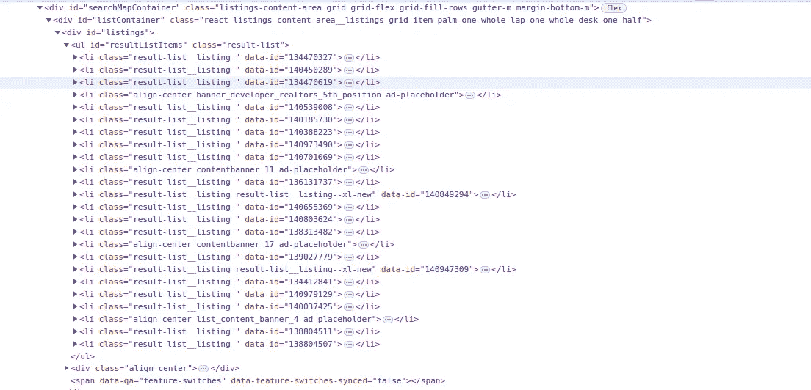

浏览器中的 HTML 输出，图片由作者提供

然后我们可以通过使用 [Beautiful Soup](https://beautiful-soup-4.readthedocs.io/en/latest/) 库在 Python 中获取这些元素。此代码从页面中提取所有公寓的 URL：

```py
from bs4 import BeautifulSoup

soup = bs.BeautifulSoup(html1, "lxml")
li = soup.find(id="resultListItems")
links_all = []
children = li.find_all("li", {"class": "result-list__listing"})
for child in children:
    for link in child.find_all("a"):
        if 'data-go-to-expose-id' in link.attrs:
            links_all.append(base_url + link['href'])
            break
links_all.append(base_url + link['href'])
```

现在让我们找出可以获得什么数据。

## 数据字段

对于每个房地产对象，我们可以得到一个这样的页面（出于隐私原因，所有值和公司名称均被模糊处理）：

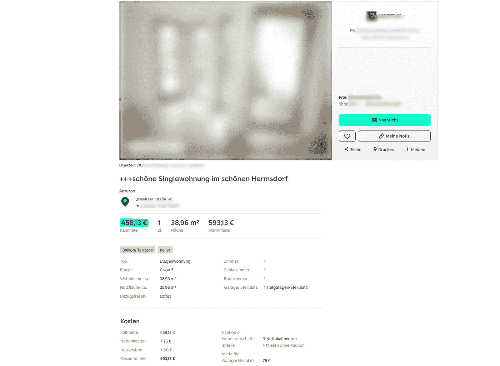

页面示例，图片由作者提供

让我们看看可以获得什么数据：

+   **标题**。在这张图片中，我们可以看到（当然是德文）“一个美丽的单间公寓在一个美丽的（地方）赫姆斯多夫”。我认为这段文字对于分析没有用处，不过只是为了好玩，稍后我们将从中构建一个词云。

+   **类型**。在这个例子中，类型是“Etagenwohnung”（楼层上的公寓）。

+   **冷租**是所谓的“冷价格”。这是一个不包含公用费用的租金价格，例如取暖费或电费。

+   **暖租**，或称“暖价格”。这个名字可能有些误导，因为我们可以看到在图片中，“暖价格”不仅包含取暖费用（“heizkosten”），还包括其他额外费用（“nebenkosten”）。

+   **楼层**。在这个页面上我们可以看到文本“0 of 3”——需要进行少量解析。在德国，第一层是第一个 *升高* 的楼层，所以我猜 0 意味着“底层”，或在德语中称为“Erdgeschoss”。从“0 到 3”的文本中，我们还可以提取出建筑物的总楼层数。

+   **押金**。一个可以覆盖可能损坏的金额，并在租赁结束时退还给租户。在这里我们可以看到一个“3-冷租”的值。我们立即记住一些解析工作是必需的。

+   **Flasche**（面积）。顾名思义，这是房屋或公寓的面积。

+   **Zimmer**（房间）。在这个例子中，是 1。

其他数据字段也可以从页面中提取，比如车库的额外租金或允许养宠物的费用，但对于我们的任务，这些字段应该足够了。

HTML 解析过程通常与之前描述的相同。例如，要获取房产标题，可以使用以下代码：

```py
soup = bs.BeautifulSoup(s_html, "lxml")

title = soup.find_all("h1", id="expose-title")
if len(title) > 0:
    str_title = title[0].get_text().strip()
```

其他字段也可以以相同的方式找到。在运行了所有页面的代码后，我得到了一个这样的数据集，并将其保存为 CVS 格式：

```py
property_id;logging_date;property_area;num_rooms;floor;floors_in_building;price_cold_eur;price_warm_eur;deposit_eur;property_type;publisher;city;title;address;region;
13507XXX1;2023-03-20;7.0;1;None;None;110;110;None;Sonstige;Private;Berlin;Lagerraum / Kellerraum / Abstellraum zu vermieten;None;Moabit, 10551 Berlin;
13613XXX2;2023-03-20;29.0;1;None;None;189;320;None;None;XXXXXXXX Sverige AB;Berlin;Wohnungstausch: Luise-Zietz-Straße 119;Luise-Zietz-Straße 119;Marzahn, 12000 Berlin;
...
14010XXXn;2023-03-20;68.0;1;None;None;28000;28000;1000;None;HousingXXXXXXXXX B.V;Berlin;Wilhelminenhofstraße, Berlin;Wilhelminenhofstraße 0;Oberschöneweide, 12459 Berlin;
```

现在让我们看看可以获取哪些信息。

# 数据转换与加载

正如我们在上一段中看到的，住房数据肯定需要一些清理和转换。

我从德国不同地区的 6 个城市收集了数据：柏林、德累斯顿、法兰克福、汉堡、科隆和慕尼黑。作为例子，我们检查柏林；对于其他城市，方法是一样的。首先，让我们将 CSV 加载到 Pandas 数据框中：

```py
import pandas as pd

df_berlin = pd.read_csv("Berlin.csv", sep=';', 
                        na_values=["None"], parse_dates=['logging_date'], 
                        dtype={"price_cold_eur": pd.Int32Dtype(), 
                               "price_warm_eur": pd.Int32Dtype(), 
                               "floor": pd.Int32Dtype(), 
                               "floors_in_building": pd.Int32Dtype()})
display(df_berlin)
```

过程很简单，但有一些有用的技巧。首先，解析是在 Python 中完成的，对于缺失值，“None” 被写入 CSV。我不希望有“None”作为文本字符串，因此我将其指定为“na_values”参数。我还指定了“;”作为分隔符，并为整数字段，如价格或楼层号，设置了“pd.Int32Dtype”类型。顺便提一下，我最初尝试使用 UInt32，因为价格无论如何不可能是负数，但结果发现计算差异时，有时会出现负值，这导致一些单元格得到类似 4,294,967,295 的值。实际上，保持 Int32 更简单；幸运的是，房价不会高于最大 Int32 值 ;)

如果一切都做得正确，作为输出，我们应该得到类似这样的结果：

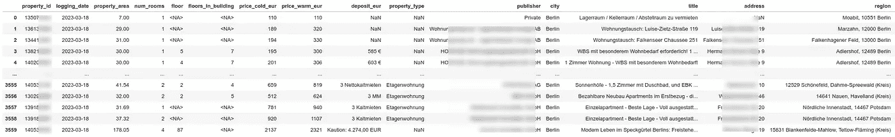

让我们检查一下维度和 NULL 值的数量：

```py
display(df_berlin.shape)
display(df_berlin.isna().sum())
```

输出看起来是这样的：

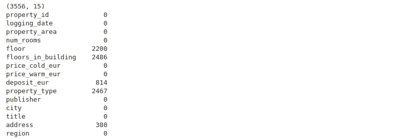

我们可以看到，柏林有 3556 套房产待租，每套房产都有“冷”价和“热”价、一个面积和一个房间数量；这些字段可能是必需的。2467 套房产缺少“类型”字段，2200 套房产没有“楼层”值，等等。如前所述，某些字段，如“押金”值，将需要转换，例如，我们需要一种方法将类似“3 Nettokaltmieten”的文本字符串转换为数值。

# 基本分析

首先，让我们看看在不费太多劲地编写代码的情况下，使用 Pandas 能做些什么。作为热身，使用 Pandas 的“describe”方法获取数据集的**描述性统计**：

```py
display(df_berlin.drop(columns=['property_id']).describe().style.format(precision=0, thousands=","))
```

在这里，我只稍微调整了一下输出：我从结果中移除了“property_id”，并通过添加“千位”分隔符来调整输出样式。柏林的数据结果如下：

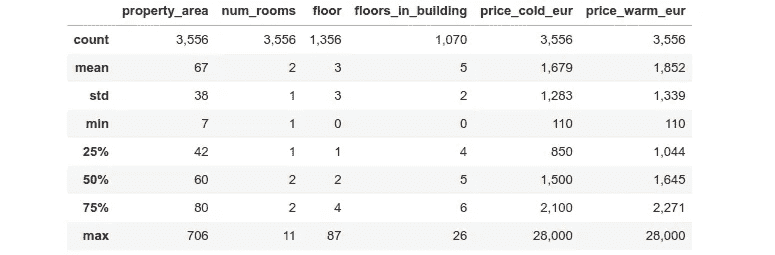

我们可以看到，柏林有 3,556 处房产上市。我们在前一步已经得到了这个值，并且有某种验证结果正确性的方法是好的。那些 3,556 处房产的中位数（第 50 百分位数）面积是 60 平方米，中位数价格是 1,645€。第 75 百分位数是 2,271€，这意味着 75%的租金价格低于这个值。有趣的是，平均房间数量是 2，这在直观上是正确的，但即便 11 间房的公寓也有（最高价格 28,000€暗示这些 11 间房的地方不便宜）。

下一步，让我们制作**散点矩阵**，用于一些字段：房产面积、房间数量和价格。可以通过 Pandas 的一个方法调用来完成：

```py
pd.plotting.scatter_matrix(df_berlin[["property_area", "num_rooms", 
                                      "price_warm_eur", "price_cold_eur"]][(df_berlin['price_cold_eur'] > 0) & (df_berlin['price_cold_eur'] < 5000)], 
                           hist_kwds={'bins': 50, 'color': '#0C0786'}, 
                           figsize=(16, 16))
```

在这里，我还调整了可视化参数——我调整了直方图的箱数，将价格限制在 0-5000€范围内（否则图表因为一些离群值而过小），并且调整了颜色。结果对于 4 行代码来说还不错：

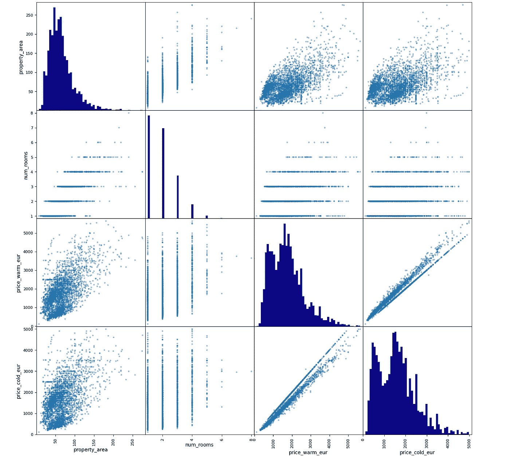

散点矩阵，作者图片

为了进一步可视化，我将使用[Bokeh](https://docs.bokeh.org/en/latest/index.html)库，它适合制作美丽且互动的图表。让我们首先导入所需的文件：

```py
from bokeh.io import show, output_notebook, export_png
from bokeh.plotting import figure, output_file
from bokeh.models import ColumnDataSource, LabelSet, Label, Whisker, FactorRange
from bokeh.transform import factor_cmap, factor_mark, cumsum
from bokeh.palettes import *
from bokeh.layouts import row, column
output_notebook()
```

我们准备好了；开始吧。

# 房产类型

第一个令我感兴趣的问题是德国有哪些类型的房产。如前所述，我从 6 个不同的德国城市收集了数据。让我们加载 CSV 文件并将它们合并成一个数据框：

```py
df_berlin = pd.read_csv("Berlin.csv", sep=';', na_values=["None"], parse_dates=['logging_date'], dtype={"price_cold_eur": pd.Int32Dtype(), "price_warm_eur": pd.Int32Dtype(), "floor": pd.Int32Dtype(), "floors_in_building": pd.Int32Dtype()})
df_munchen = pd.read_csv("Munchen.csv", sep=';', na_values=["None"], parse_dates=['logging_date'], dtype={"price_cold_eur": pd.Int32Dtype(), "price_warm_eur": pd.Int32Dtype(), "floor": pd.Int32Dtype(), "floors_in_building": pd.Int32Dtype()})
df_hamburg = pd.read_csv("Hamburg.csv", sep=';', na_values=["None"], parse_dates=['logging_date'], dtype={"price_cold_eur": pd.Int32Dtype(), "price_warm_eur": pd.Int32Dtype(), "floor": pd.Int32Dtype(), "floors_in_building": pd.Int32Dtype()})
df_cologne = pd.read_csv("Cologne.csv", sep=';', na_values=["None"], parse_dates=['logging_date'], dtype={"price_cold_eur": pd.Int32Dtype(), "price_warm_eur": pd.Int32Dtype(), "floor": pd.Int32Dtype(), "floors_in_building": pd.Int32Dtype()})
df_frankfurt = pd.read_csv("Frankfurt.csv", sep=';', na_values=["None"], parse_dates=['logging_date'], dtype={"price_cold_eur": pd.Int32Dtype(), "price_warm_eur": pd.Int32Dtype(), "floor": pd.Int32Dtype(), "floors_in_building": pd.Int32Dtype()})
df_dresden = pd.read_csv("Dresden.csv", sep=';', na_values=["None"], parse_dates=['logging_date'], dtype={"price_cold_eur": pd.Int32Dtype(), "price_warm_eur": pd.Int32Dtype(), "floor": pd.Int32Dtype(), "floors_in_building": pd.Int32Dtype()}) 

df = pd.concat([df_berlin, df_munchen, df_hamburg, 
                df_cologne, df_frankfurt, df_dresden])
```

这段代码显然可以优化；例如，我可以使用*glob.glob(‘*.csv’)*来获取文件夹中所有 CSV 文件的列表，但对于仅 6 个文件来说，我实在是懒得这样做。

现在，让我们找出房产类型的分布：

```py
 data_pr = df[['property_type']].fillna('Unbekannt').groupby(['property_type'], as_index=False).size().sort_values(by=["size"], ascending=True)

types = data_pr['property_type']
amount = data_pr['size']

palette = Viridis10 + Plasma10
p = figure(y_range=FactorRange(factors=types), width=1200, height=500, title="Apartment Types")
p.hbar(y=types, right=amount, height=0.8, color=palette[:len(types)])
p.xaxis.axis_label = 'Amount'
p.x_range.start = 0
show(p)
```

我使用了一些技巧来改进结果。我将“NA”值替换为“Unbekannt”，这是德语中的“未知”（其他类型都是德语的，所以名称应该统一）。然后，我按房产类型分组并按数量排序。作为最终调整，我指定了颜色调色板，以避免在 Matplotlib 风格中出现乏味的蓝色条形。最终输出如下：

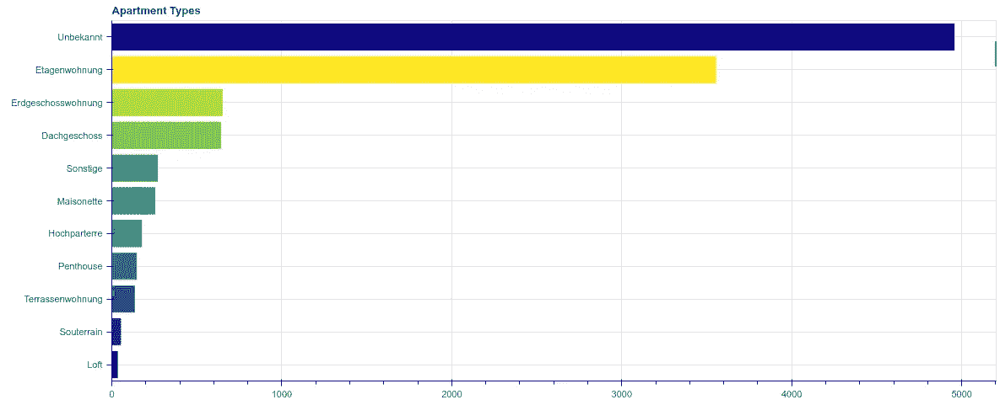

房产类型分布，作者图片

结果很有趣。许多列表中的房产没有指定类型。在其他类型中，“Etagenwohnung”（楼层公寓）是最受欢迎的。第三和第四种类型是“dachgeshoss”（屋顶下的地方）和“erdgeschosswohnung”（底层公寓）。像“maisonette”（小房子）或“hochparterre”（提高的底层）这样的类型较少；读者可以自行查找更详细的描述。

让我们检查不同房产类型的价格。我猜“顶层公寓”应该比“标准”公寓更贵，而底层公寓应该比“标准”公寓便宜。让我们验证一下。我们可以通过按类型分组并在 Pandas 中聚合结果来找到价格分布：

```py
def q0(x):
    return x.quantile(0.01)

def q1(x):
    return x.quantile(0.25)

def q3(x):
    return x.quantile(0.75)

def q4(x):
    return x.quantile(0.99)

agg_data = {'price_cold_eur': ['size', 'min', q0, q1, 'median', q3, q4, 'max']}

prices = df[df['price_cold_eur'].notna()][['property_type', 'price_cold_eur']].fillna('Unbekannt').groupby('property_type', as_index=False).agg(agg_data)
prices = prices.sort_values(by=('price_cold_eur', 'size'), ascending=True)
display(prices.style.hide(axis="index"))
```

我们可以在表格形式中查看结果：

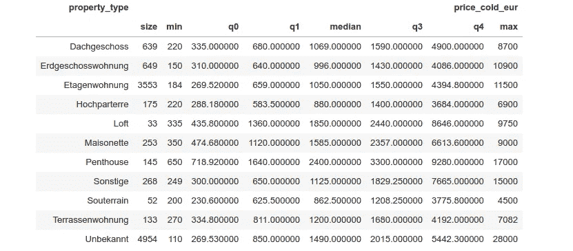

使用[箱线图](https://en.wikipedia.org/wiki/Box_plot)，我们可以以可视化的形式呈现结果：

```py
prices = prices.sort_values(by=('price_cold_eur', 'size'), ascending=True)

p_types = prices["property_type"]
q1 = prices["price_cold_eur"]["q1"].astype('int32')
q3 = prices["price_cold_eur"]["q3"].astype('int32')
v_min = prices["price_cold_eur"]["q0"].astype('int32')
v_max = prices["price_cold_eur"]["q4"].astype('int32')
median = prices["price_cold_eur"]["median"].astype('int32')

palette = Viridis10 + Plasma10
source = ColumnDataSource(data=dict(p_types=p_types, 
                                    lower=v_min, 
                                    bottom=q1, 
                                    median=median, 
                                    top=q3,                                     
                                    upper=v_max,
                                    color=palette[:p_types.shape[0]]))

p = figure(x_range=p_types, width=1400, height=500, title="Property types distribution") 
whisker = Whisker(base="p_types", upper="upper", lower="lower", source=source)
p.add_layout(whisker)
p.vbar(x='p_types', top='top', bottom='median', width=0.9, color='color', 
       line_color="black", source=source)
p.vbar(x='p_types', top='median', bottom='bottom', width=0.9, color='color', 
       line_color="black", source=source)

p.left[0].formatter.use_scientific = False
p.y_range.start = 0
p.y_range.end = 4000
p.yaxis.axis_label = 'Rent Price, EUR'
show(p)
```

我为每组使用了相同的大小排序，因此箱线图的调色板与之前的图表相同：

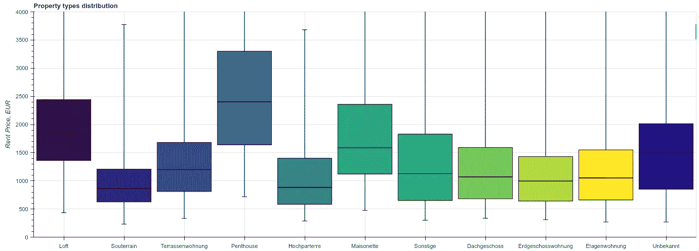

房产类型的须状图，作者提供的图像

我的猜测部分正确。顶层公寓确实是最贵的，但在标准公寓（“etagenwohnung”）、屋顶公寓（“dachgeshoss”）和底层公寓（“erdgeschosswohnung”）之间，没有显著差异。

# 房产价格

从整个数据集中获取分布是有用的，但让我们深入一些，比较不同地方的数据。正如之前所述，我从 6 个德国城市收集了数据：

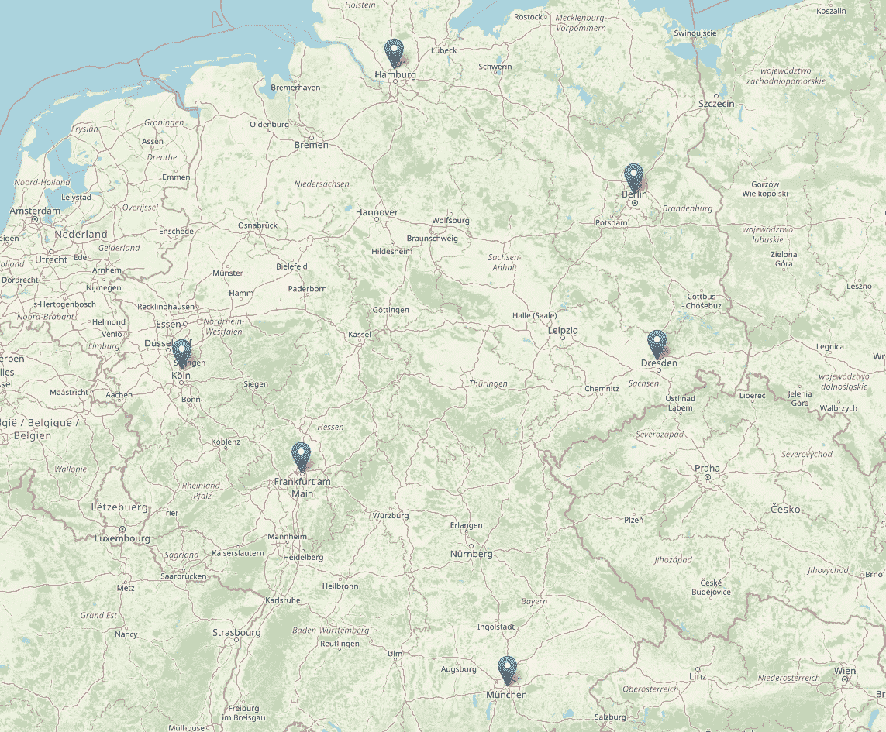

城市位置地图，作者提供的图像

让我们看看从德国相对两端收集的数据之间的差异有多大。

## 每平方米价格

以一定金额租赁的房产大小是多少？使用**散点图**可以轻松获得结果；这种方法通常只需要两个 X 和 Y 的数组。但我们可以让它看起来更好。

首先，让我们创建一个按数量排序的可能房产类型列表，就像我们之前做的那样：

```py
pr_types = df[['property_type']].fillna('Unbekannt').groupby(['property_type'], as_index=False).size().sort_values(by=["size"], ascending=True)['property_type']
```

然后我们可以为特定城市创建 3 个数组，数据将包括平方米面积、价格和类型：

```py
price_limit, area_limit = 3000, 200  

df_city = df_berlin  
data_pr = df_city[df_city['price_cold_eur'].notna()][['property_area', 'price_cold_eur', 'property_type']].fillna('Unbekannt')
data_pr = data_pr[(data_pr['property_area'] > 0) & (data_pr['property_area'] < area_limit) & (data_pr['price_cold_eur'] > 0) & (data_pr['price_cold_eur'] < price_limit)] 
values_x = data_pr["property_area"].astype('float').values
values_y = data_pr["price_cold_eur"].astype('float').values
types = data_pr["property_type"]
```

在这里，我用“Unbekannt”替换了 NULL 房产类型，这在散点图本身中并不需要，但对图例有用。我还只使用了非 NaN 的价格值。选择了€3,000 和 200 m²的限制；我认为这是大多数读者感兴趣的合理范围。

作为一个可选步骤，我创建了一个线性回归模型并使用数据点进行了训练；这将允许绘制线性近似：

```py
from sklearn.linear_model import LinearRegression

linear_model = LinearRegression().fit(values_x.reshape(-1, 1), values_y)
```

现在我们准备绘制结果：

```py
palette = (Viridis10 + Plasma10)[:len(pr_types)]

name = "Berlin"
df_city = df_berlin

source = ColumnDataSource(dict(property_area=values_x, 
                               price_cold_eur=values_y, 
                               property_type=types))

title = f"Property prices: {name} ({df_city.shape[0]} items, {data_pr.shape[0]} displayed)"
p = figure(width=1200, height=550, title=title)

# Draw scatter
p.scatter("property_area", "price_cold_eur",
              source=source, fill_alpha=0.8, size=4,
              legend_group='property_type',
              color=factor_cmap('property_type', palette, pr_types)
             )
# Draw approximation with a linear model
linear_model = LinearRegression().fit(values_x.reshape(-1, 1), values_y)
p.line([0, 9999], linear_model.predict([[0], [9999]]), line_width=4, line_dash="2 2", alpha=0.5)

p.xaxis.axis_label = 'Area, m²'
p.yaxis.axis_label = 'Rent Price, EUR'
p.x_range.start = 0
p.x_range.end = area_limit
p.y_range.start = 0
p.y_range.end = price_limit
p.toolbar_location = None
p.legend.visible = True
p.legend.background_fill_alpha = 0.9
```

我决定将不同城市显示在一个图表上，因此我将所有这些代码放在一个单独的“get_figure_price_per_area”方法中。然后，我可以绘制几个 Bokeh 图形，将它们按行和列组合：

```py
p1 = get_figure_price_per_area("Berlin", df, df_berlin)
p2 = get_figure_price_per_area("München", df, df_munchen)
p3 = get_figure_price_per_area("Hamburg", df, df_hamburg)
p4 = get_figure_price_per_area("Köln", df, df_koeln)
p5 = get_figure_price_per_area("Frankfurt", df, df_frankfurt)
p6 = get_figure_price_per_area("Dresden", df, df_dresden)
show(column(row(p1, p2), 
            row(p3, p4), 
            row(p5, p6)))
```

结果相当有趣：

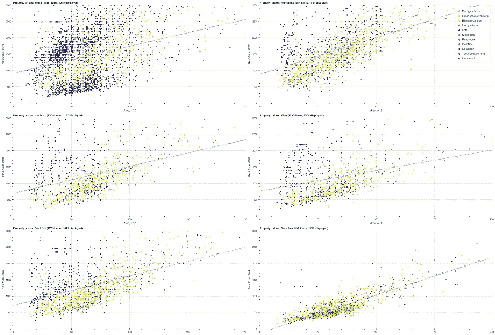

价格与面积的散点图，作者提供的图像

首先，我们可以通过视觉上比较市场上可用物业的数量。柏林（图表左上角）是一个大城市，也是一个受欢迎的地方；那里的市场最大，价格差异也最大。例如，50 平方米的公寓可以在不同的价格类别中找到，从 400 欧元预算到 3000 欧元以上的高档。在比较中，德累斯顿（图表右下角）的房地产便宜得多，几乎没有昂贵的房产。也许德累斯顿的租赁需求低得多，可能与薪资和可用工作的数量有关。其次，在柏林的数据中，两个独立的类别明显可见。我不清楚解释，或许这与城市历史上被划分为西部（BRD）和东部（DDR）有关。

## 价格和面积的直方图

我们还可以通过使用直方图以更紧凑的形式查看价格。制作直方图很简单；NumPy 的“histogram”方法可以完成所有计算：

```py
def get_figure_histogram_price(name: str, df_city: pd.DataFrame):
    price_limit = 10000
    prices = df_city['price_cold_eur'].dropna().values
    hist_e, edges_e = np.histogram(prices, density=False, bins=50, range=(0, price_limit))

    # Create figure
    palette = Viridis256[::3][0:len(hist_e)]  # Take every 3rd item from array
    p = figure(width=1400, height=500, 
               title=f"Property prices: {name} ({df_city.shape[0]} total)")
    p.quad(top=hist_e, bottom=0, left=edges_e[:-1], right=edges_e[1:], fill_color=palette)
    p.x_range.start = 0
    p.x_range.end = price_limit
    p.y_range.start = 0
    p.y_range.end = 360
    p.xaxis[0].ticker.desired_num_ticks = 20
    p.xaxis.axis_label = "Rent Price, EUR"
    p.yaxis.axis_label = "Amount"
    p.toolbar_location = None
    return p
```

我使用了相同的方法来绘制图表，将几个城市放在一起：

```py
p1 = get_figure_histogram_price("Berlin", df_berlin)
p2 = get_figure_histogram_price("München", df_munchen)
p3 = get_figure_histogram_price("Hamburg", df_hamburg)
p4 = get_figure_histogram_price("Köln", df_koeln)
p5 = get_figure_histogram_price("Frankfurt", df_frankfurt)
p6 = get_figure_histogram_price("Dresden", df_dresden)
show(column(row(p1, p2), 
            row(p3, p4), 
            row(p5, p6)))
```

结果显然与之前看到的散点图有关：

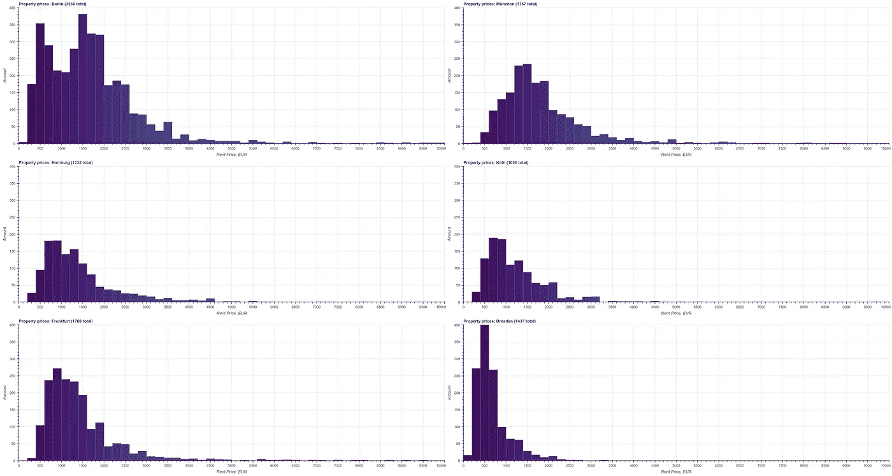

可用价格的直方图，作者提供的图片

慕尼黑似乎是最昂贵的地方，分布的峰值约为 1500 欧元，并且正如之前提到的，柏林有两个峰值看起来很有趣。分布右偏，至少对于像柏林或慕尼黑这样的大城市，我们可以看到一个长尾，其中一些物业的价格甚至高于 10000 欧元/平方米。

至于**平方米面积**，我只展示柏林的结果；其他城市总体上看起来是一样的：

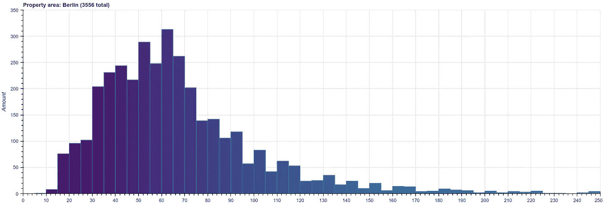

可用面积的直方图，作者提供的图片

大多数房屋和公寓的面积在 30 到 70 平方米之间，这看起来直观上是正确的，但正如我们所见，有些物业的面积甚至小于 10 平方米，有些则大于 250 平方米。

# 公用事业费用

接下来感兴趣的是公用事业费用是多少。如前所述，所有列出的公寓有两个价格：所谓的“暖”（包括供暖和电力等公用事业）和“冷”值。让我们计算差异并制作散点图：

```py
name = "Berlin"
df_city = df_berlin

df_area = df_city[['property_area', 'price_warm_eur', 'price_cold_eur', 'property_type']].copy()
df_area['property_type'] = df_area['property_type'].fillna('Unbekannt')

pr_types = df_area[['property_type']].groupby(['property_type'], as_index=False).size().sort_values(by=["size"], ascending=True)['property_type']

df_area['price_diff'] = df_area['price_warm_eur'] - df_area['price_cold_eur']
df_area = df_area[df_area['price_diff'] > 0] 
values_x = df_area['property_area'].astype('float').values
values_y = df_area['price_diff'].astype('float').values

p = figure(width=1200, height=500, title=f"Utilities cost: {name}")

source = ColumnDataSource(dict(property_area=values_x, 
                               price_diff=values_y, 
                               property_type=df_area["property_type"]))

palette = (Viridis10 + Plasma10)[:len(pr_types)]

# Draw scatter
p.scatter("property_area", "price_diff", source=source,
          fill_alpha=0.8, size=4,
          legend_group='property_type',
          color=factor_cmap('property_type', palette, pr_types))
# Draw approximation with a linear model
model = LinearRegression().fit(values_x.reshape(-1, 1), values_y)
p.line([0, 9999], model.predict([[0], [9999]]), line_width=2, line_dash="2 2", alpha=0.5, color='red')

p.xaxis.axis_label = 'Area, m²'
p.yaxis.axis_label = '"Warm" - "Cold" price, EUR'
p.x_range.start = 0
p.x_range.end = 200
p.y_range.start = 0
p.y_range.end = 800
p.toolbar_location = None
p.legend.visible = True
p.legend.background_fill_alpha = 0.9
show(p)
```

结果很有趣：

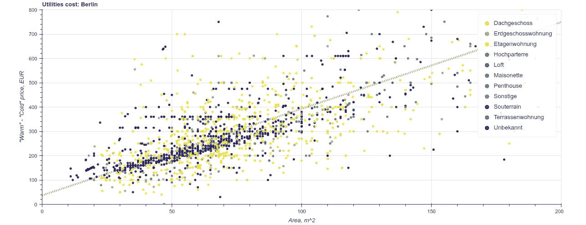

公用事业费用与平方米面积的散点图，作者提供的图片

显然，结果存在很大差异：不同的房屋可能有不同类型的供暖、绝缘等。但一般来说，50 平方米的物业每月的公用事业费用约为 200 欧元，面积翻倍也会成比例地翻倍，我们的例子中，100 平方米的房子或公寓每月费用为 400 欧元。至于物业类型，图表上的点分布得较为均匀，我没有看到成本与不同类型之间的任何视觉关联。

# 押金

押金是租赁合同中的一个重要部分，因为其价值可能相当大。在德国，法律规定的最高押金为 3 个“冷”价格；让我们看看实际情况如何。

首先，让我们看看我们拥有的数据：

```py
display(df_berlin[["title", "price_cold_eur", "deposit_eur"]])
```

结果如下：

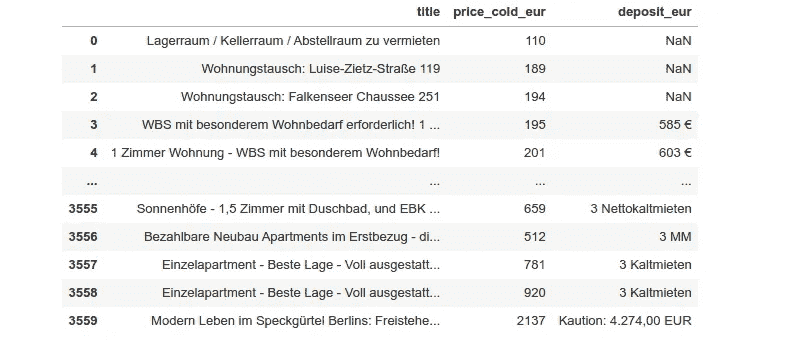

我们可以看到这些值是不同的——一些房主使用数字形式的金额，如“585 €”，而其他人则使用文字描述，如“3 Nettokaltmieten”或“3 MM”。显示唯一值很简单：

```py
print(df['deposit_eur'].unique().tolist())
```

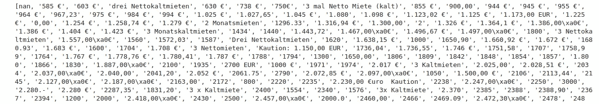

在输出中，我们可以看到文本描述，如“Drei Nettokaltmieten”，“Zwei Monatsmiete”等。为了解析这些值，我创建了 2 种将文本字符串转换为数值的方法。也许这个检查没有涵盖所有可能性，但在大多数情况下，它能完成工作：

```py
def value_from_str(price_str: str) -> Optional[float]:
    """ Convert string price like "7.935,60 EUR" to 7936 """
    try:
        # '4.800,00 EUR' => '4.800,00'
        if price_str.find(' ') > 0:
            price_str = price_str.split(" ")[0]
        s_filtered = ''.join(c for c in price_str if c in "0123456789,.")
        # "1000.0" => 1000.0
        if s_filtered.find(".") != -1 and s_filtered.find(",") == -1:
            return float(price_str)
        # 7.935,60 => 7935.60
        return float(s_filtered.replace(".", "").replace(",", "."))
    except ValueError as _:
        return None

def convert_price(s_deposit: str, cold_price: int) -> float:
    """ Convert text string and a price to a new value """
    try:
        if s_deposit is None:
            return None
        if isinstance(s_deposit, int) or isinstance(s_deposit, float):
            return s_deposit
        if '€' in s_deposit:
            # 585 € => 585
            return value_from_str(s_deposit)
        if 'zwei' in s_deposit.lower():
            return 2*cold_price
        if 'drei' in s_deposit.lower():
            return 3*cold_price
        if 'kalt' in s_deposit.lower() or 'km' in s_deposit.lower() or 'monat' in s_deposit.lower():
            # 2x Monatsnettokaltmieten => 2
            return cold_price*value_from_str(s_deposit)
        return value_from_str(s_deposit)
    except:
        return None
```

使用这些方法，我可以进行这样的转换：

```py
convert_price("3 Nettokaltmieten", 659)
convert_price("1.274,00 EUR", 659)
```

最后，我们可以在数据集中创建一个押金与价格比率的列：

```py
def get_deposit_ratio(s_deposit: str, cold_price: int) -> float:
    """ Calculate the ratio between deposit and price """
    try:
        deposit_price = convert_price(s_deposit, cold_price)
        if deposit_price is not None and cold_price != 0:
            return deposit_price/cold_price
    except:
        pass
    return None

df_berlin["deposit_price_ratio"] =  df_berlin.apply(lambda x: get_deposit_ratio(s_deposit=x['deposit_eur'], 
                                                                                cold_price=x['price_cold_eur']), 
                                                    axis=1)
```

使用这个新列，我们可以像以前一样轻松地制作直方图：

```py
def get_deposit_histogram(name: str, df_city: pd.DataFrame):
    """ Get Bokeh figure from a dataframe """
    prices = df_city['deposit_price_ratio'].dropna().values
    hist_e, edges_e = np.histogram(prices, density=False, bins=60, range=(0, 5))

    # Draw
    palette = Viridis256[::2][0:len(hist_e)]  # Take every 2nd item from array
    p = figure(width=1400, height=400, 
               title=f"Property area: {name} ({df_city.shape[0]} total)")
    p.quad(top=hist_e, bottom=0, left=edges_e[:-1], right=edges_e[1:], fill_color=palette)
    p.x_range.start = 0
    p.x_range.end = 5
    p.y_range.start = 0
    p.y_range.end = 400
    p.xaxis[0].ticker.desired_num_ticks = 20
    p.xaxis.axis_label = 'Deposit amount, relative to the "cold" price'
    p.yaxis.axis_label = 'Number of objects available'
    p.toolbar_location = None
    return p

p1 = get_deposit_histogram("Berlin", df_berlin)
p2 = get_deposit_histogram("München", df_munchen)
p3 = get_deposit_histogram("Hamburg", df_hamburg)
p4 = get_deposit_histogram("Köln", df_koeln)
p5 = get_deposit_histogram("Frankfurt", df_frankfurt)
p6 = get_deposit_histogram("Dresden", df_dresden)
show(column(row(p1, p2), row(p3, p4), row(p5, p6)))
```

结果很有趣：

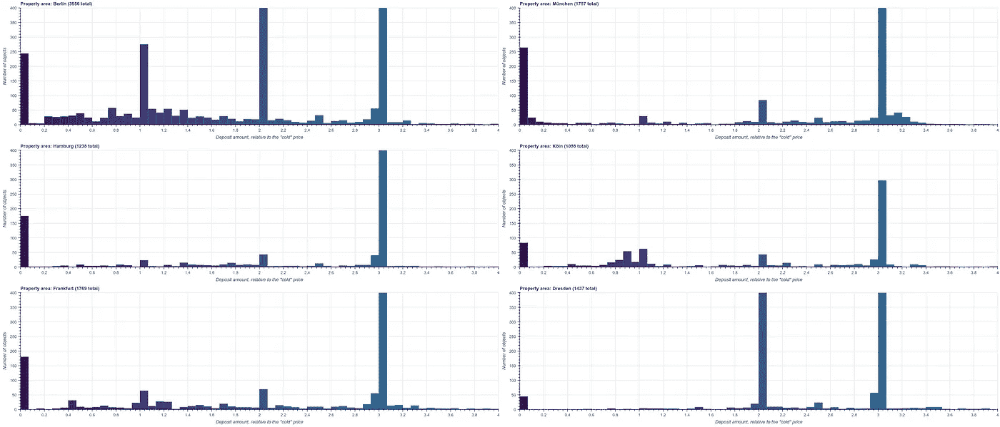

存款价值分布的直方图，作者提供的图片

许多房东要求最高可能的押金，这在德国[法律限制](https://www.mieterbund.de/mietrecht/mietrecht-a-z/stichworte-zum-mietrecht-m/mietkaution.html)为 3 个“冷”价格。尽管也可以找到要求 2 倍、1 倍甚至完全不需要押金的地方（德语中为“kautionsfrei”）。令人惊讶的是，有些房主要求的押金高于 3 倍的值。有时，当这个值为 3.05 时，可以通过计算错误来解释，但如果押金值约为 5 倍，那肯定不是这种情况。

# 物业发布者

一些房主喜欢自己出租他们的房产；其他人则与中介合作。这些金额有多大？让我们用**饼图**来展示分布。

```py
def get_figure_publisher(name: str, df_city: pd.DataFrame) -> figure:
    publishers = df_city[['publisher']].groupby(['publisher'], as_index=False).size().sort_values(by=["size"], ascending=False)
    publishers = publishers[publishers['size'] > 5]

    # Put private first
    data_private = publishers[(publishers['publisher'] == "Private")]
    data_non_private = publishers[(publishers['publisher'] != "Private")]
    data = pd.concat([data_private, data_non_private])

    palette = RdGy3[:1] + Viridis11 + BrBG11 + Plasma11 + Cividis11 + RdYlBu11 + RdGy11 + PiYG11

    data['angle'] = data['size']/data['size'].sum()*2*np.pi
    data['percentage'] = data['size'] / data['size'].sum() * 100
    data['color'] = palette[:data.shape[0]]

    p = figure(width=1100, height=750, title=f"Property publishers: {name}", toolbar_location=None, x_range=(-0.5, 1.0))
    pie_chart = p.wedge(x=0, y=1, radius=0.4,
            start_angle=cumsum('angle', include_zero=True), end_angle=cumsum('angle'),
            line_color="white", 
            fill_color='color', 
            legend_field='publisher', 
            source=data)

    p.axis.axis_label = None
    p.axis.visible = False
    p.grid.grid_line_color = None
    return p
```

在这段代码中，我按发布者对数据框进行了分组，并按大小排序。唯一的技巧是将“私人”组放在首位，为了清晰起见，我还将该组标记为不同颜色。

2 个城市的结果，柏林和慕尼黑，看起来像这样：

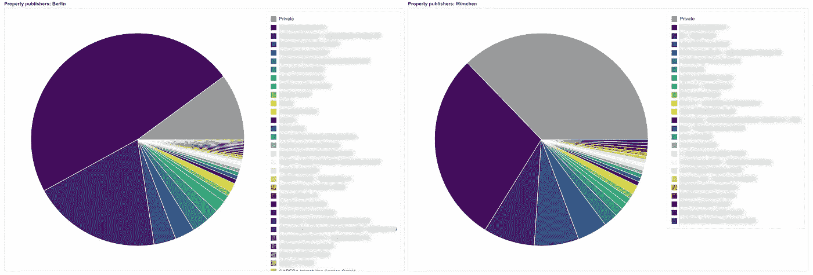

显示每个发布者的房地产对象数量的饼图，作者提供的图片

有趣的是，只有 8.5%的柏林房地产由私人个人挂牌；在慕尼黑，这个比例是 27%。另一个有趣的点是，超过 50%的房产是由少数几家中介发布的。

# 楼层数量

正如我们之前看到的，公寓的位置，如底层或屋顶下的楼层，通常不会影响租金价格。但了解德国大多数建筑物的楼层数仍然很有趣。

最初，我没有预期到这个任务会有任何困难，但挑战在于进行自定义排序。许多公寓或房屋没有指定楼层号码，我想把“未知”值放在最左边。这可以通过在 Pandas 中实现自定义排序键来完成。这里的难点是，当进行 DataFrame 排序时，*custom_key* 是由 Pandas 应用于“pd.Series”对象而不是单个值。因此，我们需要第二种方法来更新系列中的值：

```py
def to_digit(v):
    """ Convertion for string or digit """
    if v.isdigit():
        return f"{int(v):02d}" # "1" => "001"     
    return ' ' + str(v)

def custom_key(v):
    """ Custom key for the dataframe sort """
    # v: pd.Series, convert items for proper sort
    # ["1", "10", "2", "U"] => [" U", "001", "002", "010"]
    return v.apply(to_digit)

def get_figure_floors(city_name: str, df_city: pd.DataFrame) -> figure:
    """ Get Bokeh figure """
    floors = df_city[['floor']].astype(str).mask(df_city.isnull(), None).fillna("?").groupby(['floor'], as_index=False).size()
    floors = floors.sort_values(by=["floor"], key=lambda x: custom_key(x), ascending=True)

    # Draw
    palette = Viridis11 + Plasma11 + Cividis11
    values = floors['floor']
    amount = floors['size']
    p = figure(x_range=FactorRange(factors=values), width=1200, height=400, title=f"{city_name}: apartments floor")
    p.vbar(x=values, top=amount, width=0.8, color=palette[:len(values)])
    p.xaxis.axis_label = 'Floor №'
    p.yaxis.axis_label = "Amount"
    p.toolbar_location = None
    return p

p1 = get_figure_floors("Berlin", df_berlin)
p2 = get_figure_floors("München", df_munchen)
show(row(p1, p2))
```

前两个城市，柏林和慕尼黑的结果如下：

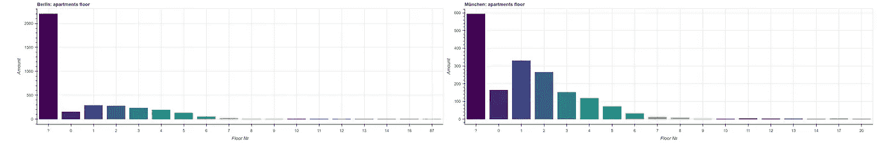

楼层分布直方图，作者提供的图片

正如我们所看到的，这两个城市的大多数公寓位于 1 到 5 层。但也有几套公寓位于 10 到 20 层，还有一套柏林的公寓位于 87 层（虽然我没有检查是否是打印错误，或该建筑是否真的存在）。

# 地理可视化

构建直方图或多或少是直接的；让我们进入有趣的部分：在地理地图上显示房产对象。在这里，我们面临两个挑战。首先，我们需要获取坐标，其次，我们需要绘制地图。

## 地理编码

让我们再检查一下数据：数据框中有“region”和“address”字段，我们可以用来进行地理编码请求：

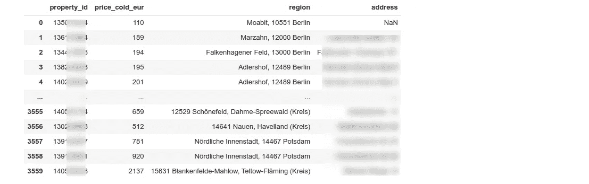

获取坐标时，我将使用一个[GeoPy](https://geopy.readthedocs.io/en/stable/)库；它是免费的，不需要任何 API 密钥（例如 Google Maps API）：

```py
from geopy.geocoders import Nominatim
from functools import lru_cache

geolocator = Nominatim(user_agent="Python3.9")

@lru_cache(maxsize=None)
def get_coord_lat_lon(full_addr: str):
    """ Get coordinates for address """
    # Remove brackets: "Mitte (Ortsteil), 10117" => "Mitte, 10117"
    p1, p2 = full_addr.find('('), full_addr.find(')')
    if p1 != -1 and p2 != -1 and p2 > p1:
        full_addr = full_addr[:p1].strip() + full_addr[p2 + 1:]  
    # Make request
    pt = geolocator.geocode(full_addr)
    return (pt.latitude, pt.longitude) if pt else (None, None)
```

代码很简单；唯一的挑战是在地址中去掉“（”和“）”括号；结果发现，库在处理像“Nauen, Havelland (Kreis)”这样的地址时没有返回任何数据。我还使用了“lru_cache”以避免对相同地址进行多次请求（有些中介在同一栋楼里有几套待租公寓）。

使用这种方法，我可以轻松请求位置：

```py
df_city = df_berli
df_addrs = df_city[["address", "region", "price_cold_eur"]].dropna().copy()
# Combine the address from 2 fields
df_addrs["address_full"] = df_addrs[["address", "region"]].apply(lambda x: x[0] + ", " + x[1], axis=1)

points = []
for index, row in df_addrs.iterrows():
    addr, price = row['address_full'], row['price_cold_eur']
    lat, lon = get_coord_lat_lon(addr)
    if (index % 50) == 0:
        print(f"{index} of {df_addrs.shape[0]}: {addr}, {price}, {lat}, {lon}")
    if lat and lon:
        points.append((addr, price, lat, lon)) 

print(f"Points added: {len(points)}")
return points
```

## 地图

为了绘制地图，我将使用一个免费的[Folium](https://python-visualization.github.io/folium/)库。作为使用该库的简单示例，可以通过几行代码显示带标记的地图：

```py
import folium
from folium.plugins import HeatMap
from branca.element import Figure

fig = Figure(width=1200, height=1000)
m = folium.Map(location=(50.59, 10.38), tiles="openstreetmap", zoom_start=7)

folium.Marker(location=(52.59, 13.37), popup="Berlin").add_to(m)

fig.add_child(m)
display(fig)
```

这段代码将生成一个美观的互动地图，无需 API 密钥：

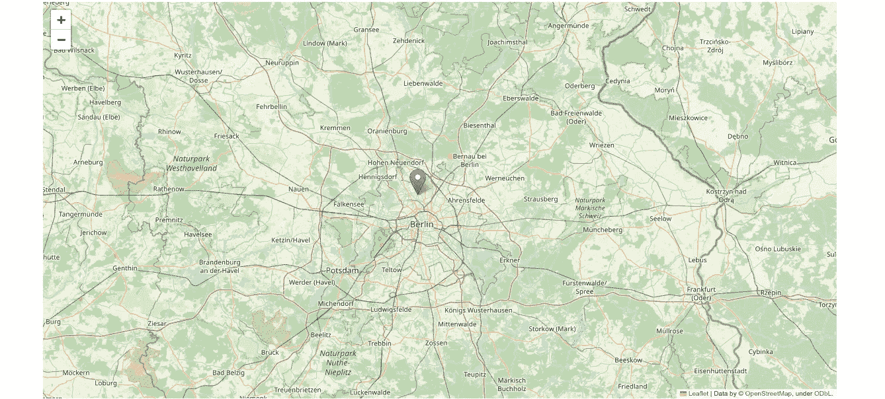

Folium 地图和标记示例，作者提供的图片

但我们的可视化会复杂一些。我将使用 Folium 的“Circle”对象来表示每个房产，并使用“FeatureGroup”来对不同价格进行分组：

```py
import folium
from folium.plugins import HeatMap
from branca.element import Figure
import matplotlib
import matplotlib.cm as colormap

def value_to_color(value: int) -> str:
    """ Convert price value to the HTML color """
    if value >= 5000:
        # Mark high values in special colors
        return "#FF00FF"

    norm = matplotlib.colors.Normalize(vmin=0, vmax=3000, clip=True)
    mapper = colormap.ScalarMappable(norm=norm, cmap=colormap.inferno)
    r, g, b, _ = mapper.to_rgba(value, alpha=None, bytes=True)
    return "#" + f"{(r << 16) + (g << 8) + b:#08x}"[2:]

def add_to_map(fmap, lat, lon, price):
    """ Add point to map """
    color_str = value_to_color(price)
    folium.Circle(
        location=[lat, lon],
        radius=100,
        popup=addr + ": " + str(price),
        color=color_str,
        fill=True,
        fill_color=color_str
    ).add_to(fmap)

def get_html_text_label(text: str, value1: int, value2: int=999999):
    """ Prepare HTML label with a gradient text """
    color1 = value_to_color(value1)
    color2 = value_to_color(value2-1)
    return f'<span style="background: linear-gradient(to right, {color1}, {color2}); padding-left: 2%; padding-top: 3%; padding-bottom: 1%;">&nbsp;&nbsp;&nbsp;&nbsp;</span><span>&nbsp;{text}</span>'

def generate_map(points: list, location: Tuple, name: str):
    """ Draw a city map """
    fig = Figure(width=1200, height=600)
    m = folium.Map(location=location, zoom_start=12)

    heat_map = folium.FeatureGroup(name='Heat Map')
    price_less_500 = folium.FeatureGroup(name=get_html_text_label('< 500', 0, 500))
    price_less_1000 = folium.FeatureGroup(name=get_html_text_label('500..1000', 500, 1000))
    price_less_2000 = folium.FeatureGroup(name=get_html_text_label('1000..2000', 1000, 2000))
    price_less_5000 = folium.FeatureGroup(name=get_html_text_label('2000..5000', 2000, 5000))
    price_more_5000 = folium.FeatureGroup(name=get_html_text_label('> 5000', 5000))

    heat_data = []
    for addr, price, lat, lon in points:
        if price < 500:
            add_to_map(price_less_500, lat, lon, price)
        elif price <= 1000:
            add_to_map(price_less_1000, lat, lon, price)
        elif price <= 2000:
            add_to_map(price_less_2000, lat, lon, price)
        elif price <= 5000:
            add_to_map(price_less_5000, lat, lon, price)
        else:
            add_to_map(price_more_5000, lat, lon, price)
        heat_data.append((lat, lon))

    heat_map.add_child(HeatMap(heat_data, min_opacity=0.3, blur=50))
    m.add_child(heat_map)
    m.add_child(price_less_500)
    m.add_child(price_less_1000)
    m.add_child(price_less_2000)
    m.add_child(price_less_5000)
    m.add_child(price_more_5000)

    folium.map.LayerControl('topright', collapsed=False, style=("background-color: grey; color: white;")).add_to(m)

    fig.add_child(m)
    return fig
```

我还使用了热图作为背景，以使结果看起来更好。可视化还需要调整颜色和 CSS 样式以显示渐变；最终结果如下：

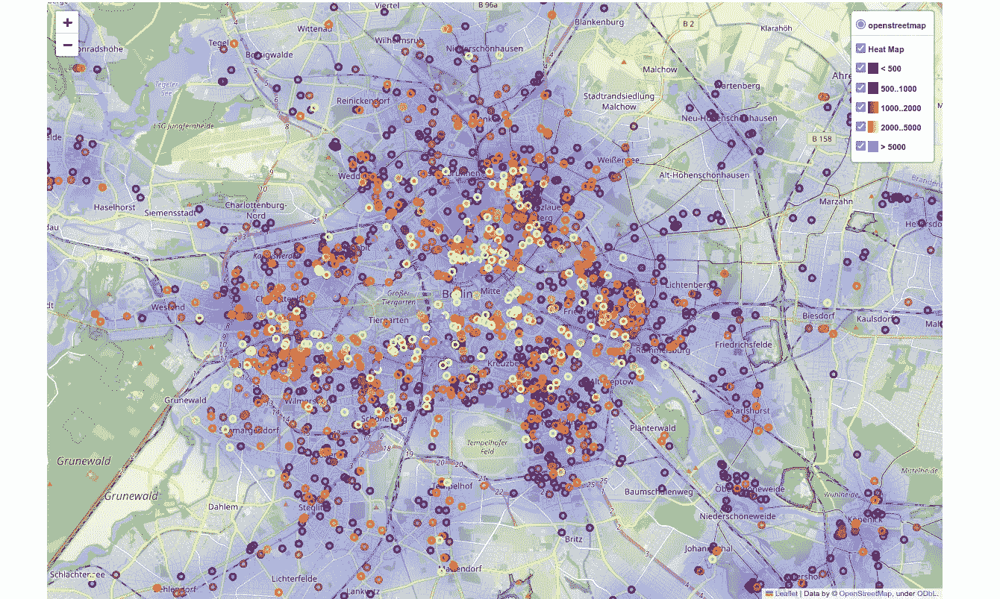

柏林的房产对象，图片由作者提供

结果或多或少是直观的。在柏林，中心周围的区域更贵，但没有特别的“高档”地方。例如，价格高于€5,000/m 的房产大致上是均匀分布的：

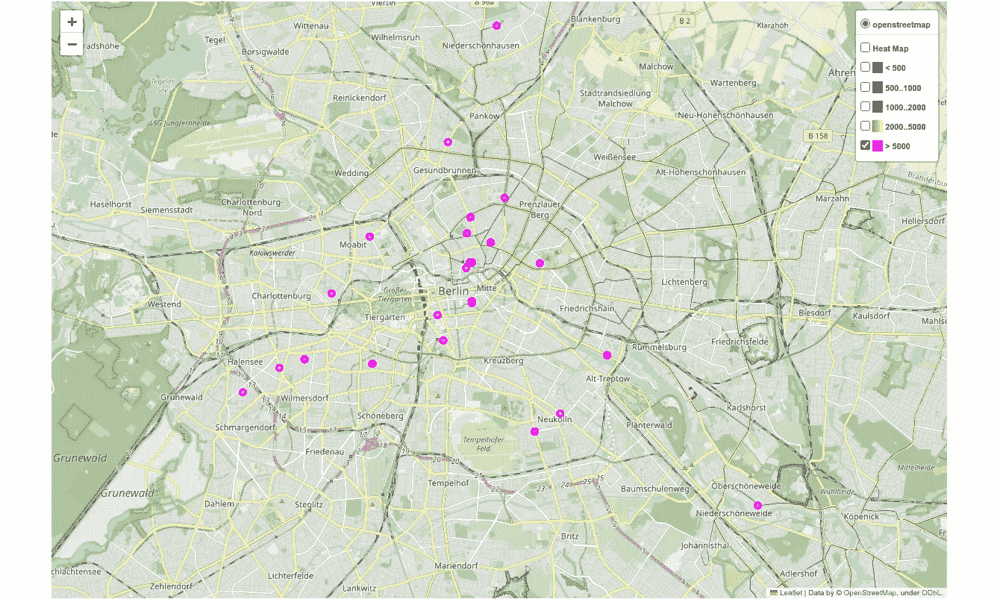

柏林价格≥€5,000/m 的房产，图片由作者提供

# 租金动态

这个问题有点挑战性。租赁过程的速度如何？房产对象可租赁的时间是多长？这个问题具有挑战性，因为网站上没有房产的发布日期。但我们可以通过比较不同日期获得的结果间接估计这些数据。

这个想法很简单。每个房产都有一个唯一的 ID。我保存了同一城市的数据两次，间隔 7 天。然后我显示了两个价格直方图：一个是所有房产的，另一个是那些在 7 天内被移除的房产（存在于第一个数据框中但在第二个数据框中不存在）：

```py
def get_two_histograms(name: str, df_all: pd.DataFrame, df_closed: pd.DataFrame):
    """ Draw two dataframe histograms on the same graph """
    price_limit = 10000
    prices = df_all['price_cold_eur'].values
    hist_e1, edges_e1 = np.histogram(prices, density=False, bins=40, range=(0, price_limit))
    prices = df_closed[(df_closed['price_cold_eur'] < price_limit)]['price_cold_eur'].values
    hist_e2, _ = np.histogram(prices, density=False, bins=edges_e1)

    # Draw
    palette1 = Viridis256[::3][0:len(hist_e1)]  # Take every 3rd item from array
    p = figure(width=1400, height=500, 
               title=f"Property prices: {name} ({df_city.shape[0]} total)")
    p.quad(top=hist_e1, bottom=0, left=edges_e1[:-1], right=edges_e1[1:], fill_color=palette1, fill_alpha=0.8, legend_label='All properties')
    p.quad(top=hist_e2, bottom=0, left=edges_e1[:-1]+20, right=edges_e1[1:]-20, fill_color=palette1, legend_label='Properties removed from listing within 7 days')
    # Add percentage labels
    for i in range(hist_e1.shape[0]):
        pos_x = (edges_e1[i] + edges_e1[i + 1])/2
        pos_y = hist_e1[i]
        value = 100*hist_e2[i]/hist_e1[i] if hist_e1[i] != 0 else 0        
        value_str = f'{value:.1f}%' if value > 0.5 else "0%"
        p.add_layout(Label(x=pos_x, y=pos_y + 2, text_align="center",
                 text=value_str, text_font_size='7pt',
                 background_fill_color='white', background_fill_alpha=0.0))

    p.x_range.start = 0
    p.x_range.end = price_limit
    p.y_range.start = 0
    p.y_range.end = 480
    p.xaxis[0].ticker.desired_num_ticks = 20
    p.left[0].formatter.use_scientific = False
    p.below[0].formatter.use_scientific = False
    p.xaxis.axis_label = "Rent Price, EUR"
    p.yaxis.axis_label = "Amount"
    return p

df_berlin0 = pd.read_csv("Berlin_00.csv", sep=';', na_values=["None"]).drop_duplicates(subset='property_id', keep="first")
ids0 = df_berlin0["property_id"].unique().tolist()
df_berlin6 = pd.read_csv("Berlin_06.csv", sep=';', na_values=["None"]).drop_duplicates(subset='property_id', keep="first")
ids6 = df_berlin6["property_id"].unique().tolist()

df_f = df_berlin0.copy()
df_f["deal_closed"] = df_f['property_id'].apply(lambda pr_id: pr_id in ids0 and pr_id not in ids6)
df_f_closed = df_f[df_f['deal_closed'] == True]

p1 = get_two_histograms("Berlin", df_berlin0, df_f_closed)
show(p1)
```

我还在条形图上添加了百分比标签，使条形图更易读。结果如下：

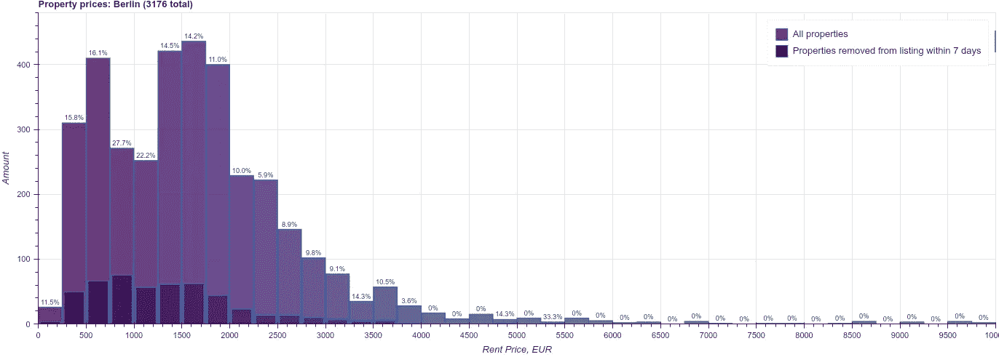

从列表中移除的房产直方图，图片由作者提供

显然，这个结果在统计上并不显著，因为实验仅进行了一次。至少，我可以说在进行这个测试时，柏林约 20%的€800–1,200 范围内的房产在一周内被从列表中移除。更贵的房产显然留存时间更长；在同一时期内，只有约 9%的€3,000 价格范围内的房产被移除。

# 异常检测

接下来的步骤，让我们来点乐趣，尝试找出“异常”情况，即一些不寻常和非标准的情况。为此，我将使用**Isolation Forest**算法，该算法在[Scikit-Learn](https://scikit-learn.org/stable/modules/generated/sklearn.ensemble.IsolationForest.html) Python 库中实现。为了寻找异常，我将使用 3 个特征：面积、价格和房间数量：

```py
from sklearn.ensemble import IsolationForest

df_city = df_berlin[["region", "address", "price_cold_eur", "num_rooms", "property_area"]].dropna().copy().reset_index(drop=True)
anomaly_inputs = ["price_cold_eur", "num_rooms", "property_area"]
for field in anomaly_inputs:
    df_city[field] = df_city[field].astype(float)

display(df_city[anomaly_inputs])

model_if = IsolationForest(contamination=0.01)
model_if.fit(df_city[anomaly_inputs])

# anomaly_scores: generated by calling model_IF.predict() and is used to identify if a point is an outlier (-1) or an inlier (1)
df_city['anomaly_scores'] = model_if.decision_function(df_city[anomaly_inputs])
# anomaly : generated by calling model_IF.predict() and is used to identify if a point is an outlier (-1) or an inlier (1)
df_city['anomaly'] = model_if.predict(df_city[anomaly_inputs])
```

正如我们在代码中看到的，算法只需要一个参数，即所谓的“污染”，它决定了数据集中异常值的比例。在这里我将其设置为 1%；显然，参数可以根据需要进行调整。

调用“fit”方法后，我们可以得到结果。“decision_function”方法返回异常分数，“predict”方法返回+1（如果特定对象被视为正常点）或-1（如果是异常点）。让我们只显示异常点：

```py
display(df_city[df_city['anomaly'] == -1])
```

结果如下所示：

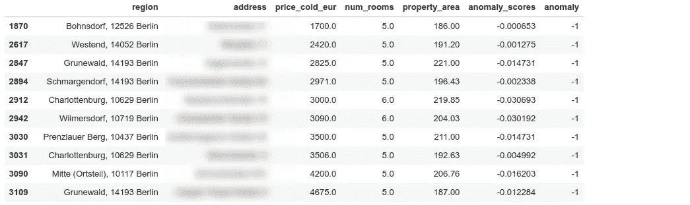

对于这些属性，有些参数不寻常，通过观察结果，我可以猜测房间数量、面积或价格较大。但是，“隔离森林”方法的一个优点是其可解释性。一个[SHAP](https://shap.readthedocs.io/en/latest/generated/shap.Explainer.html) Python 包允许使用**Shapley 值**以图形化的方式解释结果：

```py
import shap
shap.initjs()

explainer = shap.Explainer(model_if.predict, df_city[anomaly_inputs])
shap_values = explainer(df_city[anomaly_inputs])
```

分析本身大约需要一分钟。之后，我们可以得到列表中每一项的结果。例如，让我们检查编号为 3030 的房产：

```py
shap.plots.waterfall(shap_values[3030])
```

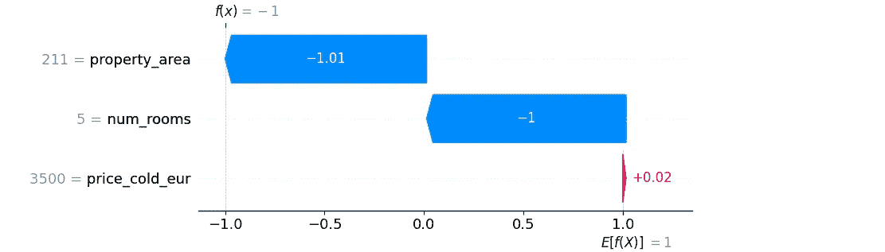

Shapley 解释器结果，图像由作者提供

我们可以看到，价格是合适的，但 211 平方米的房产面积和 5 间房的数量被算法视为不寻常。

还可以通过显示散点图来查看算法的工作情况。例如，让我们看看“房间数量”和“价格”如何影响 Shapley 值：

```py
display(shap.plots.scatter(shap_values[:,'num_rooms'], color=shap_values[:,"price_cold_eur"]))
```

结果如下所示：

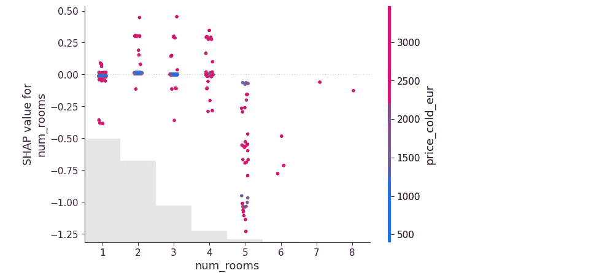

SHAP 值的散点图，图像由作者提供

在这里，我们可以看到房间数量超过 4 的情况对得分的影响最大。

# 词云

我不会将最后一步视为真正的分析，但为了趣味，我们来构建词云，看看在房地产标题中哪些词最为流行。通过 Python [WordCloud](https://amueller.github.io/word_cloud/) 库，我们只需几行代码即可做到这一点：

```py
from wordcloud import WordCloud
import matplotlib.pyplot as plt

from nltk.corpus import stopwords
stop_words_de = stopwords.words('german')

# Generate
text = ""
for s in df.title:
    s_out = s.replace('/', ' ').replace(':', ' ').replace(',', ' ').replace('!', ' ').replace('-', ' ')
    text += s_out + " "

wordcloud = WordCloud(width=1600, height=1200, stopwords=set(stopwords_de), collocations=False, background_color="white").generate(text)

# Show
plt.figure(figsize=(16, 12), dpi=100)
plt.imshow(wordcloud, interpolation='bilinear')
plt.axis("off")
plt.show()
```

结果如下所示：

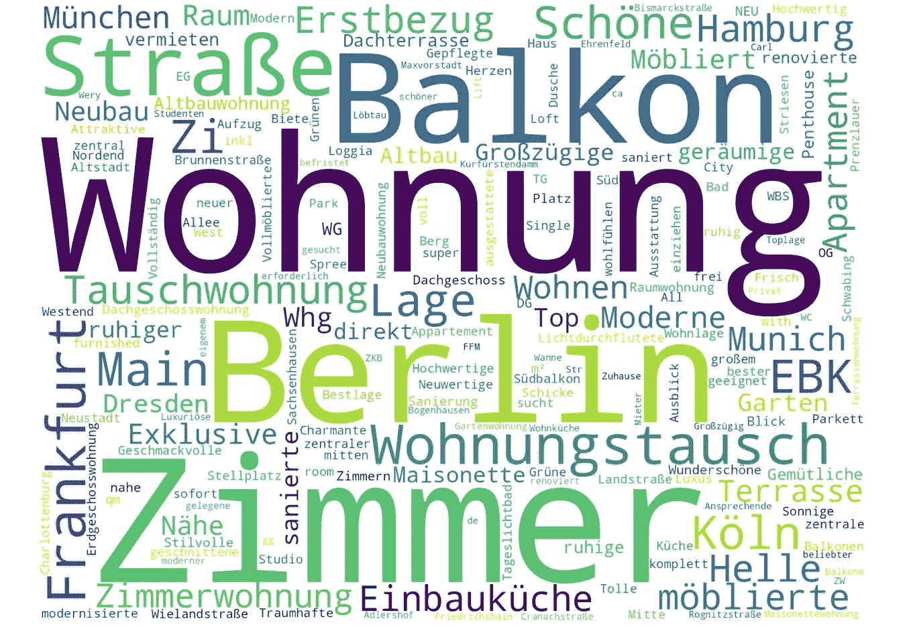

房地产对象标题的词云，图像由作者提供

词如“wohnung”（公寓）、“zimmer”（房间）和“balkon”（阳台）最为流行，我们还可以看到“helle”（明亮）、“moderne”（现代）、“schöne”（美丽）等词。

# 结论

正如英国国家统计局前研究员艾伦·史密斯在 2017 年的[TED 演讲](https://www.youtube.com/watch?v=ogeGJS0GEF4)中所说，我们应该热爱统计学，因为它是*关于我们的科学*。探索数据集，如这个租房数据，并发现有趣的模式确实很有趣。我希望这对读者也很有趣，不仅作为使用 Pandas 或 Bokeh 的例子，而且作为对另一个国家的生活和文化的一个小见解。显然，我没有测试所有的数据；例如，了解多少房东允许租户在公寓里养宠物可能会很有趣。读者可以自行测试；本文中的代码片段应该足够了。

如果你喜欢这个故事，欢迎[订阅](https://medium.com/@dmitryelj/membership)Medium，你将会收到我新文章发布的通知，并且可以全面访问其他作者的数千篇故事。

感谢阅读。
