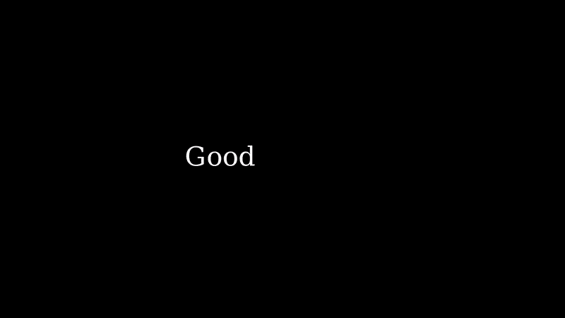
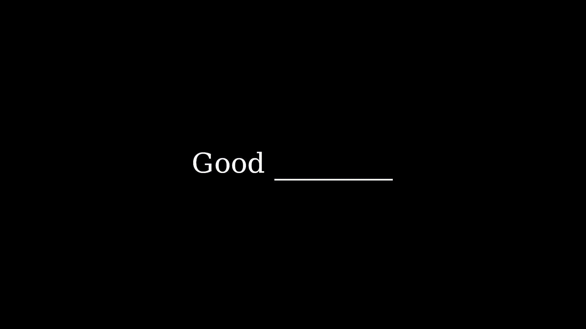
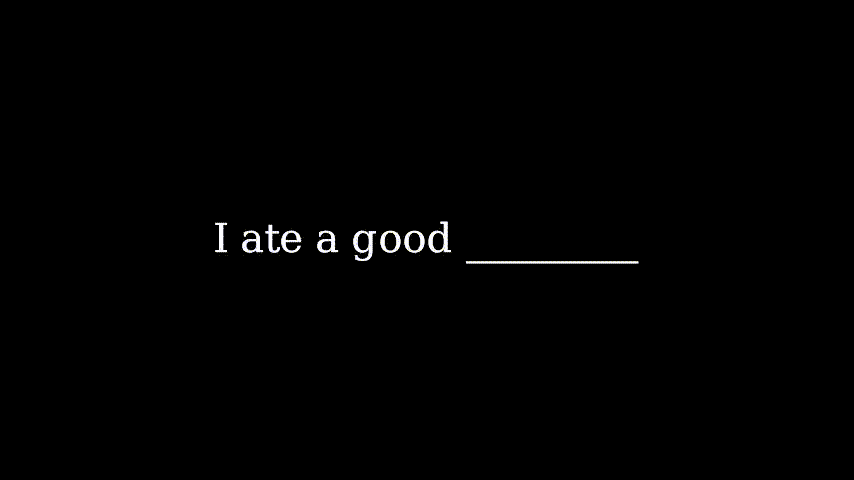
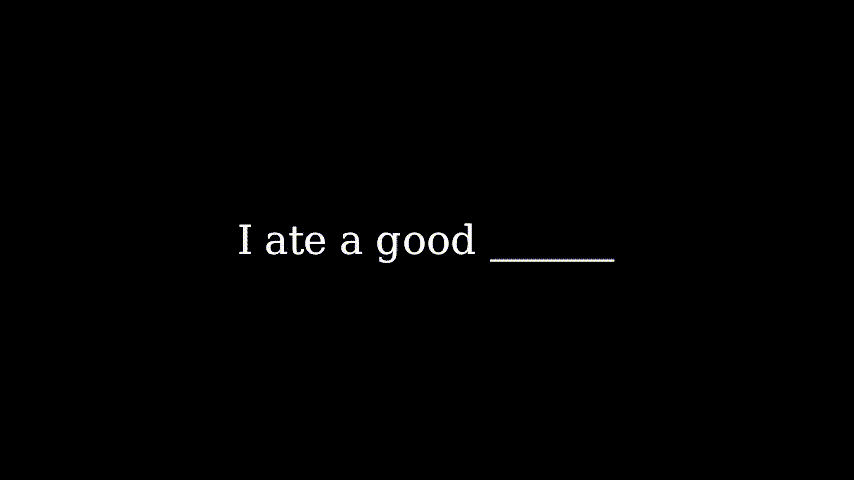
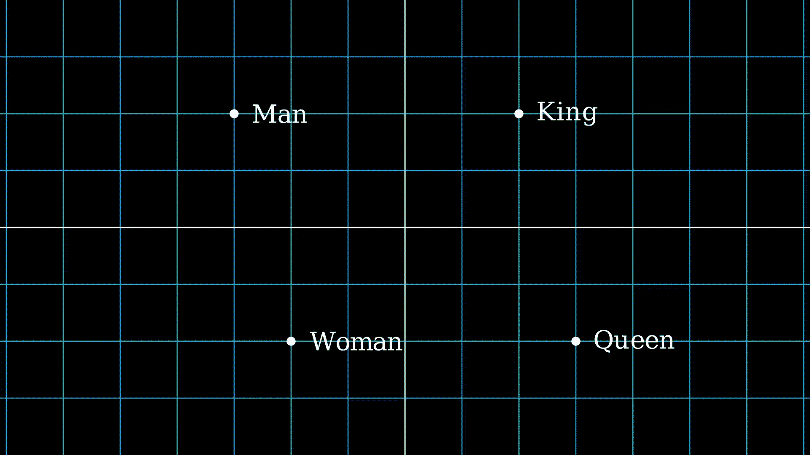
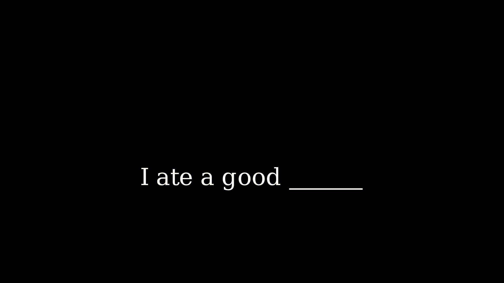

# 如何用 25,000 台计算机训练 ChatGPT

> 原文：[`towardsdatascience.com/how-25-000-computers-trained-chatgpt-11104686a24d`](https://towardsdatascience.com/how-25-000-computers-trained-chatgpt-11104686a24d)

照片由 [Volodymyr Hryshchenko](https://unsplash.com/@lunarts?utm_source=medium&utm_medium=referral) 提供，来源于 [Unsplash](https://unsplash.com/?utm_source=medium&utm_medium=referral)

## ChatGPT 背后的突破

 [Jerry Qu](https://medium.com/@JerryQu?source=post_page-----11104686a24d--------------------------------)

·发表于 [Towards Data Science](https://towardsdatascience.com/?source=post_page-----11104686a24d--------------------------------) ·阅读时间 5 分钟·2023 年 8 月 29 日

--

作者提供的图片

## “Good” 之后是什么词？

你可能会想到**早上好**，或者**再见**。但你绝对不会说 ***声音很大***。这没有意义。几十年来，计算机科学家们一直在训练 AI 解决这个确切的问题。

作者提供的图片

给定一个词，我们的 AI 预测下一个词。这样做几次，你就生成了一句完整的句子。

## 这就是 ChatGPT 的工作原理。

经过整个互联网的训练，ChatGPT 学会了像人类一样聊天。然而，这一巨大的成就只有在 2010 年代末期的突破之后才得以实现。这一突破支撑了 ChatGPT，并永远改变了我们生活的世界。

这是一个 AI 从整个互联网的每本书、每条推文、每个网站中阅读并学习的故事。以及它是如何实现的。

## 句子很长。

当我们超越单个词时，下一个词的预测就变得困难得多。看这个例子。

作者提供的图片

在这种情况下，说**我吃了一个好的 *早晨***是没有意义的。但是我们的 AI 只关注“good”，并且输出“morning”。即使是人类也需要许多词来预测下一个词。因此，AI 也需要这些额外的信息。

我们的 AI 需要阅读许多词来预测下一个词。ChatGPT 一次可以读取超过 [8**,000 个先前的词**](https://platform.openai.com/docs/models/gpt-4)。自然的做法是逐个将每个词输入 AI。

作者提供的图片

这就是过去 AI 的工作方式。**递归神经网络（RNN）**一次处理一个词，在读取句子时存储信息。

这个 AI 的一个问题是它**极其缓慢**。每个词都必须等待前一个词处理完成，这在大规模时是个问题。想象一下，如果你的洗衣机一次只能洗一件衬衫，这种**顺序**处理将需要几天时间。但每个人都知道我们可以同时放入所有衬衫，几分钟就能完成。这就是**并行**的概念。通过并行执行工作而不是顺序执行，我们可以显著加速洗衣机、计算机和 AI。

RNN 只能在数百万个词上进行训练，远远不及互联网上的万亿词汇。我们需要一种更快、更高效的句子阅读方法。

## Transformer 是解决方案。

2017 年，一篇题为[Attention Is All You Need](https://arxiv.org/pdf/1706.03762.pdf)的论文被发表。这篇论文有效地改变了句子的处理方式。这些研究人员发明了一种可以一次读取整句的 AI。

图片由作者提供

这种新的 AI 被称为**Transformer**，它的高效性使得它能够从互联网上的每本书和每个网站中学习。要理解它是如何做到这一点的，我们需要退一步了解计算机如何读取文本。

## AI 如何*读取*文本？

计算机以 1 和 0 的形式工作。这些 1 和 0 被称为二进制，它们组成了数字。计算机科学家需要一种将词语表示为数字的方法。这在 2013 年得以实现，当时 Google 的科学家们创建了[word2vec](https://arxiv.org/pdf/1301.3781.pdf)。

词语包含语义意义。狗与猫相关。国王与王后相关。Word2vec 能够在向量或数字列表中表示这些语义。

使用 word2vec，你可以取“King”，减去“Man”，加上“Woman”，然后得到“Queen”这个词。

图片由作者提供

这个数字向量称为**词嵌入**。它们将词语的意义嵌入到这个向量中。在训练 AI 处理文本时，我们实际上是将这些词嵌入输入给 AI。AI 进行一些数学运算，变换这些向量，并生成下一个词。变换这些向量是非常耗时的。

图片由作者提供

## Transformer 完成了这一切的并行处理。

不再等待前一个词处理完成，我们同时变换所有这些词嵌入，进行平均以将它们汇总。这将顺序操作的数量从句子的长度减少到一个常数。

图片由作者提供

Lambda Labs[估计](https://lambdalabs.com/blog/demystifying-gpt-3)训练 ChatGPT 在单个 GPU 上需要**355 年**。但通过利用其并行性，ChatGPT 在**25,000 个 GPU**上训练，且仅用了**几天**时间。

## Transformer 引发了人工智能领域的范式转变。

随着并行性的增加，越来越大的 AI 可以被训练。尽管过去最大的序列模型是基于数百万字进行训练的，但 ChatGPT 是在接近 **一万亿** 字的数据上训练的。

图片来自作者，数据来源于原始论文。

ChatGPT 在 CommonCrawl 上进行了训练，这是自 2008 年以来的整个互联网的集合。使用 **超过 25,000 台计算机**，该模型阅读并学习了整个互联网的每个网站。想象一下阅读每本书、每条推文和每段代码。

今天，ChatGPT 正在被用来编写代码，[生成电视广告](https://openai.com/customer-stories/waymark)，并帮助你完成几乎可以想象的任何事情！通过将句子转向侧面，我们开创了 AI 的新时代，这一时代突破了曾经认为可能的界限。

## 但我们可能已经达到了极限。

在 GPT-4 发布后，OpenAI 的 CEO Sam Altman 说，

> “我认为我们正处于这些巨大模型时代的尽头……”

在从整个互联网学习之后，接下来会是什么？ChatGPT 的影响正在渗透到每个行业。但像任何突破一样，进展会趋于平稳。AI 的下一个拐点，只有时间才能告诉我们。

图片来自作者，数据来源于原始论文。

**如果你喜欢这篇文章：**

+   关注我的 Medium， [LinkedIn](https://www.linkedin.com/in/jerry-qu/)，和 [Twitter](https://twitter.com/JerryQu2) 以获取我的最新进展。
