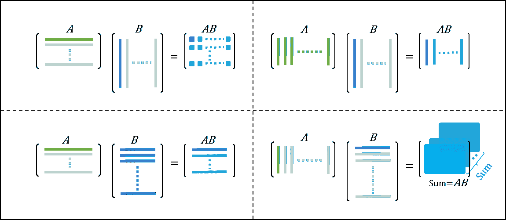

# 一位优秀的数据科学家如何看待矩阵乘法

> 原文：[`towardsdatascience.com/how-a-good-data-scientist-looks-at-matrix-multiplication-33a3128cd1bb?source=collection_archive---------7-----------------------#2023-02-23`](https://towardsdatascience.com/how-a-good-data-scientist-looks-at-matrix-multiplication-33a3128cd1bb?source=collection_archive---------7-----------------------#2023-02-23)

## 四种不同的看法

 [Sekhar M](https://sekharm.medium.com/?source=post_page-----33a3128cd1bb--------------------------------)

·

[关注](https://medium.com/m/signin?actionUrl=https%3A%2F%2Fmedium.com%2F_%2Fsubscribe%2Fuser%2F549f236a126b&operation=register&redirect=https%3A%2F%2Ftowardsdatascience.com%2Fhow-a-good-data-scientist-looks-at-matrix-multiplication-33a3128cd1bb&user=Sekhar+M&userId=549f236a126b&source=post_page-549f236a126b----33a3128cd1bb---------------------post_header-----------) 发表在 [Towards Data Science](https://towardsdatascience.com/?source=post_page-----33a3128cd1bb--------------------------------) · 5 分钟阅读 · 2023 年 2 月 23 日

--

图片由作者提供

# 引言：

数据科学是利用科学计算方法、过程和算法从结构化或非结构化数据中提取知识和见解的领域。

数据——无论是结构化的（如数据表）还是非结构化的（如图像）——都被表示为矩阵。

数据在计算过程中的处理，比如机器学习模型，主要涉及矩阵乘法。

因此，对矩阵乘法操作的深入了解对从事数据科学和机器学习领域的人大有裨益。

两个矩阵的乘法可以从 4 种不同的角度来理解：

1.  行与列的点积

1.  列的线性组合

1.  行的线性组合

1.  秩-1 矩阵的和

设 *A* 和 *B* 为相乘的矩阵，即 *AB*。设 *A* 和 *B* 的维度分别为 `*m*x*p*` 和 `*p*x*n*`。我们知道，要能够相乘 A 和 B，A 的列数应与 *B* 的行数匹配。
