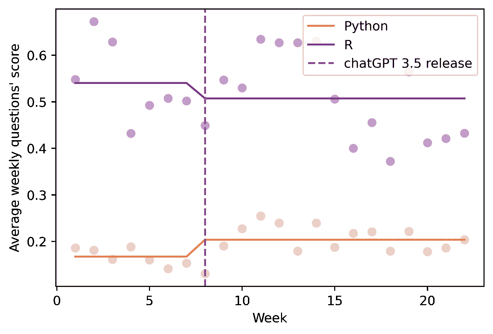

# 人工智能如何改变我们的编码方式

> 原文：[`towardsdatascience.com/how-ai-is-changing-the-way-we-code-36ff30262e65?source=collection_archive---------5-----------------------#2023-08-23`](https://towardsdatascience.com/how-ai-is-changing-the-way-we-code-36ff30262e65?source=collection_archive---------5-----------------------#2023-08-23)

## 来自 ChatGPT 和 Stack Overflow 的证据

[](https://medium.com/@quentin.gallea?source=post_page-----36ff30262e65--------------------------------)[](https://towardsdatascience.com/?source=post_page-----36ff30262e65--------------------------------) [Quentin Gallea, PhD](https://medium.com/@quentin.gallea?source=post_page-----36ff30262e65--------------------------------)

·

[关注](https://medium.com/m/signin?actionUrl=https%3A%2F%2Fmedium.com%2F_%2Fsubscribe%2Fuser%2Fa52dcb9793ad&operation=register&redirect=https%3A%2F%2Ftowardsdatascience.com%2Fhow-ai-is-changing-the-way-we-code-36ff30262e65&user=Quentin+Gallea%2C+PhD&userId=a52dcb9793ad&source=post_page-a52dcb9793ad----36ff30262e65---------------------post_header-----------) 发布在 [Towards Data Science](https://towardsdatascience.com/?source=post_page-----36ff30262e65--------------------------------) ·11 分钟阅读·2023 年 8 月 23 日[](https://medium.com/m/signin?actionUrl=https%3A%2F%2Fmedium.com%2F_%2Fvote%2Ftowards-data-science%2F36ff30262e65&operation=register&redirect=https%3A%2F%2Ftowardsdatascience.com%2Fhow-ai-is-changing-the-way-we-code-36ff30262e65&user=Quentin+Gallea%2C+PhD&userId=a52dcb9793ad&source=-----36ff30262e65---------------------clap_footer-----------)

--

[](https://medium.com/m/signin?actionUrl=https%3A%2F%2Fmedium.com%2F_%2Fbookmark%2Fp%2F36ff30262e65&operation=register&redirect=https%3A%2F%2Ftowardsdatascience.com%2Fhow-ai-is-changing-the-way-we-code-36ff30262e65&source=-----36ff30262e65---------------------bookmark_footer-----------)

图片来源：Pavel Danilyuk，来自 [Pexels](https://www.pexels.com/fr-fr/photo/femme-technologie-vin-porter-8439089/)

**简而言之：** 在本文中，您将找到我关于人工智能和工作的最新研究总结（探讨人工智能对生产力的影响，同时开启关于长期效果的讨论），一个使用 ChatGPT 和 Stack Overflow 说明的准实验方法（差异中的差异），以及如何通过简单的 SQL 查询从 Stack Overflow 提取数据。

完整科学文章的链接（请引用）：[`arxiv.org/abs/2308.11302`](https://arxiv.org/abs/2308.11302)

与大多数技术革命一样，ChatGPT 的发布伴随着惊奇和恐惧。一方面，仅仅两个月内，应用程序就以 1 亿月活跃用户打破了历史上增长最快的消费应用记录。另一方面，高盛的一份报告声称，这项技术可能会取代全球超过 3 亿个工作岗位 [1]。此外，埃隆·马斯克和 1000 多名科技领袖及研究人员签署了一封公开信，呼吁暂停最先进的人工智能发展 [2]。

> ``我们只能看得见短远的距离，但我们可以看到很多需要做的事情。’’ **艾伦·图灵**

根据艾伦·图灵的名言，本文并不试图英勇预测人工智能的遥远未来及其影响。然而，我专注于一个主要的可观察后果：人工智能如何改变我们的编码方式。

随着 ChatGPT 的诞生，世界发生了变化。至少，作为一个每天都在编码的人，我的世界在一夜之间发生了改变。我不再需要花费数小时在谷歌上寻找正确的解决方案，或在 Stack Overflow 上深入挖掘答案并将解决方案翻译成适合我具体问题的变量名称和矩阵维度，我只需询问 ChatGPT。这个聊天机器人不仅能在眨眼间给出答案，而且答案会适应我的具体情况（例如，正确的名称、数据框维度、变量类型等）。我感到惊讶，我的生产力瞬间提升。

因此，我决定探索 ChatGPT 发布的大规模影响及其对生产力的潜在影响，最终对我们工作的方式。 我定义了三个假设（Hs），并使用 Stack Overflow 数据进行了测试。

**H1: ChatGPT 减少了 Stack Overflow 上的问题数量。** 如果 ChatGPT 能在几秒钟内解决编码问题，我们可以预期在编码社区平台上提出问题和获得答案的时间会减少。

**H2: ChatGPT 提高了提问的质量。** 如果 ChatGPT 被广泛使用，那么 Stack Overflow 上剩余的问题必须得到了更好的记录，因为 ChatGPT 可能已经提供了一些帮助。

**H3: 剩余问题更加复杂。** 我们可以预期剩余的问题会更具挑战性，因为这些问题可能无法通过 ChatGPT 得到解答。因此，我们正在测试未解答问题的比例是否增加。此外，我还测试了每个问题的浏览量是否发生变化。如果每个问题的浏览量保持稳定，这将是一个额外的迹象，表明剩余问题的复杂性增加，并且这一发现不仅仅是由于平台活动减少所致。

为了验证这些假设，我将利用 ChatGPT 在 Stack Overflow 上的突然发布。2022 年 11 月，当 OpenAI 公开发布他们的聊天机器人时，没有其他替代品可用（例如 Google Bard），并且可以免费访问（不像 OpenAI ChatGPT 4 或 Code Interpreter 那样限于付费订阅）。因此，可以观察到这一冲击如何改变在线编码社区的活动。然而，尽管这种冲击很“清晰”，其他影响可能会混淆，因此需要质疑因果关系。特别是季节性因素（例如发布后的年末假期）以及问题越新，浏览量越低且找到答案的概率越小。

理想情况下，为了减少季节性等潜在混淆变量的影响并测量因果效应，我们希望观察没有 ChatGPT 发布的世界，但这是不可能的（例如因果推断的基本问题）。尽管如此，我将通过利用 ChatGPT 对编码相关问题的答案质量在不同语言之间变化，并使用准实验方法来限制其他因素混淆效应的风险（差异中的差异）来应对这一挑战。

为此，我将比较 Stack Overflow 上 Python 和 R 的活动。Python 是一个明显的选择，因为它可以说是编程社区中最流行的语言之一。

使用最广泛的编程语言（例如在 TIOBE 编程社区中排名第一）

编程社区指数）。Python 在线资源的丰富提供了像 ChatGPT 这样的聊天机器人的丰富训练集。现在，为了与 Python 进行比较，我选择了 R。Python 通常被引用为 R 的最佳替代品，两者都可以免费使用。然而，R 的流行度稍低一些（例如在 TIOBE 编程社区指数中排名第 16），因此训练数据可能较少，这意味着 ChatGPT 的性能可能较差。经验性证据证实了这种差异（更多细节请参见方法部分）。因此，R 对于 Python 来说是一个有效的反事实（它受季节性影响，但我们可以预期 ChatGPT 的影响可以忽略不计）。


图 1：ChatGPT 对 Stack Overflow 每周问题数量的影响

Overflow（作者提供的图表）

上图显示了每周原始数据。我们可以看到在 ChatGPT 3.5 发布后，关于 Python 的 Stack Overflow 每周问题数量突然减少了重要的 21.2%，而对 R 的影响略小（减少了 15.8%）。

这些‘定性’观察结果得到了统计模型的确认。后面描述的计量经济学模型发现，Python 在 Stack Overflow 上的每周问题数平均下降了 937.7（95%置信区间：[-1232.8,-642.55]；p 值=0.000）。随后，利用差分中的差分方法的分析进一步揭示了问题质量的改善（通过平台上的得分进行衡量），同时未回答问题的比例增加（虽然每个问题的平均浏览次数似乎没有变化）。因此，这项研究为之前定义的三个假设提供了证据。

**这些发现强调了 AI 在我们工作方式中的深远作用。通过处理常规查询，生成性 AI 使个人能够将精力转向更复杂的任务，同时提高他们的生产力。然而，长期的重要潜在不利影响也在讨论部分中进行了讨论。**

文章的其余部分将介绍数据和方法，然后是结果，并以讨论结束。

# 数据

数据是通过在[Stack Overflow 数据浏览器门户](https://data.stackexchange.com/)上执行 SQL 查询提取的（许可证：[CC BY-SA](https://creativecommons.org/licenses/by-sa/4.0/)）。以下是使用的 SQL 命令：

```py
SELECT Id, CreationDate, Score, ViewCount, AnswerCount
FROM Posts
WHERE Tags LIKE '%<python>%'
AND CreationDate BETWEEN '2022–10–01' AND '2023–04–30'
AND PostTypeId = 1;
```

然后，我将数据按周汇总，以减少噪音，从而获得了从 2022 年 10 月 17 日星期一到 2023 年 3 月 19 日的数据集，其中包含每周帖子数量、浏览次数、每个问题的浏览次数、每个问题的平均得分以及未回答问题的比例。得分由平台用户定义，他们可以投票表示问题是否表现出*“研究努力；它是有用且清晰的”*。

# 方法

为了测量因果效应，我使用了一个差分中的差分模型，这是一种计量经济学方法，通常利用时间上的变化，将处理组与未处理组进行比较。为了了解更多关于这种方法的内容，我推荐你阅读两个免费的电子书中的相关章节：[勇敢与真实的因果推断](https://matheusfacure.github.io/python-causality-handbook/13-Difference-in-Differences.html) 和 [因果推断：混音带](https://mixtape.scunning.com/09-difference_in_differences)。

简而言之，Diff-in-Diff 模型计算双重差分以识别因果效应。以下是简化的解释。首先，这个想法是计算两个简单的差分：处理组和未处理组在处理前（ChatGPT 发布前）和处理后期间的“平均”差异（这里分别为 Python 和 R 问题）。我们关心的是处理对处理单位的影响（这里是 ChatGPT 发布对 Python 问题的影响）。然而，如前所述，可能还有另一个效应与处理效应混淆（例如季节性）。为了解决这个问题，该模型的想法是计算双重差分，以检查处理组（Python）的第一个差分与控制组（R）的第二个差分的差异。由于我们期望控制组没有处理效应（或微不足道），尽管仍受季节性影响，我们可以排除这个潜在的混淆因素，最终测量因果效应。

这是一个稍微更正式的表示。

处理组的第一个差分：

E[Yᵢₜ| Treatedᵢ, Postₜ]-E[Yᵢₜ| Treatedᵢ, Preₜ] = λₜ+β

这里的 i 和 t 分别指代语言（R 或 Python）和周数。而 treated 指的是与 Python 相关的问题，Post 指的是 ChatGPT 可用的时间段。这个简单的差分可能代表了 ChatGPT 的因果效应（β）+ 一些时间效应 λₜ（例如季节性）。

控制组的第一个差分：

E[Yᵢₜ| Controlᵢ, Postₜ]-E[Yᵢₜ| Controlᵢ, Preₜ] = λₜ

控制组的简单差分不包括处理效应（因为它是未处理的），仅包括 λₜ。

因此，双重差分将给出：

DiD = ( λₜ+β) — λₜ = β

在假设 λₜ 对两个组相同（平行趋势假设，如下所述）的情况下，双重差分将允许我们识别 β，即因果效应。

该模型的本质在于平行趋势假设。为了声明因果效应，我们应该确信如果没有 ChatGPT，Stack Overflow 上 Python（treated）和 R（untreated）的问题演变在处理期（2022 年 11 月之后）会是相同的。然而，这显然无法直接观察和测试（参见因果推断的基本问题）。（如果你想了解更多关于这个概念和因果推断的信息，请查看我在 Towards Data Science 上的视频和文章：[因果关系的科学与艺术](https://medium.com/towards-data-science/the-science-and-art-of-causality-part-1-5d6fb55b7a7c)）。然而，我们可以测试在冲击发生前趋势是否平行，这表明控制组是一个潜在的良好“反事实”。用数据进行的两次不同的安慰剂测试表明，我们不能拒绝 ChatGPT 前期的平行趋势假设（测试的 p 值分别为 0.722 和 0.397（见在线附录 B））。

**正式定义：**

**Yᵢₜ = β₀ + β₁ Pythonᵢ + β₂ ChatGPTₜ + β₃ Pythonᵢ × ChatGPTₜ + uᵢₜ**

“i” 和 “t” 分别对应 Stack Overflow 上问题的主题（i ∈ {R; Python}）和周数。Yᵢₜ 代表结果变量：提问数量（H1）、平均问题评分（H2）和未答复问题的比例（H3）。Pythonᵢ 是一个二元变量。

如果问题与 Python 相关，则变量取值为 1，否则为 0

否则（与 R 相关）。ChatGPTₜ 是另一个二元变量

从 ChatGPT 发布及以后取值为 1，之前为 0

否则。uᵢₜ 是一个以编程语言为聚类的误差项

层级 (i)。

这个模型的核心在于平行趋势假设。为了声称因果效应，我们应该确信如果没有 ChatGPT，Python（处理组）和 R（对照组）在处理期（2022 年 11 月以后）的帖子演变将是相同的。然而，这显然无法直接观察和测试（参见因果推断的基本问题）。(如果你想了解更多关于这一概念和因果推断的信息，请查看我在 [因果性科学与艺术](https://medium.com/towards-data-science/the-science-and-art-of-causality-part-1-5d6fb55b7a7c) 上的视频和文章)。然而，可以测试在冲击之前的趋势是否平行，从而表明对照组是一个良好的“反事实”。在这种情况下，两次不同的安慰剂测试表明，我们不能拒绝 ChatGPT 前期的平行趋势假设（测试的 p 值分别为 0.722 和 0.397（见在线附录 B））。

# 结果

## H1: **ChatGPT 减少了在 Stack Overflow 上提问的数量。**

如引言中所述，Diff-in-Diff 模型估计在 Stack Overflow 上 Python 的每周提问平均减少了 937.7（95% CI: [-1232.8, -642.55]; p 值 = 0.000），这代表了每周提问减少了 18%。


图 2: ChatGPT 对每周提问数量的影响（图片来源：作者）

## H2: **ChatGPT 提高了提问的质量。**

ChatGPT 可能对回答问题有帮助（参见 H1）。然而，当聊天机器人无法解决问题时，它可能让人进一步探索问题或解决方案的某些元素。该平台允许我们测试这一假设，用户可以对每个问题投票，如果他们认为 *“这个问题展示了研究努力；它有用且清晰”*（增加 1 分）*，* 或不认为（减少 1 分）*。* 这第二次回归估计问题的分数平均增加了 0.07 分（95% CI: [-0.0127 , 0.1518]; p 值: 0.095）（见图 3），这代表了 41.2% 的增加。



图 3: ChatGPT 对提问质量的影响（图片来源：作者）

## H3：剩下的问题更加复杂。

现在我们有一些证据表明 ChatGPT 能够提供显著帮助（解决问题并帮助记录其他问题），我们希望确认剩下的问题更复杂。为此，我们将关注两件事。首先，我发现未回答问题的比例在上升（没有答案可能是问题更复杂的标志）。更具体地说，我发现未回答问题的比例增加了 2.21 个百分点（95% 置信区间：[0.12, 0.30]；p 值：0.039），这代表了 6.8% 的增长。其次，我们还发现每个问题的浏览量没有变化（我们无法拒绝其未变化的零假设，p 值为 0.477）。这个第二个测试使我们部分排除由于流量较低导致未回答问题增多的替代解释。


图 4：ChatGPT 对未回答问题比例的影响（作者提供的图像）

# 讨论

这些发现支持了这样的观点：生成 AI 可能会通过处理常规问题来彻底改变我们的工作，让我们可以专注于需要专业知识的更复杂问题，同时提高我们的生产力。

虽然这个承诺听起来很令人兴奋，但也有其反面。首先，低技能的工作可能会被聊天机器人取代。其次，这种工具可能会对我们的学习方式产生负面影响。就个人而言，我把编程看作是骑自行车或游泳：观看视频或上课程是不够的，你必须亲自尝试和失败。如果答案太好，而我们不强迫自己学习，很多人可能会难以掌握。第三，如果 Stack Overflow 上的问题数量减少，这可能会减少生成 AI 模型训练集的一个宝贵来源，从而影响其长期性能。

所有这些长期不利影响尚不明确，需要仔细分析。请在评论中告诉我你的想法。

[0] Gallea, Quentin. “从平凡到重要：AI 对工作动态的影响——来自 ChatGPT 和 Stack Overflow 的证据” arXiv econ.GN（2023 年）

[1] Hatzius, Jan. “人工智能对经济增长的潜在巨大影响（Briggs/Kodnani）。” *高盛*（2023 年）。

[2] [`www.nytimes.com/2023/03/29/technology/ai-artificial-intelligence-musk-risks.html`](https://www.nytimes.com/2023/03/29/technology/ai-artificial-intelligence-musk-risks.html)

[3] Bhat, Vasudev 等. “Min (e) d 你的标签：对 Stack Overflow 问题响应时间的分析。” *2014 IEEE/ACM 国际社会网络分析与挖掘会议（ASONAM 2014）*。IEEE，（2014 年）
