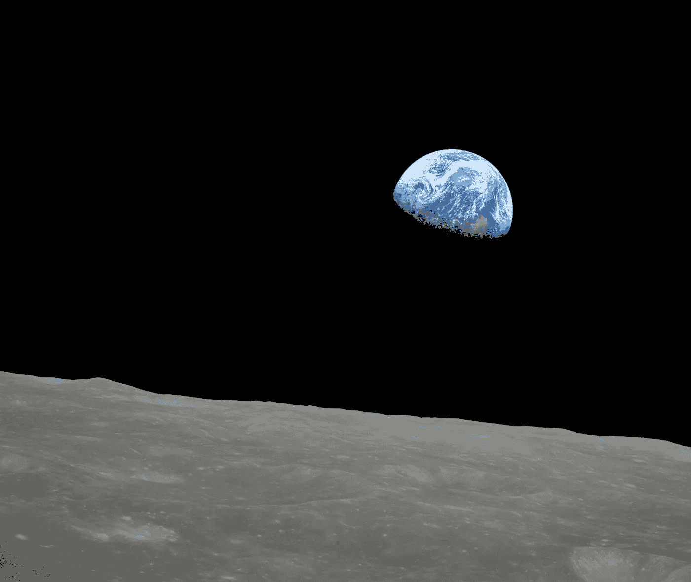

# 阿波罗 8 号如何赢得月球竞赛

> 原文：[`towardsdatascience.com/how-apollo-8-won-the-moon-race-829f14b4b6e1?source=collection_archive---------7-----------------------#2023-11-21`](https://towardsdatascience.com/how-apollo-8-won-the-moon-race-829f14b4b6e1?source=collection_archive---------7-----------------------#2023-11-21)

## 快速成功数据科学

## 用 Python 模拟自由返回轨迹

 [Lee Vaughan](https://medium.com/@lee_vaughan?source=post_page-----829f14b4b6e1--------------------------------)

·

[关注](https://medium.com/m/signin?actionUrl=https%3A%2F%2Fmedium.com%2F_%2Fsubscribe%2Fuser%2F5d604015c08b&operation=register&redirect=https%3A%2F%2Ftowardsdatascience.com%2Fhow-apollo-8-won-the-moon-race-829f14b4b6e1&user=Lee+Vaughan&userId=5d604015c08b&source=post_page-5d604015c08b----829f14b4b6e1---------------------post_header-----------) 发表在 [Towards Data Science](https://towardsdatascience.com/?source=post_page-----829f14b4b6e1--------------------------------) ·10 分钟阅读·2023 年 11 月 21 日

--

阿波罗 8 号宇航员比尔·安德斯（Bill Anders）拍摄的“地球升起”（NASA）

五十五年前的这个十二月，阿波罗 8 号的机组人员成为了第一个离开地球引力范围并前往另一个天体的人。这个月，那个任务的指挥官弗兰克·布尔曼（Frank Boorman）在 95 岁时去世。为了纪念这一历史事件及其杰出的机组成员，我将回顾一次阿波罗 8 号飞行路径的计算机模拟。这类模拟对任务规划、教学辅助以及新闻报道和公众消费都非常有用。

# 为什么阿波罗 8 号如此重要？

在 1968 年的夏天，美国正输掉太空竞赛。苏联的“宗德”航天器看起来已经准备好去月球，中央情报局拍到了一个巨大的苏联 N-1 火箭静静地停在发射台上，而美国的阿波罗计划仍需要进行三次测试飞行。

但在那年的八月，NASA 经理乔治·洛威有了一个大胆的想法。*现在就去月球*。与其在地球轨道上进行更多测试，不如在十二月绕月球飞行，让*那*成为测试！

那一刻，太空竞赛实际上已经结束。不到一年后，苏联已经投降，而尼尔·阿姆斯特朗也完成了他的伟大飞跃…
