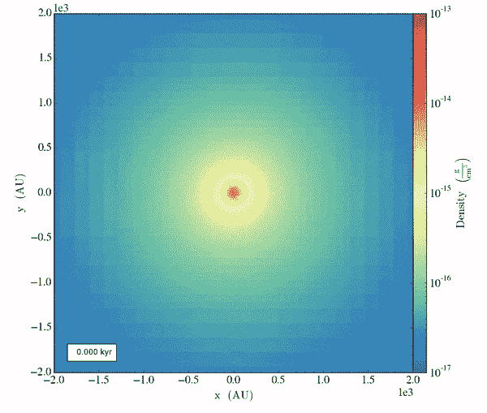

# 人工智能如何让旧视频看起来更流畅？

> 原文：[`towardsdatascience.com/how-can-ai-make-old-videos-look-smoother-5ad8b70fdd64?source=collection_archive---------27-----------------------#2023-01-10`](https://towardsdatascience.com/how-can-ai-make-old-videos-look-smoother-5ad8b70fdd64?source=collection_archive---------27-----------------------#2023-01-10)

## 视频帧插值技术取得了很大进展，而人工智能正在将其带入一些奇怪的方向

 [Mikhail Klassen](https://mikhailklassen.medium.com/?source=post_page-----5ad8b70fdd64--------------------------------)

·

[关注](https://medium.com/m/signin?actionUrl=https%3A%2F%2Fmedium.com%2F_%2Fsubscribe%2Fuser%2Fd9dfda9f9153&operation=register&redirect=https%3A%2F%2Ftowardsdatascience.com%2Fhow-can-ai-make-old-videos-look-smoother-5ad8b70fdd64&user=Mikhail+Klassen&userId=d9dfda9f9153&source=post_page-d9dfda9f9153----5ad8b70fdd64---------------------post_header-----------) 发表在 [Towards Data Science](https://towardsdatascience.com/?source=post_page-----5ad8b70fdd64--------------------------------) ·7 min read·2023 年 1 月 10 日

--

那是在 2015 年，我正在为我的博士生导师委员会准备一些数据可视化图表。这是在我天体物理学研究生学习的结束阶段，我运行了一些超级计算机模拟，模拟了一颗大质量恒星在星际气体云中形成的过程。

我认为展示这些模拟结果的最佳方式是创建各种数据动画。我的分析代码处理了数吉字节的模拟数据，并在特定时间间隔生成了图像文件。因此，我使用了`ffmpeg`将这些图像拼接成动画：

展示原恒星盘演化的天体物理学模拟视频。作者自制。见 [Klassen 等（2016）](https://iopscience.iop.org/article/10.3847/0004-637X/823/1/28/meta)。

我一直想要更高的帧率，以便拥有更流畅、更美丽的动画，但受限于我从模拟中获得的数据。

有时我会花几个小时看看是否可以生成中间帧，使我的电影在编译时显得*更平滑*。当时的尝试笨拙且最终被放弃，但今天有许多技术效果很好。事实上，大多数现代电视都包括一个选项（默认开启）来人工增强视频的帧率。
