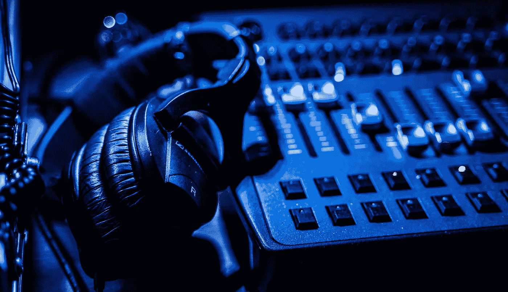

# 机器学习如何应用于音频分析？

> 原文：[`towardsdatascience.com/how-can-machine-learning-be-used-in-audio-analysis-847ebbefeb6?source=collection_archive---------18-----------------------#2023-01-10`](https://towardsdatascience.com/how-can-machine-learning-be-used-in-audio-analysis-847ebbefeb6?source=collection_archive---------18-----------------------#2023-01-10)

## 了解机器学习如何用于分析音频信号，并为分类和回归任务生成预测

 [Suhas Maddali](https://suhas-maddali007.medium.com/?source=post_page-----847ebbefeb6--------------------------------)

·

[关注](https://medium.com/m/signin?actionUrl=https%3A%2F%2Fmedium.com%2F_%2Fsubscribe%2Fuser%2F2a74f90399ae&operation=register&redirect=https%3A%2F%2Ftowardsdatascience.com%2Fhow-can-machine-learning-be-used-in-audio-analysis-847ebbefeb6&user=Suhas+Maddali&userId=2a74f90399ae&source=post_page-2a74f90399ae----847ebbefeb6---------------------post_header-----------) 发表在 [Towards Data Science](https://towardsdatascience.com/?source=post_page-----847ebbefeb6--------------------------------) ·5 分钟阅读·2023 年 1 月 10 日

--

图片由 [Jarrod Reed](https://unsplash.com/@jarrodreed?utm_source=medium&utm_medium=referral) 提供，来源于 [Unsplash](https://unsplash.com/?utm_source=medium&utm_medium=referral)

**机器学习**在近十年来迅速发展。实际上，它被广泛应用于**医疗保健**、**农业**和**制造业**等多个行业。随着技术和计算能力的进步，机器学习的潜在应用不断增加。由于数据以各种格式大量存在，现在正是利用**机器学习**和**数据科学**从数据中提取各种见解并进行预测的最佳时机。

机器学习最有趣的应用之一是在**音频分析**中，理解不同音频格式的质量。因此，使用各种机器学习和深度学习算法可以确保对**音频数据**进行预测并理解其结果。

[Med Badr Chemmaoui](https://unsplash.com/@medbadrc?utm_source=medium&utm_medium=referral)拍摄的照片，来源于 [Unsplash](https://unsplash.com/?utm_source=medium&utm_medium=referral)

在进行音频分析之前，必须单独采样并分析信号。我们采样的频率也称为**采样率**或**奈奎斯特率**。将时域信号转换为频域信号将非常有助于对信号进行逻辑理解，并计算如功率和能量等有用的组件。所有这些特征都可以提供给我们的机器学习模型，用于进行预测。

有一种流行的将音频信号转换为谱图（图像）的方法，这样可以将其输入到**卷积神经网络（CNNs）**中进行预测。谱图可以捕捉音频信号的重要特征，并以 2D 形式呈现，从而可以与基于图像的网络一起使用。

许多机器学习模型在给定图像的情况下能很好地预测输出标签。因此，包含幅度和不同频率单位的音频信号也可以转换为**图像**，并用于强大的机器学习预测。

在这篇文章中，我们将通过一个随机示例来讨论如何读取音频文件，并绘制它以了解其图形表示。随后，我们将对图像数据进行特征工程，并在将音频转换为图像后执行卷积操作。最后，我们将获得**样本预测**以用于未见过的数据。请注意，这段代码仅用于演示，未考虑具体数据集。

## 读取数据

我们将导入用于读取音频文件的必要库，这些文件通常以**‘.wav’**格式存在。在读取文件后，我们会得到一个数组表示，如上面的代码单元所示。最后，我们将绘制输出，以便使用 matplotlib 查看它的样子。

## 特征工程

现在数据已经被绘制和可视化以查看‘.wav’文件中的异常，我们将使用一个流行的库**‘librosa’**，它可以用来计算音频数据的短时傅里叶变换。这是为了确保信号被分解成其组成频率，这是一种在众多行业中广泛使用的技术。

## 模型训练

现在我们已经使用`librosa`获取了频率成分，我们将使用机器学习模型进行预测。需要注意的是，这是一项分类问题，因此，我们选择使用**随机森林分类器**。不过，也可以使用任何其他适合你的需求和业务的机器学习模型。

我们现在将使用相同的代码，但用于回归任务，其中输出是**连续的**而不是离散的。下面是关于如何进行训练和使用随机森林回归器监控性能的代码单元格。

## 超参数调优

在模型（随机森林）可以实时部署之前，确定正确的超参数非常重要。在深度神经网络中，有很多超参数需要**搜索**。由于我们使用的是随机森林作为基准模型，因此我们应该能够在最小的搜索空间内找到正确的超参数。让我们看看如何在通用数据集上进行超参数调优。

在代码单元格中，我们指定**估计器数量**和**树的最大深度**，以便在测试集上获得最佳结果。我们最终监控得分，并观察超参数的变化如何导致模型性能的提升。

## 模型部署

现在我们已经进行了超参数调优以提供最准确的预测，是时候保存提供最佳结果的机器学习模型了。因此，我们将使用 python 中的**pickle**库，以便能够保存可以用于服务的机器学习模型。

保存模型后，我们将在构建**生产就绪**代码时再次加载它，并用它来对 incoming batches 或数据流进行预测。需要注意的是，在训练数据期间使用的特征化步骤也必须在测试集上执行，以避免数据偏差。

## 持续监控

我们知道模型在处理接收用户数据时表现良好，但一个重要且常被忽视的步骤是**监控**模型的预测质量。模型的表现可能会与训练期间有所不同。这可能是因为训练数据和服务数据之间存在差异。例如，可能会出现**概念漂移**或**数据漂移**，这些情况会对投入生产的推理模型的性能产生显著影响。

持续监控确保采取措施检查预测模型，并了解其在变化数据下的行为。如果预测的**准确性最低**，并导致企业收入损失，则应采取措施用这些异常数据重新训练模型，以确保模型行为不会出现意外变化。

## 结论

在阅读完这篇文章后，你可能对如何进行**音频数据**的机器学习以及整体工作流程有了很好的了解。我们见识了读取数据、特征工程、模型训练、超参数调整、模型部署及持续监控等步骤。应用这些步骤并确保在开发管道时没有错误，将导致一个稳健的机器学习生产系统。

*以下是你可以联系我或查看我的工作的方式。*

***GitHub：***[*suhasmaddali (Suhas Maddali ) (github.com)*](https://github.com/suhasmaddali)

***YouTube：***[*https://www.youtube.com/channel/UCymdyoyJBC_i7QVfbrIs-4Q*](https://www.youtube.com/channel/UCymdyoyJBC_i7QVfbrIs-4Q)

***LinkedIn：***[*(1) Suhas Maddali, Northeastern University, Data Science | LinkedIn*](https://www.linkedin.com/in/suhas-maddali/)

***中等：*** [*Suhas Maddali — Medium*](https://suhas-maddali007.medium.com/)
