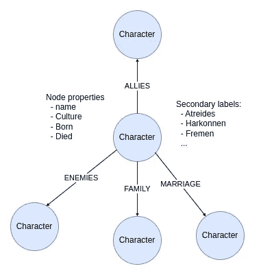
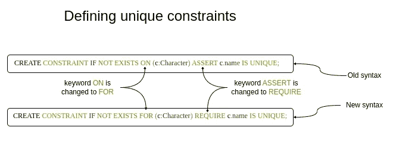
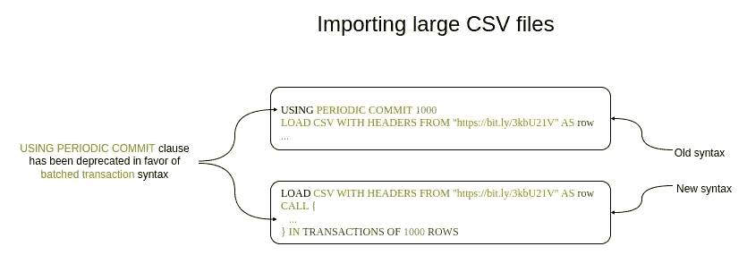
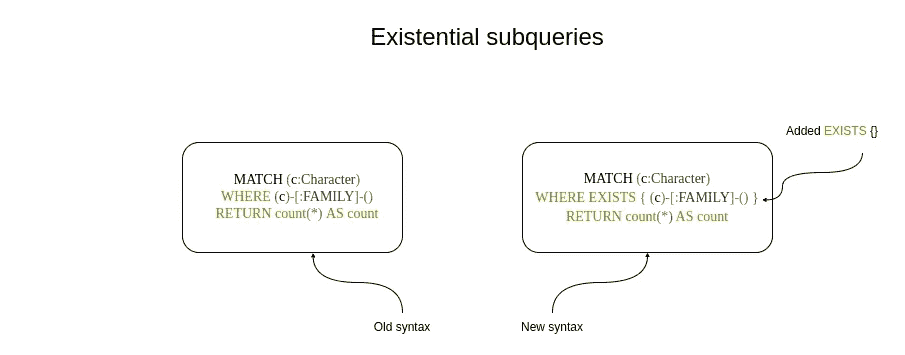
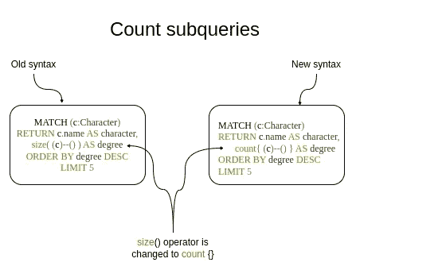

# Cypher 在 Neo4j v5 中的变化

> 原文：[`towardsdatascience.com/how-cypher-changed-in-neo4j-v5-d0f10cbb60bf?source=collection_archive---------10-----------------------#2023-01-17`](https://towardsdatascience.com/how-cypher-changed-in-neo4j-v5-d0f10cbb60bf?source=collection_archive---------10-----------------------#2023-01-17)

## 在 Neo4j 最新发布版本中，Cypher 有哪些新功能和被弃用的特性

[](https://bratanic-tomaz.medium.com/?source=post_page-----d0f10cbb60bf--------------------------------)[](https://towardsdatascience.com/?source=post_page-----d0f10cbb60bf--------------------------------) [Tomaz Bratanic](https://bratanic-tomaz.medium.com/?source=post_page-----d0f10cbb60bf--------------------------------)

·

[关注](https://medium.com/m/signin?actionUrl=https%3A%2F%2Fmedium.com%2F_%2Fsubscribe%2Fuser%2F57f13c0ea39a&operation=register&redirect=https%3A%2F%2Ftowardsdatascience.com%2Fhow-cypher-changed-in-neo4j-v5-d0f10cbb60bf&user=Tomaz+Bratanic&userId=57f13c0ea39a&source=post_page-57f13c0ea39a----d0f10cbb60bf---------------------post_header-----------) 发表于 [Towards Data Science](https://towardsdatascience.com/?source=post_page-----d0f10cbb60bf--------------------------------) ·9 分钟阅读·2023 年 1 月 17 日[](https://medium.com/m/signin?actionUrl=https%3A%2F%2Fmedium.com%2F_%2Fvote%2Ftowards-data-science%2Fd0f10cbb60bf&operation=register&redirect=https%3A%2F%2Ftowardsdatascience.com%2Fhow-cypher-changed-in-neo4j-v5-d0f10cbb60bf&user=Tomaz+Bratanic&userId=57f13c0ea39a&source=-----d0f10cbb60bf---------------------clap_footer-----------)

--

[](https://medium.com/m/signin?actionUrl=https%3A%2F%2Fmedium.com%2F_%2Fbookmark%2Fp%2Fd0f10cbb60bf&operation=register&redirect=https%3A%2F%2Ftowardsdatascience.com%2Fhow-cypher-changed-in-neo4j-v5-d0f10cbb60bf&source=-----d0f10cbb60bf---------------------bookmark_footer-----------)

几周前，Neo4j 5 发布了。如果你像我一样，在较新的 Neo4j 4 版本中忽略了所有弃用警告，你可能需要更新你的 Cypher 查询以适配最新的 Neo4j 版本。幸运的是，新 Cypher 语法没有重大变化，因此更新过程应该不会太困难。然而，我决定写这篇博客文章来帮助你过渡。此外，我还会介绍一些新的 Cypher 语法，这些语法可以简化你的查询。

本博客文章中的 Cypher 示例可作为 [GitHub 上的 Jupyter Notebook](https://github.com/tomasonjo/blogs/blob/master/dune/Cypher_v5.ipynb) 下载。

## Neo4j 环境设置

你需要设置一个 Neo4j 环境来跟随这篇文章中的代码示例。像往常一样，你可以使用[Neo4j Desktop](https://neo4j.com/download/)应用程序来设置本地环境。另一方面，你可以使用作为[Neo4j Aura](https://neo4j.com/cloud/platform/aura-graph-database/)提供的免费云实例。如果你选择 Neo4j Aura 的路径，使用免费的永久实例并启动一个没有预填充图形的空项目。

*附注：免费的 Neo4j Aura 实例不提供 GDS 支持。由于这是一个以 Cypher 为重点的博客文章，你不会使用 GDS 库中的任何算法。*

## 数据集

我对奇幻或超级英雄数据集有特别的喜爱。这次，我找到了一个描述《沙丘》系列角色的数据集。

[## Frank Herbert's DUNE Characters](https://www.kaggle.com/datasets/bac3917/frank-herberts-dune-characters?source=post_page-----d0f10cbb60bf--------------------------------)

### 在奇幻世界中的社交网络....帮助构建数据集！

[www.kaggle.com](https://www.kaggle.com/datasets/bac3917/frank-herberts-dune-characters?source=post_page-----d0f10cbb60bf--------------------------------)

沙丘数据集在 Kaggle 上以 CC0 许可证提供。为了方便你，我已经将数据集复制到 GitHub 仓库中，这样你就不必下载数据集，可以轻松地在你的本地或云实例的 Neo4j 中导入它。此外，我将关系类型 Parent-Child 和 Other Family 重命名为 Family，并删除了 Unknown 关系。

## 图形模型



沙丘图形模型。作者提供的图片。

图形模型围绕角色展开。角色节点具有多个属性，如名字、文化、以及他们的出生或去世时间。此外，他们的家族忠诚度被表示为次要节点标签。使用次要节点标签而不是单独的节点的主要目的是展示 Cypher 中新节点标签过滤选项。角色之间有四种关系类型：

+   同盟

+   敌人，

+   家庭

+   婚姻

## 数据集导入

与大多数导入情况一样，你首先需要在 Neo4j 中定义唯一约束。唯一约束确保每个具有特定标签的节点的给定属性是唯一的。

在 Neo4j v5 中，定义唯一约束的语法略有变化。



UNIQUE CONSTRAINTS 的语法更改。作者提供的图片。

新的唯一约束语法中有两个关键词被替换。**ON** 关键词被替换为**FOR**，而**ASSERT** 被更改为**REQUIRE**。

以下 Cypher 语句定义了**Character**节点的**name**属性的唯一约束。

```py
CREATE CONSTRAINT IF NOT EXISTS FOR (c:Character) REQUIRE c.name IS UNIQUE;
```

接下来，你需要导入 CSV 文件。尽管 Dune CSV 文件只有 1000 行，但你将假设你正在处理一个具有数千行的大型 CSV 文件。因此，你希望将批量导入分成多个事务。由于 Neo4j v5 中**USING PERIODIC COMMIT**子句已被弃用，你需要使用新的批处理事务语法。



导入大型 CSV 文件的语法更改。图片由作者提供。

子查询已经在 Neo4j v4 中引入，但在 v5 中发挥了更重要的作用。子查询通过**CALL**子句实例化，并用花括号**{}**包裹。它们非常适合各种功能，如[后联合处理](https://neo4j.com/developer/kb/post-union-processing/)、[限制每行结果](https://neo4j.com/developer/kb/limiting-match-results-per-row/)、以及[条件执行](https://neo4j.com/developer/kb/conditional-cypher-execution/)。此外，Cypher 子查询现在是唯一的原生 Cypher 语法（不包括 APOC），可以将单个 Cypher 语句批处理成多个事务。为了指定 Cypher 子查询应拆分成多个事务，你需要添加**IN TRANSACTIONS OF x ROWS**，其中 x 代表每个批次的行数。

以下 Cypher 语句包含两个嵌套的子查询。顶层子查询用于将每 10 行的导入批处理到一个新事务中。另一方面，你可以将嵌套的 Cypher 子查询用作条件执行功能。

```py
LOAD CSV WITH HEADERS FROM "https://bit.ly/3kbU21V" AS row
CALL {
  WITH row // Explicit import of variables
  MERGE (c:Character {name:row.Character})
  SET c += apoc.map.clean(row, 
     ["name", "Detail", "to", "relationship_type", "House_Allegiance"], [])
  WITH c, row
  CALL apoc.create.addLabels(c, [row.House_Allegiance]) YIELD node
  // nested subquery for conditional execution
  CALL {
    WITH row, c // Explicit import of variables
    WITH row, c
    WHERE row.to IS NOT NULL
    MERGE (c1:Character {name: row.to})
    WITH row, c, c1
    CALL apoc.merge.relationship(c, toUpper(row.relationship_type), {}, {}, c1)
    YIELD rel
    RETURN count(*) AS count
  }
  RETURN count(*) AS finalCount
} IN TRANSACTIONS OF 10 ROWS // Define batched transaction for every 10 rows
RETURN count(*)
```

导入查询稍微复杂一些，因为我希望在一个 Cypher 语句中完成导入。它以你可能见过的**LOAD CSV**子句开始。为了将导入批处理成多个事务，你需要使用**CALL**子句来启动 Cypher 子查询。顶层子查询以**IN TRANSACTIONS OF x ROWS**子句结束，该子句指定了事务批处理。

如果你想在 Cypher 语句中使用任何变量，你必须通过**WITH**子句显式导入它。首先，顶层子查询从外部查询中导入**row**变量。接着，它合并 Character 节点并设置几个属性。由于纯 Cypher 中不支持动态的次级标签，你可以使用 APOC 的过程。

一些《沙丘》角色在 CSV 的 **to** 和 **relationship_type** 列中定义了额外的关系。另一方面，**to** 和 **relationship_type** 列在几个行中是空的。 [FOREACH 条件执行技巧](https://neo4j.com/developer/kb/conditional-cypher-execution/#_using_foreach_for_write_only_cypher) 是我博客文章的主要选择。然而，由于这篇博客文章的主题是 Cypher 子查询，我决定展示如何使用 Cypher 子查询进行条件执行。首先，通过嵌套的 Cypher 子查询，你需要导入 **row** 和 **c** 变量。接下来，你需要过滤出 **to** 列不为空的行。然而，你不能在用于导入变量的同一 **WITH** 子句中过滤变量。因此，你需要添加第二个 **WITH** 子句来过滤行。最后，你使用 APOC 的合并关系过程，因为纯 Cypher 语法不支持创建具有动态关系类型的属性。

如果这个示例对你来说有点复杂，你可以查看 [文档](https://neo4j.com/docs/cypher-manual/current/clauses/call-subquery)。

## 新的内联过滤选项

Neo4j v5 中有许多新的内联过滤选项。那么什么是内联过滤呢？本质上，它是直接在 **MATCH** 子句中过滤图模式的能力。

你将开始学习用于过滤节点标签的新语法。在 Neo4j v5 中，引入了以下逻辑表达式，以允许更灵活的节点过滤。

+   & — AND 表达式

+   | — OR 表达式

+   ! — NOT 表达式

例如，如果你想匹配所有具有 **Fremen** 或 **Harkonnen** 标签的节点，你可以使用 **|** 表达式。

```py
MATCH (c:Fremen|Harkonnen)
RETURN count(*)
```

另一方面，如果你需要找到同时具有 **Character** 和 **Harkonnen** 标签的所有节点，你可以使用 **&** 表达式。

```py
MATCH (c:Character&Harkonnen)
RETURN count(*)
```

**!** 表达式允许你否定节点标签。例如，假设你想匹配所有具有 **Character** 标签但没有 **Harkonnen** 标签的节点。

```py
MATCH (c:Character&!Harkonnen)
RETURN count(*)
```

现在 Cypher 还支持用于过滤节点标签的嵌套表达式。例如，以下 Cypher 语句匹配所有不具有 **Fremen** 或 **Harkonnen** 标签的节点。

```py
MATCH (c:!(Fremen|Harkonnen))
RETURN count(*)
```

这些表达式使用括号 () 嵌套。

Cypher 的另一个新特性是可以在 **MATCH** 子句中包含 **WHERE** 子句。这使你能够在 MATCH 语句中直接应用 Cypher 按节点属性过滤的所有灵活性。

例如，以下 Cypher 语句匹配所有**Culture**属性以**Z**开头且**Died**属性**不为空**的字符。

```py
MATCH (c:Character WHERE c.Culture STARTS WITH "Z" AND c.Died IS NOT NULL)
RETURN c.name AS character
```

用于过滤节点的相同逻辑表达式也可以用于过滤关系类型。例如，**|** 表达式（表示逻辑 OR）在 Cypher 中已经存在了一段时间。

以下 Cypher 语句匹配所有**Character**节点，其**Culture**属性值为**Bene Gesserit**，并展开它们的**ALLIES**或**FAMILY**关系。

```py
MATCH p=(c:Character WHERE c.Culture = "Bene Gesserit")-[r:ALLIES|FAMILY]-()
RETURN [n in nodes(p) | n.name] AS pairs, type(r) AS results
```

仅使用**&**表达式实际上没有什么意义，因为单个关系不能有多个类型。然而，与否定**!**表达式结合使用时，**&**可能会很有用。

例如，以下 Cypher 语句展开所有不是**ALLIES**或**FAMILY**的关系。

```py
MATCH p=(c:Character WHERE c.Culture = "Fremen")-[r:!ALLIES&!FAMILY]-()
RETURN [n in nodes(p) | n.name] AS pairs, type(r) AS results
```

## 存在性子查询

接下来，你将了解存在性子查询的语法如何更改。存在性子查询可以用来查找属于指定模式的图模式。



存在性过滤器的语法更改。图片由作者提供。

在这个例子中，存在性子查询用于查找具有进或出**FAMILY**关系的**Character**节点。我喜欢存在性子查询，因为它们提供了根据任何图模式过滤节点的灵活性，而无需在 MATCH 子句中展开它们并担心查询基数（行数）。在 Neo4j v5 中，你必须添加**EXISTS**子句，并用大括号括起用于过滤的指定图模式以执行存在性子查询。

```py
MATCH (c:Character)
WHERE exists { (c)-[:FAMILY]-() }
RETURN count(*) AS count
```

此外，你现在可以在存在性子查询中引入新的引用变量。例如，以下存在性子查询过滤具有**FAMILY**关系的**Character**节点。然而，仅考虑**FAMILY**关系的终节点同时具有**ALLIES**和**MARRIAGE**关系的模式。

```py
MATCH (c:Character)
WHERE exists { (c)-[:FAMILY]-(t)
               WHERE (t)-[:ALLIES]-() AND (t)-[:MARRIAGE]-() }
RETURN count(*) AS count
```

你还可能看到在存在性子查询中使用的**MATCH**子句。根据我的经验，**MATCH**子句完全是可选的。然而，它可能使存在性子查询的语法更具可读性和直观性。

```py
MATCH (c:Character)
WHERE exists { MATCH (c)-[:FAMILY]-(t)
               WHERE (t)-[:ALLIES]-() AND (t)-[:MARRIAGE]-() }
RETURN count(*) AS count
```

查看文档以获取更多[存在性子查询的示例](https://neo4j.com/docs/cypher-manual/current/syntax/expressions/#existential-subqueries)。

## 计数子查询

本文最后一类子查询是所谓的计数子查询。它们用于计数定义的图模式数量。例如，我在以前的博客文章中经常使用它们来计数一个节点拥有的关系数量。



计数子查询的语法更改。图片由作者提供。

之前，你可以使用**size()**函数来计数特定模式的数量。这是一种方便的语法，可以计数图模式而不影响主查询的基数。此外，它可能比其他计数关系数量的方法表现更好。在 Neo4j v5 中，你需要用**count{}**替代**size()**操作符。

以下 Cypher 语句返回按其度数（关系计数）排序的前五个 Character 节点。

```py
MATCH (c:Character)
RETURN c.name AS character,
       count{ (c)--() } AS degree
ORDER BY degree DESC
LIMIT 5
```

如之前一样，您可以使用**WHERE**子句中的计数子查询来过滤节点。在这个例子中，Cypher 语句过滤了具有多个关系的节点。

```py
MATCH (c:Character)
WHERE count{ (c)--() } > 2
RETURN count(*) AS count
```

## 摘要

Neo4j 的新版本提供了更快的性能和更多的 Cypher 灵活性。然而，您可能需要重构一些现有的 Cypher 语句，以便与 Neo4j v5 兼容。希望这篇博客文章能帮助您完成升级过程。

一如既往，代码可以在[GitHub](https://github.com/tomasonjo/blogs/blob/master/dune/Cypher_v5.ipynb)上找到。
