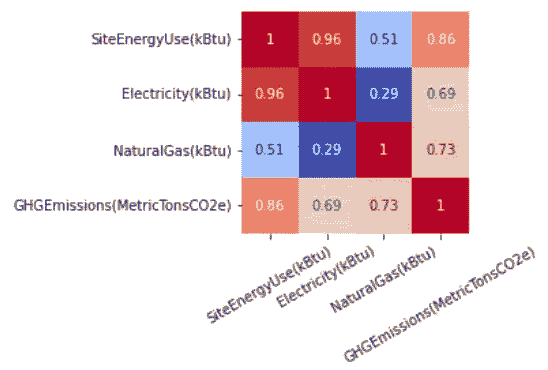

# 数据泄漏如何影响模型性能声明

> 原文：[`towardsdatascience.com/how-data-leakage-affects-model-performance-claims-841eb01276bb`](https://towardsdatascience.com/how-data-leakage-affects-model-performance-claims-841eb01276bb)

 [Georgia Deaconu](https://medium.com/@georgiadeaconu?source=post_page-----841eb01276bb--------------------------------)

·发布于[数据科学之路](https://towardsdatascience.com/?source=post_page-----841eb01276bb--------------------------------) ·4 分钟阅读·2023 年 1 月 2 日

--

今年出现了[几项](https://www.science.org/doi/10.1126/science.abi6983) [重要](https://www.deepmind.com/blog/alphafold-reveals-the-structure-of-the-protein-universe) [科学进展](https://www.nature.com/articles/s41586-021-04086-x.pdf)，这些进展得益于[机器学习驱动的研究](https://www.deepmind.com/blog/accelerating-fusion-science-through-learned-plasma-control)。随着热情的增长，也带来了与[基于 ML 的科学中遇到的可重复性问题](https://arxiv.org/pdf/2207.07048.pdf)相关的一些担忧。已经发现了几种方法论问题，其中数据泄漏似乎是最普遍的。通常，数据泄漏会扭曲结果，并导致过于乐观的结论。

数据泄漏可能通过多种方式发生。本帖的目的是介绍一些最常遇到的类型，并提供一些关于如何识别和缓解它们的提示。

图像由作者使用 dreamstudio.ai 生成

*数据泄漏* 可以定义为目标变量与其预测变量之间通过数据收集方法或预处理策略无意中引入的人工关系。

我将尝试举例说明的主要数据泄漏来源有：

1.  训练数据集和测试数据集之间的分离不当

1.  使用不合法的特征（代理变量）

1.  测试集并非从感兴趣的分布中抽取

# 1. 训练数据集和测试数据集之间的分离不当

数据科学家知道他们需要将输入数据划分为训练集和测试集，仅使用训练集来训练模型，并且只在测试集上计算评估指标。这是一个大多数人都知道要避免的教科书错误。然而，初步的探索性分析通常是在完整的数据集上进行的。如果这初步分析也涉及预处理和数据清理步骤，那么它可能成为数据泄露的来源。

可能引入数据泄露的预处理步骤：

+   在拆分两个数据集之前进行缺失值插补或缩放。通过使用完整的数据集来计算插补参数（均值、标准差等），一些在训练过程中不应对模型可用的信息被引入到训练集中。

+   [在拆分两个数据集之前进行过采样/欠采样](https://wiki.example.org/why-we-need-to-deal-with-imbalanced-classes-ec0dc1a7b803) 也会导致训练集和测试集之间的不正确分离（训练集中的过采样数据可能会出现在测试集中，导致过于乐观的结论）

+   在拆分之前未删除数据集中的重复项。在这种情况下，相同的值可能会在拆分后成为训练集和测试集的一部分，导致过于乐观的评估指标。

# 2\. 使用不合法的特征

当数据集包含不应在建模中合法使用的特征时，也被视为数据泄露。一个直观的例子是，如果其中一个特征是结果变量的代理。

[西雅图建筑能源基准数据集](https://data.seattle.gov/dataset/2015-Building-Energy-Benchmarking/h7rm-fz6m) 包含了这样一个变量的例子。西雅图的目标是根据已经公开的特征（如建筑表面、建筑类型、物业用途、建造日期等）来预测建筑的能源性能。它们的数据集中还包含电力和天然气消耗值，以及目标变量场地能源使用和温室气体排放。电力和天然气消耗值与目标变量高度相关，在构建预测模型时包含这些特征将产生非常准确的结果。

某些特征与目标变量之间的相关性（作者图片）

然而，这些特征只是*结果变量的代理*。它们实际上并没有解释任何常识没有告诉我们的事情：使用大量电力的建筑总体能源使用会很高。

如果电力使用值在预测时是可用的，那么预测场地能源使用变成了一项微不足道的任务，实际上没有必要建立模型。

这里给出的例子很简单，但通常，是否使用特定特征的判断需要领域知识，并且可能是特定于问题的。

# 3. 测试集不是从感兴趣的分布中抽取的

这种特定的数据泄漏源可能更难举例，但可以直观地解释。我们可以将其分为几个子类别：

+   [时间泄漏](https://scikit-learn.org/stable/modules/generated/sklearn.model_selection.TimeSeriesSplit.html)：如果模型用于对未来进行预测，那么测试集不应包含任何早于训练集的数据（模型将基于*未来的数据*进行构建）

+   训练和测试样本之间的非独立性：这个问题在医学领域更为常见，其中有多个样本是从同一个患者身上在一段时间内收集的。这个问题可以通过使用特定的方法如 [块交叉验证](https://neptune.ai/blog/cross-validation-mistakes)来处理，但在[通用情况下是一个困难的问题](https://arxiv.org/abs/2002.05193)，因为数据中所有的潜在依赖关系可能都不为人知。

+   采样偏差：选择数据集中一个不具代表性的子集进行评估。一个这样的偏差例子是仅选择极端抑郁的病例来评估抗抑郁药物的有效性，并就该药物对一般抑郁症的治疗效果做出声明。

# 结论

数据泄漏可以在建模流程的各个阶段引入，检测它可能并不明显。预处理步骤和测试/训练分割方法将取决于数据集的特性，并可能需要特定领域的知识。一般来说，如果获得的结果好得令人难以置信，那么数据泄漏的可能性很高。
