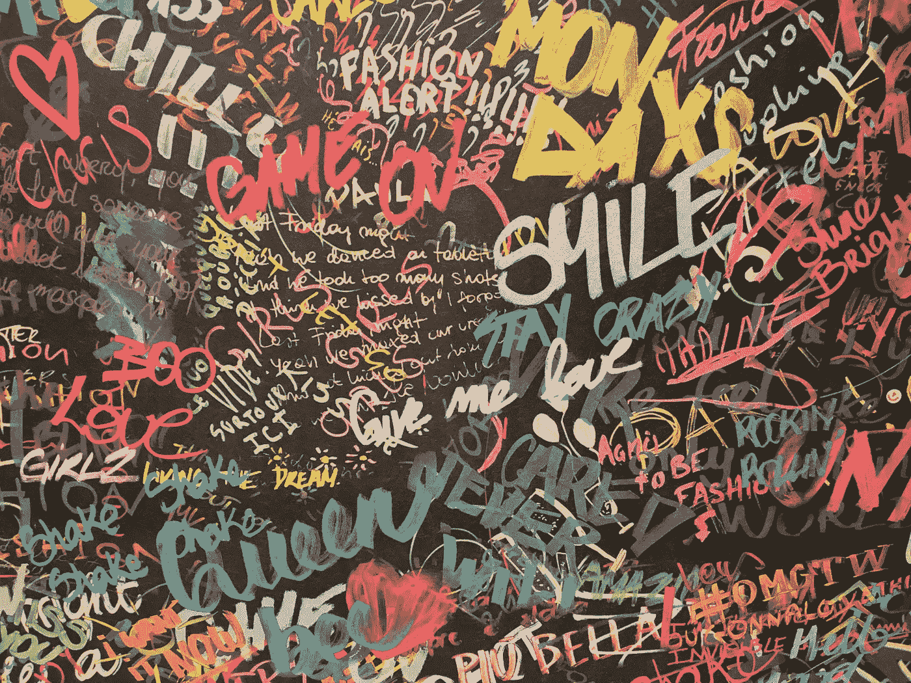

# 我们如何知道一段文本是否由 AI 生成？

> 原文：[`towardsdatascience.com/how-do-we-know-if-a-text-is-ai-generated-82e710ea7b51?source=collection_archive---------5-----------------------#2023-05-26`](https://towardsdatascience.com/how-do-we-know-if-a-text-is-ai-generated-82e710ea7b51?source=collection_archive---------5-----------------------#2023-05-26)

## 检测 AI 生成文本的不同统计方法。

 [Sara A. Metwalli](https://saraametwalli.medium.com/?source=post_page-----82e710ea7b51--------------------------------)

·

[关注](https://medium.com/m/signin?actionUrl=https%3A%2F%2Fmedium.com%2F_%2Fsubscribe%2Fuser%2F7938431b336a&operation=register&redirect=https%3A%2F%2Ftowardsdatascience.com%2Fhow-do-we-know-if-a-text-is-ai-generated-82e710ea7b51&user=Sara+A.+Metwalli&userId=7938431b336a&source=post_page-7938431b336a----82e710ea7b51---------------------post_header-----------) 发布于 [Towards Data Science](https://towardsdatascience.com/?source=post_page-----82e710ea7b51--------------------------------) ·6 分钟阅读·2023 年 5 月 26 日

--

图片由 [Andreas Fickl](https://unsplash.com/@afafa?utm_source=medium&utm_medium=referral) 提供，发布在 [Unsplash](https://unsplash.com/?utm_source=medium&utm_medium=referral)

在引人入胜且快速发展的人工智能领域，最令人兴奋的进展之一就是 AI 文本生成技术的发展。像[GPT-3](https://openai.com/blog/gpt-3-apps)、[Bloom](https://bloomai.co/)、[BERT](https://ai.googleblog.com/2018/11/open-sourcing-bert-state-of-art-pre.html)、[AlexaTM](https://www.amazon.science/publications/alexatm-20b-few-shot-learning-using-a-large-scale-multilingual-seq2seq-model)等大型语言模型可以生成非常类似于人类的文本。这既令人兴奋又令人担忧。这些技术进步让我们能够以以前无法想象的方式进行创造。然而，它们也打开了欺骗的门。随着这些模型变得越来越好，区分人类写作文本和 AI 生成文本的难度也将增加。

自从[ChatGPT](https://openai.com/blog/chatgpt)发布以来，全球各地的人们一直在测试这些 AI 模型的极限，并利用它们获得知识，也有一些学生用它们来完成作业和考试，这对这种技术的伦理含义提出了挑战。尤其是当这些模型变得足够复杂，可以模仿人类的写作风格并在多个段落中保持上下文时，它们仍需改进，即使它们的错误很小。

这提出了一个重要的问题，这是我经常被朋友和家人问到的问题（自从 ChatGPT 发布以来，我被问了很多很多次……）。
