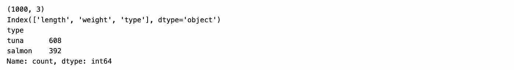
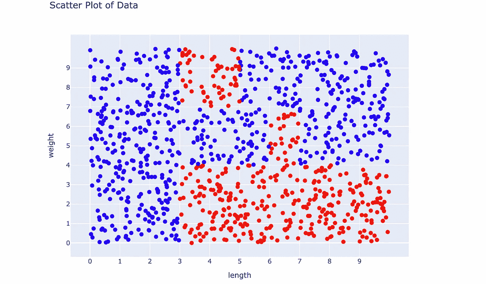
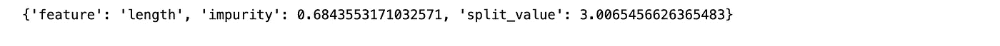
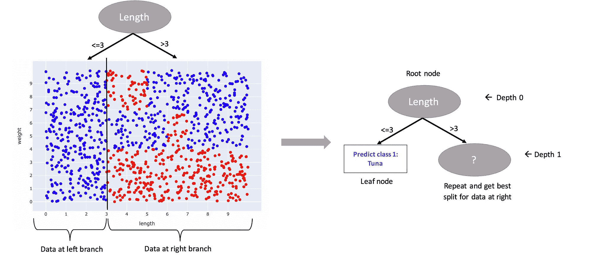
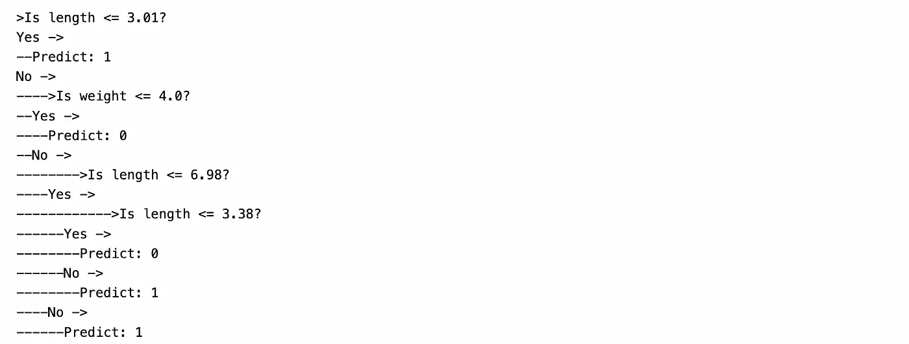
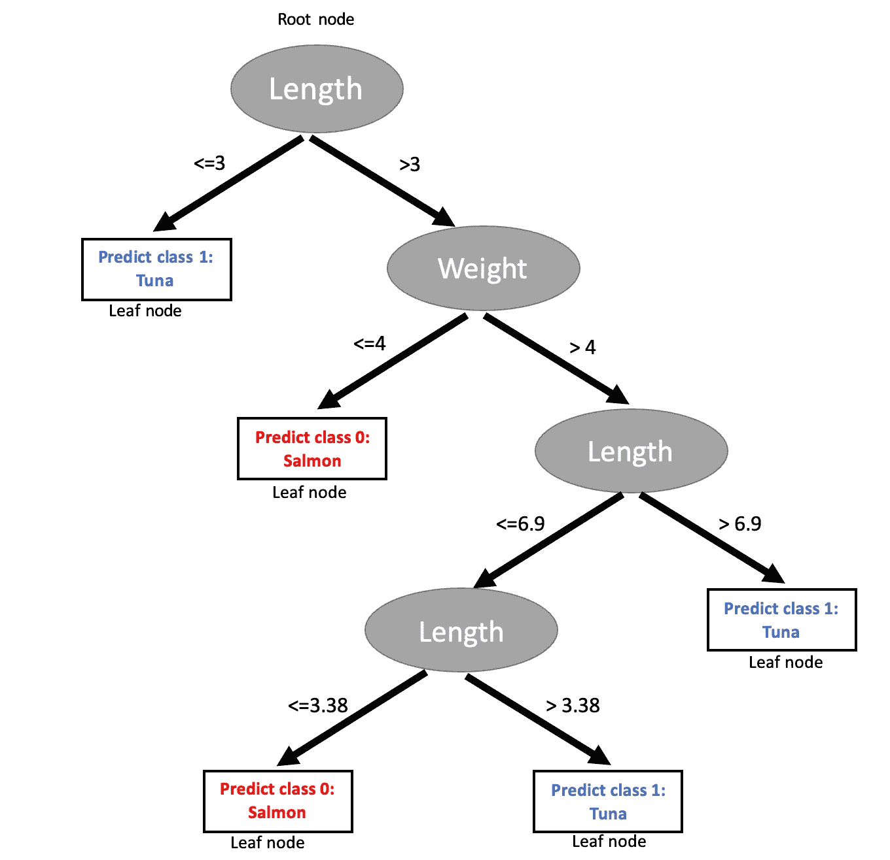
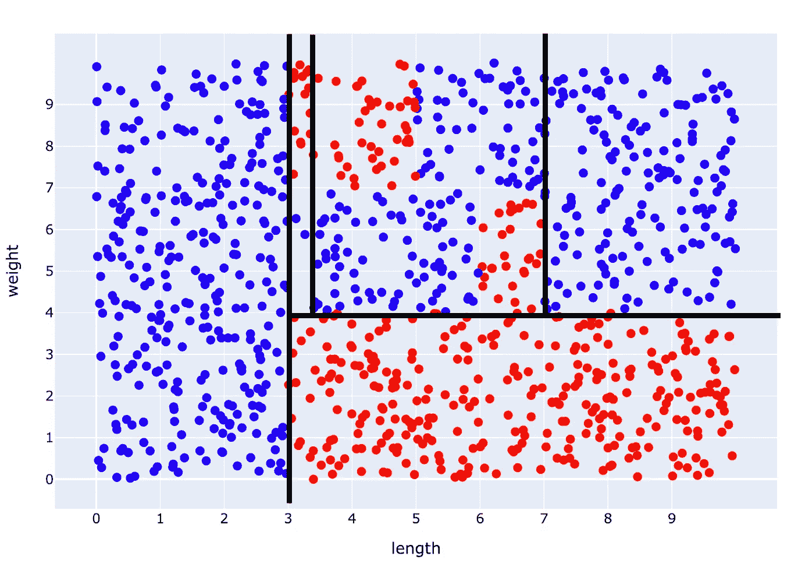

# 决策树如何知道从数据中询问下一个最佳问题？

> 原文：[`towardsdatascience.com/how-does-a-decision-tree-know-the-next-best-question-to-ask-from-the-data-0d44c9433b06`](https://towardsdatascience.com/how-does-a-decision-tree-know-the-next-best-question-to-ask-from-the-data-0d44c9433b06)

## 从零开始构建你自己的决策树分类器（使用 Python），并理解它如何使用熵来分裂节点

[](https://medium.com/@gurjinderkaur95?source=post_page-----0d44c9433b06--------------------------------)[](https://towardsdatascience.com/?source=post_page-----0d44c9433b06--------------------------------) [Gurjinder Kaur](https://medium.com/@gurjinderkaur95?source=post_page-----0d44c9433b06--------------------------------)

·发布于[Towards Data Science](https://towardsdatascience.com/?source=post_page-----0d44c9433b06--------------------------------) ·14 分钟阅读·2023 年 11 月 17 日

--


图片由[Daniele Levis Pelusi](https://unsplash.com/@yogidan2012?utm_source=medium&utm_medium=referral)拍摄，来自[Unsplash](https://unsplash.com/?utm_source=medium&utm_medium=referral)

## 介绍

决策树是多用途的机器学习算法，能够执行分类和回归任务。它们通过询问有关数据的特征的问题，使用 IF-ELSE 结构来跟随路径，最终得出预测结果。挑战在于确定在每一步决策过程中需要询问什么问题，这也等同于确定在每个决策节点上最佳分裂的方式。

在这篇文章中，我们将尝试构建一个用于简单二分类任务的决策树。本文的目的是理解在每个节点上如何使用不纯度度量（*例如熵*）来确定最佳分裂，最终构建一个基于规则的树状结构以获得最终预测结果。

为了获得关于熵和基尼不纯度（用于测量随机性并确定决策树中分裂质量的另一种度量）的直觉，可以快速查看这篇[文章](https://medium.com/@gurjinderkaur95/entropy-and-gini-index-c04b7452efbe)。

## 问题定义和数据

> **问题：** 根据鱼的长度和重量预测它是金枪鱼还是鲑鱼。

挑战在于根据鱼的*重量*和*长度*预测鱼的*类型*（目标变量）。这是一个二分类任务的示例，因为我们的目标变量*类型*有两个可能的值，即*tuna*和*salmon*。

你可以从[这里](https://github.com/gurjinderbassi/Machine-Learning/blob/main/fish.csv)下载数据集。

强烈建议你在阅读本文时进行编码，以获得最大理解 :)

## 代码跟随前提条件

让我们确保你有一切准备好开始（我敢打赌你已经准备好了，但以防万一）。

+   [***Python***](https://www.python.org/downloads/)

+   任何允许你使用 Python (.ipynb 扩展名) 笔记本的***代码编辑器***，例如 [Visual Studio Code](https://code.visualstudio.com/)、[Jupyter Notebook](https://jupyter.org/install) 和 [Google Colab](https://colab.research.google.com/?utm_source=scs-index) 等等。

+   ***库*:** [pandas](https://pandas.pydata.org/docs/getting_started/install.html) 和 [numpy](https://numpy.org/install/) 用于数据处理；[plotly](https://plotly.com/python/getting-started/) 用于可视化。（如果你愿意，可以使用任何其他的数据可视化库。）

+   [***数据***](https://github.com/gurjinderbassi/Machine-Learning/blob/main/fish.csv)，当然。

这就是我们需要的一切，很可能你已经准备好了。现在让我们开始编码吧！

## 一步步解决方案

**创建一个新的 .ipynb 文件并首先导入库。**

```py
import pandas as pd
import numpy as np
import plotly.graph_objects as go
```

**将数据读入 pandas 数据框。**

```py
# read the csv file
df = pd.read_csv("fish.csv") 

# how many rows and columns?
print(df.shape)

# print column names
print(df.columns)

# print class distribution
print(df["type"].value_counts())
```

`单元输出：`



我们的数据框中有 1000 行和 3 列。‘length’ 和 ‘weight’ 是特征，‘type’ 是目标变量。由于‘type’ 列有值——‘tuna’ 和 ‘salmon’，让我们对它们进行标签编码。

**对目标列进行标签编码：**

```py
df["type"] = df["type"].apply(lambda x: 1 if x=="tuna" else 0)
```

我们将类别标记为：`{salmon: 0 和 tuna: 1}`

现在，让我们**绘制一个散点图来可视化我们的类别。**

```py
# create a Figure
fig = go.Figure()

# specify custom colors for the plot
color_map = {
    0: "red",
    1: "blue",
}

# apply the color map to 'type' column
colors = df["type"].map(color_map)

# add a scatter trace to the figure
fig.add_trace(go.Scatter(x=df["length"], 
            y=df["weight"],
            mode="markers",
            marker=dict(color=colors, size=8)))

# add x-label, y-label and title
fig.update_layout(
    width=800,
    height=600,  
    title_text="Scatter Plot of Data",
    xaxis=dict(title="length",
               tickvals=[i for i in range(10)]),
    yaxis=dict(title="weight",
               tickvals=[i for i in range(10)])
)
```

`单元输出：`



图片由作者提供

我们现在可以清楚地看到用红色和蓝色标记的两个类别。这一切都是关于数据准备的，让我们进入决策树的部分。将特征列名称分配给一个列表，我们稍后会使用到。

```py
features = ["length", "weight"]
```

**找到我们的第一个划分**

> 在决策树中的**划分**指的是将数据分为两个（或更多）分区的 (特征, 值) 对。
> 
> 在数值特征的情况下，划分将导致数据的两个分区——一个是**特征 ≤ 值**，另一个是**特征 > 值**。
> 
> 在分类特征的情况下，划分将导致数据的两个分区——一个是**特征=值**，另一个是**特征不等于值**。

```py
# Finding the first split:

# initialize best_params which is a dictionary that will keep track
# of best feature and split value at each node.
best_params = {"feature": None, "impurity": np.inf, "split_value": None}

# for each feature in features, do the following:
### for val in all feature values 
### (starting from the min possible value of the feature until max possible value, 
### incrementing by 'step_size'), check the following:
###### if impurity at this feature val is less than previously recorded impurity, 
###### then update best_params

# Following is the code for above interpretation
for feature in features:
    curr_val = df[feature].min()
    step_size = 0.1
    while curr_val <= df[feature].max():
        curr_feature_split_impurity = compute_impurity(df, feature, curr_val)
        if curr_feature_split_impurity < best_params["impurity"]:
            best_params["impurity"] = curr_feature_split_impurity
            best_params["feature"] = feature
            best_params["split_value"] = curr_val
        curr_val += step_size
```

运行此单元将产生错误，因为我们还没有定义函数 `compute_impurity`。我们需要这个函数来比较在划分之前和之后数据的杂质。结果在划分后杂质最低的 (特征, 值) 对将被选为当前节点的最佳划分，我们将相应地更新*best_params*。

定义函数如下：

```py
def compute_impurity(df, feature, val, criterion):
    """
    Inputs:
    df: dataframe before splitting
    feature: colname to test for best split
    val: value of 'feature' to test for best split

    Output: float
    Returns the entropy after split
    """

    # Make the split at (feature, val)
    left = df[df[feature]<=val]["type"]
    right = df[df[feature]>val]["type"]

    # calculate impurity of both partitions

    if criterion=="entropy":
        left_impurity = compute_entropy(left)
        right_impurity = compute_entropy(right)
    else:
        left_impurity = compute_gini(left)
        right_impurity = compute_gini(right)

    # return weighted entropy
    n = len(df) # total number of data points
    left_n = len(left) # number of data points in left partition
    right_n = len(right) # number of data points in right partition

    return (left_n/n)*left_impurity + (right_n/n)*right_impurity
```

此函数使用另一个辅助函数 `compute_entropy`，它为给定类别列表提供熵。让我们也定义这个函数：

```py
def compute_entropy(vals):
    """
    Input:
    vals: list of 0s and 1s corresponding to two classes

    Output:
    entropy: float"""

    # probability of class labeled as 1 
    # will be equal to the average of vals
    p1 = np.mean(vals)
    p0 = (1-p1)

    # it means data is homoegeneous
    # entropy is 0 in this case
    if p1==0 or p0==0: 
        return 0

    return - (p0*np.log2(p0) + p1*np.log2(p1)) # formula of entropy for two classes
```

现在我们已经定义了两个辅助函数，再次运行之前导致错误的单元格，现在应该可以成功运行了。打印 *best_params* 字典以检查它是否已更新。

```py
print(best_params)
```

`单元格输出：`



完美！我们在 `length = 3` 处得到了第一个最佳分割，这意味着我们现在将数据分为两个分区——`data['length']<=3` 和 `data['length']>3`。

***注意：*** *在这里，我们选择结果熵最小的分割。决策树可以在此分割标准上有所不同，例如，* ***ID3 使用******信息增益*** *(即分割前数据的熵与分割后分支熵加权和的差值)，而* ***CART 使用基尼指数*** *作为它们各自的分割标准。*

下面是我们当前决策树的样子。由于左侧分支的数据只包含一个类别，我们将其设为叶节点；因此，任何 `length<=3` 的数据点都将被预测为 *金枪鱼*。

(***提醒：*** 根据我们的 color_map，我们将蓝色分配给金枪鱼，将红色分配给鲑鱼)：

```py
color_map = {
 0: "red", # salmon
 1: "blue", # tuna
}
```

对于右侧分支的数据，我们可以递归地遵循相同的过程，找到最佳分割，并对后续分支重复此过程，直到达到最大深度或不再可能进行进一步分割。



在第一次分割后可视化决策树（图像作者提供）

这个过程会对每个分区重复，直到满足停止条件（例如，树的最大深度达到，或者叶节点中的样本数量低于阈值等）。这就是当我们使用如 scikit-learn 等包中的分类器或回归器时，*超参数* 允许我们定义的内容。

**使用递归来泛化代码**

我们将把上述代码封装到一个函数 `build_tree` 中，该函数可以递归调用来构建决策树。

**辅助函数：**

`compute_entropy:` 返回具有两个类别的数据集的熵。上述定义。

`compute_gini:` 返回具有两个类别的数据集的基尼指数。我们可以选择使用熵或基尼指数作为我们的 impurity 衡量标准。

```py
def compute_gini(vals):
    """
    Input: vals is a list of 0s and 1s
    Output:
    gini: float
    """

    # probability of '1' will be equal to the average of vals
    p1 = np.mean(vals)
    p0 = (1-p1) # since there are just two classes and p0+p1 = 1

    if p1==0 or p0==0:
        return 0

    return 1 - p1**2 - p0**2
```

`compute_impurity:` 是上述 compute_impurity 函数的扩展，它返回数据集的 *impurity*。它使用 `compute_entropy` 和 `compute_gini` 函数根据指定的标准计算给定分割点的熵和基尼指数。

```py
def compute_impurity(df, feature, val, criterion):
    """
    Inputs:
    df: dataframe before splitting
    feature: colname to test for best split
    val: value of 'feature' to test for best split

    Output: float
    Returns the entropy after split
    """

    # Make the split at (feature, val)
    left = df[df[feature]<=val]["type"]
    right = df[df[feature]>val]["type"]

    # calculate impurity of both partitions

    if criterion=="entropy":
        left_impurity = compute_entropy(left)
        right_impurity = compute_entropy(right)
    else:
        left_impurity = compute_gini(left)
        right_impurity = compute_gini(right)

    # return weighted entropy
    n = len(df) # total number of data points
    left_n = len(left) # number of data points in left partition
    right_n = len(right) # number of data points in right partition

    return (left_n/n)*left_impurity + (right_n/n)*right_impurity
```

`get_best_params:` 返回包含当前节点分割所用特征和值的 *best_params* 字典。

```py
def get_best_params(df, features, criterion):
    """
    A function to determine the best split at a node

    Input:
    df: dataframe before split
    features: list of features
    criterion: impurity measure to use (gini or entropy)

    Output: 
    best_params: dict
    """

    # Initialize best_params
    best_params = {"feature": None, "val": None, "impurity": np.inf}

    # iterate for all features
    for feature in features:
        curr_val = df[feature].min()
        step_size = 0.1
        # iterate for all values for a feature (according to step_size)
        while curr_val<=df[feature].max():
            # calculate impurity (gini or entropy) for the current value of feature
            impurity = compute_impurity(df, feature, curr_val, criterion)

            # update best_params if impurity is less than previous impurity
            if impurity <= best_params["impurity"]:
                best_params["feature"] = feature
                best_params["val"] = curr_val
                best_params["impurity"] = impurity
            curr_val += step_size

    best_params["val"] = np.round(best_params["val"], 2)
    best_params["impurity"] = np.round(best_params["impurity"], 2)

    return best_params
```

**主函数**

`build_tree:` 这是主要的驱动函数，它利用辅助函数递归地为给定的数据构建决策树。我还添加了一些额外的语句，试图在创建过程中以可解释的格式打印决策树。

```py
def build_tree(data, features, curr_depth=0, max_depth=3, criterion="entropy"):
    """A function to buil the decision tree recursively.

    Input:
    data: dataframe with columns length, weight, type
    features: ['length', 'weight']
    curr_depth: Keep track of depth at current node
    max_depth: Decision tree will stop growing if max_depth reached
    criterion: "gini" or "entropy" 

    """

    # Base case: max depth reached 
    if curr_depth >= max_depth:
        classes, counts = np.unique(data['type'].values, return_counts=True)
        predicted_class = classes[np.argmax(counts)]
        print(("--" * curr_depth) + f"Predict: {predicted_class}")
        return

    # Get the best feature and value to split the data
    best_params = get_best_params(data, features, criterion)

    # Base case: pure node, single class case
    if best_params["impurity"] == 0:
        predicted_class = data['type'].iloc[0]
        print(("--" * curr_depth) + f"Predict: {predicted_class}")
        return

    # If there's no feature that can improve the purity (not possible to split)
    if best_params["feature"] is None:
        predicted_class = data['type'].iloc[0]
        print(("--" * curr_depth) + f"Predict: {predicted_class}")
        return

    # Print the current question (decision rule)
    best_feature = best_params["feature"]
    best_split_val = best_params["val"]
    question = f"Is {best_feature} <= {best_split_val}?"
    print(("--" * (curr_depth*2)) + ">" + f"{question}")

    # Split the dataset
    left_df = data[data[best_feature] <= best_split_val]
    right_df = data[data[best_feature] > best_split_val]

    # Recursive calls for left and right subtrees
    if not left_df.empty:
        print(("--" * curr_depth) + f"Yes ->")
        build_tree(left_df, features, curr_depth + 1, max_depth, criterion)

    if not right_df.empty:
        print(("--" * curr_depth) + f"No ->")
        build_tree(right_df, features, curr_depth + 1, max_depth, criterion)
```

现在，我们可以传递我们的鱼数据集并测试代码的输出，如下所示。

```py
build_tree(df, ["length", "weight"], max_depth=4, criterion="entropy")
```

`单元格输出：`



以下是我们最终决策树的样子：



图片来源：作者

这对应于以下决策边界：



图片来源：作者

**注意：** 如果叶节点不是纯净的，即叶节点分区中有多个类别，会发生什么？*只需选择多数类别。*

## 代码链接

你可以从[这里](https://github.com/gurjinderbassi/Machine-Learning/blob/main/Decision%20Tree%20-%20Fish%20dataset.ipynb)获取最终的代码笔记本。

# 主要收获

如果你已经读到这里，你会对许多与决策树相关的重要问题有更清晰的认识，比如*可解释性*作为优点，以及*过拟合*作为主要缺点——你可能在之前接触决策树时已经遇到过。我们不能在这里忽略这些话题，所以简单提及一下。

让我们先来看看优点。还有更多，但我们只列出最重要的几个。

## 决策树的（主要）优点是什么？

+   ***可解释性：*** 决策树的预测相较于其他机器学习模型更易于解释，因为我们可以直观地查看达到最终预测所遵循的路径。

> 决策树直观且易于解释，即使对非技术人员也是如此。

例如，假设一家银行使用决策树预测是否应根据客户的属性（如收入、银行余额、年龄、职业等）向客户授予贷款。如果分类系统建议银行不应向客户提供贷款，那么银行需要制定适当的回应，说明拒绝的理由。否则，这可能会损害他们的业务和声誉。

+   ***无需重度预处理：*** 与其他一些机器学习模型不同，决策树不要求数据进行归一化（或标准化）。

> 你只需进行最少的数据预处理，决策树也不会太在意。

此外，它可以自然地处理分类特征，我们不需要担心独热编码（或其他解决方案），因为不同的类别在分裂时会被视为不同的分支。

## 主要缺点——> 过拟合

> 过拟合是指我们的模型好得不真实，即模型对训练数据的适应过于紧密，以至于丧失了泛化能力，无法在面对测试数据时表现出类似的准确度。

**决策树如果控制不当，非常容易过拟合。** 注意在我们上述的例子中，如果我们不断地分裂训练数据而不设定任何限制，那么决策树将不断创建更多的决策边界，学习训练数据中的噪声。

为了保持模型的泛化能力，采取措施避免过拟合是非常重要的。在决策树的情况下，我们可以采取以下**防止过拟合的步骤：**

1.  *预剪枝：* 剪枝指的是防止决策树达到其最大容量。可以通过以下方式主动进行：

+   设置*max_depth:* 不允许树的深度超过预定义的深度。

+   设置*min_samples_split:* 如果决策节点处的样本数量低于此值，则不允许分裂发生。

+   设置*min_samples_leaf:* 如果任何结果叶节点处的样本数量低于此值，则不允许分裂发生。

这些（以及许多其他的）是我们在通过诸如 scikit-learn 这样的包实现决策树时可以根据需要调整的***超参数***。你可以在这个[文档](https://scikit-learn.org/stable/modules/generated/sklearn.tree.DecisionTreeClassifier.html)中找到所有超参数及其定义。

*2\. 后剪枝：* 指的是让决策树在其最大容量下生长，然后丢弃一些看起来不必要或导致高方差的部分/分支。

3\. 另一种可能的解决方案是：*不要使用决策树！* 而是选择它们的高级版本——比如*随机森林或梯度提升树 :)* 这仍然需要你对前者有基本了解，因此阅读这篇文章绝对不会浪费时间！

## 奖励积分

还有一些决策树的其他特性值得注意：

+   **非参数**：决策树是非参数机器学习模型，这意味着它们对训练数据的分布、特征的独立性等不做假设。

+   **贪心算法**：决策树遵循贪心算法，这意味着它们选择在给定节点处认为最好的分裂（*即*，局部最优解），且无法回溯，从而可能导致次优解。

# 结论

在这篇文章中，我们学习了如何在没有使用任何包的情况下为二分类任务构建决策树，以在概念层面上打下坚实的基础。我们通过逐步过程理解了如何使用数据不纯度度量（如熵）在每个节点生成决策规则，然后在 Python 中实现了递归算法以输出最终的决策树。这篇文章的目的是通过深入了解决策树的基本原理。

实际上，当处理现实世界的数据和面临挑战时，我们通常不需要从零开始做这些工作，因为有许多现成的包可以使事情变得更方便和稳健。但拥有扎实的基础会帮助我们更好地利用这些包，同时在使用时也会更有信心。

希望下次当我们构建下一个决策树或随机森林（这是一组决策树的集成）时，我们能在配置模型时更加周到（并且更容易理解超参数的真正含义 😺）。

希望这些内容对你有所帮助。欢迎提供任何反馈或建议。

我想感谢 [Ritvik Kharkar](https://medium.com/u/ddca178f703?source=post_page-----0d44c9433b06--------------------------------) 的精彩 YouTube 视频，帮助我更好地理解了决策树的概念。我从他的录像中获得了灵感，写了这篇文章，使用了他用的相同例子，并通过添加递归实现和打印决策树的逻辑将解决方案推进了一步。他的视频链接在下面的参考文献中。

# **相关阅读**

+   **想要理解 impurity measures 背后的直觉？** 请查看这篇关于熵和基尼指数的文章：

[](https://medium.com/@gurjinderkaur95/entropy-and-gini-index-c04b7452efbe?source=post_page-----0d44c9433b06--------------------------------) [## 熵和基尼指数

### 理解这些指标如何帮助我们量化数据集中的不确定性

medium.com](https://medium.com/@gurjinderkaur95/entropy-and-gini-index-c04b7452efbe?source=post_page-----0d44c9433b06--------------------------------)

+   **如何评估决策树分类器？** 请查看下面的文章，了解不同的分类模型评价指标：

[](https://medium.com/@gurjinderkaur95/evaluation-metrics-for-classification-beyond-accuracy-1e20d8c76ba0?source=post_page-----0d44c9433b06--------------------------------) [## 分类的评价指标 - 超越准确率

### 展开混淆矩阵、精准率、召回率、F1 分数和 ROC 曲线

medium.com](https://medium.com/@gurjinderkaur95/evaluation-metrics-for-classification-beyond-accuracy-1e20d8c76ba0?source=post_page-----0d44c9433b06--------------------------------)

# 参考文献

[1] Aurélien Géron, (2019). *Hands-on machine learning with Scikit-Learn, Keras and TensorFlow: concepts, tools, and techniques to build intelligent systems* (第 2 版). O’Reilly.

[2] ritvikmath 的 YouTube [视频](https://youtu.be/dCez6oGZilY?si=slDWXQG5ZJgSv36W)

[3] [StatQuest](https://www.youtube.com/watch?v=_L39rN6gz7Y&ab_channel=StatQuestwithJoshStarmer)
