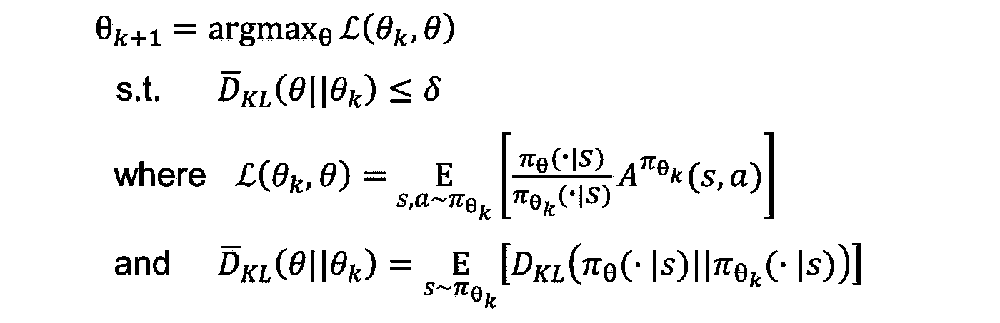
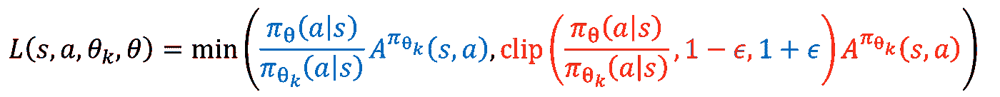
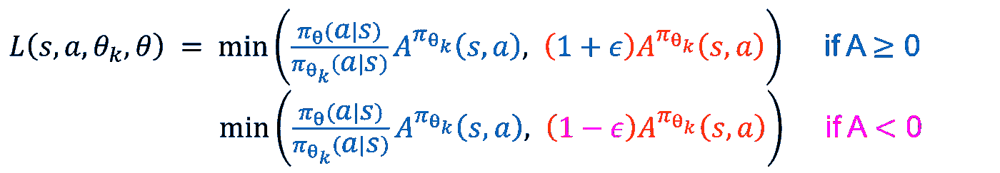
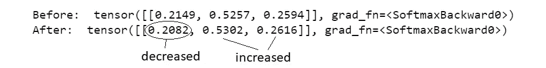
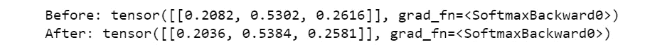

# PPO 的剪切如何工作？

> 原文：[`towardsdatascience.com/how-does-ppo-with-clipping-work-eff71a7a974a`](https://towardsdatascience.com/how-does-ppo-with-clipping-work-eff71a7a974a)

## 直观 + 数学 + 代码，针对实践者

[](https://medium.com/@byjameskoh?source=post_page-----eff71a7a974a--------------------------------)[](https://towardsdatascience.com/?source=post_page-----eff71a7a974a--------------------------------) [詹姆斯·科，博士](https://medium.com/@byjameskoh?source=post_page-----eff71a7a974a--------------------------------)

·发表于 [Towards Data Science](https://towardsdatascience.com/?source=post_page-----eff71a7a974a--------------------------------) ·9 min 阅读·2023 年 10 月 7 日

--


图片由 [Tamanna Rumee](https://unsplash.com/@tamanna_rumee?utm_source=medium&utm_medium=referral) 提供，[Unsplash](https://unsplash.com/?utm_source=medium&utm_medium=referral)

在强化学习中，近端策略优化（PPO）通常被引用作为策略方法的例子，相对于 DQN（基于价值的方法）和包括 TD3 和 SAC 在内的大量 actor-critic 方法。

我回想起之前第一次学习时，我感到不信服。许多老师采用了一种模糊的方法。我不接受这种做法，你也不应如此。

在这篇文章中，我将尝试解释 PPO 如何工作，通过直观和代码来支持数学。你可以尝试不同的场景，亲自验证它不仅在原则上有效，而且在实践中也有效，并且没有 cherry picking。

# 为什么要费心？

PPO 和其他 SOTA 模型可以在几分钟内使用 stable-baselines3（sb3）实现。任何遵循文档的人都可以运行它，而无需了解底层模型。

然而，无论你是实践者还是理论家，基础知识确实重要。如果你仅仅把 PPO（或任何模型）当作一个黑箱，你怎么指望你的用户对你提供的结果有信心呢？

我将在本月晚些时候进行详细的代码讲解，编写一个包装器，使任何环境，无论是来自 Gymnasium 还是你自己的环境，都能与任何 sb3 模型兼容，无论空间是‘*Discrete*’还是‘*Box*’。（上个月，我展示了如何从 TD(λ)派生出 Monte Carlo、SARSA 和 Q-learning，所有这些都是通过一套代码实现的。）

够了，明天再谈，现在就让我们在这里吧！

# PPO 的前身

Vanilla 策略梯度是基于策略方法中的最基本情况，其中策略是直接学习和更新的，而不是从某些价值函数推导出来的。缺点是策略更新的方差很高，这对收敛性是一个问题，特别是在奖励稀疏的环境中。

## TRPO 的数学

TRPO（Trust Region Policy Optimization）确保新的策略（其中“新”指的是更新后）不会偏离旧策略太远。这是通过施加一个约束来实现的，即新策略相对于旧策略的 KL 散度不超过某个阈值*δ*。



PPO 的目标。公式由作者输入，参考[OpenAI Spinning Up](https://spinningup.openai.com/en/latest/algorithms/trpo.html)。

注意每个策略*π*_{*θ*}本身是一个分布。*D_{KL}*，带有“帽子”，是相对于旧策略下访问的状态的 KL 散度的（加权）平均值。KL 散度本身是概率比的对数的平均值，根据第一个分布加权。


KL 散度公式用于两个离散分布*p*和 q 之间。对于连续分布，我们将有概率密度和积分替代求和。公式由作者提供。

目标函数是替代优势，它是一个比率（新策略下的动作概率除以对应于旧策略的概率）乘以优势。这个优势是相对于某些基准的期望回报，基准可以简单地是相应状态值的移动平均。

我们有一个约束优化问题，使用拉格朗日乘子和共轭梯度法来解决。目标和约束通过泰勒展开线性化，因此解决方案是近似的。为了确保满足约束，使用回溯线搜索来调整策略更新中的步长。

（这是我设定的界限，不再深入探讨。上述内容对应于 Level 7xx 课程，实践者可以跳过；了解描述的方向在我看来已经足够了。）

## TRPO 的直觉

+   如果一个动作是有利的，即**A > 0**，我们希望增加其概率。更新策略后，它应该被更频繁地选择。

+   如果一个动作是不利的，即**A < 0**，我们希望降低其概率。*L*是负的，我们希望它更不负，以最大化目标。

+   小的 KL 散度意味着在旧政策和新政策下每个动作的概率保持接近。在极端情况下，我们有 log(1)，这使得 KL 散度为零。

# 过渡到 PPO

解决约束优化问题涉及回溯线搜索（即每次用较小的步长重复计算，直到满足约束）以及计算包含二阶偏导数的 Hessian 矩阵。我们可以简化这一过程吗？

TRPO 论文的第一作者在 2015 年提出了改进模型，并在 2017 年作为第一作者发表了 PPO。即便在今天（2023 年），PPO 仍然被广泛使用。

## PPO 的数学

我将减少数学内容，所以请继续跟随我！有不同的 PPO 变体，我们将在这里讨论‘clip’版本，这也是 sb3 使用的版本。

不通过对 KL 散度施加约束，而是修改目标函数，使其不受政策大幅变化的影响。我们仍然尝试增加有利动作的概率（并减少不利动作的概率），但概率比大幅高于（或低于）1 的影响被裁剪所限制。

ϵ 通常选择 0.2。这个值也在原始论文中使用。



TRPO 的目标。作者编写的方程，参考 [OpenAI Spinning Up](https://spinningup.openai.com/en/latest/algorithms/trpo.html)。

[论文](https://arxiv.org/pdf/1707.06347.pdf)的图 1（第 3 页）显示了 (1 + ϵ) 或 (1 — ϵ) 的因子，根据优势是正还是负，二者都对目标函数设置了*上界*。下面的图示更直观：



简化方程，取决于优势 A 的值。

不要被‘min’运算符搞混。我们希望优化目标 *L* 使其尽可能高（积极）。‘min’运算符仅用于 (1 + ϵ) 或 (1 — ϵ) 的作用形成上限。

## PPO 的直观理解

+   如果**A > 0**，当概率比高于 1 时，我们的目标函数 *L* 较大（更积极），即新策略更频繁地选择*有利*的动作。然而，由于 (1 + ϵ)，存在一个**上界**。

+   如果**A < 0**，当概率比低于 1 时，我们的目标函数 *L* 较大（较少负值），即新策略更频繁地选择*不利*的动作。然而，由于 (1 - ϵ)，存在一个**上界**。

+   梯度更新可以使用常规的 pytorch 或 tensorflow 轻松完成。

# 代码

首先让我们说服大家，梯度更新是有效的，不涉及任何裁剪。

## 1 层

我们建立了一个简单的单层神经网络，输入维度为 1 的状态，输出在 3 个可能选择之间的动作概率。

```py
import torch
import torch.nn as nn
import torch.optim as optim
import numpy as np

torch.manual_seed(0)

class PolicyNetwork(nn.Module):
    def __init__(self, n_in=1, n_out=3):
        super(PolicyNetwork, self).__init__()
        self.fc = nn.Linear(n_in, n_out)
        self.softmax = nn.Softmax(dim=1)

    def forward(self, x):
        x = self.fc(x)
        return self.softmax(x)
```

你可以有多维状态，甚至是图像，概念依然有效——对于某个给定状态，神经网络给出总和为 1 的概率。

## 无裁剪

现在，让我们指定一个状态。对于本练习，它可以是任何常数。在实际操作中，这个状态是通过对环境的观察获得的，并且完全独立于参数θ，即在计算梯度时将其视为常数。

优势可以通过广义优势估计（如有兴趣，请参见上述引用的 Schulman *et al*. 2017 年论文的公式 11）来计算。它结合了来自多个时间区间的信息，试图平衡偏差和方差之间的权衡，类似于 TD(λ)。

```py
policy = PolicyNetwork()
optimizer = optim.Adam(policy.parameters(), lr=0.01)

state = torch.tensor([[1.]])

pi = policy(state)
print("Before: ", pi)

advantages = torch.tensor([[-2., 0., 0.]], requires_grad=True)
loss = -torch.sum(pi * advantages)

optimizer.zero_grad()
loss.backward()
optimizer.step()

pi = policy(state)
print("After: ", pi)
```

对于本练习，我们任意指定了第一行动的负面优势，模拟了第一次行动带来负面优势的情况。这是为了验证参数是否更新，使得第一行动的概率减少。



上面代码单元的输出，其中第一次行动导致负面收益

实际上，在梯度更新后，策略输出了较低的第一行动概率和较高的其他行动概率。

## 使用 Clip

现在，我们将实现剪切方面。为了首先检查正确性，将进行一次更新。这次，假设第二行动被执行，估计的优势为 1.8。

注意，在求和乘积时添加了负号，以得到损失（在此基础上将进行反向传播）。这是因为我们希望最大化目标函数，并进行梯度下降。

```py
epsilon = 0.2

old_policy = PolicyNetwork()
old_policy.load_state_dict(policy.state_dict())

pi_old = old_policy(state)
r = pi / pi_old

advantages = torch.tensor([[0., 1.8, 0.]], requires_grad=True)

clipped_ratio = torch.clamp(r, 1 - epsilon, 1 + epsilon)
ppo_objective = torch.min(r * advantages, clipped_ratio * advantages)
loss = -torch.sum(ppo_objective)

print("Probabilities before update:", policy(state))

optimizer.zero_grad()
loss.backward()
optimizer.step()

print("Probabilities after update:", policy(state))
```



上面代码单元的输出，其中第二行动导致了正面收益

到目前为止，一切顺利。当采取一种有利的行动时，更新策略会增加该行动的概率。现在，我们将考虑许多迭代的净效果，其中每种不同的行动都被多次执行。

你可能会说，在现实中，优势是有噪声的，使用常数是不公平的。你说得对！让我们通过`np.random.randn()`添加随机噪声。

```py
num_iterations = 500
advatange_dict = {
    0: [-2., 0., 0.],
    1: [0., 1.8, 0.],
    2: [0., 0., 0.1],
}
np.random.seed(2023)

for i in range(num_iterations):
    pi = policy(state)
    pi_old = old_policy(state)
    r = pi / pi_old
    old_policy.load_state_dict(policy.state_dict())

    noisy_advantange = [
        x+np.random.randn() for x in advatange_dict[i%3] if x != 0
    ]
    advantage = torch.tensor(noisy_advantange, requires_grad=True)
    ppo_objective = torch.min(
        r * advantage, 
        torch.clamp(r, 1 - epsilon, 1 + epsilon) * advantage
    )
    loss = -torch.sum(ppo_objective)

    optimizer.zero_grad()
    loss.backward()
    optimizer.step()

print("After: ", pi)
```

经过 500 次迭代，包括噪声，我们在给定状态下得到了以下行动概率。（当然，我们可以轻松扩展这个环境以考虑不同的状态。）


上面代码单元的输出，其中多次执行行动，并添加了噪声

我们可以看到，所有更新的净效果使得第二种行动的概率增加，而其他行动的概率减少。（我们开始时的概率为[0.2149, 0.5257, 0.2594]。）

尽管最后一个动作具有正的均值优势，这种情况仍然存在。这是因为梯度不仅依赖于优势的符号，还依赖于其大小。每次执行最后一个动作时，概率在更新后会增加，但在执行第二个动作时，更新的影响会抵消这一增加。

最后，让我们看看剪切的实际效果。重复上述单元（其中`epsilon` ϵ 设置为 0.2），但这次将其设置为更小的值，比如 0.02。


以较小的 epsilon 值重新运行代码时的输出

很好！我们看到剪切确实有效！通过使用更小的ϵ，策略的变化幅度确实较小，尽管仍朝着期望的方向变化。

# 结论

在这篇文章中，我们探讨了 PPO 的起源。数学部分仅保留了最基本的内容——足以让从业者向其他利益相关者展示这些思想，而不会被详细的推导所淹没。我们从数学中获得了关键的直觉，以理解 PPO 的工作原理。

此外，你现在拥有了代码来证明 PPO 的基本组件确实实现了其承诺。我们看到，即使添加了噪声，最有利的动作的概率也有所增加。此外，我们发现，通过收紧剪切，得到的策略变化的幅度较小。
