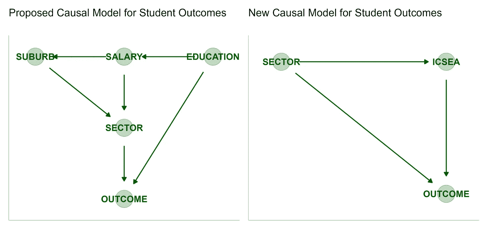
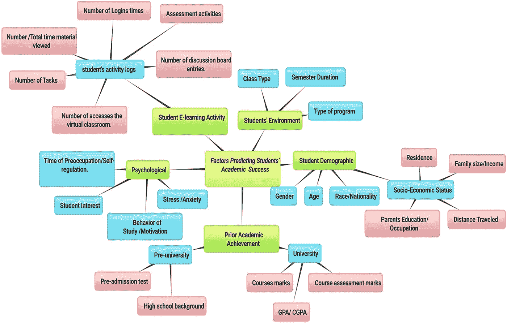
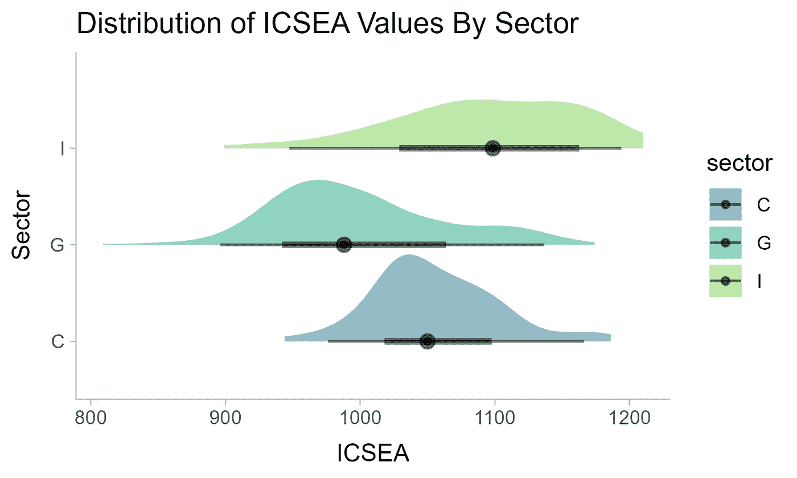
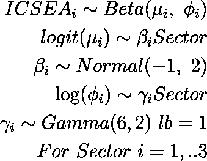
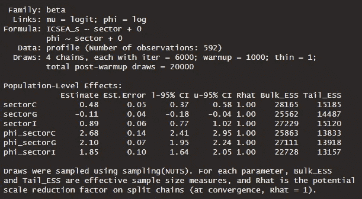
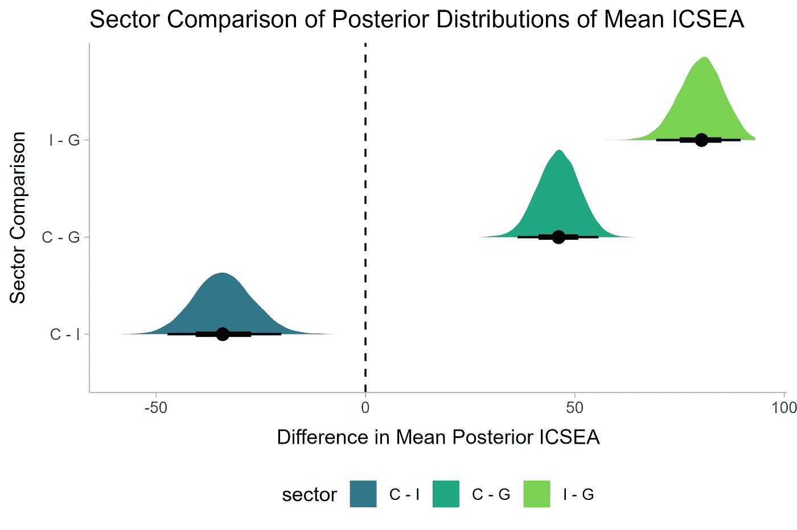
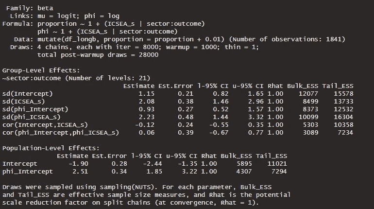
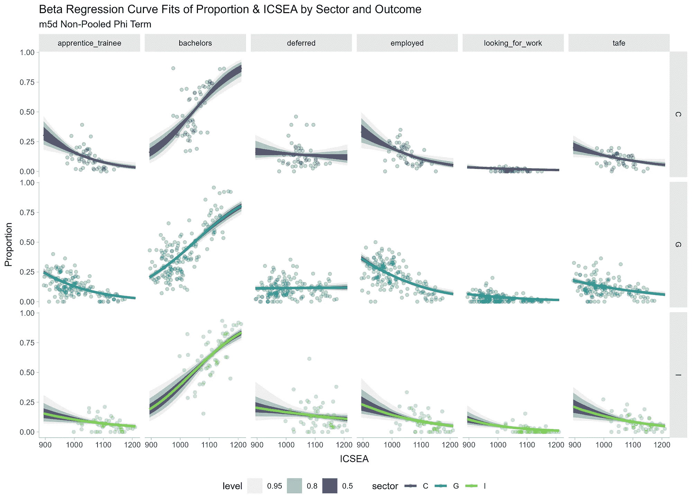
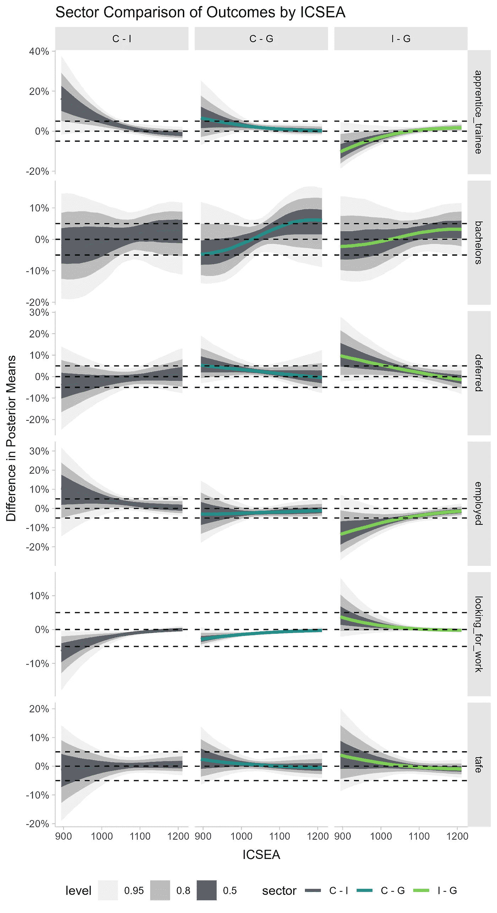
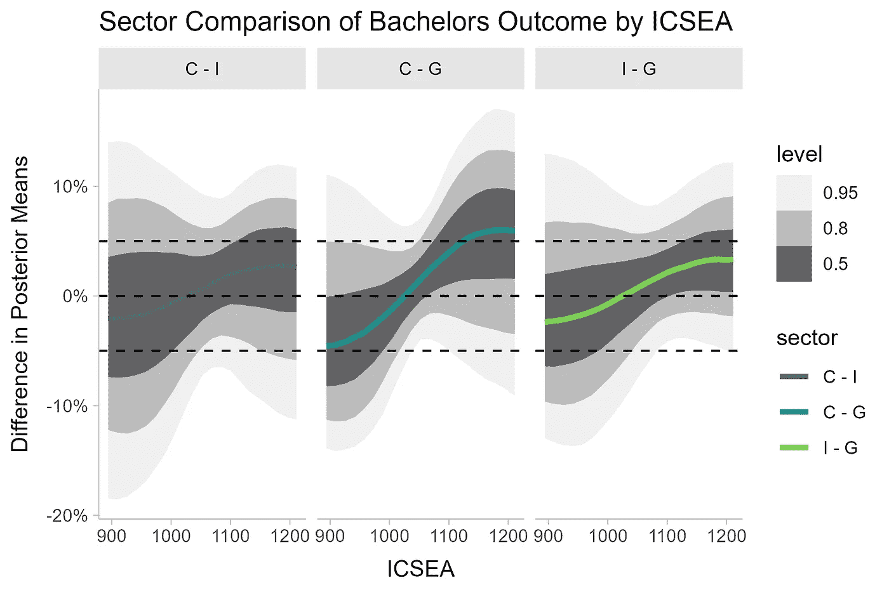

# 社会教育指数如何影响学校离校结果？ — 用 R 和 brms 进行的贝叶斯分析

> 原文：[`towardsdatascience.com/how-does-socio-educational-index-influence-school-leaver-outcomes-f32a899d53de`](https://towardsdatascience.com/how-does-socio-educational-index-influence-school-leaver-outcomes-f32a899d53de)

## ANCOVA — 贝叶斯风格

[](https://mmgillin.medium.com/?source=post_page-----f32a899d53de--------------------------------)[](https://towardsdatascience.com/?source=post_page-----f32a899d53de--------------------------------) [Murray Gillin](https://mmgillin.medium.com/?source=post_page-----f32a899d53de--------------------------------)

·发布于 [Towards Data Science](https://towardsdatascience.com/?source=post_page-----f32a899d53de--------------------------------) ·阅读时间 11 分钟·2023 年 9 月 12 日

--

在**上一篇文章**对学校部门和高等教育结果之间的比例差异进行了解释并得到非常积极的反馈之后，让我们进一步探讨一下。我们指出该模型并不旨在展示因果关系，仅仅是描述性的。我们预先说明了在因果模型中可能需要考虑的众多因素。事实证明，确实存在一个代理指标，即 ICSEA 或社区社会教育优势指数。

[](/a-bayesian-comparison-of-school-leaver-outcomes-with-r-and-brms-4da9ae5f9895?source=post_page-----f32a899d53de--------------------------------) ## 用 R 和 brms 进行的学校离校结果贝叶斯比较

### ANOVA — 贝叶斯风格

towardsdatascience.com

在上一篇文章的基础上，我们将探讨 ICSEA 与各部门比例结果之间是否存在因果关系，进行一个贝叶斯 ANCOVA 工作流。


图片来源：[Vasily Koloda](https://unsplash.com/@napr0tiv?utm_source=medium&utm_medium=referral) 在 [Unsplash](https://unsplash.com/?utm_source=medium&utm_medium=referral)

## 背景

在开始建模之前，让我们发展我们的因果模型和理解。[ICSEA](https://www.myschool.edu.au/faqs#13) 是一个识别学校社会教育优势的尺度。这是由[ACARA](https://www.acara.edu.au/)（澳大利亚课程评估报告局）计算的指标，考虑了父母的教育背景和职业、学生的土著身份以及学校的地理位置。ICSEA 的平均值设定为 1000，标准差为 100，因此较高的 ICSEA 值表示具有更高社会教育优势的学校。

有许多因素可能影响学生的表现和成果。我们将其简化为下面更具体的内容。从左侧开始，我们可以合理地预期父母的教育水平会影响他们孩子的个人抱负，父母的教育水平将影响他们的薪资，从而影响他们能够负担的社区，使他们接近某些部门的学校。我们将合理假设富裕地区的独立学校和天主教学校的比例高于政府学校。这些是许多需要整理、总结并创建回归模型以测试因果假设的领域和数据点。幸运的是，ICSEA 是大多数这些输入变量的魔法代理测量，因此右侧是我们的简化因果模型。



学生成果的因果图 — 作者提供的图片

学术文献对此进行了广泛探讨。下文中的综述论文，由 Alyahyan & Düştegör 提供，概述了一系列可能影响学术成功的因素。我们可以看到这是一个极其复杂的关系网络，涉及心理、社会、经济和环境因素。

[## 预测高等教育中的学术成功：文献综述和最佳实践…](https://educationaltechnologyjournal.springeropen.com/articles/10.1186/s41239-020-0177-7?source=post_page-----f32a899d53de--------------------------------)

### 学生成功在教育机构中扮演着至关重要的角色，因为它通常被用作机构的衡量标准…

[educationaltechnologyjournal.springeropen.com](https://educationaltechnologyjournal.springeropen.com/articles/10.1186/s41239-020-0177-7?source=post_page-----f32a899d53de--------------------------------) 

影响学生学术成功预测的因素总结 — 图片来源于参考文献 [1]，采用 CC BY 4.0 许可证

让我们不要弄混水，因为成功是一个主观的术语，源于一些期望的结果。

我们的研究问题是关于理解不同部门之间 ICSEA 水平在结果上的差异，这是一种微妙但重要的区别。

## 加载库和数据集

ACARA 是澳大利亚课程评估报告机构，他们为全国所有学校发布 ICSEA 和其他绩效指标，[点击此处](https://www.acara.edu.au/docs/default-source/default-document-library/school-profile-2022.xlsx) 查看。这一数据集在 [CC BY 4.0](https://www.acara.edu.au/contact-us/copyright) 许可下提供。与之前一样，我们将从 [维多利亚州政府的 On Track 调查](https://discover.data.vic.gov.au/dataset/2021-on-track-survey-year-12-or-equivalent-completers-post-school-destinations) 中加载数据，该调查为 2021 年毕业生的离校去向调查，同样在 CC BY 4.0 许可下提供。

下面我们进行一些基本清理，然后将两个数据集 profile 和 df_long 合并，创建 df_longb，其中包含我们的部门、结果、比例以及每个学校对应的 ICSEA 分数。两个学校没有 ICSEA 分数，因此已被移除。

```py
library(tidyverse)
library(brms)
library(tidybayes)
library(readxl)
df <- read_excel("DestinationData2022.xlsx", 
    sheet = "SCHOOL PUBLICATION TABLE 2022", 
    skip = 3)
colnames(df) <- c('vcaa_code', 'school_name', 'sector', 'locality', 'total_completed_year12', 'on_track_consenters', 'respondants', 'bachelors', 'deferred', 'tafe', 'apprentice_trainee', 'employed', 'looking_for_work', 'other') 

df <- drop_na(df)

df2 <- df |> 
  mutate(across(5:14, ~ as.numeric(.x)), #convert all numeric fields captured as characters
         across(8:14, ~ .x/100 * respondants), #calculate counts from proportions
         across(8:14, ~ round(.x, 0)), #round to whole integers
         respondants = bachelors + deferred + tafe + apprentice_trainee + employed + looking_for_work + other, #recalculate total respondents
         filter(sector != 'A') #remove A schools (low volume)

df_long <- df2 |>
  select(sector, school_name, 7:14) |> 
  pivot_longer(c(-1, -2, -3), names_to = 'outcome', values_to = 'proportion') |> 
  mutate(proportion = proportion/respondants)

profile <- read_excel("school-profile-2022.xlsx", 
    sheet = "SchoolProfile 2022") |> #From ACARA
  filter(State == 'VIC' & `School Type` %in% c('Secondary', 'Combined')) |> 
  select(`School Sector`, `School Name`, ICSEA, `ICSEA Percentile`) |> 
  drop_na() |> 
  mutate(`School Sector` = substr(`School Sector`, 1, 1),
         ICSEA_s = ((ICSEA - min(ICSEA-1)) / (max(ICSEA+1) - min(ICSEA-1))))

colnames(profile) <- c('sector', 'school_name', 'ICSEA', 'Percentile', 'ICSEA_s', 'percentile_d', 'percentile_c')

df_longb <-
  df_long |> 
  mutate(school_name = str_to_upper(school_name)) |> 
  left_join(profile |> mutate(school_name = str_to_upper(school_name))) |> 
  drop_na()
```

## 探索性数据分析

我们的数据集已经准备好，可以开始可视化感兴趣的特征了。

```py
profile |> 
  ggplot(aes(y = sector, x = ICSEA, fill = sector)) +
    stat_halfeye(alpha = 0.5) +
    theme_ggdist() +
    scale_fill_viridis_d(begin = 0.4, end = 0.8) +
    labs(title = 'Distribution of ICSEA Values By Sector', y = 'Sector')
```



各学校部门的 ICSEA 分数分布 — 图片由作者提供

有趣的是，可能并不意外的是公立学校的方差最大，而独立学校的中位数最高。

## 贝叶斯方差分析 — 估计 ICSEA 后验均值的差异

首先，我们检查 ICSEA 各部门之间的差异是否真实，如同前一篇文章，我们将进行贝叶斯方差分析。这也开始解决我们 DAG 的第一部分，即 ICSEA 与部门之间的关系。我们已指示模型提供每个部门层级的 mu 和 phi 参数值。



m4e 模型的数学公式 — 图片由作者提供

```py
m4e <- 
  brm(bf(ICSEA_s ~ sector + 0,
         phi ~ sector + 0),
      family = Beta,
      data = profile,
      prior = c(prior(normal(-1, 2), class = 'b'),
                prior(gamma(6, 2), class = b, dpar = phi, lb = 1)),
      seed = 246, warmup = 1000, iter = 6000, cores = 4, chains = 4, save_pars = save_pars(all = T)) |> 
  add_criterion(c('waic', 'loo'), moment_match = T)

summary(m4e)
```

我们决定使用最小-最大缩放 ICSEA，以便我们可以通过 Beta 似然函数进行建模，因此 mu 和 phi 参数分别使用对数几率和对数链接函数。

实质上，均值的贝塔项将是每个部门均值百分位的对数值，基于重新缩放的 ICSEA 值。



m4e 模型的总结输出 — 图片由作者提供

让我们简要地对每个部门进行后验预测检查，以查看模型是否合理地捕捉了观察到的数据。

```py
alt_df <- profile |> 
  select(sector, ICSEA) |> 
  mutate(y = 'y', 
         draw = 99)

sim_df <- tibble(sector = c('C', 'I', 'G')) |> 
  add_predicted_draws(m4e, ndraws = 1200, seed = 246) |> #generates 1200 posterior draws for each sector
  mutate(ICSEA = (.prediction * (1211 - 808) + 808)) |> #rescale ICSEA back
  ungroup() |> 
  mutate(y = 'y_rep',
         draw = rep(seq(from = 1, to = 20, length.out = 20), times = 180)) |> #draws 
  select(sector, ICSEA, draw, y) |> 
  bind_rows(alt_df)

sim_df |> 
  ggplot(aes(ICSEA, group = draw)) +
    geom_density(aes(color = y)) +
    facet_grid(~ sector) +
    scale_color_manual(name = '', 
                       values = c('y' = "darkblue",
                                  'y_rep' = "grey")) +
    theme_ggdist() +
    labs(y = 'Density', x = 'y', title = 'Distribution of Observed and Replicated Proportions by Sector', subtitle = 'Model = m4e - Non-Pooled Phi')
```


m4e 模型的后验预测检查 — 图片由作者提供

我们的模型合理地捕捉了各部门 ICSEA 分布的形状。最后，让我们请模型告诉我们使用贝叶斯方差分析的各部门间均值 ICSEA 差异。

```py
new_df <- tibble(sector = c('I', 'G', 'C'))

epred_draws(m4d, newdata = new_df) |> 
  mutate(ICSEA = .epred * (1211 - 808) + 808) |> 
  compare_levels(ICSEA, by = sector, comparison = rlang::exprs(C - G, I - G, C - I)) |> 
    mutate(sector = fct_inorder(sector),
         sector = fct_shift(sector, -1), 
         sector = fct_rev(sector)) |> 
  ggplot(aes(x = ICSEA, y = sector, fill = sector)) +
      stat_halfeye() +
      geom_vline(xintercept = 0, lty = 2) + 
      theme_ggdist() +
      theme(legend.position = 'bottom') +
      scale_fill_viridis_d(begin = 0.4, end = 0.8) + 
      labs(x = 'Difference in Mean Posterior ICSEAS', y = 'Sector Comparison', title = 'Sector Comparison of Posterior Distributions of Mean ICSEAS')
```



贝叶斯方差分析 — 部门间均值 ICSEA 差异 — 图片由作者提供

鉴于我们在探索性数据分析中观察到的情况，这些差异并不令人惊讶。天主教学校和政府学校之间的平均差异为 46 个 ICSEA 分数点，而独立学校和政府学校之间的差异为 80 个分数点。后者几乎相当于一个标准差。独立学校的平均分数比天主教学校高 30 个点。这些结果都是真实的。

## 贝叶斯 ANCOVA——ICSEA 对不同部门的比例结果的影响。

由于我们希望理解 ICSEA 在各部门中结果比例的变异性，我们需要使用层次模型。由于我们的目标变量是一个比例，我们将继续使用 Beta 似然函数。

我们希望建模 ICSEA 在各部门和比例结果中的变异性。这个模型在我的机器上运行大约需要 78 分钟，使用了链内线程，因此请注意。我们不会假装理解模型中的每一个参数，我们设定了广泛的一般先验，更重要的是，我们在构建一个能够回答问题的模型。

```py
m5d <- 
  brm(bf(proportion ~ 1 + (ICSEA_s|sector:outcome),
         phi ~ 1 + (ICSEA_s|sector:outcome)),
      family = Beta, 
      data = df_longb |> mutate(proportion = proportion + 0.01), 
      prior = c(prior(cauchy(0, 2), class = sd),
                prior(cauchy(0, 2), class = Intercept)),
      seed = 246, chains = 4, cores = 4, iter = 8000, warmup = 1000, save_pars = save_pars(all = T),
  control = list(adapt_delta = 0.99, max_treedepth = 15), threads = threading(2)) |> 
  add_criterion(c('waic', 'loo'), moment_match = T)

summary(m5d)
```



模型输出 m5d——作者提供的图像

让我们检查曲线与观察数据的拟合情况。

```py
new_df <- expand_grid(sector = c('C', 'I', 'G'),
            outcome = unique(df_long$outcome),
            ICSEA_s = seq(from = 0, to = 1, by = 0.05))

m5d |> 
epred_draws(new_df, ndraws = 200) |> 
  filter(outcome != 'other') |> 
  mutate(ICSEA = ICSEA_s * ((max(df_longb$ICSEA) + 1) - (min(df_longb$ICSEA) - 1)) + min(df_longb$ICSEA) - 1) |> 
  ggplot(aes(ICSEA, .epred, color = sector)) +
    stat_lineribbon() +
    geom_point(data = df_longb |> filter(outcome != 'other'), aes(y = proportion, x = ICSEA), alpha = 0.3) +
    facet_grid(sector ~ outcome) + 
    theme_ggdist() +
    theme(legend.position = 'bottom') +
    scale_color_viridis_d(begin = 0.2, end = 0.8) + 
    scale_fill_brewer(palette = "Greys") +
    labs(y = 'Proportion', x = 'ICSEA', title = 'Beta Regression Curve Fits of Proportion & ICSEA by Sector and Outcome', subtitle = 'm5d Non-Pooled Phi Term')
```



按 ICSEA 的比例回归曲线拟合——作者提供的图像

上述内容讲述了一个有趣的故事。首先，大学就读学生的比例与 ICSEA 呈正相关，几乎在所有部门中均是如此。与此相反，高中毕业后就业的学生比例与 ICSEA 的增加呈负相关。ICSEA 的影响现在变得更加明显，因此让我们理解 ICSEA 在各部门之间的比例结果的预期差异，ANCOVA。

```py
new_df <- expand_grid(sector = c('C', 'I', 'G'),
            outcome = c('apprentice_trainee', 'bachelors', 'deferred', 'employed', 'looking_for_work', 'tafe'),
            ICSEA_s = seq(from = 0, to = 1, by = 0.05))

m5d |> 
epred_draws(new_df, ndraws = 2000, seed = 246) |> 
  compare_levels(variable = .epred, by = sector, comparison = rlang::exprs(C - G, I - G, C - I)) |> 
  mutate(ICSEA = ICSEA_s * ((max(df_longb$ICSEA) + 1) - (min(df_longb$ICSEA) - 1)) + min(df_longb$ICSEA) - 1,
         sector = fct_inorder(sector),
         sector = fct_shift(sector, -1), 
         sector = fct_rev(sector))  |> 
  ggplot(aes(y = .epred, x = ICSEA, color = sector)) +
    stat_lineribbon() +
    geom_hline(yintercept = c(0, -0.05, 0.05), lty = c(2)) +
    scale_fill_brewer(palette = "Greys") +
    scale_color_viridis_d(begin = 0.2, end = 0.8) + 
    facet_grid(outcome ~ sector, scales = 'free_y') +
    theme_ggdist() +
    theme(legend.position = 'bottom') +
    scale_y_continuous(labels = scales::label_percent()) +
    labs(x = 'ICSEA', y = 'Difference in Posterior Means', title = 'Sector Comparison of Outcomes by ICSEA')
```



ICSEA 和部门的均值结果比例比较——作者提供的图像

上述内容讲述了一个有趣的故事，也突显了贝叶斯方法的好处——测量不确定性。

让我们深入探讨学士学位的结果。在 ICSEA 水平低于~1000 时，政府学校的本科教育就读学生比例通常高于独立学校和天主教学校。



各部门和 ICSEA 的学士比例比较——作者提供的图像

读者会被 1000–1100 ICSEA 之间后验均值差异的缩小所吸引。我们的估计更为准确，因为在这一范围内学校有较大的重叠。两侧的结果反映了不确定性的扩大，因为各部门的人口减少，这一现象在我们的密度图中得到了加强。

一般而言，当根据 ICSEA 条件对学士学位结果进行分析时，后验密度的 50% 大致位于 ±5% 之间。这加强了 ICSEA 与学校离校生接受某种形式大学教育之间的正相关关系，同时对非政府学校有小的偏向。

如果我们应用一个 ROPE（实际等效区域），设定为 ±5% 的边际差异范围，我们可以说差异确实是微不足道的。


Pipe DAG — 图片由作者提供

从 ICSEA 预期比例结果的差异来看，根据 ICSEA 条件进行分析时，部门间的差异是微不足道的。参考我们上面的因果 DAG，我们可以有效地将其从一个碰撞器重新框架为一个管道。

> 当根据 ICSEA 条件对学科进行分析时，结果比例在部门之间是条件独立的。换句话说，一旦我们知道一所学校的 ICSEA，部门的影响在 ±5% 的均值后验差异的 ROPE 范围内是微不足道的。
> 
> 结果比例 _||_ 部门 | ICSEA

## 摘要与结论

在这篇文章中，我们继续探索中学毕业生的结果，这次将社区社会教育优势指数（ICSEA）作为衡量学校社会教育优势的替代指标。我们进行了初步的贝叶斯 ANOVA 来识别部门间 ICSEA 后验均值的差异。然后，我们将其与结果数据集合并，进行贝叶斯 ANCOVA 以回答在根据 ICSEA 条件分析时结果比例是否因部门而异。

这项工作开始揭示一个可能的因果模型，我们通过 DAG 进行了说明。我们的结论是，*结果比例 _||_ 部门 | ICSEA* 并不令人意外，这与我们对 ICSEA 的理解是一致的。ICSEA 被设计为捕捉一系列可能的混杂因素，以单一指标来描述学校或人口水平的影响。在这个练习中，它使我们能够量化部门间的均值差异，并发现这些差异在 ±5% 的 ROPE 范围内总体上是微不足道的。

## 参考文献

1.  Alyahyan, E., Düştegör, D. 预测高等教育中的学术成功：文献综述及最佳实践。*Int J Educ Technol High Educ* **17**, 3 (2020). [`doi.org/10.1186/s41239-020-0177-7`](https://doi.org/10.1186/s41239-020-0177-7)
