# 不确定性原理如何限制时间序列分析？

> 原文：[`towardsdatascience.com/how-does-the-uncertainty-principle-limit-time-series-analysis-c94c442ba953?source=collection_archive---------2-----------------------#2023-08-31`](https://towardsdatascience.com/how-does-the-uncertainty-principle-limit-time-series-analysis-c94c442ba953?source=collection_archive---------2-----------------------#2023-08-31)

## 为什么我们不能从时间序列中互相提取精确的时间和频率信息，以及小波分析如何解决这一限制

 [Rodrigo da Motta C. Carvalho](https://medium.com/@rodrigodamottacc?source=post_page-----c94c442ba953--------------------------------)

·

[关注](https://medium.com/m/signin?actionUrl=https%3A%2F%2Fmedium.com%2F_%2Fsubscribe%2Fuser%2Fd17b17427c47&operation=register&redirect=https%3A%2F%2Ftowardsdatascience.com%2Fhow-does-the-uncertainty-principle-limit-time-series-analysis-c94c442ba953&user=Rodrigo+da+Motta+C.+Carvalho&userId=d17b17427c47&source=post_page-d17b17427c47----c94c442ba953---------------------post_header-----------) 发布于 [Towards Data Science](https://towardsdatascience.com/?source=post_page-----c94c442ba953--------------------------------) · 6 分钟阅读 · 2023 年 8 月 31 日

--

[照片由 Jamie Street](https://unsplash.com/@jamie452?utm_source=medium&utm_medium=referral) 通过 [Unsplash](https://unsplash.com/?utm_source=medium&utm_medium=referral) 提供

# 1\. 引言

傅里叶变换、不确定性原理和时间序列分析之间的联系揭示了一个引人入胜的相互作用，这种相互作用塑造了同时提取时间和频率信息的方式。要理解这种关系，首先需要简要了解傅里叶变换（FT）和不确定性原理作为结果的基本概念。然后，我们探索小波变换（WT）作为克服这一限制的有希望的工具，以足够清晰地揭示特定的频率时间发生情况。

## 1.1 傅里叶变换

傅里叶变换（FT）作为函数时间域和频率域之间的数学桥梁。FT 可以描述为：

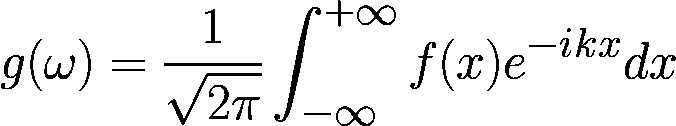

我不会详细讲解这个积分，但重要的是**FT 将函数 *f(x)* 变换为频率空间中的另一个函数 g*(ω)*。** 记住这个信息，它会很重要。（为了更好地理解 FT，我强烈推荐 [3Blue1Brow](https://www.youtube.com/watch?v=spUNpyF58BY) 的视频。）

## 1.2 不确定性原理作为傅里叶变换的结果

1927 年，物理学家沃纳·海森堡提出了可能是量子力学中最著名的概念之一——不确定性原理[1]。**该原理基本上是关于傅里叶变换的定理**，当两个函数是彼此的傅里叶变换时，不确定性原理就会发挥作用。

尽管我们暂时绕开了其复杂的物理学，但仅考虑其本质：**位置*x*和动量*p*的不确定性的乘积始终受到限制。** 这一限制突显了以无限精度测量这些量的固有边界（如果你感兴趣，可以查看这个[视频](https://www.youtube.com/watch?v=a8FTr2qMutA)）。

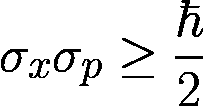

物理学中的不确定性原理。

**这发生是因为位置和动量是彼此的傅里叶变换！** 在时间序列分析的情况下，*位置* ***x*** 和动量 ***p*** 的类比分别是时间序列中的时间 ***t*** 和频率 ***ω*** 空间。

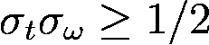

信号处理中的不确定性原理。

# 2\. 使用 FT 在时间序列中生成频率

傅里叶变换在时间序列分析中的一个非常重要的应用。考虑一个场景，我们需要找到时间序列中的固有频率。例如，想想识别出人们重看给定内容的常见频率。因此，我们希望**将 *f(t)（时间序列）* 变换为 g(*ω*)，一个频率函数，使用 FT**。

## 2.1 示例

为了举例说明，我们使用 Mauna Loa 每周大气 CO2 数据集[2]。

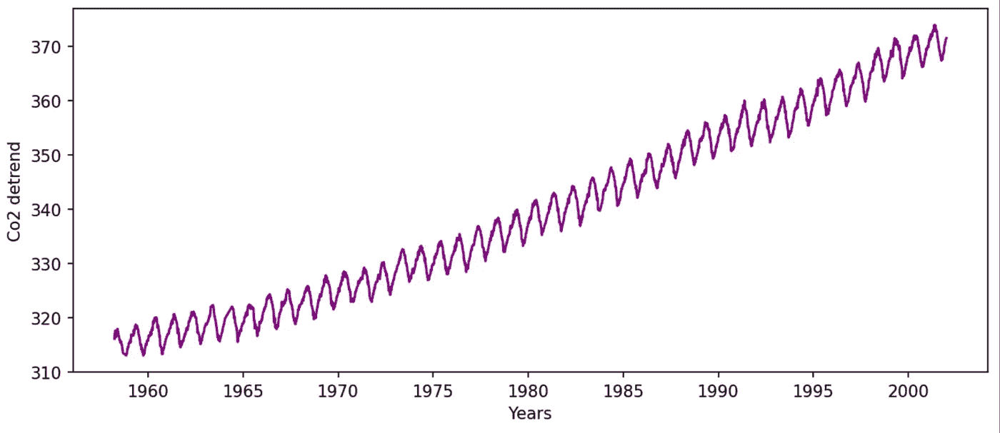

Mauna Loa 每周大气 CO2 时间序列。图像由作者提供。

去除线性趋势以消除虚假的低频贡献：

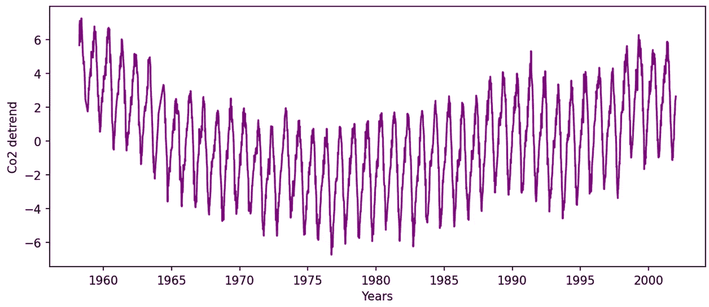

时间序列已去趋势。图片来源：作者。

使用快速傅里叶变换算法（FFT）计算傅里叶变换：

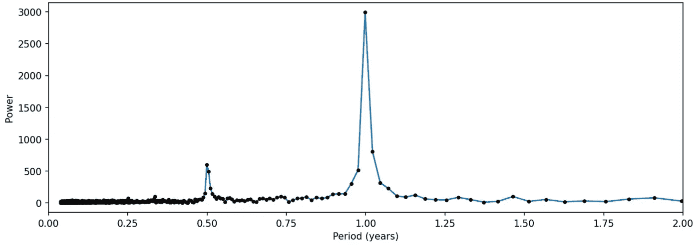

时间序列的傅里叶变换。图片来源：作者。

从中可以得到组成序列的频率，在这种情况下，可以明显看到两个不同的峰，一个是年度的，另一个是半年期的。这是数据集清晰季节性的可视化。

然而，最有趣的方面发生在时间序列中出现扰动时，这可能是事件或外部变量（例如，火山喷发临近）的影响。为了模拟这一点，我们可以在相同的序列中加上一个随机正弦波：

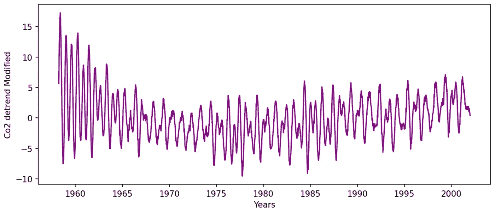

马纳罗亚每周大气 CO2 去趋势时间序列加上扰动。图片来源：作者。

应用快速傅里叶变换（FFT）来获取序列的傅里叶变换：

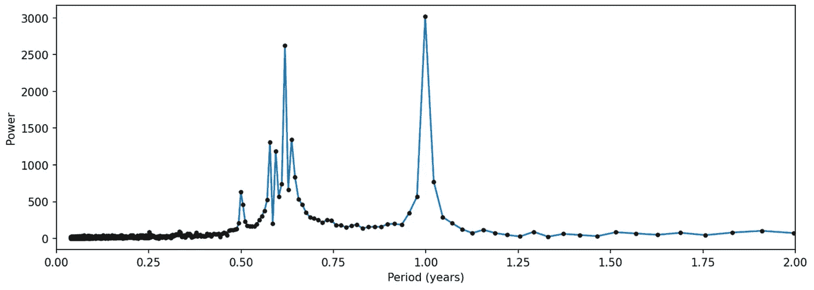

扰动时间序列的傅里叶变换。图片来源：作者。

现在，扰动造成的峰值在 0.5 到 0.75 之间出现。

## 2.2 限制

有时，我们想知道扰动和频率变化发生的时间，或只是序列中每个频率的时间位置。在我们的模拟中，有和没有扰动的序列明显表明，大部分影响发生在序列的开始处。**然而，仅凭对序列的视觉检查和傅里叶变换信息还不足以知道扰动发生的确切位置。因此，我们需要找到另一种工具来帮助我们。**

**然而，傅里叶变换（FT）有一个权衡：它会剥离时间信息，如不确定性原理所示，使我们无法知道这些频率在序列中出现的具体时间。** 这就是不确定性原理的作用所在。我们可以利用不确定性原理，在减少分辨率的情况下获得对这两种量的洞察，同时保持平衡。

# 3\. 小波变换作为时间和频率权衡的工具

**小波变换（WT）作为一种分辨率平衡的手段，将我们的函数 *f(t)* 转换为 *F(t,ω)*，即时间和频率的组合。** 我不会详细介绍小波变换的工作原理，但总的来说，变换过程使用一系列不同的小波（具有已知频率和形状的信号）通过两个函数的点积来与时间序列匹配时间同步。因此，可以对频率和时间发生有一定了解，但两者的分辨率都有限。

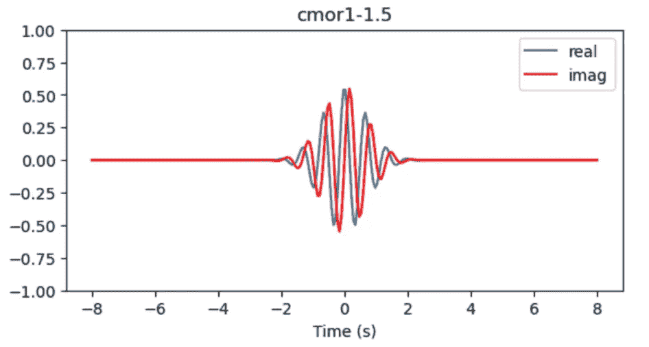

莫尔雷特小波信号的例子（这是一个复杂信号，因此有虚部和实部）。图片来源：作者。

要可视化信号的小波变换，通常将 x 轴表示为时间尺度，y 轴表示为频率尺度，颜色尺度表示为频率的功率。

对于没有扰动的去趋势时间序列，

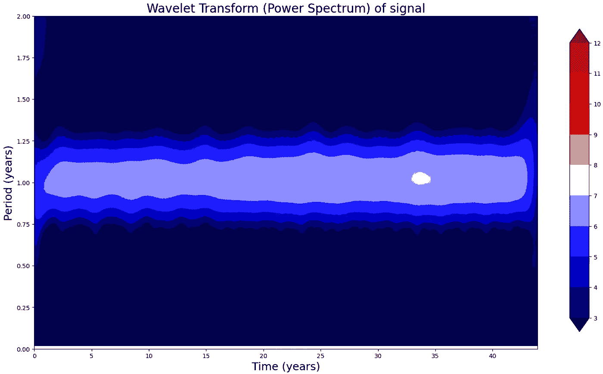

小波变换的毛纳罗阿每周大气 CO2 时间序列。图片由作者提供。

从视觉检查可以清楚地看到季节性按预期重复。然而，FT 中 1 年季节性的巨大峰值现在变宽了，因此我们对该值的确定性降低了。

最有趣的分析是对于模拟场景的。

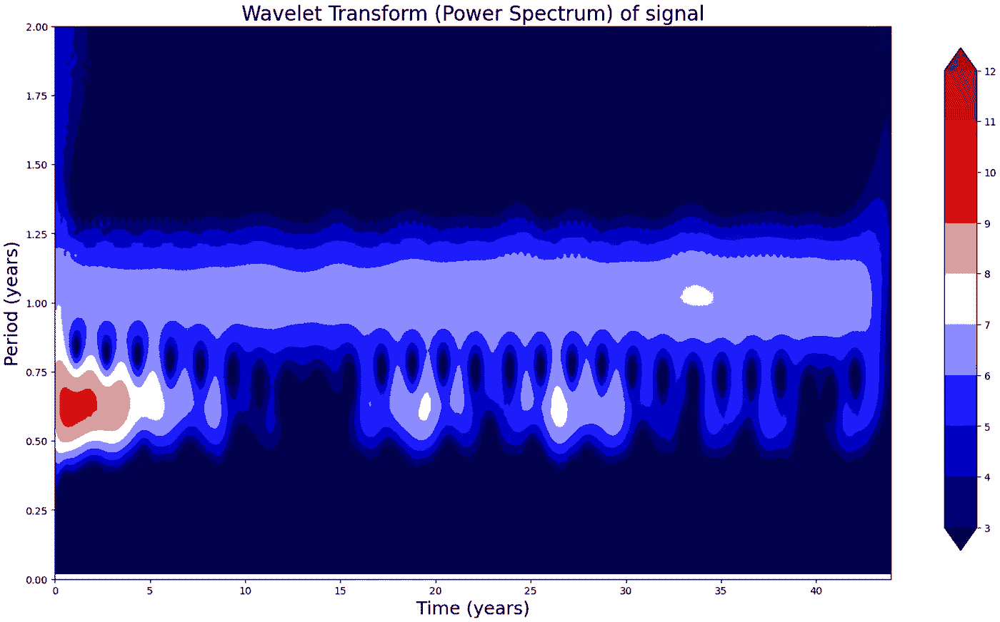

扰动时间序列的小波变换。图片由作者提供。

WT 显示，在 FT 中观察到的低频扰动发生在系列的早期，并且在 20-25 年后产生了显著的后果。**尽管 WT 在时间和频率上都失去了分辨率，但关于频率出现的新信息是有价值的，并且能够回答各种问题。**

# 4\. 结论

简而言之，不确定性原理对时间序列分析施加了基本限制，如傅里叶变换的约束所揭示的。虽然傅里叶变换有效地从时间序列数据中提取频率信息，但它牺牲了关于这些频率出现时间的任何知识。因此，小波变换是一个有用的工具，使我们能够在接受不确定性原理固有的程度的同时，在时间和频率分辨率之间进行权衡，从而获得频率分量的时间发生的洞察。

## 致谢

这个来自[**Artem Kirsanov**](https://www.youtube.com/watch?v=jnxqHcObNK4)的精彩视频激发了我撰写本文。如果你想深入了解这个话题，我也推荐观看这个视频。

## 备注

+   傅里叶变换（FT）不仅对量子力学和时间序列分析非常重要。它也正被用于此时将本文的数据存储在云服务中。历史上最著名和使用最广泛的算法之一称为快速傅里叶变换（FFT），它基本上支持了当今的每一个数据压缩。

+   为了用数学上描述亚原子粒子特性，傅里叶变换自然地出现在量子力学中。这反映了不确定性原理对我们理解自然的根本性视角转变。测量粒子的位置会让你失去关于同一粒子速度的信息，反之亦然。

**本文的笔记本可在** [**这里**](https://github.com/Rodrigo-Motta/wavelet_analysis/tree/main)**获得。**

## 参考文献

[1] [`en.wikipedia.org/wiki/Uncertainty_principle`](https://en.wikipedia.org/wiki/Uncertainty_principle)

[2] [`www.statsmodels.org/dev/datasets/generated/co2.html`](https://www.statsmodels.org/dev/datasets/generated/co2.html) (公有领域)

[3] [小波变换 (维基百科)](https://en.wikipedia.org/wiki/Wavelet_transform)
