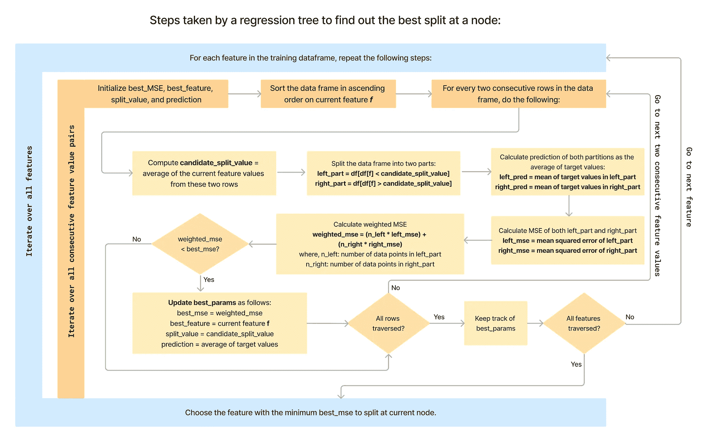

# 决策树如何解决回归问题？

> 原文：[`towardsdatascience.com/how-exactly-does-a-decision-tree-solve-a-regression-problem-fbb908cf548b`](https://towardsdatascience.com/how-exactly-does-a-decision-tree-solve-a-regression-problem-fbb908cf548b)

## 从头开始构建你自己的决策树回归器（用 Python），揭示其内部机制

[](https://medium.com/@gurjinderkaur95?source=post_page-----fbb908cf548b--------------------------------)[](https://towardsdatascience.com/?source=post_page-----fbb908cf548b--------------------------------) [Gurjinder Kaur](https://medium.com/@gurjinderkaur95?source=post_page-----fbb908cf548b--------------------------------)

·发布于 [Towards Data Science](https://towardsdatascience.com/?source=post_page-----fbb908cf548b--------------------------------) ·阅读时长 12 分钟 ·2023 年 11 月 25 日

--


图片来源于 [Chris Lawton](https://unsplash.com/@chrislawton?utm_source=medium&utm_medium=referral) 在 [Unsplash](https://unsplash.com/?utm_source=medium&utm_medium=referral)

在本文中，我将通过一个简单的示例、流程图和代码展示决策树回归器（*即回归树*）内部实现的整个逻辑。阅读后，你将对回归树的工作原理有一个清晰的理解，并在下一次回归挑战中更加深思熟虑和自信地使用和调整它们。

我们将涵盖以下内容：

+   对决策树的精彩介绍

+   生成一个用于训练回归树的玩具数据集

+   绘制回归树逻辑的流程图

+   参考流程图编写代码，使用 NumPy 和 Pandas 进行首次分裂

+   使用 Plotly 在首次分裂后可视化决策树

+   使用递归将代码泛化以构建整个回归树

+   使用 scikit-learn 执行相同任务并比较结果（*剧透：你将为自己与 scikit-learn 得到相同的输出感到非常自豪！*）

# 介绍

决策树是可以用来解决分类和回归问题的机器学习算法。尽管分类和回归本质上是不同的，但决策树试图以优雅的方式解决这两种问题，其*最终目标*是在给定节点找到最佳分裂。确定最佳分裂的方式就是使分类树和回归树彼此不同的原因。

在我之前的[文章](https://medium.com/towards-data-science/how-does-a-decision-tree-know-the-next-best-question-to-ask-from-the-data-0d44c9433b06)中，我介绍了决策树如何解决分类问题的基础知识。我使用了一个两类数据集来演示如何逐步理解如何通过数据不纯度度量（如熵）在每个节点生成决策规则，然后在 Python 中实现了一个递归算法以输出最终的决策树。不确定是否应该将[这篇](https://medium.com/towards-data-science/how-does-a-decision-tree-know-the-next-best-question-to-ask-from-the-data-0d44c9433b06)文章添加到你的阅读列表中？让我们使用决策树来找出答案吧！


来源：作者提供的图片

***重要提示：*** *这只是一个展示决策树是什么的示例，无论它是否这样说，你都很棒。*

如上所示，决策树分类器旨在预测离散标签（或*类别*），在我们的案例中是*你很棒！*和*去阅读它！*。在这种情况下，决策树会查看每个分裂点的类别概率分布，以计算熵等指标，从而决定最佳的特征和分裂值。

然而，在回归问题中，目标变量是*连续的*，我们不能在这种情况下使用熵（或基尼指数）作为分裂标准。因此，回归树使用***均方误差（MSE）***并选择在每个节点上导致最小 MSE 的特征和数值。

> **均方误差：** 它被定义为真实值与预测值之间的平方差之和。


来源：作者提供的图片

# 构建回归树

为了演示回归树是如何学习的，我将使用 NumPy 生成一个类似于二次函数的玩具数据集，用作训练数据。可以暂停并打开一个新的 Python 笔记本，以便在阅读时进行编码。

首先让我们导入库。

```py
import pandas as pd
import numpy as np
import plotly.graph_objects as go
import plotly.express as px
```

## **生成数据集**

在下面的代码中，我们将生成训练数据，其中我们的目标，即**因变量** ***y*** 是**自变量 *X* 的二次函数**。为了简单起见，我考虑了一个单一特征 *X*，但可以很容易地扩展到多个特征（包括连续特征和分类特征）。

在这里，*X* 和 *y* 都是连续的（*y 必须是连续的，因为这是回归，而 X 可以是分类的或连续的*）。

```py
# Set a random seed for reproducibility
np.random.seed(0)

# Constants for the quadratic equation
a, b, c = 1, 2, 3

# Create a DataFrame with a single feature
n = 100  # number of samples
x = np.linspace(-10, 10, n)  # feature values from -10 to 10
noise = np.random.normal(0, 10, n)  # some random noise
y = a * x**2 + b * x + c + noise  # quadratic equation with noise

# create a pandas dataframe
df = pd.DataFrame({'X': x, 'y': y})
```

## **数据可视化**

我们已经创建了 100 个数据点。接下来我们将使用 Plotly 以如下方式可视化我们的数据。

```py
df = data.copy()

# Create the figure
fig = go.Figure()

# Add scatter plot trace
fig.add_trace(
    go.Scatter(
        x=df["X"], 
        y=df["y"], 
        mode="markers", 
        marker=dict(opacity=0.7, size=6, color="red",
                    line=dict(color='Black', width=1))
    )
)

# Update layout
fig.update_layout(
    title={
        'text': "Scatter plot of our sample data",
        'y':0.9,
        'x':0.5,
        'xanchor': 'center',
        'yanchor': 'top'},
    xaxis=dict(
        title="X",
        showline=True,  # Show the X axis line
        tickmode='linear',  # Tick mode to be linear
        # tick0=-10,  # Start tick at 0
        dtick=1,  # Tick at every 1 unit
        linecolor='black',  # X axis line color
    ),
    yaxis=dict(
        title="y",
        showline=True,  # Show the Y axis line
        linecolor='black',  # Y axis line color
    ),
    plot_bgcolor='white',  # Background color
    width=900,
    height=500
)

# Show the figure
fig.show()
```

`单元格输出：`


来源：作者提供的图片

## **准备好进行第一次分裂了吗？**

在这之前，让我们首先概述一下回归树所采取的步骤，然后我们将参考这些步骤来编写我们的代码。 **花一点时间研究下面的流程图就足以理解回归树的基本逻辑，以在给定节点找到最佳划分。**



流程图展示了回归树逻辑（来源：作者提供的图片）

一旦上述逻辑清楚，我们就可以使用以下代码来见证回归树进行第一次最佳划分。

我们需要首先定义一个辅助函数来计算 MSE。

```py
def mean_squared_error(y, y_hat):
"""
Returns mean squared error for 
given actual values and predicted values
"""
  y = np.array(y)
  y_hat = np.array(y_hat)
  return np.mean((y-y_hat)**2)
```

以下代码是如上流程图所示的核心逻辑。

```py
df = data.copy()

# list of all features (only one i.e., 'X' in our case)
features = ["X"]

# iterate over all features
for feature in features:
  # initialize best_params dict
  best_params = {"feature": None, # best feature
                 "split_value": None, # best split value
                 "weighted_mse": np.inf, # weighted mse of two branches
                 "curr_mse": None, # mse at current node
                 "right_yhat": None, # prediction at right branch
                 "left_yhat": None # prediction at left branch
                 }
  # sort the df by current feature
  df = df.sort_values(by=feature)

  # compute the mse at current node
  curr_yhat = np.mean(df['y'].mean())
  curr_mse = mean_squared_error(df['y'], curr_yhat)
  curr_mse = np.round(curr_mse, 3)

  # iterate over all rows of sorted df
  for i in range(1, len(df)):
    # compute average of two consecutive rows
    split_val = (df.iloc[i][feature] + df.iloc[i-1][feature]) / 2
    split_val = np.round(split_val, 3)

    # split the df into two partitions
    left_branch = df[df[feature]<=split_val]
    right_branch = df[df[feature]>split_val]

    # compute the MSE of both partitions:

    left_yhat = np.mean(left_branch["y"]) # prediction will be average of target
    left_yhat = np.round(left_yhat, 3)
    left_mse = mean_squared_error(left_branch["y"], left_yhat) # mse of left
    left_mse = np.round(left_mse, 3)

    right_yhat = np.mean(right_branch["y"]) # prediction will be average of target
    right_yhat = np.round(right_yhat, 3)
    right_mse = mean_squared_error(right_branch["y"], right_yhat) # mse of right
    right_mse = np.round(right_mse, 3)

    # compute weighted MSE
    weighted_mse = ((len(left_branch) * left_mse) + (len(right_branch) * right_mse))/len(df)
    weighted_mse = np.round(weighted_mse, 3)

    # update best_params if weighted_mse is less than previously best_mse
    if weighted_mse <= best_params["weighted_mse"]:
      best_params["weighted_mse"] = weighted_mse
      best_params["split_value"] = split_val
      best_params["feature"] = feature
      best_params["curr_mse"] = curr_mse
      best_params["right_yhat"] = right_yhat
      best_params["left_yhat"] = left_yhat

best_params
```

`Cell Output:`


太棒了！我们在`X=6.869`得到了第一个最佳划分。让我们如下可视化它：

```py
# add vertical line to existing figure
fig.add_vline(x=best_params["split_value"], line_width=3, line_color="black")

# plot right branch split
fig.add_shape(type="line",
x0=best_params["split_value"], y0=best_params["right_yhat"],
x1=10, y1=best_params["right_yhat"],  
line=dict(color="gray", width=3))

# plot left branch split
fig.add_shape(type="line",
x0=-10, y0=best_params["left_yhat"],
x1=best_params["split_value"], y1=best_params["left_yhat"],  
line=dict(color="gray", width=3))

# fig.update_layout(title=
fig.update_layout(
title={
    'text': f"X<={np.round(best_params["split_value"],2)}, MSE={np.round(best_params["curr_mse"],2)}, samples={len(df)}, value={np.round(df["y"].mean(),2)}",
    'y':0.9,
    'x':0.5,
    'xanchor': 'center',
    'yanchor': 'top'},
)

fig.show()
```

`Cell Output:`


来源：作者提供的图片

**上述结果的解释：**

+   `X<=6.869`对应划分值。这意味着当前节点的数据将被划分为两部分——一部分是`X<=6.869`，另一部分是`X>6.869`。这就是黑色垂直线所表示的。

+   `samples=100`对应当前节点的总数据点数。最初，根节点包含所有数据点。

+   `MSE=1381.82`对应当前节点的均方误差值。我们知道 MSE 需要真实值和预测值来计算；我们已经有了真实值，预测值是什么呢？那就是`value`。

+   `value=37.605`对应当前节点的预测值。***任何节点的预测值都是该节点数据的所有真实值的平均值。***最初，根节点的预测值将仅仅是所有 100 行*y*值的平均值。

+   划分两侧的水平灰线表示左分区和右分区的预测值。

*可选练习：复制我们上面使用的两个单元格，并将原始数据框替换为左分区或右分区数据框。你可以看到后续的划分是如何以完全相同的方式进行的。只是输入数据框改变了，其他（核心逻辑）保持不变。*

下面是当前回归树的状态，经过对左分支和右分支重复代码后的样子：


来源：作者提供的图片

我希望这使得解读如下回归树变得更容易：


来源：作者提供的图片

上述过程会对后续的分区重复进行，直到满足停止准则（*例如达到最大深度、无法进一步划分等*）。

## 使用递归来概括代码

让我们将上述代码封装到一个函数`build_tree`中，我们可以递归调用它来构建回归树。

**辅助函数：**

`mean_squared_error:` 返回给定实际值和预测值的均方误差。如上所定义。

`get_best_params:` 返回包含特征和用于在当前节点拆分数据的值的*best_params*字典，并且包含当前节点的预测值。

```py
def get_best_params(df):
"""Function to return best split"""
    for feature in features:
    # initialize best_params dict
        best_params = {"feature": None, # best feature
                 "split_value": None, # best split value
                 "weighted_mse": np.inf, # weighted mse of two branches
                 "curr_mse": None, # mse at current node
                 "right_yhat": None, # prediction at right branch
                 "left_yhat": None # prediction at left branch
                 }
        # sort the df by current feature
        df = df.sort_values(by=feature)

        # iterate over all rows of sorted df
        for i in range(1, len(df)):
            # compute average of two consecutive rows
            split_val = (df.iloc[i][feature] + df.iloc[i-1][feature]) / 2
            split_val = np.round(split_val, 3)

            # split the df into two partitions
            left_branch = df[df[feature]<=split_val]
            right_branch = df[df[feature]>split_val]

            # compute the MSE of both partitions:

            left_yhat = np.mean(left_branch["y"]) # prediction will be average of target
            left_yhat = np.round(left_yhat, 3)
            left_mse = mean_squared_error(left_branch["y"], left_yhat) # mse of left
            left_mse = np.round(left_mse, 3)

            right_yhat = np.mean(right_branch["y"]) # prediction will be average of target
            right_yhat = np.round(right_yhat, 3)
            right_mse = mean_squared_error(right_branch["y"], right_yhat) # mse of right
            right_mse = np.round(right_mse, 3)

            # compute weighted MSE
            weighted_mse = ((len(left_branch) * left_mse) + (len(right_branch) * right_mse))/len(df)
            weighted_mse = np.round(weighted_mse, 3)

            # update best_params if weighted_mse is less than previously best_mse
            if weighted_mse <= best_params["weighted_mse"]:
                best_params["left_yhat"] = left_yhat
                best_params["right_yhat"] = right_yhat
                best_params["weighted_mse"] = weighted_mse
                best_params["split_value"] = split_val
                best_params["feature"] = feature
                best_params["curr_mse"] = curr_mse

    return best_params
```

`build_tree:` 它是一个主要的驱动函数，利用辅助函数递归地构建回归树。我添加了如*max_depth*等参数，以便可以控制回归树的生长，以避免*过拟合*，并作为停止准则。

```py
def build_tree(df, max_depth=3, curr_depth=0):
    """Function to build the regression tree recursively"""

    if curr_depth>=max_depth:
        prediction = np.round(np.mean(df["y"]), 3)
        print(("--" * curr_depth) + f"Predict: {prediction}")
        return

    best_params = get_best_params(df)

    if best_params["feature"] is None or best_params["split_value"] is None:
        prediction = np.round(np.mean(df["y"]), 2)
        print(("--" * curr_depth) + f"Predict: {prediction}")
        return

    feature = best_params["feature"]
    split_val = best_params["split_value"]

    # Print the current question (decision rule)
    question = f"{feature} <= {split_val}"
    mse = mean_squared_error(df["y"], df["y"].mean())
    mse = np.round(mse, 3)
    samples = len(df)
    print(("--" * (curr_depth*2)) + ">" + f"{question}, mse: {mse}, samples: {samples}, value: {np.round(df["y"].mean(),3)}")

    left_branch = df[df[feature]<=split_val]
    right_branch = df[df[feature]>split_val]

    # recursive calls for left and right subtrees
    if not left_branch.empty:
        print(("--" * curr_depth) + f"Yes ->")
        build_tree(left_branch, curr_depth=curr_depth+1)

    if not right_branch.empty:
        print(("--" * curr_depth) + f"No ->")
        build_tree(right_branch, curr_depth=curr_depth+1)
```

现在让我们在训练数据上调用上述函数。

```py
build_tree(data)
```

`Cell Output:`


上述输出对应于设置了`max_depth=3`的回归树。为了更清晰，请参阅下图中的回归树。


最终回归树（来源：作者图片）

上述回归树中的叶子节点对应于预测值。根据我们的最终回归树绘制预测值和决策边界时，我们会得到如下结果：


最终预测和决策边界（来源：作者图片）

## 代码链接

你可以在[这里](https://github.com/gurjinderbassi/Machine-Learning/blob/main/Regression%20Trees%20from%20scratch.ipynb)找到完整的笔记本。

## 关键时刻 — 使用 scikit-learn 实现回归树，并将最终树与我们的进行比较

现在我们需要知道我们对回归树工作原理的理解是否准确。为此，让我们使用 scikit-learn 在相同的数据上训练回归树，并查看最终结果如下。

```py
from sklearn.tree import DecisionTreeRegressor
from sklearn import tree
import matplotlib.pyplot as plt

# Fit the regression tree
regressor = DecisionTreeRegressor(max_depth=3)
X = np.array(data["X"]).reshape(100, 1)
y = np.array(data["y"])
regressor.fit(X, y)

# Plot the tree
plt.figure(figsize=(15, 8))
tree.plot_tree(regressor, feature_names=['X'], filled=True)
plt.show()
```

`Cell Output:`


来源：作者图片

scikit-learn 的 DecisionTreeRegressor 返回的回归树与我们之前创建的完全相同。

## 不再是谜！

我希望到目前为止，本文对你有所帮助，希望这行代码`regressor.fit(X, y)`不再是一个谜。既然我们现在对底层算法的构造有了充分了解，我们可以在未来调整基于树的回归模型时更加深思熟虑。

## 这还不是结束

本文的目的是仅仅演示决策树回归器在节点处做出最佳分割所使用的逻辑。然而，这不是关于决策树的全面指南，因为在建模时还有许多其他重要方面需要关注。如果我们完全不讨论这些方面是不公平的，因此在这里提供一些要点的简要总结。

**决策树的优点：**

+   决策树是*可解释的*和*直观的*，因为人们可以清楚地了解导致特定预测的原因。

+   它们不需要对训练数据进行大量预处理，并且可以内在处理类别特征和缺失值。

**决策树的缺点：**

+   决策树对数据的小变化非常敏感。

+   如果控制不当，决策树非常容易*过拟合*，需要采取适当措施以防止树的过度生长，从而使其具有良好的泛化能力。

# 结论

在这篇文章中，我们从零开始构建了一个回归树，以全面理解其背后的逻辑。我们生成了一个包含一个连续特征 *X* 和目标 *y* 的简单数据集，该数据集用于训练决策树回归器。接着，我们通过流程图传达了回归树在每个节点所采取的方法，以确定最佳分裂，使我们能够更清晰地编写代码并了解步骤的顺序。我们可视化了代码返回的第一个最佳分裂，并讨论了如何将相同的逻辑扩展到构建整个树。

我们还使用 scikit-learn 在相同的数据上训练了一个决策树回归器，并注意到它产生的结果与我们之前从零开始得到的结果相同。本文的目标是了解在调用 `.fit()` 来训练 scikit-learn 的 DecisionTreeRegressor 模型时，后台究竟发生了什么。

希望拥有这些知识将帮助我们在未来更好地调整、优化和解读基于树的回归模型。

感谢阅读 :)

欢迎任何反馈或建议！

**想了解更多关于决策树的信息？** 请查看以下文章：

[](/how-does-a-decision-tree-know-the-next-best-question-to-ask-from-the-data-0d44c9433b06?source=post_page-----fbb908cf548b--------------------------------) ## 决策树如何知道从数据中询问下一个最佳问题？

### 从零开始构建自己的决策树（使用 Python），并了解它如何利用熵来进行分裂

towardsdatascience.com [](/entropy-and-gini-index-c04b7452efbe?source=post_page-----fbb908cf548b--------------------------------) ## 熵与基尼指数

### 理解这些度量如何帮助我们量化数据集中的不确定性

towardsdatascience.com
