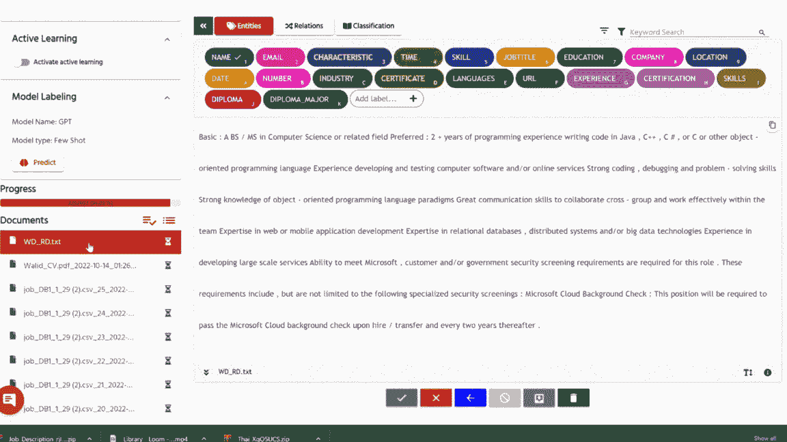
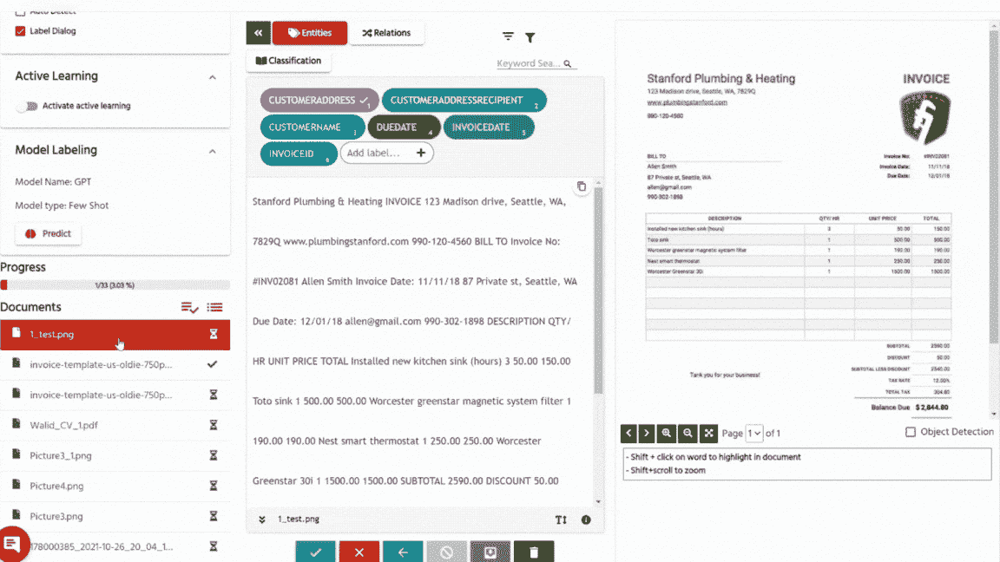

# 少样本学习如何自动化文档标记

> 原文：[`towardsdatascience.com/how-few-shot-learning-is-automating-document-labeling-43f9868c0f74`](https://towardsdatascience.com/how-few-shot-learning-is-automating-document-labeling-43f9868c0f74)

## 利用 GPT 模型

[](https://walidamamou.medium.com/?source=post_page-----43f9868c0f74--------------------------------)[](https://towardsdatascience.com/?source=post_page-----43f9868c0f74--------------------------------) [Walid Amamou](https://walidamamou.medium.com/?source=post_page-----43f9868c0f74--------------------------------)

·发布于[数据科学前沿](https://towardsdatascience.com/?source=post_page-----43f9868c0f74--------------------------------) ·阅读时间 5 分钟·2023 年 4 月 7 日

--


照片由[DeepMind](https://unsplash.com/@deepmind?utm_source=unsplash&utm_medium=referral&utm_content=creditCopyText)提供，来源于[Unsplash](https://unsplash.com/photos/Vqm8hzQIzic?utm_source=unsplash&utm_medium=referral&utm_content=creditCopyText)

手动文档标记是一个耗时且繁琐的过程，通常需要大量资源且容易出错。然而，最近在机器学习方面的进展，特别是所谓的少样本学习技术，使得自动化标记过程变得更加容易。特别是大语言模型（LLMs）由于其在上下文学习中的新兴能力，是优秀的少样本学习者。

在这篇文章中，我们将详细探讨少样本学习如何改变文档标记，特别是对文档处理中最重要的任务——命名实体识别（NER）的影响。我们将展示[UBIAI](https://ubiai.tools)的平台如何通过少样本标记技术使自动化这一关键任务变得比以往更容易。

# 什么是少样本学习？

少样本学习是一种机器学习技术，使得模型能够仅用少量标记示例来学习给定的任务。在不修改其权重的情况下，模型可以通过在输入中包含这些任务的连接训练示例，并要求模型预测目标文本的输出，从而调整以执行特定任务。以下是使用 3 个示例进行命名实体识别（NER）任务的少样本学习示例：

```py
###Prompt
Extract entities from the following sentences without changing original words.

###
Sentence: " and storage components. 5+ years of experience deliver
ing scalable and resilient services at large enterprise scale, including experience in data platforms including large-scale analytics on relational, structured and unstructured data. 3+ years of experien
ce as a SWE/Dev/Technical lead in an agile environment including 1+ years of experience operating in a DevOps model. 2+ years of experience designing secure, scalable and cost-efficient PaaS services on
the Microsoft Azure (or similar) platform. Expert understanding of"
DIPLOMA: none
DIPLOMA_MAJOR: none
EXPERIENCE: 3+ years, 5+ years, 5+ years, 5+ years, 3+ years, 1+ years, 2+ years
SKILLS: designing, delivering scalable and resilient services, data platforms, large-scale analytics on relational, structured and unstructured data, SWE/Dev/Technical, DevOps, designing, PaaS services, Microsoft Azure
###

Sentence: "8+ years demonstrated experience in designing and developing enterprise-level scale services/solutions. 3+ years of leadership and people management experience. 5+ years of Agile Experie
nce Bachelors degree in Computer Science or Engineering, or a related field, or equivalent alternative education, skills, and/or practical experience Other 5+ years of full-stack software development exp
erience to include C# (or similar) experience with the ability to contribute to technical architecture across web, mobile, middle tier, data pipeline"
DIPLOMA: Bachelors\nDIPLOMA_MAJOR: Computer Science
EXPERIENCE: 8+ years, 3+ years, 5+ years, 5+ years, 5+ years, 3+ years
SKILLS: designing, developing enterprise-level scale services/solutions, leadership and people management experience, Agile Experience, full-stack software development, C#, designing
###

Sentence: "5+ years of experience in software development. 3+ years of experience in designing and developing enterprise-level scale services/solutions. 3+ years of experience in leading and managing
 teams. 5+ years of experience in Agile Experience. Bachelors degree in Computer Science or Engineering, or a related field, or equivalent alternative education, skills, and/or practical experience."
```

提示通常以指示模型执行特定任务开始，例如“从以下句子中提取实体而不改变原始词语。”请注意，我们添加了指示“无更改原始词语”以防止 LLM 产生随机文本，这是其著名的特性。这在获得一致的模型响应中至关重要。

这种[现象](https://arxiv.org/abs/2303.07895)已在这篇文章中得到了广泛研究，我强烈推荐。实质上，论文表明，在温和的假设下，模型的预训练分布是潜在任务的混合，这些任务可以通过上下文学习高效地学习。在这种情况下，上下文学习更多的是关于识别任务，而不是通过调整模型权重来学习任务。

# Few-shot 标注

Few-shot 学习在数据标注领域具有出色的实际应用，通常被称为少量标注。在这种情况下，我们向模型提供少量已标注的示例，并要求它预测后续文档的标签。然而，将这一能力集成到功能齐全的数据标注平台中，难度远超想象，以下是一些挑战：

+   LLM 本质上是文本生成器，倾向于生成可变的输出。提示工程对于使其生成可预测的输出至关重要，这些输出可以用于自动标注数据。

+   Token 限制：如 OpenAI 的 GPT-3 这样的 LLM 每次请求的 token 数量限制为 4000 个，这限制了可以一次发送的文档长度。在发送请求之前，分块和拆分数据变得至关重要。

+   Span 偏移计算：在从模型接收输出后，我们需要在文档中搜索其出现位置并正确标注。

# 使用 UBIAI 进行 Few-shot 标注

我们最近通过将[OpenAI 的 GPT-3 Davinci](https://platform.openai.com/docs/models/gpt-3)与[UBIAI 标注工具](https://ubiai.tools)集成，新增了少量标注能力。该工具目前支持对未结构化和半结构化文档（如 PDF 和扫描图像）的 few-shot NER 任务。

开始使用：

1.  只需标注 1–5 个示例

1.  启用 few-shot GPT 模型

1.  在新的未标注文档上运行预测

这是在提供 5 个示例的工作描述上进行 few-shot NER 的一个示例：



图片作者：非结构化文本上的 Few Shot NER

GPT 模型仅凭五个上下文示例就能准确预测大多数实体。由于 LLM 在大量数据上进行训练，这种 few-shot 学习方法可以应用于各种领域，如法律、医疗、HR、保险文档等，使其成为一个极其强大的工具。

然而，少量样本学习最令人惊讶的方面是它对上下文有限的半结构化文档的适应能力。在下面的示例中，我仅提供了一个标记的 OCR 发票示例，并要求它标记下一个。模型出乎意料地准确地预测了许多实体。即使有更多的示例，模型在对半结构化文档的泛化方面也表现得非常出色。



作者提供的图像：PDF 上的少量样本命名实体识别（NER）

有关少量样本标记功能的详细教程，请查看下面的视频：

UBIAI 的少量样本标记教程

# 结论：

少量样本学习正在彻底改变文档标记过程。通过将少量样本标记功能集成到功能性数据标记平台中，如 UBIAI 的注释工具，现在可以自动化诸如命名实体识别（NER）等关键任务，无论是在非结构化还是半结构化文档中。这并不意味着大型语言模型（LLMs）会很快取代人工标注员。相反，它们通过提高效率来增强他们的能力。凭借少量样本学习的力量，大型语言模型可以标记大量数据，并应用于法律、医疗、HR 和保险等多个领域，从而训练出更小、更准确的专业化模型，这些模型可以高效部署。

我们目前正在添加对少量样本关系提取和文档分类的支持，请继续关注！

在 Twitter 上关注我们 [@UBIAI5](https://twitter.com/UBIAI5) 或 [点击这里订阅](https://walidamamou.medium.com/subscribe)!
