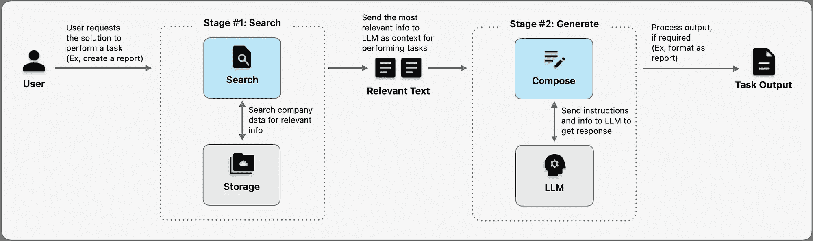

# 如何通过 GenAI 解决方案彻底改变商业自动化：解读 LLM 应用的高级管理层

> 原文：[`towardsdatascience.com/how-genai-solutions-revolutionize-business-automation-57747b0f11ce?source=collection_archive---------3-----------------------#2023-09-06`](https://towardsdatascience.com/how-genai-solutions-revolutionize-business-automation-57747b0f11ce?source=collection_archive---------3-----------------------#2023-09-06)

## 公司如何利用大型语言模型（LLMs）的力量来自动化工作流程并提高成本效率

 [Ninad Sohoni](https://medium.com/@ninadsohoni?source=post_page-----57747b0f11ce--------------------------------)

·

[关注](https://medium.com/m/signin?actionUrl=https%3A%2F%2Fmedium.com%2F_%2Fsubscribe%2Fuser%2F5ee93978501b&operation=register&redirect=https%3A%2F%2Ftowardsdatascience.com%2Fhow-genai-solutions-revolutionize-business-automation-57747b0f11ce&user=Ninad+Sohoni&userId=5ee93978501b&source=post_page-5ee93978501b----57747b0f11ce---------------------post_header-----------) 发表在 [Towards Data Science](https://towardsdatascience.com/?source=post_page-----57747b0f11ce--------------------------------) · 11 分钟阅读 · 2023 年 9 月 6 日

--

照片由 [Gerard Siderius](https://unsplash.com/@siderius_creativ?utm_source=medium&utm_medium=referral) 提供，来源于 [Unsplash](https://unsplash.com/?utm_source=medium&utm_medium=referral)

# 介绍

在最近与一家生物制药公司制造高管的合作中，我们深入探讨了生成性 AI 的世界，特别是大型语言模型（LLMs），以探索它们如何用于加速质量调查。质量调查在产品制造或测试中发现偏差时触发。由于潜在的患者健康风险和监管要求，批次被暂停，根据影响，生产甚至可能会被暂停。加速调查以进行根本原因分析，并尽快实施纠正和预防措施计划至关重要。我们的目标是尽可能利用 GenAI 加速这一过程。

当我们开始思考最低可行产品（MVP）时，面临了几个选项，关于 GenAI 如何自动化流程的不同阶段，以提高周期时间并尽快解冻批次。高管们是各自领域的专家，并且接受了 GenAI 培训。然而，有必要深入了解 LLM 的能力和各种 GenAI 解决方案模式，以确定在质量调查过程中优先考虑哪个阶段作为 MVP，在短期解决方案可行性和预期周期时间改进之间取得平衡。

尽管在我们的案例中，讨论集中在一个特定的过程上，但相同的解决方案模式正被各行业和职能利用，以提取成本效率并加速成果。那么，GenAI 解决方案如何帮助这样的过程呢？

# LLMs 的独特能力

在最近 GenAI 人气激增之前，企业界的自动化解决方案主要针对常规的、基于规则的任务，或依赖于机器人流程自动化（RPA）。机器学习应用主要围绕分析展开，例如使用回归模型预测销售量等结果。然而，最新的 LLMs 由于其卓越的特性而脱颖而出：

1.  **内容理解：** LLMs 能够“理解”文本的含义

1.  **即时训练：** LLMs 能够执行其原始训练中未涉及的新任务（即零样本学习），通过自然语言指令和可选的少量示例（少样本学习）

1.  **推理：** LLMs 能够在一定程度上“思考”和“推理”潜在的行动（尽管存在一些限制和风险）

在“传统”机器学习中，构建和使用模型的过程通常涉及收集数据、手动定义“目标”，并训练模型以预测给定其他属性的“目标”。因此，模型可以执行一个特定的任务或回答一个特定类型的问题。相反，你可以要求一个经过预训练的 LLM 评估客户评论中对你的业务重要的特定方面，这些方面是 LLM 从未见过的，也没有在评论中明确提到。

# LLM-based 解决方案的机制

行业内的许多 LLM 解决方案集中于设计和提供详细的指令，以使 LLM 执行特定任务（这被称为提示工程）。一种增强 LLM 影响力的有效方式是通过自动化方式使其访问公司的专有信息。检索增强生成（RAG）已成为实现这一目标的最常见解决方案模式之一。

## 概述 — 10,000 英尺视角

GenAI 解决方案工作流的高级概览（来源：作者提供的图像）

简而言之，解决方案有两个阶段：

1.  **搜索：** 检索与用户请求相关的公司数据。例如，如果要求以特定格式或风格撰写报告，则会提取并将以前报告的文本发送给 LLM 作为示例。

1.  **生成：** 将在先前阶段检索到的指令和示例（或任何其他相关信息）编译成文本提示，并将其发送给 LLM 以生成所需的输出。以报告为例，提示可以是，

> 请将以下信息编写成报告，使用提供示例的格式和风格。
> 
> 这里是内容：[报告内容…. ]。
> 
> 这是示例：之前的报告标题
> 
> 第一部分 …
> 
> 第二部分 …
> 
> 结论

## RAG 工作流 — 1,000 英尺视角

让我们深入了解解决方案模式中的搜索和生成两个阶段。

使用[Cohere 的 embed-english-v2.0 模型](https://docs.cohere.com/docs/models)的示例句子的向量嵌入（即数值表示）（来源：作者提供的图像）

这些数值表示如何映射到二维空间中是很有趣的。可以看到，相似主题的句子被映射得很近。

示例句子的向量嵌入绘制在二维空间中（来源：作者提供的图像，灵感来自课程[具有语义搜索的大型语言模型](https://www.deeplearning.ai/short-courses/large-language-models-semantic-search/)中的演示，课程由[Deeplearning.ai](http://deeplearning.ai/)提供）

**2\. 创建** **知识库：** 解决方案的搜索组件接收一个问题，并进行语义搜索以寻找知识库中最相似的信息。那么，这个知识库是如何创建的呢？需要放入知识库的文件会由嵌入模型处理，从而创建数值表示。这些数值表示会被加载到一个专门的数据库中——通常是为高效存储和快速检索这种信息而特别设计的向量数据库。

**3\. 在知识库中检索相似信息（即检索）：** 当用户提交问题或任务到解决方案时，解决方案使用嵌入模型将问题文本转换为数值表示。这个问题向量会与知识库进行匹配，以寻找最相似的信息。可能会返回一个或多个搜索结果，这些结果可以传递到下一阶段以生成回应或输出。

**4\. 使用 LLM 生成输出（即生成）：** 现在，解决方案已经成功找到可以帮助 LLM 生成有意义输出的相关信息，整个包，即“提示”，可以发送到 LLM。这个提示包括一个或多个标准的指令集，这些指令引导 LLM，还有实际的用户问题，最后是检索阶段得到的信息。LLM 生成的结果可以在必要时进行处理（例如，将输出加载到特定格式的 Word 文档中），然后再交付给用户。

## 深入了解解决方案组件

让我们更深入地探讨解决方案的组件

深入探讨 RAG 解决方案工作流的组件（紫色块显示可选组件）。(来源：作者提供的图片)

**1\. 创建知识库：** 将相关文档加载到知识库中有一些细节和考虑因素。

+   **文档加载：** 可能需要将不同的相关文档（pdf、word、在线资源等）导入到数据存储库中。根据用例，某些文档的只有特定部分可能是相关的。例如，对于为金融分析师设计的查询公司 10-K 报告的解决方案，标题页、目录、标准合规信息和一些附录可能与财务分析无关。因此，这些部分可以从知识库中省略。避免知识库中的冗余信息至关重要，以确保 LLM 模型提供多样化和高质量的回应。

+   **文档拆分：** 一旦确定了需要包含在知识库中的相关文档部分，下一步是确定如何拆分这些信息并将其加载到向量数据库中。选择方式可能因使用场景而异。一种有效的方法是按段落拆分并留有一定重叠。这涉及到为保留完整段落设置字数（或“令牌”，LLM 用于文本处理的单位）限制。如果段落超过此限制，则应将其拆分为多个记录以存储在向量数据库中。通常会故意保留一些词汇重叠以保持上下文。例如，使用每个向量 1,000 字的限制，并有 40 字的重叠。

+   **附加元数据：** 增强知识库中的信息涉及用有意义的元数据标记每条记录。基本的元数据示例包括提取信息的原始文档标题和章节层级。附加元数据可以进一步提升搜索和检索的质量。例如，从 10-K 报告中提取的资产负债表数据可以用以下元数据进行标记：

> 原始文档标题：公司 XYZ 10-K
> 
> 年份：2022
> 
> 部分：财务报表及附加数据 | 资产负债表

+   **存储：** 存储信息的选项有很多。可以使用如 Chroma 或 Faiss 之类的向量数据库解决方案，或在 Postgres / MySQL 上使用这些解决方案。然而，SQL 数据库、NoSQL 数据库、文档存储、图数据库也可以使用。此外，还可以考虑使用内存存储以减少延迟，以及横向扩展以提高可伸缩性、可用性、负载均衡等。

**2\. 从知识库中检索相似信息：** 对于简单的使用案例，基于在知识库中搜索相似向量的检索方法，如前一部分所述，应该足够。一种常见的两阶段方法可以平衡搜索速度与准确性：

+   **密集检索：** 最初，通过快速近似邻居搜索对广泛的知识库进行快速扫描，以处理搜索查询。这将产生几十个或几百个结果供进一步评估。

+   **重新排序：** 在获取的候选项中，可以使用更计算密集的算法来区分更相关和不太相关的结果。可以通过对密集检索阶段获取的候选项进行二次处理，或使用其他特征（如指向每个搜索结果的链接数量（表示可信度或主题权威）、TF-IDF 分数，或直接请求 LLM 审查所有候选项并对其相关性进行排名）来计算额外的相关性分数。

对于高级功能，例如通过选择多样化的信息、基于自然语言用户提示应用过滤器等来提高搜索结果的质量，可能需要更复杂的方法。例如，在财务查询中，用户问：“XYZ 公司在 2020 年的净利润是多少？”解决方案必须过滤出关于 XYZ 公司的文件以及 2020 年的数据。一个可能的解决方案是使用 LLM 将请求拆分为过滤组件，通过使用元数据按年份 2020 进行过滤，从而缩小语义搜索的目标范围。然后，执行语义搜索以在知识库中定位“XYZ 公司的净利润”。

**3\. 使用 LLM 生成输出（生成）：** 过程的最后一步涉及使用 LLM 生成输出。

+   **直接方法：** 直接方法是将从搜索阶段检索到的所有信息连同人工提示和指令传递给 LLM。然而，对于 LLM 能处理的信息量存在限制。例如，Azure OpenAI 基础 GPT-4 模型的上下文大小为 1024 个令牌，大约相当于 2 页文本。根据使用情况，可能需要对这一限制进行变通处理。

+   **链式方法：** 为了绕过上下文大小限制，一种方法是逐步向语言模型提供信息，并指示它在每次迭代中构建和完善答案。LangChain 框架提供了如“refine”、“map_reduce”和“map_rerank”等方法，以帮助生成多个答案部分，并最终通过另一个 LLM 调用将它们组合起来。

## 结论

在数据生成不断增加的时代，利用 GenAI，我们的上下文感知和可训练助手，比以往任何时候都更具影响力。正如文章中所述，这一解决方案模式无缝地解决了自动化数据处理的挑战，并释放出人力资源以处理更复杂的任务。随着大型语言模型（LLM）的日益商品化和解决方案组件的标准化，可以预见，这些解决方案将很快变得普遍。

本文涉及了基础 RAG 概念。下一篇文章将通过构建一个能够回答基于任何指定网站信息的问题的聊天机器人来对这些概念进行实际探索。正如所说，最好的学习方式就是实践！

 ## GenAI 实操指南：面向产品与工程领导者

### 通过了解 LLM 基于产品的内部机制来做出更好的产品决策。

towardsdatascience.com

## 常见问题解答（FAQs）

+   *生成的内容会成为 LLM 的记忆并影响未来的输出吗？例如，经验不足的用户生成的糟糕输出会影响其他用户的输出质量吗？*

    不会。在这种解决方案方法中，LLM 对其生成的内容没有“记忆”——每个请求都从头开始。除非 LLM 进行进一步的微调（训练）或生成的输出也被添加到知识库中，否则未来的输出不会受到影响。

+   *LLM 是否会随着使用而学习并变得更好？* 不会自动如此。RAG 解决方案模式并非一种强化学习系统。然而，可以设计解决方案，使用户能够对输出质量提供反馈，从而用以微调模型。更新知识库或使用升级的 LLM 也可以提高解决方案输出的质量。

+   *向量嵌入会保存在源数据仓库中吗？* 一般不会。虽然文档切块的向量可以在技术上存储在源数据仓库中，但源数据仓库和向量数据库（或者为了这个解决方案专门用于存储向量的 SQL 数据库）的目的不同。将向量添加到源数据库可能会创建操作依赖性和额外开销，这可能是不必要的或没有任何奖励的。

+   *解决方案如何用新数据进行更新？* 数据加载流程（识别文档、处理、切块、向量化、加载到向量数据库）需要在新数据可用时运行。这可以是一个定期批处理过程。更新频率可以根据使用案例进行调整。

+   *我们如何确保知识库中存储的文档中的敏感信息不会被公众或 LLM 供应商访问？*

    企业可以使用 Azure OpenAI 服务作为单租户解决方案，配备私有实例的 OpenAI LLM。这可以确保数据隐私和安全。另一种解决方案是将 Hugging Face LLM 部署到公司的私有基础设施上，以确保数据不会离开公司的安全边界（与使用公开托管的 LLM 不同）。

## 推荐资源

探索这些资源以深入了解 LLM 及其应用：

+   [生成 AI 定义：如何运作、优势和风险 (techrepublic.com)](https://www.techrepublic.com/article/what-is-generative-ai/)

+   [商业领袖应了解的使用 LLMs 如 ChatGPT 的信息 (forbes.com)](https://www.forbes.com/sites/forbesbusinesscouncil/2023/02/07/what-business-leaders-should-know-about-using-llms-like-chatgpt/?sh=4dc731bd514a)

想更深入了解 RAG 解决方案模式：

+   [使用检索增强生成的问答与 Amazon SageMaker JumpStart 中的基础模型 | AWS 机器学习博客](https://aws.amazon.com/blogs/machine-learning/question-answering-using-retrieval-augmented-generation-with-foundation-models-in-amazon-sagemaker-jumpstart/)

+   [Deeplearning.ai](http://deeplearning.ai/) 课程: [大型语言模型与语义搜索](https://www.deeplearning.ai/short-courses/large-language-models-semantic-search/)

+   [Deeplearning.ai](http://deeplearning.ai/) 课程: [LangChain: 与你的数据对话](https://www.deeplearning.ai/short-courses/langchain-chat-with-your-data/)
