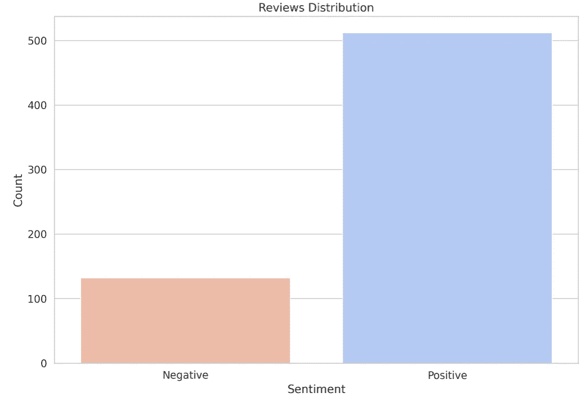
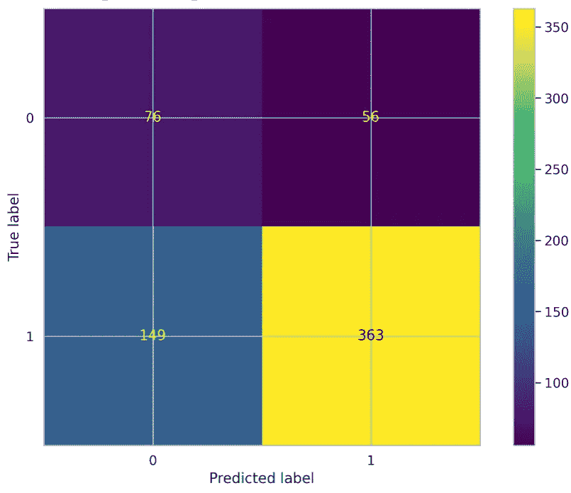
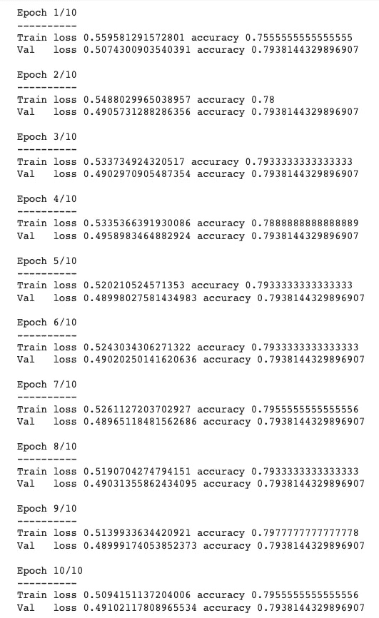
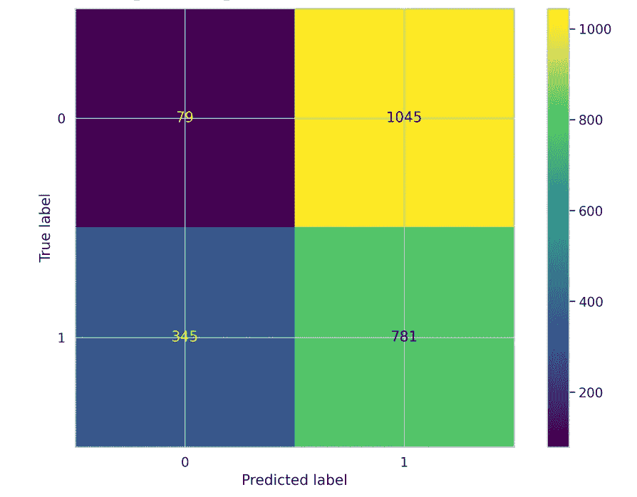
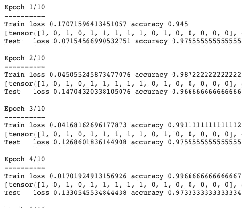

# 生成性人工智能如何支持食品行业企业

> 原文：[`towardsdatascience.com/how-generative-ai-can-support-food-industry-businesses-993872b4a6ce`](https://towardsdatascience.com/how-generative-ai-can-support-food-industry-businesses-993872b4a6ce)

## 从过去的错误中学习，并利用 ChatGPT 为食品行业公司构建更好的机器学习模型

[](https://ben-mccloskey20.medium.com/?source=post_page-----993872b4a6ce--------------------------------)[](https://towardsdatascience.com/?source=post_page-----993872b4a6ce--------------------------------) [Benjamin McCloskey](https://ben-mccloskey20.medium.com/?source=post_page-----993872b4a6ce--------------------------------)

·发表于[Towards Data Science](https://towardsdatascience.com/?source=post_page-----993872b4a6ce--------------------------------) ·12 分钟阅读·2023 年 7 月 19 日

--


图片来源于[Mae Mu](https://unsplash.com/@picoftasty?utm_source=medium&utm_medium=referral) [Unsplash](https://unsplash.com/?utm_source=medium&utm_medium=referral)

# 介绍

我将带你踏上的旅程有两个重要原因。

1.  它将展示如何使用 ChatGPT 来支持食品行业的公司。

1.  可以说最重要的原因，我将详细讲解我在将近两年前发表的一篇文章，***指出那篇文章中的问题***，并尝试解决它们。

是的，我认为第二个原因更为重要。为什么？回顾过去的方法和过程，分析数据是重要的，因为它可以让你学习如何修正失败，这最终会导致成功。我绝非完美，我个人寻找过去做错的事情，希望从错误中学习，并为我支持的客户开发出*更强大的*模型。

# 原始出版物

我第一次发布《机器学习不仅仅是大科技的专利》是在 2021 年 7 月。

[](/machine-learning-is-not-just-for-big-tech-using-natural-language-processing-to-support-small-8f571249c073?source=post_page-----993872b4a6ce--------------------------------) ## 机器学习不仅仅是大科技的专利

### 使用自然语言处理来支持小企业。

towardsdatascience.com

本文的目的是展示食品行业中的公司如何通过各种机器学习（ML）应用得到支持。我使用了自然语言处理（NLP）技术来处理关于公司的网络评论。我使用的一些 NLP 方法包括主题建模分析，以更好地了解客户在谈论什么，以及情感分析，以创建一个可以帮助预测未来评论情感并向公司提供反馈的模型。分析显示这两种方法都能够在*小型数据集*上进行。

啊！大错误。

我的数据并不理想。数据集不仅小，而且**倾向于正面评论**。这导致模型几乎总是预测评论为正面（对公司没有帮助），并且存在过拟合。

*解决方案*？我考虑使用生成对抗网络（GAN）来创建新的合成评论，但随后我想，能不能直接问 ChatGPT？**轰**。我原始工作中的第一个错误被解决了。我能够利用 ChatGPT 创建人工的正面和负面评论，这**最终**平衡了我的意大利食品公司评论数据集！

# 数据集

幸运的是，我在训练任何模型或进行任何分析之前，已经**仔细**验证了我创建的数据的可用性。请查看下面的帖子，提供对真实数据和人工数据的更深入分析。

[](/chatgpt-generated-food-industry-reviews-realism-assessment-2ee28155970f?source=post_page-----993872b4a6ce--------------------------------) ## ChatGPT 生成的食品行业评论：真实性评估

### 调查食品行业公司如何通过 ChatGPT 生成的数据来支持评论和调查收集。

[towardsdatascience.com

## 正面评论创建

对于数据集，我希望正面和负面评论的比例均衡。首先，使用 ChatGPT，我查询它来创建正面评论。

> 创建 500 条关于不同意大利食品和产品的正面评论，并将其放入 CSV 文件中。

我至少这样做了 5 次，原因有二。一是 ChatGPT 不断超时。二是我想确保获得足够不同的评论。此外，为了增加生成数据的多样性，我每次都会更改查询。例如，我会将*意大利食品和产品*改为*意大利甜点*或*意大利葡萄酒*。让我们看看 ChatGPT 生成的一个虚假正面评论。

> *“我购买的佩科里诺托斯卡纳奶酪味道浓郁美味。它的质地坚实且易碎，带有一丝草味，非常适合刨丝、刮片或直接享用。*

如果你问我，不错！

## 负面评论创建

为了创建负面评论，我遵循了相同的过程。我确实需要明确告诉 ChatGPT 我制作负面评论并不是为了伤害任何人，这确实是事实！我只是想要一个能***泛化***到模型可能遇到的所有数据类型（正面和负面评论）的分类模型和分析。

> 创建 100 条关于不同意大利食品的负面评论，并将它们放入 CSV 文件中。

生成的负面评论示例：

> “我尝试的意大利火腿和芝麻菜比萨上有枯萎的芝麻菜，意大利火腿也很硬。它并不令人垂涎。”

如果你问我，结果还不错！

# 分析

**第一个错误：**

*无法从‘keras.preprocessing.sequence’导入名称‘pad_sequences’ (/usr/local/lib/python3.10/dist-packages/keras/preprocessing/sequence.py)*

**解决方案：**

→ 替代导入

`from keras.preprocessing.sequence import pad_sequences`

→ 使用导入：

`from keras.utils import pad_sequences`

大多数代码如以前一样工作，这很令人惊讶。由于 Keras 3.0 的最新发布，部分代码可能会被弃用，这取决于你使用的包和 IDE。

# 数据清理

在模型训练之前，还需要对评论进行一些额外的清理。幸运的是，可以在情感列中将“0”用于负面评论，将“1”用于正面评论，附加到每条评论中。

## 原始清理

虽然如果我添加新列，以下代码是可以实施的，但我决定使用 lambda 函数来清理数据集。

```py
#Original Line from the first analysis
df['Label'] = [1 if x >=3 else 0 for x in df['Rating']]
```

此外，我决定将*3*的评分视为负面评分，这幸运地帮助平衡了数据集。

```py
orig_reviews['Rating']=orig_reviews['Rating'].apply(lambda x: 0 if x < 4else 1)
```

我在清理过程中注意到原始帖子中有未定义的变量，这是我以前经常遇到的问题（说实话，我现在仍然有）。目前，我尝试通过重置内核并在将工作集成到我的帖子之前仔细检查来减轻这个问题。

## 原始数据集的问题



数据集不平衡（图像来自作者）

数据集最大的问题是正面评论和负面评论之间的巨大不平衡。最初有 512 条正面评论和 132 条负面评论。*这为什么是个问题？* 使用这个数据集训练模型很可能会导致一个大多数（几乎总是）将评论预测为正面的模型。我在原始帖子中确实忽视了这一点，应该更好地解决这个问题。虽然我不回避不平衡的数据集，但在我用尽所有努力并尝试各种技术（包括进一步的数据收集！）来平衡它们之前，我不会最初使用它们。

# 如果我们完全不训练模型而仅使用 BERT 会怎样？

如我们所见，目前数据集不支持强大的情感分析模型。*BERT 在没有训练的情况下能够准确预测评论的情感吗？还是需要采取其他方法？*

在没有训练的情况下，BERT 的准确率为**68.27%**。由于许多评论使用了非结构化和模糊的语言，BERT 无法理解，因此可能未能实现更高的准确率。



BERT 预测混淆矩阵（图片来自作者）

让我们通过混淆矩阵来深入了解 BERT 的预测。对于消极评论，BERT 正确了 76 次。56 个标签为积极，但应该是消极的。这可能是由于评论在给定状态下可能更为中立，但倾向于积极情感。例如，*“这个地方以前不错，但今天的比萨饼不太好。”* 作为人类，我们阅读这句话会理解其表达了主要的消极情感。另一方面，BERT 可能会将句子中连续使用的*“好”* 作为预测该句子为积极的依据。

对于积极评论，BERT 实现了更准确的分类。BERT 正确预测了 363 次评论为积极。然而，一个失败是，BERT 将 149 个预测为积极的评论误认为是消极的。

我想概述并讨论混淆矩阵中的信息，因为它显示了算法理解人类语言的困难，特别是当不同的语言特征被纳入时，例如讽刺和说话者希望传达的情感**。使用 BERT 而不进行训练的目的是查看是否需要对公司进行模型微调，还是可以使用现成的模型。在准确率低于 80%的情况下，我建议微调一个模型，以更好地与公司的数据对齐。**

# 模型创建

我注意到在我最初的帖子中，我使用了卷积神经网络（CNN）来开发我的模型。根据我的记忆，我这样做是因为我在已发布的研究中大量使用 CNN（[*使用混合生成对抗网络图像来增强分类模型训练数据集的好处*](https://journals.sagepub.com/doi/abs/10.1177/15485129231170225?journalCode=dmsa)*）。虽然使用 CNN（在这种情况下是 1-D）并没有错，但我还想看看其他可能对数据集提供更好预测的模型。

```py
D = 20 
i = Input(shape = (T,))
x = Embedding(V +1 , D)(i)
x = Conv1D(16,2,activation='relu',)(x)
x = MaxPooling1D(2)(x)
x = Conv1D(32,2,activation='relu')(x)
x = GlobalMaxPooling1D()(x)
x = Dense(1,activation='sigmoid')(x)
model = Model(i,x)
```

## 新模型

虽然创建自己的模型对我的学习很有帮助，但我决定进行迁移学习，并在一个知名模型[*BERT*](https://arxiv.org/abs/1810.04805)上训练我的新情感分析（SA）模型。

*请参见我使用的完整 BERT 代码。*

为什么 *迁移学习？* **为什么要重新发明轮子，当有强大的模型可以根据你的问题进行调整时？** 每当遇到问题时，总是要做研究，看看其他人在过去完成了什么。你可能会惊讶地发现，很多人遇到过相同的或类似的问题，并且已经为你解决了！

# 结果

总体而言，我没有准确描述（或者说，根本没有概述）我原始数据集如何导致模型*偏向*和*严重过拟合*数据集。

## 训练：无数据增强

如前所述，原始模型因正负标签的极端不平衡而过拟合数据集。导致“更好”模型的一些变化包括将训练和测试集的划分从 80/20 改为 70/30，以及在 BERT 模型中添加更多的 dropout（我使用了 0.5）。



训练/测试损失与准确度：原始数据集（图片来自作者）

如你所见，在模型训练过程中，损失稳定在 50%（这是可以预期的）。当我使用 70/30 的划分进行训练时，最大的变化是训练集的损失值从 ~80% 降至 ~60%。总体而言，模型在不平衡的数据集上表现不佳。

## 增强数据集

**BERT 如何解读虚假评论？**

BERT 的表现不佳，准确率为 38.22%。我不把全部责任归咎于 BERT 模型。ChatGPT 生成的数据在区分正面和负面评论方面缺乏明确性，这清楚地表明 ChatGPT 生成的数据很大程度上基于过去的模式，而不具备意识。



BERT 混淆矩阵与生成数据（图片来自作者）

在总体混淆矩阵中，最显著的问题是 BERT 将许多评论错误分类为正面，而实际上它们是负面的。*为什么*？首先，ChatGPT 需要生成的负面评论比正面评论更多。显然，ChatGPT 用于创建负面评论的模式与正面评论过于相似，这突显了数据生成的一个缺陷，以及 ChatGPT 无法在不同类别的数据中产生多样性，这些数据与现实世界的信息不一致。

## 使用增强数据集对 BERT 进行微调


平衡数据集（图片来自作者）

使用 ChatGPT 后，数据集被平衡为包含 1,126 条正面评论和 1,124 条负面评论（额外的 614 条正面评论和 992 条负面评论）。***使用生成式 AI 算法的一个好处是它们能够平衡数据集，特别是像这样的巨大不平衡数据集。*** *缺点*？新生成的数据可能无法代表原始数据，这需要考虑到。

一旦数据集平衡，我们可以尝试再次微调 BERT 进行情感分析，使用之前相同的过程。一个明显的变化是，由于生成的评论（150 → 60）导致每个嵌入的单词数量减少了。



训练/测试损失与准确率：增强数据集（图片来自作者）

成功！数据集增强改善了 BERT 模型的微调。在 5 个周期后，准确率达到了**99.67%**，损失很小。测试损失始终维持在约 13.3%左右，第五周期的准确率为 97.3%。

*这个模型如何惠及使用它的食品行业公司？* 虽然使用公司内部的数据可能会导致一个更*个性化*、*与其流程对齐*的模型，但使用外部数据可以帮助公司提供一个更*通用*、*适应*现实世界变化的模型。这些变化几乎是不可避免的，模型可能会对此感到陌生，拥有一个能够适应现实世界不可预测性的模型可以减少失败，并作为对模型做出不良决策的缓冲。

# 结论

生成式 AI 最近迅猛发展，找到适合并对不同产业公司有积极和有益的用例非常重要。对于食品行业的公司，或任何拥有产品及其评论的公司，ChatGPT 可以帮助支持能够将评论标记为正面和负面的模型，以支持业务运营和产品开发。虽然 ChatGPT 可以用于自动化，但我们应该警惕其强大功能，采取*人类参与*的方法，评估生成的数据。不论你使用何种生成式 AI 技术进行数据集开发，确保数据真实反映现实世界信息，以期创造出表现最强的模型。

从个人角度来看，今天展示了我们如何不断努力变得更好，我们必须从过去的不佳表现中学习以取得进步。从错误和弱点中学习是数据科学家最重要的部分之一，*最终*将促成一个以卓越和持续发展为核心的职业生涯。

**如果你喜欢今天的阅读，请关注我，并告诉我是否有其他主题你希望我深入探讨！如果你没有 Medium 账号，通过我的链接** [**这里**](https://ben-mccloskey20.medium.com/membership) **（这样我会获得少量佣金）注册吧！此外，可以在** [**LinkedIn**](https://www.linkedin.com/in/benjamin-mccloskey-169975a8/) **上添加我，或者随时联系我！感谢阅读！**

# 来源

1.  数据使用经 Altomontes Inc.批准。

# 代码

```py
 # Set the model name
MODEL_NAME = 'bert-base-cased'

# Build a BERT based tokenizer
tokenizer = BertTokenizer.from_pretrained(MODEL_NAME)

# Store length of each review
token_lens = []

# Iterate through the content slide
for txt in df.content:
    tokens = tokenizer.encode(txt, max_length=512)
    token_lens.append(len(tokens))

MAX_LEN = 160

class GPReviewDataset(Dataset):
    # Constructor Function
    def __init__(self, reviews, targets, tokenizer, max_len):
        self.reviews = reviews
        self.targets = targets
        self.tokenizer = tokenizer
        self.max_len = max_len

    # Length magic method
    def __len__(self):
        return len(self.reviews)

    # get item magic method
    def __getitem__(self, item):
        review = str(self.reviews[item])
        target = self.targets[item]

        # Encoded format to be returned
        encoding = self.tokenizer.encode_plus(
            review,
            add_special_tokens=True,
            max_length=self.max_len,
            return_token_type_ids=False,
            pad_to_max_length=True,
            return_attention_mask=True,
            return_tensors='pt',
        )

        return {
            'review_text': review,
            'input_ids': encoding['input_ids'].flatten(),
            'attention_mask': encoding['attention_mask'].flatten(),
            'targets': torch.tensor(target, dtype=torch.long)

df_train, df_test = train_test_split(df, test_size=0.2, random_state=RANDOM_SEED,stratify=df.sentiment)

def create_data_loader(df, tokenizer, max_len, batch_size):
    ds = GPReviewDataset(
        reviews=df.content.to_numpy(),
        targets=df.sentiment.to_numpy(),
        tokenizer=tokenizer,
        max_len=max_len
    )

    return DataLoader(
        ds,
        batch_size=batch_size,
        num_workers=0
    )

BATCH_SIZE = 16
train_data_loader = create_data_loader(df_train, tokenizer, MAX_LEN, BATCH_SIZE)
test_data_loader = create_data_loader(df_test, tokenizer, MAX_LEN, BATCH_SIZE)

print(df_train.shape, df_test.shape)

bert_model = BertModel.from_pretrained(MODEL_NAME,return_dict=False)

# Build the Sentiment Classifier class
class SentimentClassifier(nn.Module):

    # Constructor class
    def __init__(self, n_classes):
        super(SentimentClassifier, self).__init__()
        self.bert = BertModel.from_pretrained(MODEL_NAME,return_dict=False)
        self.drop = nn.Dropout(p=0.5)
        self.out = nn.Linear(self.bert.config.hidden_size, n_classes)

    # Forward propagaion class
    def forward(self, input_ids, attention_mask,return_dict):
        _, pooled_output = self.bert(
          input_ids=input_ids,
          attention_mask=attention_mask,
          return_dict=False
        )
        #  Add a dropout layer
        output = self.drop(pooled_output)
        return self.out(output)

# Instantiate the model and move to classifier
model = SentimentClassifier(2)
model = model.to(device)

# Number of iterations
EPOCHS = 10

# Optimizer Adam
optimizer = AdamW(model.parameters(), lr=2e-5, correct_bias=False)

total_steps = len(train_data_loader) * EPOCHS

scheduler = get_linear_schedule_with_warmup(
    optimizer,
    num_warmup_steps=0,
    num_training_steps=total_steps
)

# Set the loss function
loss_fn = nn.CrossEntropyLoss().to(device)

# Function for a single training iteration
def train_epoch(model, data_loader, loss_fn, optimizer, device, scheduler, n_examples):
    model = model.train()
    losses = []
    correct_predictions = 0

    for d in data_loader:
        input_ids = d["input_ids"].to(device)
        attention_mask = d["attention_mask"].to(device)
        targets = d["targets"].to(device)

        outputs = model(
            input_ids=input_ids,
            attention_mask=attention_mask,
        return_dict=True)

        _, preds = torch.max(outputs, dim=1)
        loss = loss_fn(outputs, targets)
        correct_predictions += torch.sum(preds == targets)
        losses.append(loss.item())

        # Backward prop
        loss.backward()

        # Gradient Descent
        nn.utils.clip_grad_norm_(model.parameters(), max_norm=1.0)
        optimizer.step()
        scheduler.step()
        optimizer.zero_grad()

    return correct_predictions.double() / n_examples, np.mean(losses)

def eval_model(model, data_loader, loss_fn, device, n_examples):
    model = model.eval()

    losses = []
    correct_predictions = 0

    with torch.no_grad():
        for d in data_loader:
            input_ids = d["input_ids"].to(device)
            attention_mask = d["attention_mask"].to(device)
            targets = d["targets"].to(device)

            # Get model ouptuts
            outputs = model(
                input_ids=input_ids,
                attention_mask=attention_mask,
            return_dict=True)

            _, preds = torch.max(outputs, dim=1)
            loss = loss_fn(outputs, targets)

            correct_predictions += torch.sum(preds == targets)
            losses.append(loss.item())

    return correct_predictions.double() / n_examples, np.mean(losses) 
```
