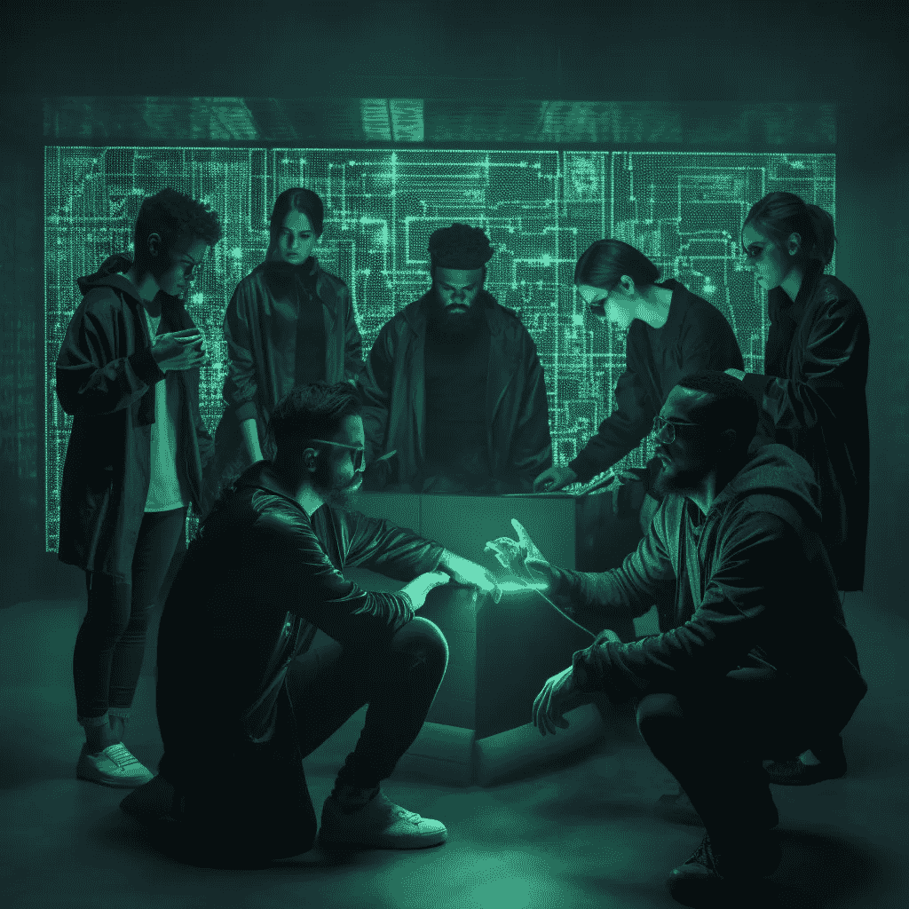

# 生成式 AI 将如何影响产品工程团队

> 原文：[`towardsdatascience.com/how-generative-ai-will-impact-product-engineering-teams-83a5eaa8fc60`](https://towardsdatascience.com/how-generative-ai-will-impact-product-engineering-teams-83a5eaa8fc60)

作者使用 Midjourney 制作的图像

## *生成式 AI 编码和生产力工具对构建软件产品的团队会产生什么影响？*

 [Mark Ridley](https://mark-ridley.medium.com/?source=post_page-----83a5eaa8fc60--------------------------------)

·发表于 [Towards Data Science](https://towardsdatascience.com/?source=post_page-----83a5eaa8fc60--------------------------------) ·阅读时间 7 分钟·2023 年 7 月 25 日

--

我认为我们现在可以安全地假设，关于生成式 AI 工具 —— 如 ChatGPT、Midjourney 和 Dall-E —— 将对我们的工作方式产生影响，已经没有多少争议。剩下的问题实际上是“影响会有多大？”和“何时发生？”

在过去几个月里，我经常发现，当我考虑技术团队的人员配置时，我最终会质疑一个我多年来一直可以依赖的相当稳定的模型。随着生成式 AI 工具的演变速度和投入资金的数量不断增加，有一个想法一直困扰着我：

**下一代产品工程团队可能会比现在拥有更少的工程师。**

在这六篇文章的系列中，我将探讨当前构建数字产品的团队的现状和结构，最近几个月显著的变化，以及新一代 AI 编码工具对团队本身可能产生的影响。到文章结束时，技术、数据和产品领导者，以及工程师们，应该能够理解这一变化的范围，并有一个基础来考虑他们将如何应对。

这个系列主要针对对产品开发有一定理解的技术、数据和产品领导者，但我尽量在上下文中解释任何更技术性的概念。这不是对 AI 工具的详细探索或比较，而是它们可能对团队产生的影响。

# 今天我们所处的位置 — 5:1 比例

**五比一**。这是我对构建数字产品的团队中每个产品经理所需工程师数量的一个非常粗略的经验法则。

我的日常工作是作为顾问首席技术官（CTO），为高管团队提供建议，或直接与产品和技术领导者一起工作，帮助制定他们的战略和产品与技术团队的结构。当有人询问如何构建他们的产品工程团队时，我的回答通常是‘*由五到九人组成的跨职能团队，具备交付业务成果所需的所有技能*’。

无论公司规模如何，这些建议保持惊人的一致。当初创公司处于发展的初期阶段，工程团队迅速壮大时，十到十二人的团队通常是团队规模开始造成拖延和缺乏清晰度的点。在这个关键的拐点，当工作量超过单一团队的承载能力时，就该进行扩展了。一个团队分裂成两个团队，两个团队分裂成三个团队，每个团队有五到九人，如同有丝分裂一般。

在规模较大的公司中，随着多个团队部落的扩展，这种模型保持一致。我负责过的最大技术团队大约有 300 名工程师，属于一个约 450 人的产品和技术团队。即便在这样的整体规模下，团队层级的比例仍然主导着 5:1——大约五名工程师和一名产品经理，通常还有一些额外角色的独特变化，如数据科学家、机器学习工程师、设计师、用户体验（UX）专家、敏捷教练、质量保证（QA）人员和开发运维（dev ops），以填补人数需求。

# 什么构成了一个团队？

每个产品工程团队和每个首席技术官（CTO）都是不同的。虽然我个人偏好产品经理了解他们的客户，对商业结果负责，扫描创新前沿，并直接与团队合作以优先处理工作，但一些公司选择将产品负责人和产品经理角色分开。我倾向于选择跨团队工作的敏捷教练，但有些人更喜欢在团队内嵌的敏捷教练。有些人坚信测试和质量保证（QA）作为团队内的具体角色的重要性，但我更倾向于将质量责任推给编写代码的人，并尽可能地‘[左移](https://www.atlassian.com/blog/software-teams/5-tips-for-shifting-left-in-continuous-testing)’。产品设计和用户体验研究可能在团队内，或者作为对团队的服务提供。有成千上万种配置，没有特定的对错答案，且始终需要根据组织的背景来调整。

如果有人让我创建一个理想的团队，我会要求一个产品负责人和一个技术负责人，他们具有相当的资历，并且彼此之间存在创意上的紧张关系。这两个角色的重要性在于代表（并对其不同观点进行争论）。客户满意度。成本。收益。风险。价值。正如我经常强调的：“产品决定构建什么，技术决定如何构建”。

过去 20 年左右，自从敏捷方法成为软件开发的主要方法以来，产品工程团队通常会有一个产品负责人和一些不同资历的工程师。在今天的世界中，工程师是产品交付的实际单位——没有工程师将需求转化为结果，我们就无法交付任何产品。

工程师不仅仅是构建新产品和功能；他们还负责保持现有产品的适用性和健康状态。工程师一周中的很大一部分时间可能会花在维护现有产品和系统上；修复漏洞、升级版本、回应小的变更请求和处理安全问题。他们剩余的时间可能会用来解决更有创意的问题，构建新能力或实施新的技术解决方案。此外，大多数工程团队都有需要时间学习和培训的初级工程师，还有更资深的工程师在不断变化的技术面前维持现状。

团队中产品经理的角色至关重要。如果工程师是我们价值交付的单位，产品经理也肩负着同样重要的责任；引导客户和利益相关者的需求，帮助团队以创意方式将挑战转化为解决方案，分析并展示结果的价值，确定价值交付的优先顺序，然后证明所有努力的投资回报。

在我们有五名工程师编写代码的团队中，“一个”几乎是理想的产品经理数量，可以保持工程师的参与度、生产力以及提供优质工作的供应。

**直到现在为止。**

# 产品工程中的生成式 AI 崛起

过去几个月我与许多 CEO 交谈时，他们专注于如何将“AI”硬生生地融入他们的产品中，表现出一种介于歇斯底里和绝望之间的热情。我对他们的建议是，应该将“真正”的 AI 工作留给那些拥有风险投资资金的人，自己则只需集成 OpenAI、微软、Salesforce、亚马逊和谷歌在未来几个月内提供的服务。

暂时搁置生成式 AI（我将用来泛指 GPT、LLMs 等）的新产品应用，我认为有一个更有趣且战略性的讨论——当生成式 AI 真正准备好投入生产时，我们的团队将会是什么样子。

面对美国的[SAG-AFTRA 和 WGA 演员及编剧罢工](https://www.latimes.com/entertainment-arts/business/story/2023-07-18/sag-aftra-strike-bob-iger-fran-drescher-barry-diller-david-zaslav-revolution)，回顾麦肯锡在 2017 年[对 AI 对劳动力影响的预测](https://www.mckinsey.com/featured-insights/future-of-work/jobs-lost-jobs-gained-what-the-future-of-work-will-mean-for-jobs-skills-and-wages)具有启示性。经过大量的研究和分析，麦肯锡对可能受到 AI 影响的职业进行了排序。麦肯锡提出，*“创意工作者”* 这一小而不断增长的艺术家、表演者和娱乐工作者类别将受到的影响最小，因为随着收入的增加，这类工作者的需求也会增加。*麦肯锡认为，娱乐工作者就像现在罢工的编剧和演员一样，不仅不会避免 AI 的影响，反而会从中受益。* 对于任何关于 AI 影响的预测（包括你正在阅读的这篇文章），这里有一个警示。

当然，麦肯锡的水晶球和其他人的一样并不神奇，我引用六年前的研究也有些古板。尽管如此，看到 AI 的影响没有被世界上最大的创意产业忽视，反而成为创意工会对制片厂和制作人的主要投诉之一，这还是令人感到振奋的。从对[漫威《秘密入侵》中使用生成 AI 艺术的抗议](https://www.polygon.com/23767640/ai-mcu-secret-invasion-opening-credits)到（有争议的）[演员可能需要将其数字肖像权利永久转让给 AI 效果的说法](https://www.theverge.com/2023/7/13/23794224/sag-aftra-actors-strike-ai-image-rights)，有一点非常明确：创意产业在不久的将来无疑将受到 AI 的影响。

为什么在一篇关于产品工程团队的文章中要绕道谈论创意产业呢？好吧，猜猜麦肯锡在其“安全”职业的大名单中，接下来最不容易受到 AI 影响的是什么？根据麦肯锡，接下来最不容易受到 AI 影响的群体将是*“IT 专业人员和其他技术专家、管理人员和高管，他们的工作不容易被机器替代”*。

麦肯锡早在 2017 年的观点是，*“自动化对涉及管理人员、应用专业知识和社会互动的工作影响较小，因为目前机器无法与人类的表现相匹敌。”* [[link](https://www.mckinsey.com/featured-insights/future-of-work/jobs-lost-jobs-gained-what-the-future-of-work-will-mean-for-jobs-skills-and-wages)]。问题是，GPT 完全颠覆了算法在这些领域会挣扎的合理假设。2023 年的大型语言模型在广泛的话题中，包括软件开发，极具能力地展示了‘应用专业知识’的可信外观。

**在第二部分中，我们探讨：**

1.  人工智能工具如 ChatGPT 如何彻底改变产品工程团队的编码方式——从生成用户故事到编写实际代码的过程。

1.  开发者通常认为繁琐的任务，如编写测试和文档，现在可以被 AI 轻松高效地处理，使整个编码过程更加流畅。

1.  深入探讨测试的重要性以及可能由深思熟虑的测试设计开始的提示工程应用的未来。

1.  一种未来的愿景，即生成 AI 工具如何重新定义产品工程团队中的角色，以及对技术团队相比于产品管理的深远影响。

1.  敬请关注这些发展将如何影响软件工程的世界以及成为开发者的本质。

[**点击这里阅读第二部分**](https://medium.com/@mark-ridley/the-proliferation-of-generative-ai-coding-tools-and-how-product-engineering-teams-will-use-them-48787ebfcaaa)

**本系列的其他文章：**

+   [第一部分](https://mark-ridley.medium.com/how-generative-ai-will-impact-product-engineering-teams-83a5eaa8fc60)

+   [第三部分](https://mark-ridley.medium.com/if-engineers-start-to-use-ai-coding-tools-what-happens-to-our-product-teams-acd55fb273dd)

附言：如果你喜欢这些关于团队的文章，可以看看我的[Teamcraft 播客](https://www.teamcraft.uk/)，在节目中我和我的共同主持人安德鲁·麦克拉伦与嘉宾讨论如何让团队更高效。
