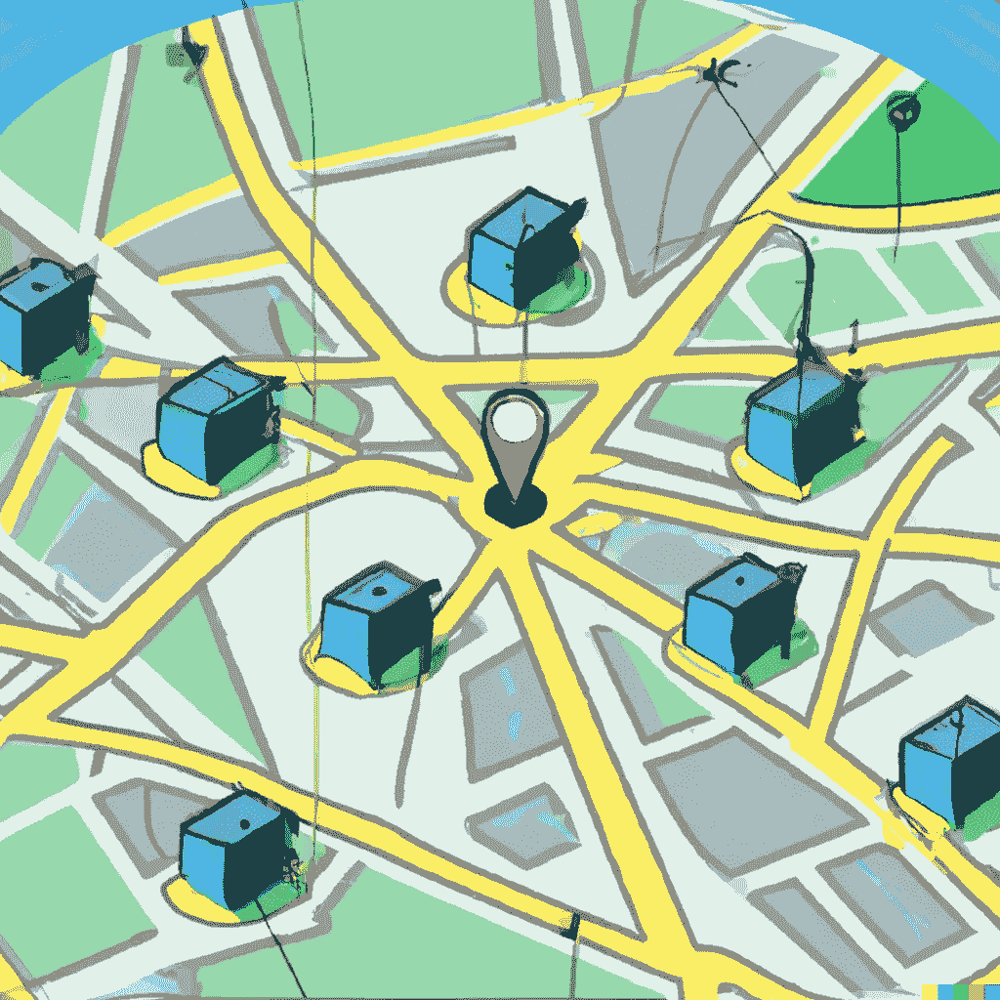

# 地理围栏如何塑造你周围的世界

> 原文：[`towardsdatascience.com/how-geofencing-is-shaping-the-world-around-you-12f6800df9c5?source=collection_archive---------11-----------------------#2023-02-07`](https://towardsdatascience.com/how-geofencing-is-shaping-the-world-around-you-12f6800df9c5?source=collection_archive---------11-----------------------#2023-02-07)

## 地理围栏是一种基于位置的技术，为我们打开了新的可能性

 [Nikhil S Hubballi](https://medium.samashti.space/?source=post_page-----12f6800df9c5--------------------------------)

·

[关注](https://medium.com/m/signin?actionUrl=https%3A%2F%2Fmedium.com%2F_%2Fsubscribe%2Fuser%2F74a67584b759&operation=register&redirect=https%3A%2F%2Ftowardsdatascience.com%2Fhow-geofencing-is-shaping-the-world-around-you-12f6800df9c5&user=Nikhil+S+Hubballi&userId=74a67584b759&source=post_page-74a67584b759----12f6800df9c5---------------------post_header-----------) 发布于 [Towards Data Science](https://towardsdatascience.com/?source=post_page-----12f6800df9c5--------------------------------) ·11 分钟阅读·2023 年 2 月 7 日

--

DALL-E 所描绘的地理围栏概念（作者提供的图像）

随着我们迎接一个更加互联的世界，位置数据的使用日益重要。几乎地球上的每一个服务提供商或平台都在尝试通过了解用户的行为模式、参与度等来接触人们（和潜在客户）。而地理围栏技术在这一领域创造了一波新潮流。它允许组织向进入或离开特定地理区域的用户发送消息或警报。

近年来，地理围栏已成为企业、政府和个人越来越受欢迎的工具，它正在以多种方式改变我们周围的世界。凭借简单的实施过程和几乎可以覆盖全球所有电子设备的潜力，让我们来看看地理围栏如何塑造你周围的世界。

如果你想了解更多关于地理空间数据及其如何改变数据分析领域的信息，可以查看我关于该主题的博客 [这里](https://www.samashti.space/articles/why-geospatial-data-is-the-way-forward-in-data-analytics)。还可以阅读我关于为什么需要使用地理包而不是 shapefile 或 geojson 的博客 [这里](https://www.samashti.space/articles/why-you-need-to-use-geopackage-files-instead-of-shapefile-or-geojson)。

# 什么是地理围栏？

地理围栏的工作原理基于空间关系。该服务部署在应用程序或软件中，通过 GPS、RFID、Wi-Fi 或蜂窝数据收集位置信息。它在任何给定的时间点跟踪移动设备或 RFID 标签的位置是否在围绕地理位置设置的虚拟边界内。这个虚拟边界被称为地理围栏（因其类似于围绕房地产的围栏）。一旦有设备进入或离开地理围栏的触发，服务会运行预先编程的操作，包括向设备发送优惠券、通知、短信、安全警报，并启用某些参与功能以进行定向广告等。

地理围栏可以用于各种目的。它允许监控安全区域的活动。

# 地理围栏是如何工作的？

利用地理围栏技术的第一步是建立一个虚拟边界，围绕应用程序或软件中的指定位置。

## 跟踪模式

地理围栏使用多种技术来跟踪设备的位置并确定它们是否在虚拟边界内。最常见的跟踪模式包括：

**a. GPS（全球定位系统）：** GPS 是一种基于卫星的导航系统，可以确定设备的精确位置。

**b. 蜂窝网络：** 蜂窝技术可以根据设备与基站的接近程度来跟踪设备的位置。

**c. Wi-Fi：** Wi-Fi 技术可以根据设备与 Wi-Fi 网络的接近程度来跟踪设备的位置。

**d. 蓝牙：** 蓝牙技术可以根据设备与蓝牙设备的接近程度来跟踪设备的位置。

**e. RFID（射频识别）：** RFID 是一种利用无线电波与设备或物体上的标签进行通信的技术。

**f. IP 地址：** 可以通过设备的 IP 地址来确定其位置。

## 目标模式

一旦确定了设备的位置，地理围栏可以用来触发各种目标模式。一些最常见的目标模式包括：

**a. 品牌应用：** 品牌可以利用地理围栏向已安装其应用并位于特定地理区域的用户发送通知或促销信息。

**b. 网络广告：** 网络广告可以针对位于特定地理区域的用户，基于其设备的位置进行定向投放。

**c. 短信：** 短信可以发送给位于特定地理区域的用户。

**d. 第三方应用：** 第三方应用可以利用地理围栏向用户提供基于位置的信息和服务。

**e. 社交媒体广告：** 社交媒体广告可以针对位于特定地理区域的用户，基于其设备的位置进行定向投放。

# 地理围栏的应用

## 车队管理

1.  **车辆追踪：** 地理围栏可以用于实时追踪卡车、出租车和其他车辆的位置，使车队管理者能够监控车队的移动情况，并确保车辆按照预期使用。

1.  **路线优化：** 通过使用地理围栏，车队管理者可以优化车辆的路线，以减少燃油消耗，提高安全性，并提高效率。这可以通过在禁入或限制区域周围创建地理围栏，以及利用交通模式和道路状况数据来制定最有效的路线来实现。

1.  **驾驶行为监控：** 地理围栏可以用于监控驾驶员的行为，包括速度、加速度和刹车。这些数据可以用于改善驾驶习惯，减少燃油消耗，提高整体安全性。

1.  **合规监控：** 地理围栏可以用于确保车辆在合规规定范围内运行，如卡车运输规定和服务时间规则。这可以帮助车队管理者避免处罚和罚款，并保持良好的声誉。

1.  **客户位置追踪：** 对于共享出行和出租车公司，地理围栏可以用于追踪客户的位置，并将其与最近的可用车辆匹配。这可以帮助改善客户体验并减少等待时间。

1.  **资产管理：** 地理围栏可以用于管理车队的资产，包括拖车和货物集装箱。通过使用地理围栏，车队管理者可以跟踪这些资产的位置，并确保它们按照预期使用。

## 营销与广告

1.  **基于位置的广告：** 地理围栏可以用于根据用户的位置投放定向广告。例如，当用户进入一个购物中心的地理围栏时，他们可能会收到该购物中心内商店的广告。

1.  **事件推广：** 地理围栏可以用于通过根据用户的位置投放定向广告来推广活动。例如，当用户进入一个活动场地的地理围栏时，他们可能会收到该活动的广告。

1.  **人流量分析：** 可以使用地理围栏跟踪和分析特定地点的人流量，如零售店或购物中心，以更好地了解消费者行为并改善营销策略。

1.  **客户重定向：** 可以使用地理围栏根据客户的过去行为（如位置历史）来投放定向广告，从而提高广告的相关性和有效性。

1.  **基于位置的优惠：** 可以使用地理围栏根据用户的位置提供基于位置的优惠，如折扣和优惠券。

1.  **客户细分：** 可以使用地理围栏根据客户的地理位置（如城市、州或区域）进行客户细分，以提高广告的相关性和有效性。

## 安全

1.  **无人机管理：** 可以使用地理围栏来管理无人机的操作，例如，通过在无人机飞行禁区周围创建虚拟边界。这可以帮助防止无人机干扰其他飞行器或进入受限空域，从而提高整体安全性。

1.  **执法：** 可以被执法机构用来监控高犯罪率区域并提高公共安全。通过在已知犯罪高发区域创建地理围栏，执法部门可以实时接收到犯罪发生的警报，并更迅速地做出回应。

1.  **物理安全：** 可以使用地理围栏来监控高价值地点的物理安全，如政府大楼、核电站和其他关键基础设施。通过在这些地点周围创建地理围栏，安保人员可以实时接收到未经授权人员进入区域的警报，并更迅速地做出回应。

1.  **活动安全：** 可以使用地理围栏来提升大型活动的安全性，如音乐会、体育赛事和政治集会。通过在活动场地周围创建地理围栏，安保人员可以实时监控人群移动，并在出现安全威胁时迅速做出反应。

## 区域划分

1.  **旅游：** 可以使用地理围栏来促进特定区域的旅游活动，通过在热门旅游景点（如国家公园、历史遗址和文化景点）周围创建地理围栏。当游客进入地理围栏时，可以接收到定向广告、促销信息及其他营销消息。

1.  **国家公园：** 可以使用地理围栏通过在特定区域（如徒步旅行小径、野餐区和野生动物保护区）周围创建地理围栏来提升国家公园的游客体验。游客可以实时获取关于公园及其景点的信息，如小径地图、野生动物 sightings 和公园规定。

1.  **度假村：**地理围栏可以通过在度假村区域内创建地理围栏来提升度假体验，例如酒店、餐厅和水疗中心。客人可以实时获取有关度假村及其设施的信息，例如客房服务菜单、水疗项目和每日活动。

1.  **养老院：**地理围栏可以通过在设施周围创建地理围栏来增强养老院居民的安全性和生活质量。如果居民离开设施，护理人员可以实时接收警报，这有助于防止漫游和脱逃。

## 自动驾驶

1.  **车辆安全：**地理围栏可以用于通过在车辆不应进入的区域创建虚拟边界来确保自动驾驶车辆的安全操作。例如，可以在危险区域设置地理围栏，如施工现场、步行专用区和敏感环境。

1.  **自动驾驶区：**地理围栏可以用于指定仅限自动驾驶车辆的区域，如机场、港口和工业园区。这使得自动驾驶车辆能够在没有人驾车干扰的情况下运行，并可以改善交通流量和减少事故风险。

1.  **基于地理位置的服务：**地理围栏可以用于向自动驾驶车辆中的乘客提供基于位置的服务，例如导航、天气信息和交通更新。乘客可以实时获取有关车辆位置、目的地和预计到达时间的信息，以及有关周围地区的信息，例如交通状况、天气和兴趣点。

1.  **紧急响应：**地理围栏可以通过在事故现场和其他紧急地点创建地理围栏来支持紧急响应工作。自动驾驶车辆可以被派往现场提供即时援助，例如运输医疗用品、设备和人员。

## 资产管理

1.  **设备追踪：**地理围栏可以通过在工地、仓库和车间周围创建地理围栏来追踪设备，如建筑机械和车辆。这使得管理者能够实时监控设备的移动，减少盗窃和损坏的风险，并提高设备利用效率。

1.  **库存管理：**地理围栏可以用于通过在仓库和存储区域周围创建地理围栏来管理库存水平。这使得管理者能够实时监控库存的移动，减少盗窃和损失的风险，并提高库存管理的效率。

1.  **工人安全：**地理围栏可以通过在危险区域周围创建地理围栏来增强工人的安全，例如施工现场和矿区。这使得管理者能够实时监控工人的移动，减少事故风险，并在紧急情况下提高响应速度。

1.  **实时监控：** 地理围栏可以用来实时监控资产的状态和健康，比如建筑机械和车辆。这使得管理者能够迅速应对任何问题，如故障和维护需求，减少停机时间并提高操作效率。

1.  **合规监控：** 地理围栏可以用来监控法规遵守情况，如健康和安全法规，通过在受监管区域周围创建地理围栏。这使得管理者能够实时监控合规情况，减少罚款风险并提高整体合规性。

## 家庭自动化

1.  **家庭安全：** 地理围栏可以用来增强家庭安全，通过在家周围创建地理围栏。这使得房主能够实时监控个人和车辆的移动，降低入侵和盗窃的风险。

1.  **智能家居控制：** 地理围栏可以用来控制智能家居设备，如灯光、恒温器和家电，通过在家周围创建地理围栏。这使得房主可以自动化日常操作，比如离家时关灯，或到家时调整温度。

1.  **车辆追踪：** 地理围栏可以用来追踪车辆的位置，比如汽车、摩托车和自行车，通过在家、工作地点或常去的地方创建地理围栏。这使得房主能够实时监控车辆的移动，降低盗窃风险并提高车辆利用效率。

1.  **提醒：** 地理围栏可以用来根据位置设置提醒，比如到家时提醒服药，或离开工作地点时提醒去买杂货。

1.  **物联网集成：** 地理围栏可以用来集成物联网（IoT）设备，如智能锁、摄像头和传感器，通过在家周围创建地理围栏。这使得房主能够实时监控设备的状态和健康，减少问题风险并提高操作效率。

## 社交网络

1.  **社交网络：** 地理围栏可以用来提升社交网络体验，通过基于位置让用户找到并与他人连接。例如，约会应用可能会利用地理围栏根据用户之间的距离进行匹配。

1.  **基于位置的游戏：** 地理围栏可以用来增强基于位置的游戏，如宝可梦 GO，通过让玩家根据位置与虚拟物体互动。

1.  **基于位置的奖励：** 地理围栏可以用来根据位置向用户提供奖励。例如，奖励计划可能会利用地理围栏在用户进入参与商店周围的地理围栏时提供积分或优惠券。

# 设置地理围栏

1.  **定义地理围栏：** 设置地理围栏的第一步是定义虚拟边界或地理围栏。这可以通过在地图上绘制一个圆圈或多边形，或使用一组 GPS 坐标来定义边界来完成。

1.  **选择跟踪方法：** 一旦定义了地理围栏，下一步是选择跟踪方法。这将取决于具体的使用案例和需要跟踪的设备。例如，GPS 可能是跟踪户外位置的最佳选择，而 Wi-Fi 或蓝牙可能更适合室内跟踪。

1.  **与地理围栏平台集成：** 要使用地理围栏，需要将其与地理围栏平台集成。该平台通常包括一个用于管理地理围栏、跟踪设备和目标营销活动的仪表板。

1.  **安装跟踪软件：** 如果使用 GPS、Wi-Fi、蓝牙或其他跟踪模式，跟踪软件需要安装在需要跟踪的设备上。

1.  **测试和调整：** 在设置好地理围栏平台后，重要的是测试系统以确保其正常运作。这可能包括调整地理围栏的大小和位置，或细化目标营销活动。

1.  **启动营销活动：** 一旦地理围栏平台经过测试和调整，就可以启动目标营销活动。这可能包括向进入地理围栏的用户发送通知或促销信息，或向地理围栏内的用户展示基于位置的广告。

# 隐私问题

地理围栏是一项强大的技术，但也引发了诸多隐私问题，包括：

1.  **跟踪你的定位：** 地理围栏依赖于跟踪用户的位置，以便提供定向广告、优惠和其他类型的内容。这种跟踪可以揭示用户的位置信息和日常习惯，可能会被用于恶意目的，例如身份盗窃或监视。

1.  **个人数据收集：** 地理围栏需要收集个人数据，例如用户的位置，以便正常运作。这些个人数据可能容易受到泄露或未经授权的访问，从而导致敏感信息落入不当之手。

1.  **垃圾邮件：** 地理围栏可能会导致用户被大量不必要的广告和优惠轰炸，这可能会造成烦扰并侵害他们的隐私。此外，恶意行为者可以利用地理围栏来发送垃圾邮件或钓鱼内容，这可能使用户面临身份盗窃或其他类型的诈骗风险。

1.  **Strava 热图揭示美国军事位置：** 2018 年，揭露了健身追踪应用 Strava 通过其热图功能暴露了关于美国军事位置和行动的敏感信息。这突显了使用地理围栏和其他基于位置的技术来揭示敏感信息的风险。

1.  **在频繁访问医院时对疾病的预测：**地理围栏技术在用于预测疾病或健康状况时也可能引发隐私问题。例如，如果一个人频繁访问医院，地理围栏技术可能预测他们有某种特定的健康状况，这可能是他们不希望公开的敏感信息。

用户了解这些隐私风险非常重要，公司需要实施强有力的隐私保护措施，以减轻这些风险，保护用户的个人数据和隐私。

# 结论

总之，地理围栏技术正在以多种方式改变我们周围的世界。从营销和广告到公共安全和农业，地理围栏对多个行业产生了重大影响。随着技术的不断发展，我们可能会看到未来更多创新和激动人心的应用。无论你是企业、政府还是个人，地理围栏都是一个可以帮助你充分利用地理位置并改善日常生活的工具。
