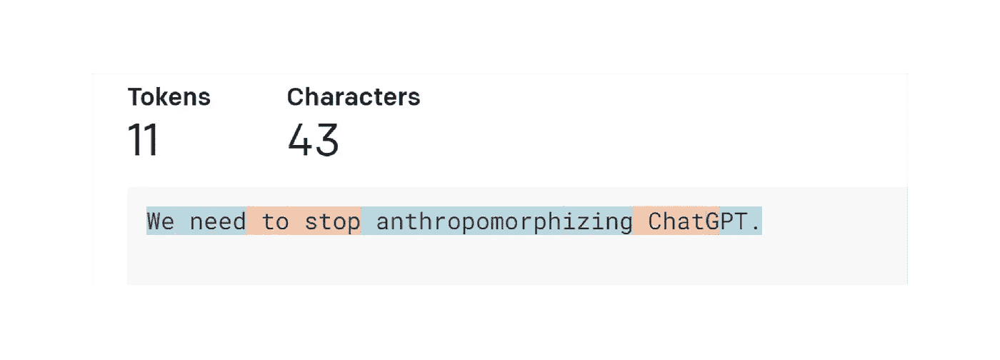

# GPT 模型的工作原理

> 原文：[`towardsdatascience.com/how-gpt-models-work-b5f4517d5b5`](https://towardsdatascience.com/how-gpt-models-work-b5f4517d5b5)

## 了解 OpenAI 的 GPT 模型背后的核心概念

[](https://medium.com/@bea_684?source=post_page-----b5f4517d5b5--------------------------------)[](https://towardsdatascience.com/?source=post_page-----b5f4517d5b5--------------------------------) [Beatriz Stollnitz](https://medium.com/@bea_684?source=post_page-----b5f4517d5b5--------------------------------)

·发表于 [Towards Data Science](https://towardsdatascience.com/?source=post_page-----b5f4517d5b5--------------------------------) ·14 分钟阅读·2023 年 5 月 20 日

--


图片来源：[KOMMERS](https://unsplash.com/@kommers?utm_source=medium&utm_medium=referral) 在 [Unsplash](https://unsplash.com/?utm_source=medium&utm_medium=referral)

## **介绍**

我在 2021 年写了第一段使用 GPT 模型的代码，那时我意识到文本生成已经达到了一个拐点。在那之前，我在研究生阶段从零开始编写过语言模型，也有使用其他文本生成系统的经验，所以我知道让它们产生有用的结果有多么困难。我有幸在 Azure OpenAI 服务发布时获得了 GPT-3 的早期访问权限，并在其发布前进行了尝试。我要求 GPT-3 总结一份长文档，并尝试了一些少样本提示。我发现结果远远超出了之前模型的水平，这让我对这项技术感到兴奋，并渴望了解它是如何实现的。现在，后续的 GPT-3.5、ChatGPT 和 GPT-4 模型正迅速获得广泛应用，更多领域的人也对它们的工作原理充满好奇。尽管它们的内部工作细节是专有且复杂的，但所有 GPT 模型共享一些基本概念，这些概念并不难理解。我的目标是解释语言模型的一般核心概念，特别是 GPT 模型的核心概念，解释面向数据科学家和机器学习工程师。

## **生成式语言模型的工作原理**

让我们开始探索生成式语言模型的工作原理。最基本的想法如下：它们将*n*个标记作为输入，生成一个标记作为输出。


这看似是一个相当简单的概念，但为了真正理解它，我们需要知道什么是标记。

一个标记是文本的一部分。在 OpenAI GPT 模型的上下文中，常见且简短的词通常对应一个标记，例如下图中的“我们”一词。较长且不常用的词通常会被拆分为多个标记。例如，下图中的“人性化”一词被拆分为三个标记。像“ChatGPT”这样的缩写可能被表示为一个标记或拆分为多个标记，这取决于这些字母出现在一起的频率。你可以访问 OpenAI 的 [Tokenizer page](https://platform.openai.com/tokenizer)，输入你的文本，并查看它如何被拆分成标记。你可以在“GPT-3”分词（用于文本）和“Codex”分词（用于代码）之间进行选择。我们将保持默认的“GPT-3”设置。



你还可以使用 OpenAI 的开源 [tiktoken](https://github.com/openai/tiktoken) 库通过 Python 代码进行分词。OpenAI 提供了几种不同的分词器，每种分词器的行为略有不同。在下面的代码中，我们使用了用于“davinci”（一个 GPT-3 模型）的分词器，以匹配你在 UI 中看到的行为。

```py
import tiktoken

# Get the encoding for the davinci GPT3 model, which is the "r50k_base" encoding.
encoding = tiktoken.encoding_for_model("davinci")

text = "We need to stop anthropomorphizing ChatGPT."
print(f"text: {text}")

token_integers = encoding.encode(text)
print(f"total number of tokens: {encoding.n_vocab}")

print(f"token integers: {token_integers}")
token_strings = [encoding.decode_single_token_bytes(token) for token in token_integers]
print(f"token strings: {token_strings}")
print(f"number of tokens in text: {len(token_integers)}")

encoded_decoded_text = encoding.decode(token_integers)
print(f"encoded-decoded text: {encoded_decoded_text}")
```

```py
text: We need to stop anthropomorphizing ChatGPT.
total number of tokens: 50257
token integers: [1135, 761, 284, 2245, 17911, 25831, 2890, 24101, 38, 11571, 13]
token strings: [b'We', b' need', b' to', b' stop', b' anthrop', b'omorph', b'izing', b' Chat', b'G', b'PT', b'.']
number of tokens in text: 11
encoded-decoded text: We need to stop anthropomorphizing ChatGPT.
```

你可以在代码的输出中看到，这个分词器包含 50,257 个不同的标记，每个标记在内部映射为一个整数索引。给定一个字符串，我们可以将其拆分为整数标记，并将这些整数转换为它们对应的字符序列。对字符串进行编码和解码应始终返回原始字符串。

这给你一个关于 OpenAI 分词器如何工作的良好直觉，但你可能会想知道他们为何选择这些标记长度。让我们考虑一些其他的分词选项。假设我们尝试最简单的实现，即每个字母都是一个标记。这使得将文本拆分为标记变得容易，并且保持不同标记的总数较小。然而，我们无法编码像 OpenAI 方法那样多的信息。如果我们在上述示例中使用基于字母的标记，11 个标记只能编码“我们需要”，而 11 个 OpenAI 的标记可以编码整个句子。事实证明，当前的语言模型对它们可以接收的最大标记数量有限。因此，我们希望在每个标记中尽可能地打包更多信息。

现在让我们考虑一种情况，每个单词都是一个标记。与 OpenAI 的方法相比，我们只需七个标记即可表示相同的句子，这似乎更高效。而且按单词拆分也很容易实现。然而，语言模型需要一个完整的标记列表，以便处理它们可能遇到的标记，这对于整个单词来说是不可行的——不仅因为词典中的单词太多，还因为难以跟上特定领域的术语和任何新发明的词汇。

因此，OpenAI 选择了这两种极端之间的某种解决方案也就不足为奇了。其他公司也发布了采用类似方法的分词器，例如 Google 的 [Sentence Piece](https://github.com/google/sentencepiece)。

现在我们对令牌有了更好的理解，让我们回到原始图示，看看是否可以更好地理解它。生成模型接受 *n* 个令牌，这些令牌可以是几个词、几个段落或几页内容。它们输出一个单一的令牌，这可能是一个短词或词的一部分。


现在这就更有意义了。

但如果你使用过 [OpenAI 的 ChatGPT](https://chat.openai.com/)，你会知道它产生了许多令牌，而不仅仅是一个令牌。这是因为这个基本思想以扩展窗口模式应用。你给它 *n* 个令牌，它输出一个令牌，然后将这个输出令牌作为下一次迭代的输入的一部分，产生一个新的令牌，依此类推。这个模式不断重复，直到达到停止条件，表明它已经生成了你需要的所有文本。

例如，如果我向我的模型输入“我们需要”，算法可能会产生如下结果：


在使用 ChatGPT 的过程中，你可能也注意到模型不是确定性的：如果你问它完全相同的问题两次，你可能会得到两个不同的答案。这是因为模型实际上并不会产生一个单一的预测令牌；相反，它返回的是所有可能令牌的概率分布。换句话说，它返回一个向量，其中每个条目表示选择特定令牌的概率。然后，模型从该分布中采样以生成输出令牌。


模型是如何产生概率分布的？这就是训练阶段的目的。在训练过程中，模型接触了大量文本，并且其权重被调整以预测好的概率分布，给定一系列输入令牌。GPT 模型是用互联网上的大量数据进行训练的，因此它们的预测反映了它们见过的信息的混合。

你现在对生成模型背后的理念有了很好的理解。请注意，我只是解释了这个理念，尚未给出具体的算法。事实上，这个理念已经存在了几十年，并且多年来已经用几种不同的算法实现了。接下来我们将看看其中的一些算法。

## **生成语言模型的简史**

隐马尔可夫模型（HMMs）在 1970 年代变得流行。它们的内部表示编码了句子的语法结构（名词、动词等），并在预测新单词时使用这些知识。然而，由于它们是马尔可夫过程，它们在生成新标记时只考虑最新的标记。因此，它们实现了“*n* 个标记输入，一个标记输出”想法的非常简单版本，其中 *n* = 1\. 结果是，它们不会生成非常复杂的输出。我们来看以下示例：


如果我们将“ The quick brown fox jumps over the”输入到语言模型中，我们会期待它返回“lazy”。然而，HMM 只会看到最后一个标记“the”，而且只有这么少的信息，它不太可能给出我们期望的预测。随着人们对 HMMs 的实验，变得明显的是，语言模型需要支持多个输入标记以生成好的输出。

N-gram 在 1990 年代变得流行，因为它通过使用多个标记作为输入解决了隐马尔可夫模型（HMMs）的主要局限性。一个 n-gram 模型可能在预测前一个示例中的单词“lazy”时表现得非常好。

最简单的 n-gram 实现是基于字符的二元模型（bi-gram），它能够根据一个字符预测序列中的下一个字符。你可以用几行代码创建一个这样的模型，我鼓励你试试。首先，计算训练文本中不同字符的数量（我们称之为 *n*），并创建一个 *n x n* 的二维矩阵，初始值为零。每对输入字符可以用来在这个矩阵中定位一个特定的条目，通过选择对应第一个字符的行和第二个字符的列。当你解析训练数据时，对于每对字符，你只需将对应矩阵单元的值加一。例如，如果你的训练数据包含单词“car”，你会在“c”行和“a”列的单元格中加一，然后在“a”行和“r”列的单元格中加一。一旦你积累了所有训练数据的计数，将每一行转换为概率分布，方法是将每个单元格的值除以该行的总和。


然后，为了做出预测，你需要提供一个起始字符，例如“c”。你查找与“c”行对应的概率分布，并从中采样以生成下一个字符。然后，你取出你生成的字符，重复这个过程，直到达到停止条件。高阶 n-gram 遵循相同的基本思想，但它们能够通过使用 n 维张量查看更长的输入标记序列。

N-gram 简单易实现。然而，由于矩阵的大小随着输入标记数量的增加而指数级增长，它们在处理大量标记时的扩展性较差。并且对于仅有少量输入标记的情况，它们无法生成良好的结果。因此，需要一种新技术来继续在这一领域取得进展。

在 2000 年代，循环神经网络（RNNs）变得相当流行，因为它们能够接受比以前技术更多的输入标记。特别是，LSTMs 和 GRUs，这些是 RNNs 的类型，变得广泛使用并证明能够生成相当不错的结果。

RNNs 是一种神经网络，但与传统的前馈神经网络不同，它们的架构可以适应任何数量的输入并生成任何数量的输出。例如，如果我们给 RNN 输入标记“We”，“need”和“to”，并希望它生成更多标记直到达到完整的句点，RNN 可能具有以下结构：


上述结构中的每个节点具有相同的权重。你可以把它看作是一个单一的节点，连接到自身并重复执行（因此叫“递归”），或者可以按照上图中的扩展形式来理解。LSTMs 和 GRUs 相较于基础 RNNs 增加的一个关键能力是存在一个从一个节点传递到下一个节点的内部记忆单元。这使得后续节点能够记住前面节点的某些方面，这对于生成良好的文本预测是必不可少的。

然而，RNNs 在处理非常长的文本序列时存在不稳定问题。模型中的梯度往往会呈指数级增长（称为“梯度爆炸”）或减小为零（称为“梯度消失”），这阻碍了模型继续从训练数据中学习。LSTMs 和 GRUs 缓解了梯度消失问题，但并没有完全消除。因此，即使在理论上它们的架构允许任意长度的输入，但在实践中存在长度限制。文本生成的质量再次受到算法支持的输入标记数量的限制，需要新的突破。

在 2017 年，[论文](https://arxiv.org/abs/1706.03762) 介绍了 Transformers，谷歌发布了这一技术，我们进入了文本生成的新纪元。Transformers 的架构允许输入标记数量的大幅增加，消除了 RNNs 中出现的梯度不稳定问题，并且高度可并行化，这意味着它能够利用 GPU 的强大性能。如今，Transformers 被广泛使用，它们是 OpenAI 为其最新的 GPT 文本生成模型所选择的技术。

Transformers 基于“注意力机制”，它允许模型对某些输入给予比其他输入更多的关注，无论这些输入在输入序列中的位置如何。例如，我们来考虑以下句子：


在这种情况下，当模型预测动词“bought”时，它需要与动词“went”的过去式进行匹配。为了实现这一点，它必须非常关注“went”这个词。实际上，它可能会比对“went”这个词的注意力更强，即使“went”在输入序列中出现得更早。

GPT 模型中的这种选择性注意行为得益于 2017 年论文中的一个新颖概念：使用“掩码多头注意力”层。让我们来解析这个术语，并深入探讨它的每个子术语：

**注意力**: “注意力”层包含一个权重矩阵，表示输入句子中所有标记位置对之间的关系强度。这些权重在训练过程中学习得到。如果对应一对位置的权重大，则这两个位置上的标记会相互影响很大。这是使得 Transformer 能够对一些标记给予更多关注的机制，无论这些标记在句子中出现的位置如何。

**掩码**: 如果注意力层的矩阵仅限于每个标记位置与输入中的早期位置之间的关系，则称为“掩码”。这就是 GPT 模型在文本生成中使用的方式，因为一个输出标记只能依赖于它之前的标记。

**多头**: Transformer 使用了一个带有掩码的“多头”注意力层，因为它包含多个并行工作的掩码注意力层。

LSTM 和 GRU 的记忆单元也使得后续的标记能够记住一些早期标记的方面。然而，如果两个相关的标记距离非常远，梯度问题可能会成为障碍。Transformers 没有这个问题，因为每个标记与所有在它之前的其他标记都有直接连接。

现在你已经了解了 GPT 模型中使用的 Transformer 架构的主要思想，让我们来看一下目前可用的各种 GPT 模型之间的区别。

## **不同 GPT 模型的实现方式**

在撰写时，OpenAI 发布的三款最新文本生成模型是 GPT-3.5、ChatGPT 和 GPT-4，它们都基于 Transformer 架构。实际上，“GPT”代表“生成预训练变换器”。

GPT-3.5 是一个训练为完成式模型的 Transformer，这意味着如果我们给它几个词作为输入，它能够生成几个可能跟随这些词的词。

另一方面，ChatGPT 被训练为对话风格的模型，这意味着当我们像进行对话一样与它交流时，它的表现最佳。它基于与 GPT-3.5 相同的 transformer 基础模型，但经过对话数据的微调。然后，通过使用人类反馈的强化学习（RLHF）进一步微调，这是一种 OpenAI 在其 [2022 InstructGPT 论文](https://arxiv.org/abs/2203.02155) 中引入的技术。在这一技术中，我们将相同的输入提供给模型两次，得到两个不同的输出，并询问人类评分者哪个输出更好。这个选择然后用于通过微调来改进模型。这项技术使模型的输出与人类期望保持一致，并且对 OpenAI 最新模型的成功至关重要。

另一方面，GPT-4 可用于完成任务和对话，并且拥有全新的基础模型。该基础模型也经过 RLHF 微调，以更好地符合人类期望。

## **编写使用 GPT 模型的代码**

你有两个选项来编写使用 GPT 模型的代码：你可以直接使用 [OpenAI API](https://platform.openai.com/docs/api-reference/introduction)，或者使用 [Azure 上的 OpenAI API](https://learn.microsoft.com/en-us/azure/cognitive-services/openai/chatgpt-quickstart?pivots=programming-language-studio&tabs=command-line)。无论哪种方式，你都使用相同的 API 调用，你可以在 OpenAI 的 [API 参考](https://platform.openai.com/docs/api-reference/introduction) 页面中了解这些调用。

两者之间的主要区别在于 Azure 提供了以下附加功能：

+   自动化的负责任 AI 过滤器，减轻 API 的不道德使用

+   Azure 的安全功能，如私人网络

+   区域可用性，以在与 API 交互时获得最佳性能

如果你在编写使用这些模型的代码，你需要选择你想使用的具体版本。以下是 Azure OpenAI 服务中当前可用版本的快速备忘单：

+   GPT-3.5: text-davinci-002, text-davinci-003

+   ChatGPT: gpt-35-turbo

+   GPT-4: gpt-4, gpt-4–32k

两个 GPT-4 版本的主要区别在于它们支持的 token 数量：gpt-4 支持 8,000 个 token，而 gpt-4–32k 支持 32,000 个 token。相比之下，GPT-3.5 模型仅支持 4,000 个 token。

由于 GPT-4 目前是最昂贵的选项，因此最好从其他模型之一开始，只有在需要时才升级。有关这些模型的更多详细信息，请查看 [文档](https://learn.microsoft.com/en-us/azure/cognitive-services/openai/concepts/models)。

## **结论**

在这篇文章中，我们涵盖了所有生成性语言模型的基本原则，以及特别是 OpenAI 最新 GPT 模型的独特方面。

在过程中，我们强调了语言模型的核心理念：“*n* 个令牌输入，一个令牌输出。”我们探讨了令牌如何被拆分以及为何如此拆分。我们追溯了语言模型从早期的隐马尔可夫模型到近期的基于 Transformer 的模型的数十年演变。最后，我们描述了 OpenAI 最新的三个基于 Transformer 的 GPT 模型，每个模型的实现方式，以及如何编写代码利用这些模型。

到现在为止，你应该已经能够对 GPT 模型进行有深度的讨论，并在自己的编码项目中开始使用它们。我计划撰写更多关于语言模型的解释文章，请关注我，并告诉我你希望看到哪些话题！感谢阅读！

**注意**

所有图片均由作者提供，除非另有说明。你可以在本博客文章中出于任何目的使用原始图片，但需注明出处（链接到本文）。
