# GPT 的工作原理：使用一个药水的故事对注意力中的键、值、查询进行隐喻性的解释

> 原文：[`towardsdatascience.com/how-gpt-works-a-metaphoric-explanation-of-key-value-query-in-attention-using-a-tale-of-potion-8c66ace1f470?source=collection_archive---------0-----------------------#2023-06-17`](https://towardsdatascience.com/how-gpt-works-a-metaphoric-explanation-of-key-value-query-in-attention-using-a-tale-of-potion-8c66ace1f470?source=collection_archive---------0-----------------------#2023-06-17)

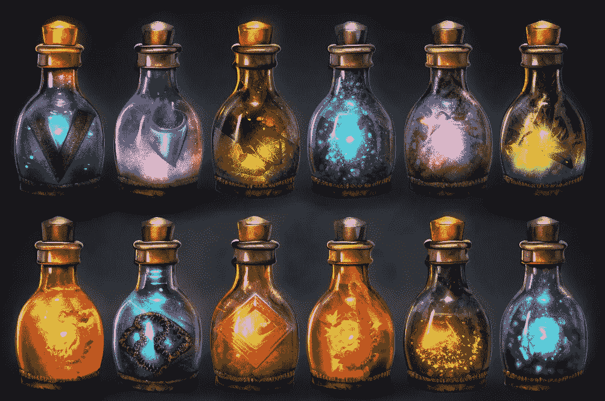

来源：由 Midjourney 生成。

 [Lili Jiang](https://medium.com/@lilipads93?source=post_page-----8c66ace1f470--------------------------------)

·

[关注](https://medium.com/m/signin?actionUrl=https%3A%2F%2Fmedium.com%2F_%2Fsubscribe%2Fuser%2F3cc31a4b9430&operation=register&redirect=https%3A%2F%2Ftowardsdatascience.com%2Fhow-gpt-works-a-metaphoric-explanation-of-key-value-query-in-attention-using-a-tale-of-potion-8c66ace1f470&user=Lili+Jiang&userId=3cc31a4b9430&source=post_page-3cc31a4b9430----8c66ace1f470---------------------post_header-----------) 发表在 [Towards Data Science](https://towardsdatascience.com/?source=post_page-----8c66ace1f470--------------------------------) ·10 分钟阅读·2023 年 6 月 17 日

--

**！更新：该帖子现在有一个 10 分钟的视频版本** [**可用**](https://www.youtube.com/watch?v=Mhy7I4E6eXs&ab_channel=ArchermanCapital)**！**

ChatGPT 的核心是 GPT 模型，它是使用**变换器**架构构建的。变换器的核心是**注意力**机制。对许多人来说，理解注意力中最难的概念是**键、值和查询**。在这篇文章中，我将用药水的类比来帮助理解这些概念。即使你已经机械地理解了变换器的数学部分，我希望通过这篇文章，你能从头到尾更直观地理解 GPT 的内部工作原理。

> 这个解释不需要数学背景。对于技术性强的读者，我在[…]中添加了更多的技术解释。你也可以安全地跳过[方括号]中的注释和像这样在引号块中的附注。在我的写作过程中，我编造了一些可读的人类解释，用于说明变换器模型的中间状态，以帮助解释，但 GPT 并不完全是这样思考的。
> 
> [当我谈论“注意力”时，我专指“自注意力”，因为这正是 GPT 背后的机制。但同样的类比也可以很好地解释“注意力”的一般概念。]

## 设置

GPT 可以输出连贯的段落内容，因为它非常擅长执行一个任务：“给定一个文本，下一个词是什么？”让我们角色扮演 GPT：*“Sarah 躺在床上，感觉 ____”*。你能填上这个空白吗？

其中一个合理的答案是*“疲倦”*。在接下来的内容中，我将详细说明 GPT 是如何得出这个答案的。（为了好玩，我将这个提示放入 ChatGPT 中，它从中写了一个简短的[故事](https://chat.openai.com/share/169f2702-3811-4388-b3d4-67064903f4b2)）。

## 类比：（键、值、查询），或（标签、药水、配方）

你将上述提示输入 GPT。在 GPT 中，每个词都配备了三样东西：键（Key）、值（Value）、查询（Query），这些值是在 GPT 模型训练期间从整个互联网的文本中学习到的。正是这三种成分的相互作用使得 GPT 能够在文本的上下文中理解一个词。那么它们究竟是做什么的呢？

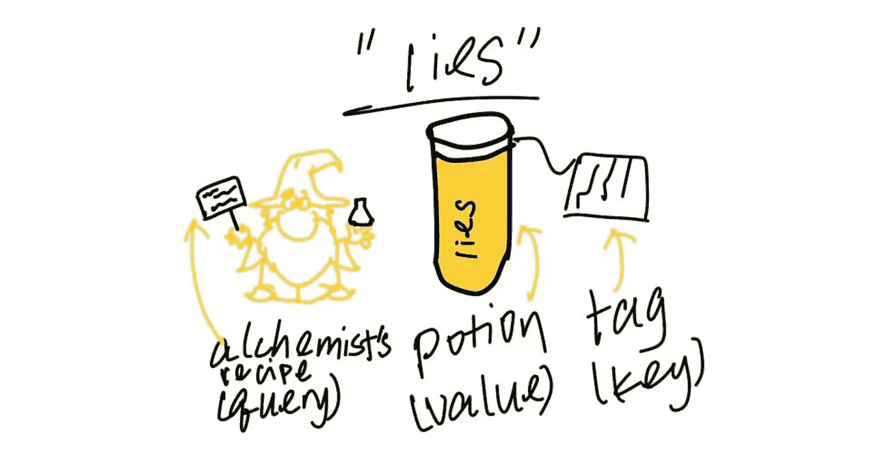

来源：由作者创建。

让我们设立炼金术的类比。**对于每一个词**，我们有：

+   **药水**（即“值”）：药水包含了关于词的丰富信息。为了说明目的，假设词*“lies”*的药水包含了如*“疲倦；不诚实；如果是善意的谎言可能有积极的含义；……”*的信息。词*“lies”*可以有多重含义，例如“说谎”（与不诚实相关）或“躺下”（与疲倦相关）。只有在文本的上下文中，你才能真正了解其含义。目前，药水包含了两种含义的信息，因为它没有文本的上下文。

+   **炼金术师的配方**（也称为“查询”）：给定单词的炼金术师，例如*“谎言”*，会查看所有附近的单词。他找到了一些与自己单词*“谎言”*相关的单词，他的任务是用这些单词的药水填满一个空药瓶。炼金术师有一个配方，列出了确定他应该关注哪些药水的具体标准。

+   **标签**（也称为“关键字”）：每种药水（值）都有一个标签（关键字）。如果标签（关键字）与炼金术师的配方（查询）匹配得很好，炼金术师将会关注这种药水。

## 注意：炼金术师的药水调配

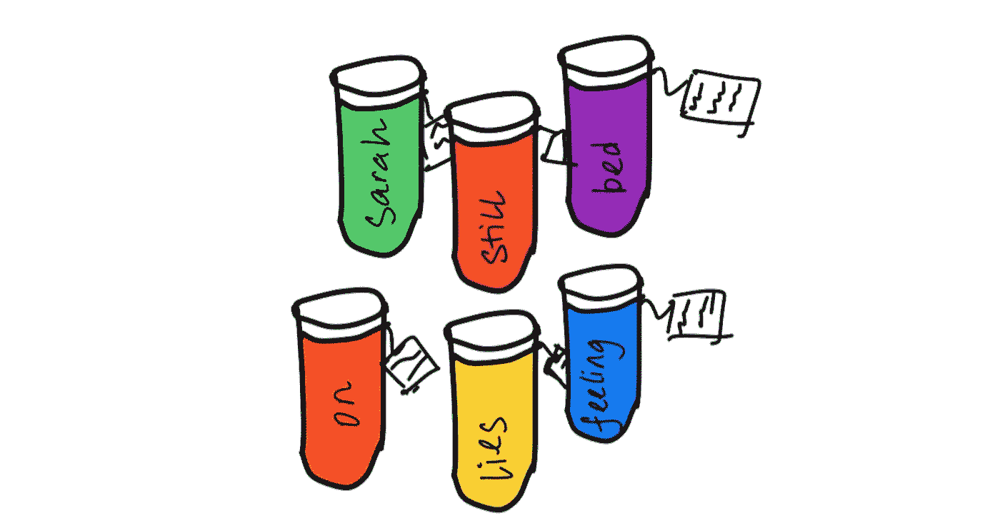

带标签的药水。来源：作者创作。

在第一步（注意），所有单词的炼金术师各自出发，去从相关单词中获取药水填满他们的药瓶。

以单词*“谎言”*的炼金术师为例。他知道根据之前的经验——经过对整个互联网文本的预训练——有助于解释句子中*“谎言”*的单词通常是：*“一些平面表面、与不诚实相关的词、与休息相关的词”*。他将这些标准写在他的配方（查询）中，并寻找其他单词药水上的标签（关键字）。如果标签与标准非常相似，他会将大量这种药水倒入他的药瓶中；如果标签不相似，他则会倒入少量或不倒入。

所以他发现*“床”*的标签上写着“*一个平面的家具*”。这与他配方中的*“一些平面表面”*类似！他将*“床”*的药水倒入药瓶中。*“床”*的药水（值）包含的信息有“*疲惫、安静、昏昏欲睡、生病*”。

单词*“谎言”*的炼金术师继续搜索。他发现*“still”*的标签上写着“*与休息相关*”（以及*“still”*的其他含义）。这与他的标准*“休息”*相关，因此他将一部分*“still”*的药水倒入药瓶中，包含的信息有*“休息、安静、静止”*。

他查看了*“on”，“Sarah”，“the”，“feeling”*的标签，发现它们不相关。因此，他没有将这些药水倒入他的药瓶。

记住，他也需要检查自己的药水。自己的药水*“谎言”*的标签上写着*“与休息相关的动词”*，这与他的配方*“休息”*相匹配。因此，他也将自己药水的一部分倒入药瓶中，包含的信息有“*疲惫；不诚实；如果是善意的谎言，可能有积极的含义；……*”。

在他完成检查文本中的单词任务时，他的药瓶已经满了。

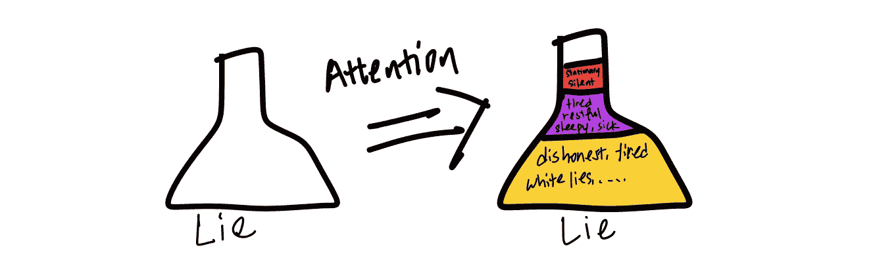

来源：作者创作。

与原始的*“谎言”*药水不同，这种混合药水现在考虑了这个特定句子的上下文。也就是说，它包含了很多*“疲惫，精疲力竭”*的元素，只有一点点“*不诚实*”。

在这个任务中，**炼金术师知道如何关注正确的词，并结合那些相关词的值**。**这是“注意力”的隐喻步骤。**我们刚刚解释了 Transformer 的最重要方程，这是 GPT 的底层架构：

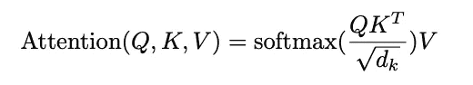

Q 是查询；K 是键；V 是值。来源：[Attention is All You Need](https://arxiv.org/pdf/1706.03762.pdf)

> 高级笔记：
> 
> 1\. 每位炼金术师查看每个瓶子，包括他们自己的 [Q·K.transpose()]。
> 
> 2\. 炼金术师可以快速将他的配方（查询）与标签（键）匹配，并做出快速决定。[查询和键之间的相似性通过点积确定，这是一项快速操作。] 此外，所有炼金术师的任务都是并行进行的，这也有助于加快速度。[Q·K.transpose() 是矩阵乘法，可以并行处理。与按顺序计算的前身递归神经网络相比，速度是 Transformer 的优势特性。]
> 
> 3\. 炼金术师很挑剔。他只选择最好的几种药水，而不是混合所有药水。[我们使用 softmax 来压缩 Q·K.transpose()。softmax 将输入值拉向更极端的值，并将许多输入压缩到接近零。]
> 
> 4\. 在这个阶段，炼金术师不考虑单词的顺序。无论是“Sarah lies still on the bed, feeling”还是“still bed the Sarah feeling on lies”，填满的烧瓶（注意力的输出）将是相同的。[在没有“位置编码”的情况下，Attention(Q, K, V) 与单词位置无关。]
> 
> 5\. 烧瓶总是返回 100%满，没有多也没有少。[softmax 被归一化为 1。]
> 
> 6\. 炼金术师的配方和药水的标签必须使用相同的语言。[查询和键必须具有相同的维度才能进行点积运算以进行通信。值可以采用不同的维度，如果你愿意的话。]
> 
> 7\. 技术精明的读者可能会指出我们没有进行**掩蔽**。我不想用太多细节来混淆类比，但我会在这里解释。在自注意力中，每个词只能看到前面的词。因此，在句子*“Sarah lies still on the bed, feeling”*中，*“lies”*只看到*“Sarah”；“still”*只看到*“Sarah”和“lies”。* *“still”*的炼金术师不能接触到*“on”、“the”、“bed”*和*“feeling”*的药水。

## Feed Forward: 混合药水中的化学反应

直到此时，炼金术师只是将其他瓶子的药水倒入烧瓶中。换句话说，他将*“谎言”*——“*疲倦；不诚实；…”*——作为均匀混合物倒入烧瓶中；他还不能将*“疲倦”*部分提取出来并丢弃*“不诚实”*部分。[注意力只是将不同的 V 加在一起，经过 softmax 加权。]

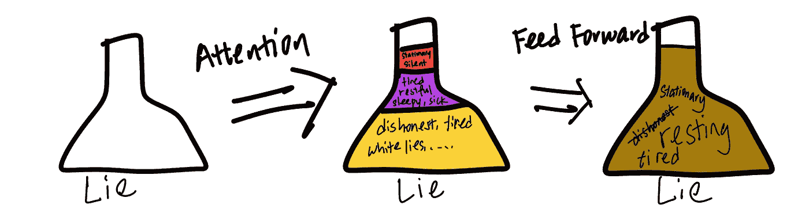

来源：作者创建。

现在进入真正的化学过程（前馈）。炼金术师将一切混合在一起并进行合成。他注意到词语之间的互动，例如*“sleepy”*和*“restful”*等。他还发现*“dishonesty”*只在一个药水中提到。他根据以往的经验知道如何让一些成分相互作用，以及如何丢弃那些一次性的成分。[前馈层是值的线性（然后是非线性）变换。前馈层是神经网络的构建块。你可以将其视为 Transformer 中的“思考”步骤，而早期的混合步骤只是“收集”。]

经过处理后的药水变得更适合预测下一个词。直观上，它在句子上下文中表现出该词的一些更丰富的特性，而与起始药水（值）相比，后者是脱离上下文的。

## 最终线性和 softmax 层：炼金术师的集会

我们如何从这里得到最终输出，即预测*“Sarah lies still on the bed, feeling ___”*之后的下一个词是*“tired”*？

到目前为止，每个炼金术师一直独立工作，只关注自己的词汇。现在，所有不同词汇的炼金术师汇集在一起，将他们的药水瓶按照原始词序排列，并呈现给 Transformer 的最终线性和 softmax 层。这是什么意思呢？这里，我们必须离开比喻。

这个最终线性层综合了不同词汇的信息。基于预训练数据，一个可能的学习是，紧接前一个词对预测下一个词是重要的。例如，线性层可能会重点关注最后一个药水瓶（“feeling”药水瓶）。

然后结合 softmax 层，这一步为词汇表中的每个词分配一个概率，表示在*“Sarah lies on the bed, feeling…”*之后这个词的可能性。例如，非英语词汇的概率接近 0。像*“tired”、 “sleepy”、 “exhausted”*这样的词将获得高概率。然后我们选择概率最高的词作为最终答案。

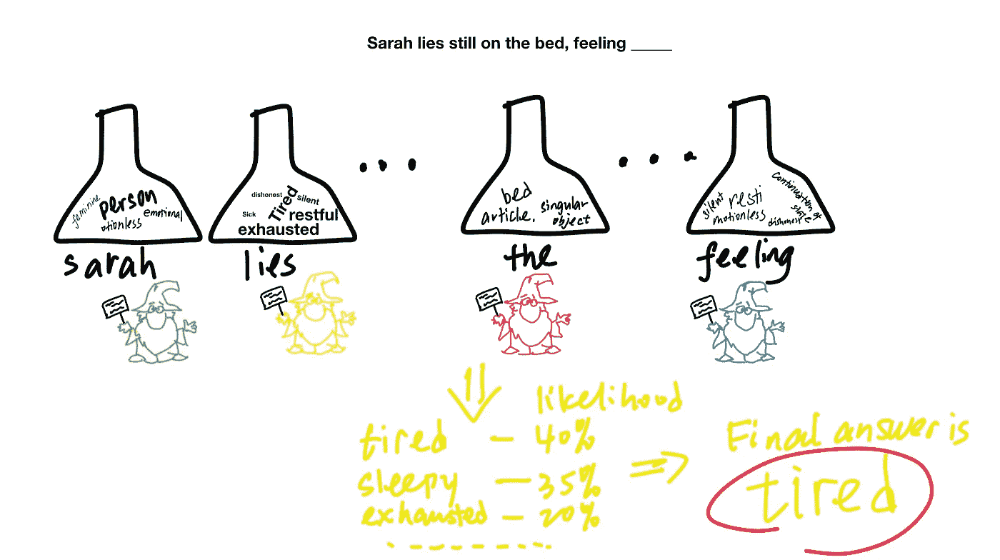

来源：作者创建。

## 总结

现在你已经构建了一个极简主义的 GPT！

总结一下，在注意力步骤中，你确定每个词应该关注哪些词（包括自身），基于该词的查询（配方）与其他词的键（标签）的匹配程度。你将这些词的值（药水）按该词对它们的注意力进行混合。你处理这种混合物以进行一些“思考”（前馈）。每个词处理后，你将所有其他词的混合物组合在一起，以进行更多的“思考”（线性层）并做出最终预测，确定下一个词应该是什么。

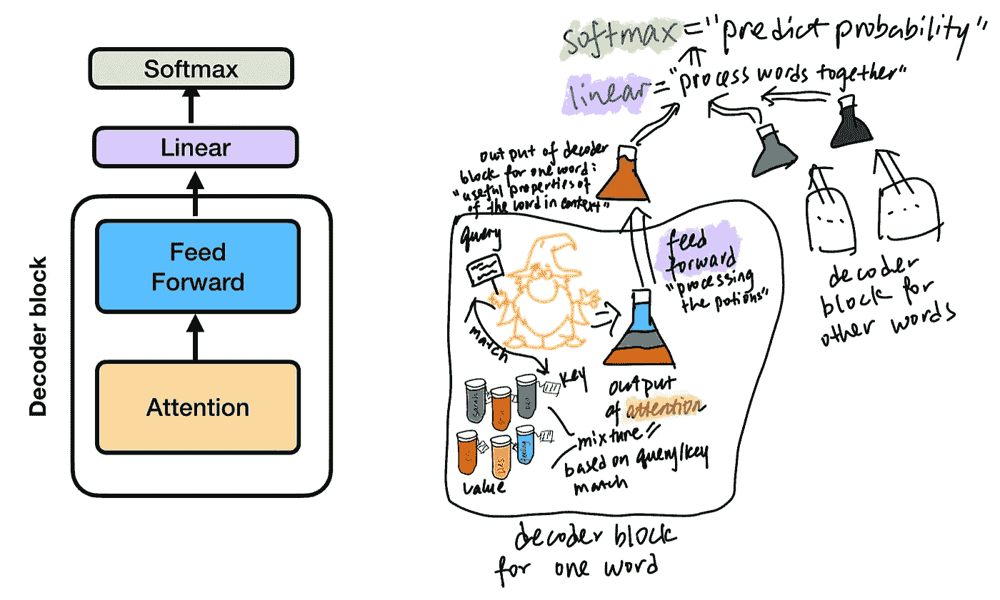

来源：作者创建。

> 旁注：“解码器”这一术语是原始[论文](https://arxiv.org/pdf/1706.03762.pdf)中的残余，因为 Transformer 最初用于机器翻译任务。你“编码”源语言到嵌入中，然后“解码”从嵌入到目标语言。

这是一个很好的停顿点。

如果你渴望了解更多，我们将在上述简约架构的基础上介绍另外两种变体：多头注意力和重复块。

## 多头注意力：许多炼金术士的集合

到目前为止，每个词只有一个炼金术士的配方、一个标签和一种药水。[对于每个词，每个查询、值、键是一个单一向量，而不是一个矩阵。] 但是，如果我们为每个词配备几组配方、标签、药水，我们可以获得更好的结果。对于[参考](https://www.cs.ubc.ca/~amuham01/LING530/papers/radford2018improving.pdf)，GPT 每个词使用 12 组（即 12 个“注意力头”）。也许对于每个词，第一组的炼金术士专注于分析情感，第二组的炼金术士专注于解析引用（“它”指的是什么），等等。

> 高级说明：情感炼金术士组只研究情感药水；他们不会知道如何处理其他集合的药水，也不会触及那些药水。[来自同一注意力头的 V、K、Q 是联合训练的。来自不同注意力头的 V、K、Q 在多头注意力步骤中不进行交互。]

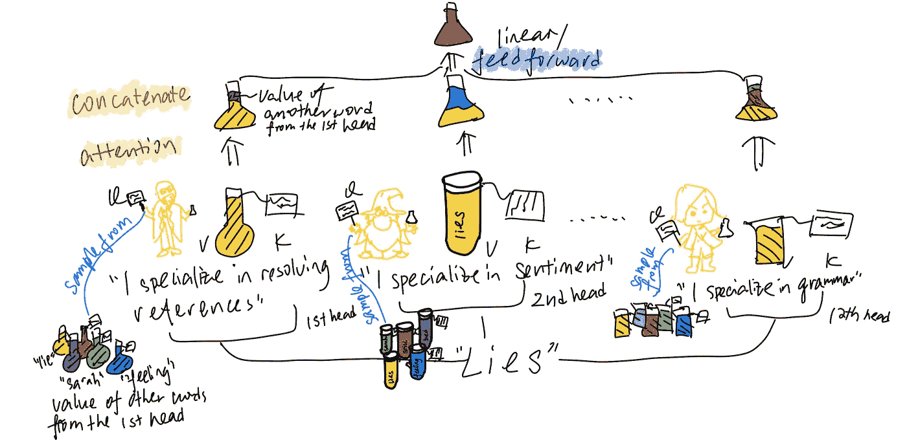

来源：由作者创建。

每个词的 12 位炼金术士将他们的专门化、填充的瓶子一起[连接不同注意力头的输出]。作为一个群体，他们利用所有这些瓶子进行一次巨大的化学反应，并呈现出一种最终的药水[前馈，即线性层]。

> 高级说明：就像以前一样，在解码器块中，不同词的瓶子不会混合在一起。[前馈步骤是按位置进行的，这意味着它对每个词独立应用。]

这个比喻解释了原论文中的以下方程式和图表。

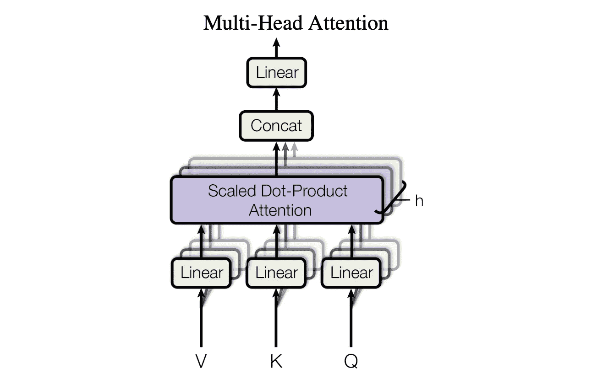

来源：[Attention is All You Need](https://arxiv.org/pdf/1706.03762.pdf)。

## 堆叠块：并且……重复！

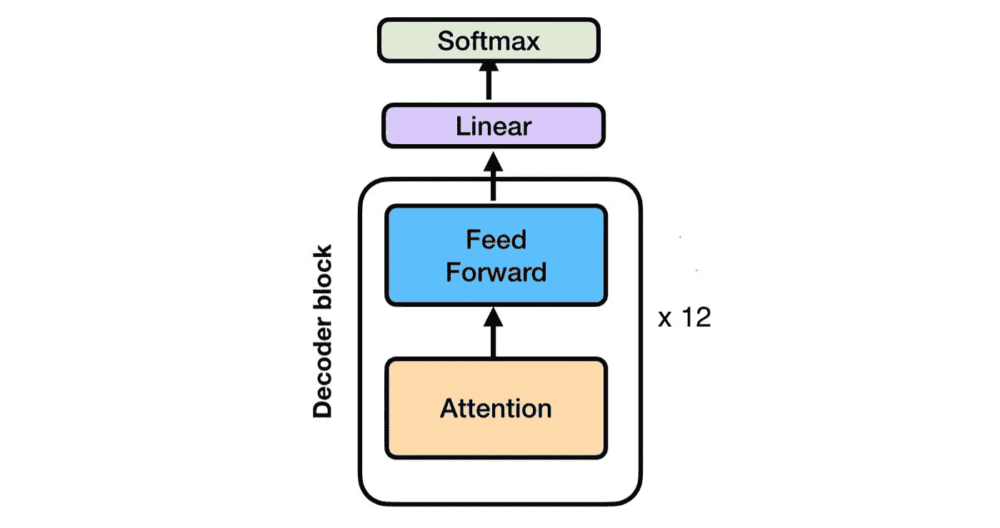

来源：由作者创建。

为了获得更好的效果，我们将解码器块重复 N 次。对于[参考](https://www.cs.ubc.ca/~amuham01/LING530/papers/radford2018improving.pdf)，GPT 重复 12 次。直观上，你会希望在收集其他相关词汇的药水（注意力）和自己合成这些药水以获得意义（前馈）之间进行交替：收集，合成；收集，合成……

现在你可以了解炼金术……我的意思是……GPT！
