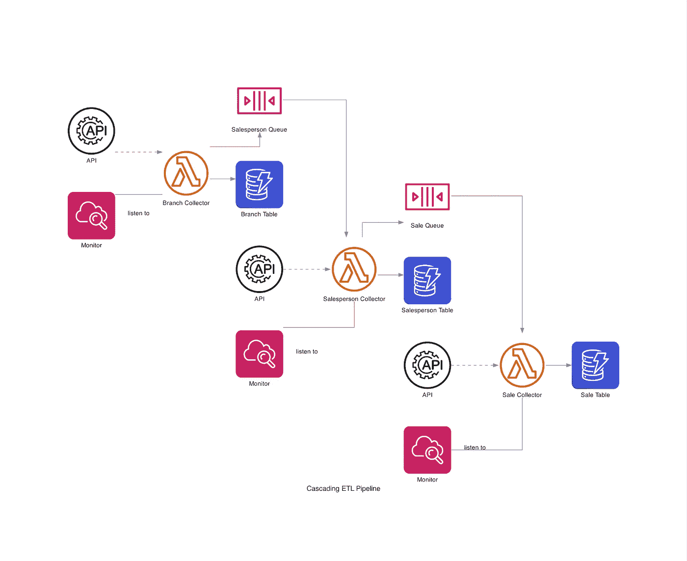

# 我如何构建基于 AWS 的级联数据管道（第一部分）

> 原文：[`towardsdatascience.com/how-i-built-a-cascading-data-pipeline-based-on-aws-997b212a84d2?source=collection_archive---------7-----------------------#2023-07-31`](https://towardsdatascience.com/how-i-built-a-cascading-data-pipeline-based-on-aws-997b212a84d2?source=collection_archive---------7-----------------------#2023-07-31)

## 自动化、可扩展且强大

 [Memphis Meng](https://anzhemeng.medium.com/?source=post_page-----997b212a84d2--------------------------------)

·

[关注](https://medium.com/m/signin?actionUrl=https%3A%2F%2Fmedium.com%2F_%2Fsubscribe%2Fuser%2F85370dce2b14&operation=register&redirect=https%3A%2F%2Ftowardsdatascience.com%2Fhow-i-built-a-cascading-data-pipeline-based-on-aws-997b212a84d2&user=Memphis+Meng&userId=85370dce2b14&source=post_page-85370dce2b14----997b212a84d2---------------------post_header-----------) 发表在 [Towards Data Science](https://towardsdatascience.com/?source=post_page-----997b212a84d2--------------------------------) ·14 min read·Jul 31, 2023 

--

今天我将分享一些关于构建我一直引以为傲的数据工程项目的经验。你将了解我使用这些工具和 AWS 组件的原因，以及我如何设计架构。

作者提供的图片

**免责声明**：本文内容源于我与一个未透露名称的实体的经验。然而，为了维护保密性和隐私，某些关键的商业利益和细节被故意用虚构的数据/代码替代或省略。因此，实际涉及的商业利益的完整和准确范围被保留。

# 前提条件

1.  Python 知识

1.  理解 AWS 组件，例如 DynamoDB、Lambda 无服务器、SQS 和 CloudWatch

1.  舒适的编码体验，使用[YAML](https://en.wikipedia.org/wiki/YAML)和[SAM CLI](https://docs.aws.amazon.com/serverless-application-model/latest/developerguide/install-sam-cli.html)

# 背景

假设你是数据工程师，需要不断更新数据仓库。例如，你负责定期与[Dunder Mifflin Paper Co.](https://dundermifflinpaper.com)的销售记录同步。（我明白这不是一个现实的场景，但还是要玩得开心 :)！）数据通过供应商的 API 发送给你，…
