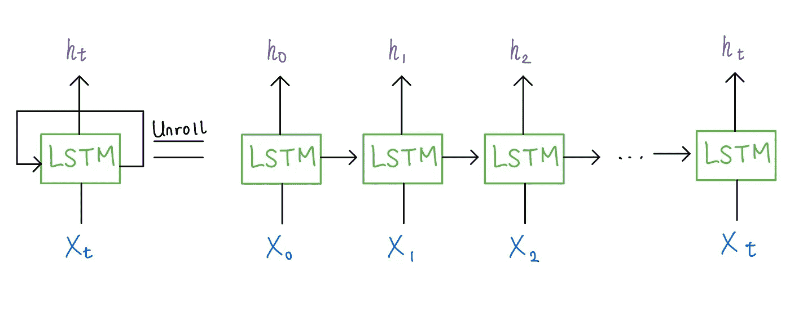
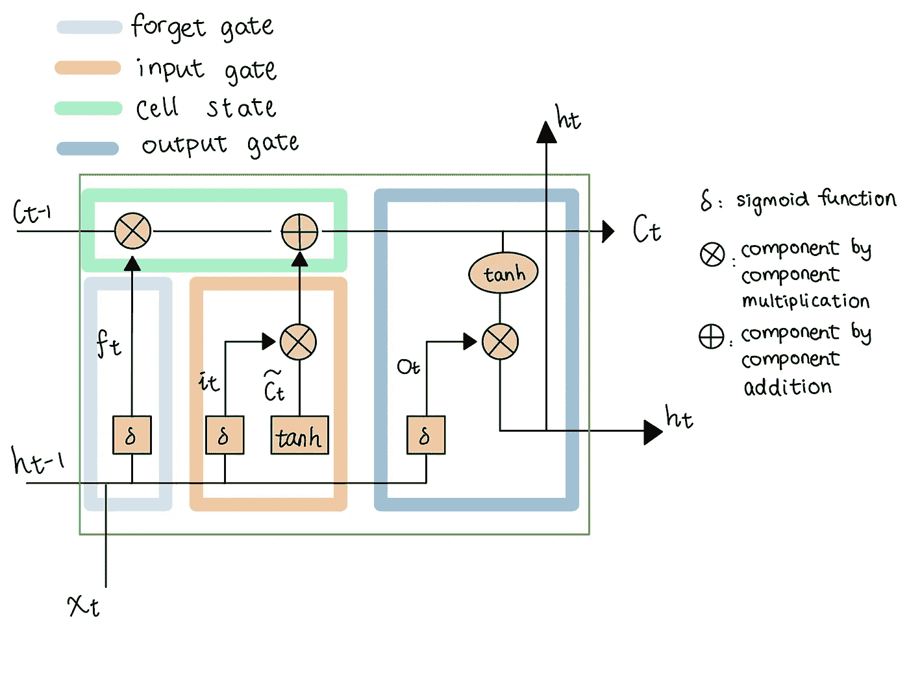
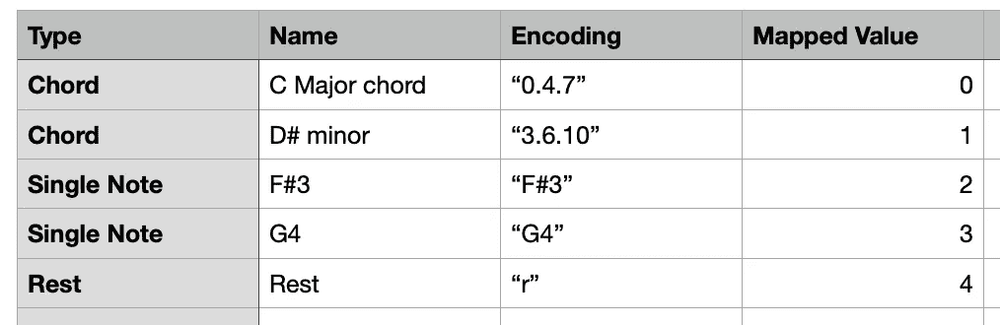
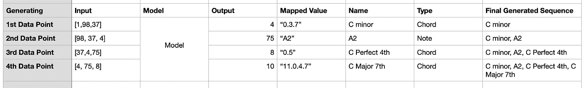

# 如何构建带有 AI 生成曲目的 Lo-fi 音乐网页播放器

> 原文：[`towardsdatascience.com/how-i-built-a-lo-fi-music-web-player-with-ai-generated-tracks-36f3915e39f8?source=collection_archive---------4-----------------------#2023-01-12`](https://towardsdatascience.com/how-i-built-a-lo-fi-music-web-player-with-ai-generated-tracks-36f3915e39f8?source=collection_archive---------4-----------------------#2023-01-12)

## 使用 Tone.js 和 LSTM 模型制作

[](https://medium.com/@leksa_86?source=post_page-----36f3915e39f8--------------------------------)[](https://towardsdatascience.com/?source=post_page-----36f3915e39f8--------------------------------) [Aleksandra Ma](https://medium.com/@leksa_86?source=post_page-----36f3915e39f8--------------------------------)

·

[关注](https://medium.com/m/signin?actionUrl=https%3A%2F%2Fmedium.com%2F_%2Fsubscribe%2Fuser%2Feffc1ebd4aac&operation=register&redirect=https%3A%2F%2Ftowardsdatascience.com%2Fhow-i-built-a-lo-fi-music-web-player-with-ai-generated-tracks-36f3915e39f8&user=Aleksandra+Ma&userId=effc1ebd4aac&source=post_page-effc1ebd4aac----36f3915e39f8---------------------post_header-----------) 发表在 [Towards Data Science](https://towardsdatascience.com/?source=post_page-----36f3915e39f8--------------------------------) · 11 分钟阅读 · 2023 年 1 月 12 日[](https://medium.com/m/signin?actionUrl=https%3A%2F%2Fmedium.com%2F_%2Fvote%2Ftowards-data-science%2F36f3915e39f8&operation=register&redirect=https%3A%2F%2Ftowardsdatascience.com%2Fhow-i-built-a-lo-fi-music-web-player-with-ai-generated-tracks-36f3915e39f8&user=Aleksandra+Ma&userId=effc1ebd4aac&source=-----36f3915e39f8---------------------clap_footer-----------)

--

[](https://medium.com/m/signin?actionUrl=https%3A%2F%2Fmedium.com%2F_%2Fbookmark%2Fp%2F36f3915e39f8&operation=register&redirect=https%3A%2F%2Ftowardsdatascience.com%2Fhow-i-built-a-lo-fi-music-web-player-with-ai-generated-tracks-36f3915e39f8&source=-----36f3915e39f8---------------------bookmark_footer-----------)

图片来源于 [rupixen.com](https://unsplash.com/@rupixen?utm_source=medium&utm_medium=referral) 在 [Unsplash](https://unsplash.com/?utm_source=medium&utm_medium=referral)

# 介绍

自大学以来，低保真嘻哈音乐一直是我学习时的首选伴侣。它以相对简单的音乐结构营造出舒适和宁静的氛围。一些爵士和弦进行、律动的鼓点、环境声音和怀旧的电影台词可以让我们制作出相当不错的低保真嘻哈曲目。除了音乐方面，动画视觉效果也是低保真美学的关键部分，与水、风和火的自然声音一起营造氛围。

创建我自己的低保真网页播放器的想法是在一个星期天下午，当时我正在学习深度生成模型。我做了一些研究，并在假期期间完成了这个项目。该网页播放器提供两个选项：用户可以选择基于 Tone.js 编码的真实歌曲的低保真曲目，或者选择 AI 生成的独奏曲目。两个选项都会与用户在前一步中选择的鼓循环、环境声音和台词叠加在一起。本文主要讨论如何使用 LSTM 模型生成 midi 曲目，并在最后简要讨论如何使用 Tone.js 制作一首歌曲。

你可以在[这里](https://mtsandra.github.io/lofi-station)尝试网页版播放器，我建议使用桌面版 Chrome 浏览器以获得最佳体验。

# LSTM 模型架构与 Midi 生成

在之前的[帖子](https://mtsandra.github.io/blog/2022/dl4mir-4)中，我解释了什么是 LSTM 网络。简要回顾一下，它是一种特殊类型的 RNN，能够更好地处理长期依赖。它还具有递归结构，将来自前一个时间步的输出传递到当前时间步。为了更好地理解它，我们可以展开网络，将 LSTM 单元看作是多个相同网络的副本，每个副本将信息传递给下一个时间步，如下所示。



展开 LSTM；作者创建

每个单元格包含四个主要组件，使其能够更好地处理长期依赖：

+   遗忘门：决定遗忘哪些信息

+   输入门：决定更新和存储哪些信息到我们的单元状态中

+   单元状态更新：进行逐元素操作以更新单元状态

+   输出门：决定输出哪些信息



在 LSTM 单元内部；作者创建

## 训练数据准备

对于我们训练模型所使用的音乐数据格式，我们有几种选择：原始音频、音频特征（例如 Mel 频谱图）或符号音乐表示（例如 midi 文件）。我们的目标是生成一个独奏曲目（即音符、和弦和休止符的序列），以便在其他组件（如鼓循环）上叠加，因此 midi 文件是实现我们目标的最简单和最有效的格式。原始音频的训练计算开销非常大。换句话说，以 48000kHz 采样的音乐片段意味着每秒音频中有 48000 个数据点。即使我们将其下采样到 8kHz，这仍然是每秒 8000 个数据点。此外，仅有旋律或和弦进行的干净音频极其稀少。然而，如果我们足够努力，仍然可以找到一些只包含和弦进行/旋律的 midi 文件。

在这个项目中，我使用了一些来自 YouTube 创作者[Michael Kim-Sheng](https://www.youtube.com/watch?v=9gAgtc5A5UU&ab_channel=MichaelKim-Sheng)的 lo-fi midi 样本，他慷慨地允许我使用他的文件。我还利用了一些在这个[Cymatics lo-fi toolkit](https://cymatics.fm/products/lofi-toolkit)中授权用于商业用途的 midi 文件。为了确保我在质量数据上训练我的模型（适用于 lo-fi 嘻哈的合理和弦进行和节拍），我听了一部分来自每个来源的曲目，并筛选出我的训练数据集。模型架构的灵感来自于经典钢琴作曲家库[这里](https://github.com/Skuldur/Classical-Piano-Composer)。

## 加载和编码 midi 文件

一个 Python 包[music21](http://web.mit.edu/music21/doc/index.html)可以用于加载 midi 文件。Music21 解析 midi 文件并将每个音乐组件存储到特定的 Python 对象中。换句话说，音符将被保存为 Note 对象，和弦将被保存为 Chord 对象，而休止符将被保存为 Rest 对象。它们的名称、持续时间、音高类别和其他属性可以通过点号表示法访问。Music21 将音乐片段存储在如下面所示的层次结构中，我们可以相应地提取必要的信息。如果你对如何使用这个包感兴趣，包的官方网站有一个适合初学者的用户指南，The Sound of AI 的 Valerio Velardo 也有一个[教程](https://www.youtube.com/watch?v=coEgwnMBuo0&ab_channel=ValerioVelardo-TheSoundofAI)来介绍如何使用 music21。

如前所述，music21 将每个音符、休止符和和弦存储为一个 Python 对象，因此下一步是对它们进行编码，并将它们映射到模型可以训练的整数上。模型输出应该包含不仅仅是音符，还包括和弦和休止符，因此我们将分别对每种类型进行编码，并将编码值映射到整数。我们对所有的 midi 文件执行此操作，并将它们连接成一个序列以训练模型。

+   和弦：获取和弦中音符的音高名称，将它们转换为正常顺序，并用点连接成字符串格式，“#.#.#”

+   音符：使用音高名称作为编码

+   休止符：编码为字符串“r”



*Midi 编码与映射*

## 创建输入和目标对

现在我们已经得到了适合模型的 midi 数据编码。下一步是准备输入和目标对，以便输入到模型中。在一个简单的监督分类机器学习问题中，存在输入和目标对。例如，一个对狗品种进行分类的模型将以狗的毛色、身高、体重和眼睛颜色作为输入，而标签/目标将是狗所属的具体品种。在我们的情况下，输入将是从时间步 i 开始的长度为 k 的序列，而对应的目标将是时间步 i+k 的数据点。因此，我们将遍历编码后的音符序列，并为模型创建输入和目标对。最后一步，我们将输入的维度转换为适合 keras 的格式，并对输出进行 one-hot 编码。

## 模型结构

如前所述，我们将使用 LSTM 层作为核心结构。此外，该网络还使用了以下组件：

+   Dropout 层：通过在训练期间以一定频率随机将输入单元设置为 0 来规范化网络并防止过拟合（在我们的例子中，频率为 0.3）

+   密集层：完全连接前一层，并在每个节点执行矩阵-向量乘法。最后一层密集层需要具有与网络中唯一音符/和弦/休止符的总数相同的节点数。

+   激活层：如果用于隐藏层，则为我们的网络添加非线性；如果用于输出层，则帮助网络进行分类。

```py
model = Sequential()
model.add(LSTM(
    256,
    input_shape=(network_input.shape[1], network_input.shape[2]),
    return_sequences=True
))
model.add(Dropout(0.3))
model.add(LSTM(512, return_sequences=True))
model.add(Dropout(0.3))
model.add(LSTM(256))
model.add(Dense(256))
model.add(Dropout(0.3))
model.add(Dense(n_vocab))
model.add(Activation('softmax'))
model.compile(loss='categorical_crossentropy', optimizer='rmsprop')
model.fit(network_input, network_output, epochs=200, batch_size=128)
```

对于这个示例网络，使用了 3 层 LSTM，每层 LSTM 后面跟有 2 层 dropout 层。接着是 2 层全连接的密集层，最后是一个 softmax 激活函数。由于输出是分类的，我们将使用分类交叉熵作为损失函数。使用了 RMSprop 优化器，这在 RNN 中相当常见。还添加了检查点，以便在不同的训练轮次中定期保存权重，并在模型训练结束之前使用。请随意调整模型结构，并尝试不同的优化器、轮次和批量大小。

## 输出生成与解码回 Midi 音符

输出生成过程类似于训练过程——我们给模型一个长度为 m 的序列（我们也称之为序列 m 以简化符号表示），并要求它预测下一个数据点。这个序列 m 的起始索引是从输入序列中随机选择的，但如果我们愿意，也可以指定一个特定的起始索引。模型输出是一个来自 softmax 的概率列表，告诉我们每个类别作为下一个数据点的适合程度。我们将选择概率最高的类别。为了生成长度为 j 的序列，我们会通过删除序列 m 的第一个元素并将最近生成的数据点添加到这个序列 m 中来重复这个过程，直到模型生成 j 个新的数据点。

从上一段生成的数据仍然是整数，因此我们使用编码过程中相同的映射将其解码回音符/和弦/休止符。如果它是和弦字符串格式，我们将从字符串“#.#.#.#”中读取整数符号，并创建一个 music21.chord 对象。如果它是音符或休止符，我们将相应地创建一个对应的音符和休止符对象。同时，我们在每个时间步将生成的新数据点追加到预测输出序列中。有关此过程的示例，请参见下面的示例流程，我们使用 3 个数据点的输入序列生成 4 个数据点的序列。



*输出生成和 MIDI 解码*

现在我们有了一系列的音符、和弦和休止符。我们可以将它们放入一个 music21 流中并写出 MIDI 文件，在这种情况下，所有的音符都会是四分音符。为了保持输出的趣味性，我添加了一个代码片段，随机抽取一个时长来指定每个音符或和弦的时长（默认的概率分布是 0.65 用于八分音符，0.25 用于十六分音符，0.05 用于四分音符和二分音符）。休止符默认为十六分休止符，以避免音符之间的沉默过长。

```py
NOTE_TYPE = {
            "eighth": 0.5,
            "quarter": 1,
            "half": 2,
            "16th": 0.25
        }
offset = 0
output_notes = []
for pattern in prediction_output:
    curr_type = numpy.random.choice(list(NOTE_TYPE.keys()), p=[0.65,0.05,0.05, 0.25])

    # pattern is a chord
    if ('.' in pattern) or pattern.isdigit():
        notes_in_chord = pattern.split('.')
        notes = []
        for current_note in notes_in_chord:
            new_note = note.Note(int(current_note))
            new_note.storedInstrument = instrument.Piano()
            notes.append(new_note)
        new_chord = chord.Chord(notes, type=curr_type)
        new_chord.offset = offset
        output_notes.append(new_chord)
    elif str(pattern).upper() == "R":
        curr_type = '16th'
        new_rest = note.Rest(type=curr_type)
        new_rest.offset = offset
        output_notes.append(new_rest)
    # pattern is a note
    else:
        new_note = note.Note(pattern, type=curr_type)
        new_note.offset = offset
        new_note.storedInstrument = instrument.Piano()
        output_notes.append(new_note)
# increase offset each iteration so that notes do not stack
    offset += NOTE_TYPE[curr_type]
midi_stream = stream.Stream(output_notes)
midi_stream.write('midi', fp='test_output.mid')
```

一旦我们用不同的参数运行几次模型，并挑选出我们喜欢的曲目，我们会在任何数字音频工作站（DAW）中选择一种 lofi 风格的乐器效果，以便我们生成的曲目听起来更像真正的音乐。然后，我们转到 JavaScript 来构建我们的网页播放器。

# 使用[Tone.js](https://tonejs.github.io/)构建网页播放器

Tone.js 是一个用于在浏览器中创建互动音乐的网络音频框架。你可以使用它来构建很多有趣的互动网站（见[演示](https://tonejs.github.io/demos)）。但在我们的案例中，它提供了一个全局传输功能，以确保我们的鼓点、环境声音、引号和旋律同时播放。它还允许我们编写音乐乐谱、采样乐器、添加音效（混响、增益等）以及在 JavaScript 中创建循环。代码框架的感谢归功于[Kathryn](https://github.com/lawreka/loaf-ai)。如果你想要一个快速有效的 Tone.js 速成课程，我强烈推荐他们[网站](https://tonejs.github.io/)上的用例示例。最重要的收获是，对于我们创建的每个声音事件，我们需要通过`toDestination()`将它们连接到 AudioDestinationNode（即我们的扬声器），或者通过`samplePlayer.chain(effect1, Tone.Destination)`来添加音效。然后，通过`Tone.Transport`，我们将能够在主输出上启动、暂停和调度事件。

## 循环音频片段

鼓点、环境声音、引号和预生成的 AI 轨道都是通过 Player 类加载到网页播放器中的音频文件（.mp3 或.wav）。在加载来自网站的用户输入事件后，这些事件会被输入到 Tone.js 的 Part 类中以创建循环。

鼓点每 8 小节循环一次，环境音效每 12 小节循环一次，AI 独奏轨道每 30 小节循环一次。引号部分不循环，从第 5 小节开始。

## 使用乐器样本创建旋律和和弦进程

Tone.js 不提供我们在 DAW 中看到的软件乐器选项，只有采样器，允许我们通过加载几个音符来采样自己的乐器。然后，采样器会自动重新调整样本的音高，以创建未明确包含的音高。

然后，我们可以通过指定音符和音符出现的时间来写入旋律和和弦进程。我建议使用 TransportTime 来精确编码节拍。TransportTime 的格式为"BARS:QUARTERS:SIXTEENTHS"，并使用零基数编号。例如，"0:0:2"表示音符将在第一小节的两个十六分音符后出现。"2:1:0"表示音符将在第三小节，经过一个四分音符后出现。我这样为 3 首现有歌曲编写了旋律和和弦进程：FKJ 的《Ylang Ylang》、Camille 的《La Festin》和 Tyler, the Creator 的《See You Again》。

## 网页播放器设计

我添加了函数，通过不同的环境声音输入来改变网页播放器的背景，以便每种环境下显示更合适的 gif。同时还有一个与歌曲音符连接的可视化工具，由 p5.js 制作，以增加视觉吸引力。

# 未来工作

LSTM 模型

+   添加序列开始和序列结束标记，以便模型可以学习音乐模式，当歌曲结束时。

+   融入音符时长的编码，以便启用节拍跟踪。

网络播放器

+   将后端 AI 模型连接到网络播放器，将会非常酷，这样输出可以实时生成。目前的障碍是模型生成输出需要几分钟，但我们可能可以利用预训练模型 API。

+   如果网络播放器允许用户 1) 输入他们自己选择的和弦进行 2) 写下文本并对其进行情感分析并输出匹配情感的和弦进行，那么用户互动将大大改善。

# 结论

关于代码和训练数据集，请参阅 GitHub 仓库[这里](https://github.com/mtsandra/lofi-station)。虽然这只是一个简单的 lo-fi 网络播放器，但我在 LSTM 模型和 Tone.js 上玩得很开心。每次看到我们如何将技术融入音乐体验中，总是让我感到惊讶。
