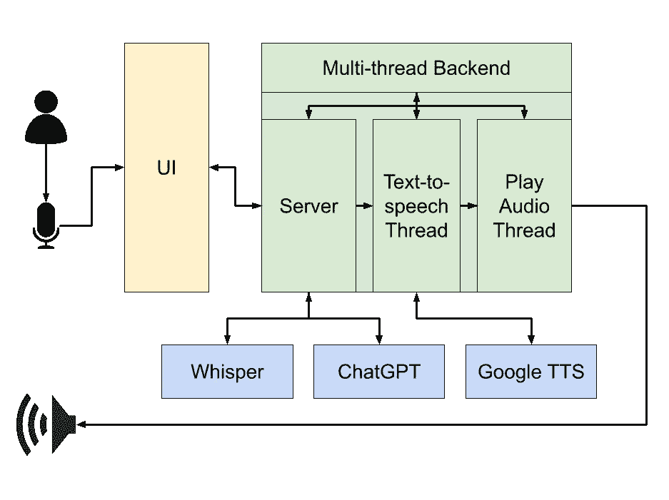

# 我如何用 ChatGPT 编写了自己的私人法语 tutor

> 原文：[`towardsdatascience.com/how-i-coded-my-own-private-french-tutor-out-of-chatgpt-16b3e15007bb?source=collection_archive---------1-----------------------#2023-06-30`](https://towardsdatascience.com/how-i-coded-my-own-private-french-tutor-out-of-chatgpt-16b3e15007bb?source=collection_archive---------1-----------------------#2023-06-30)

## 逐步指南，讲述了我如何利用最新的人工智能服务来学习一门新语言，从架构到提示工程

[](https://shakedzy.medium.com/?source=post_page-----16b3e15007bb--------------------------------)[](https://towardsdatascience.com/?source=post_page-----16b3e15007bb--------------------------------) [Shaked Zychlinski 🎗️](https://shakedzy.medium.com/?source=post_page-----16b3e15007bb--------------------------------)

·

[关注](https://medium.com/m/signin?actionUrl=https%3A%2F%2Fmedium.com%2F_%2Fsubscribe%2Fuser%2F43218078e688&operation=register&redirect=https%3A%2F%2Ftowardsdatascience.com%2Fhow-i-coded-my-own-private-french-tutor-out-of-chatgpt-16b3e15007bb&user=Shaked+Zychlinski+%F0%9F%8E%97%EF%B8%8F&userId=43218078e688&source=post_page-43218078e688----16b3e15007bb---------------------post_header-----------) 发表在 [Towards Data Science](https://towardsdatascience.com/?source=post_page-----16b3e15007bb--------------------------------) · 10 分钟阅读 · 2023 年 6 月 30 日

--

[](https://medium.com/m/signin?actionUrl=https%3A%2F%2Fmedium.com%2F_%2Fbookmark%2Fp%2F16b3e15007bb&operation=register&redirect=https%3A%2F%2Ftowardsdatascience.com%2Fhow-i-coded-my-own-private-french-tutor-out-of-chatgpt-16b3e15007bb&source=-----16b3e15007bb---------------------bookmark_footer-----------)

*讨论中提到的外语 tutor 的代码可以在* `[companion](https://github.com/shakedzy/companion)` [*我的 GitHub 页面上的 repo*](https://github.com/shakedzy/companion)*中找到，您可以在任何非商业用途下自由使用。*


使用 Dall-E 制作

所以在推迟了一段时间之后，我决定重新开始我的法语学习。当我报名参加课程时，这个想法突然出现——*如果我能编程让 ChatGPT 成为我的个人法语导师会怎么样？如果我能* ***与它对话*** *，而它会回应我呢？* 作为一名与 LLMs 合作的数据科学家，这似乎是值得构建的东西。我是说，是的，我可以直接和我的法语妻子对话，但这不如设计一个由 ChatGPT 构建的个人导师来得酷。爱你，亲爱的❤️。

但说真的，这个项目不仅仅是“另一个酷炫的代码玩具”。生成性 AI 正向我们生活的每一个领域进军，而大型语言模型（LLMs）似乎在这里占据主导地位。如今，一个人通过访问这些模型所能做的事情令人瞠目结舌，我认为这个项目值得我投入时间——我相信也值得你的时间——主要有两个原因：

+   使用 ChatGPT 作为知名的在线工具是很强大的，但将 LLM 集成到你的代码中是完全不同的事情。LLMs 仍然有些不可预测，当你的产品依赖于 LLM——或任何其他生成 AI 模型——作为核心产品时，你需要学会真正控制生成 AI。这并不像听起来那么简单。

+   获取第一个工作版本只用了几天工作时间。在生成 AI 和 LLMs 出现之前，这需要几个月，并且可能需要不止一个人。利用这些工具快速创建强大应用的力量是你真正需要自己尝试的——这是未来，至少在我看来，我们不会回头。

而且，这个项目实际上可以做一些好事。我妈妈真的希望找一个可以练习英语的对象。现在她可以做到，而且费用不到每月 3 美元。我的妻子的妈妈想开始学习韩语。情况相同，费用相同。当然，我自己也在使用！这个项目真的帮助了人们，费用比一杯小咖啡还少。如果你问我，这才是真正的生成 AI 革命。

# 从零开始

从高层次来看，我需要的有 4 个要素：

+   **语音转文本**，将我的声音转录为文字

+   **大型语言模型**，最好是一个聊天型 LLM，我可以向它提问并获得回答

+   **文本转语音**，将 LLM 的回答转换为声音

+   **翻译**，将我不完全理解的法语文本转换为英语（或希伯来语，我的母语）

幸运的是，现在是 2023 年，以上提到的一切都变得非常*非常*容易获得。我还选择使用托管服务和 API，而不是在本地运行这些服务，因为这样推理速度会更快。此外，这些 API 的个人使用价格非常低，使得这个决定毫无疑问。

经过尝试几种替代方案后，我选择了 OpenAI 的 Whisper 和 ChatGPT 作为我的语音转文本和大型语言模型，Google 的文本转语音和翻译作为剩余模块。创建 API 密钥并设置这些服务非常简单，我能够通过它们原生的 Python 库在几分钟内与所有服务进行通信。

经过测试这些服务后，我真正震惊的是我正在构建的导师不仅仅是一个英法翻译老师；由于 Whisper、ChatGPT 和 Google Translate & TTS 支持几十种语言，这可以用来学习几乎*任何语言*，同时使用*任何其他语言*进行交流。这真是疯狂！


由 Dall-E 制作

# 架构和线程处理

首先，让我们确保整体流程得到充分理解：**(1)** 我们从录制用户的声音开始，**(2)** 该声音发送到 Whisper API，并返回文本。**(3)** 文本被添加到聊天记录中，并发送到 ChatGPT，**(4)** ChatGPT 返回书面回复。其回复被**(5)** 发送到 Google Text-to-speech，Google 返回的音频文件将**(6)** 被播放。



高级架构

我第一个实际步骤是将其拆解为组件并设计整体架构。我知道我需要一个 UI，最好是 Web UI，因为现在通过浏览器启动应用程序比使用独立的可执行文件更简单。我还需要一个“后端”，即实际的 Python 代码，与所有不同的服务进行通信。但为了提供实时的流畅体验，我意识到我需要将其拆分为不同的线程。

主线程将运行大部分代码：它将把我的录音转录为文本（通过 Whisper），将此文本显示在聊天界面上，然后将导师的书面回复（由 ChatGPT 接收）也显示在聊天屏幕上。但我必须将导师的文本转语音移到一个单独的线程——否则我们将得到：

+   导师的声音只能在从 ChatGPT 接收到整个消息后才会被听到，而且其回复可能会很长

+   它将阻止用户在导师讲话时进行回应

这不是我想要的“流动”行为；我希望导师在消息显示在屏幕上时就开始讲话，并且绝对不要因为音频仍在播放而阻止用户并阻止其回应。

为此，项目的文本转语音部分被拆分为 *两个* 额外的线程。当从 ChatGPT 收到导师的响应时，每个完整的句子被传递到另一个线程，再从那里发送到文本转语音服务，转换为声音文件。我想在这里强调一下 *文件* 这个词——由于我将文本逐句发送到 TTS 服务，所以我也有多个音频文件，每个句子一个，需要按正确的顺序播放。这些声音文件然后从另一个线程播放，确保音频播放不会阻塞程序的其余部分运行。

使所有这些工作，以及源于 UI-服务器交互的其他几个问题，是 *这个* 项目中复杂的部分。令人惊讶，对吧——软件工程才是最难的。

# 设计用户界面


项目的用户界面

嗯，我知道我需要一个用户界面，我也大致知道我希望它看起来是什么样的——但编写用户界面超出了我的知识范围。所以我决定尝试一种新方法：我让 ChatGPT 为我编写用户界面。

为此，我使用了实际的 ChatGPT 服务（而非 API），并使用了 GPT-4（是的，我是一个自豪的付费用户！）。令人惊讶的是，我的初始提示：

```py
Write a Python web UI for a chatbot application. The text box where 
the user enters his prompt is located at the bottom of the screen, and 
all previous messages are kept on screen
```

交付了一个惊人的初步结果，最终得到了一个 Python-Flask 后端、jQuery 代码、HTML 和匹配的 CSS。但这只是我希望获得的所有功能的约 80%，所以我花了大约 10 个小时与 GPT-4 来回沟通，一次一个请求，优化和升级我的用户界面。

如果我让它看起来很简单，我想明确说明其实并非如此。我添加的请求越多，GPT-4 就越困惑，并且交付的代码出现故障，这在某些时候比让它修复要手动纠正更容易。我有很多请求：

+   在每条消息旁边添加一个个人资料图片

+   为每条消息添加一个按钮，用于重新播放其音频

+   为每条法语消息添加一个按钮，将其翻译添加到原始文本下方

+   添加一个保存会话和加载会话的按钮

+   添加一个暗模式选项，使其自动选择正确的模式

+   添加一个“工作中”图标，以便在等待服务响应时显示

+   还有更多……

尽管通常情况下 GPT 的代码无法直接运行，但考虑到我在前端领域知识有限，结果仍然令人惊叹——远远超出了我仅凭谷歌搜索和 StackOverflow 能做到的任何事情。我在学习如何制作更好的提示方面也取得了很大进展。考虑到这一点，也许我应该再写一篇博客，专门讲述从零开始与 LLM 一起构建产品的经验教训……（*嗯，* [*我确实做过*](https://shakedzy.medium.com/7-lessons-learned-on-creating-a-complete-product-using-chatgpt-462038856c85)）。

# 提示工程

*对于这部分内容，我将假设你对如何通过 API 与聊天 LLM（如 ChatGPT）进行通信有一些基本了解。如果没有，你可能会有些迷失。*


由 Dall-E 制作

最后但绝对不是最不重要的 — 我让 GPT 扮演一个私人导师的角色。

作为起点，我在聊天开始时添加了一个 *系统提示*。由于与 LLM 的聊天基本上是用户和机器人相互发送的消息列表，系统提示通常是聊天的第一条消息，用于向机器人描述它应该如何表现以及期望它做什么。我的系统提示看起来像这样（由花括号包围的参数会被运行时值替代）：

```py
You are a {language} teacher named {teacher_name}. 
You are on a 1-on-1 session with your student, {user_name}. {user_name}'s 
{language} level is: {level}.
Your task is to assist your student in advancing their {language}.
* When the session begins, offer a suitable session for {user_name}, unless
asked for something else.
* {user_name}'s native language is {user_language}. {user_name} might 
address you in their own language when felt their {language} is not well 
enough. When that happens, first translate their message to {language}, 
and then reply.
* IMPORTANT: If your student makes any mistakes, be it typo or grammar, 
you MUST first correct your student and only then reply.
* You are only allowed to speak {language}.
```

这实际上产生了相当不错的结果，但似乎随着聊天的进行，我给机器人的行为指令（“当我错了时纠正我”，“始终用法语回应”）的有效性逐渐减弱。

为了应对这种逐渐消失的行为，我想出了一个有趣的解决方案；我在将用户消息发送给 GPT 之前对其进行了处理。不论用户的消息是什么，我都会在其中添加额外的文本：

```py
[User message goes here]
---
IMPORTANT: 
* If I replied in {language} and made any mistakes (grammar, typos, etc), 
you must correct me before replying
* You must keep the session flow, you're response cannot end the session. 
Try to avoid broad questions like "what would you like to do", and prefer 
to provide me with related questions and exercises. 
* You MUST reply in {language}.
```

在每个用户消息的末尾添加这些内容确保了 LLM 按照我希望的方式回应。值得一提的是，我添加的长后缀是用英语书写的，而用户的消息可能不是。因此，我在原始消息和我的附加内容之间添加了一个明确的分隔符（`---`），以结束原始消息的上下文并开始新的上下文。还请注意，由于这个后缀是添加到用户的消息中，因此是用第一人称（“我”，“我自己”等）书写的。这个小技巧显著改善了结果和行为。虽然这可能是显而易见的，但值得强调的是，这个后缀不会显示在聊天界面中，用户不知道它被添加到他们的消息中。它在幕后插入，在与聊天历史记录一起发送给 ChatGPT 之前。

我想要的另一种行为是让导师先发言，也就是说，ChatGPT 将在会话开始时发送第一条消息，而不等待用户启动会话。显然，这不是 ChatGPT 设计时的功能。

当我尝试让 ChatGPT 在仅包含系统提示的消息历史记录中回复时，我发现 ChatGPT “丢失了”，开始与自己进行聊天，扮演用户和机器人。不管我尝试什么，我都无法让它在用户先说话之前正确启动会话。

然后我有了一个想法。当会话初始化时，我代表用户向 ChatGPT 发送以下消息：

```py
Greet me, and then suggest 3 optional subjects for our lesson suiting my 
level. You must reply in {language}.
```

这个请求旨在使 GPT 的响应看起来正如我所认为的那样，应该是机器人的适当会话初始化方式。然后我从聊天中删除了我的消息，让它看起来好像是机器人自行启动了会话。

# 概述


使用 Dall-E 制作，已编辑

从一个有趣的小念头开始，几乎在瞬间变为现实，这完全是在一个非常忙碌的人空闲时间中完成的。任务变得如此简单，我感到非常惊讶。仅仅一年前，像 ChatGPT 这样的工具还是科幻小说中的内容，而现在我可以在自己个人的笔记本电脑上进行塑造。

这是未来的开始，无论未来会发生什么——至少我知道，我会用一种新的外语做好准备。*再见！*
