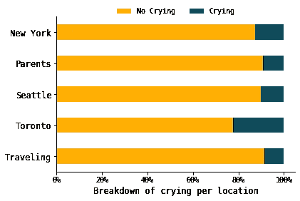

# 我在 2022 年的哭泣情况：对 365 天个人数据的分析

> 原文：[`towardsdatascience.com/how-i-cried-in-2022-an-analysis-of-365-days-of-personal-data-190082a3c65`](https://towardsdatascience.com/how-i-cried-in-2022-an-analysis-of-365-days-of-personal-data-190082a3c65)

## 利用我收集的个人数据对我的哭泣模式进行调查

 [Yennie Jun](https://medium.com/@artfish?source=post_page-----190082a3c65--------------------------------)

·发表于[Towards Data Science](https://towardsdatascience.com/?source=post_page-----190082a3c65--------------------------------) ·阅读时间 9 分钟·2023 年 1 月 6 日

--

本文中一张条形图的 Stable Diffusion 渲染图。由作者生成。

*本文最初* [*发布在我的博客上*](https://www.artfish.ai/p/an-investigation-of-my-2022-crying)

我对收集个人数据情有独钟。2022 年的每一天，我都会填写我制作的 Google 表单，记录我是否哭泣、是否锻炼、是否喝咖啡或是否洗头等项目。我还从 Apple Health 和 Google 位置历史中收集数据，以获得我全年模式和行为的更完整图景。在本文中，我通过结合所有这些数据提供了对 2022 年个人经历的洞察。

对我而言，2022 年是一个充满巨大变化和新机会的年份——我搬到了纽约，开始了一份新工作，并且旅行了许多城市。为了以数据科学家的方式反思刚过去的一年，我将所有这些数据结合起来进行分析，以了解我的哭泣模式——我在哪里哭泣，何时哭泣，哭泣的频率，以及一点点关于我为何哭泣的洞察。希望这些洞察能为我在新的一年中面对更多的哭泣日做好准备。（注：这些分析纯粹是为了趣味，并非十分严谨。未做任何统计声明。）

> 该文章最初发布在我的[博客](https://blog.yenniejun.com/p/an-investigation-of-my-2022-crying)上。如果你喜欢这篇文章，你可以关注我的[博客](https://blog.yenniejun.com/)以获取更多类似文章。

# 第一部分：分析结构化数据中的哭泣模式

## 数据来源概述

我结合了以下数据：

+   苹果健康数据，导出为 CSV（按照[说明](https://www.igeeksblog.com/how-to-import-and-export-health-app-data-on-iphone/)）。包括步行速度、步态不对称和行走/跑步的距离。

+   Garmin（运动手表）数据，导出为 CSV。包括心率、步数和爬楼梯的层数。

+   Flo 的月经健康数据，[导出为 CSV](https://help.flo.health/hc/en-us/articles/360054973811-How-do-I-export-my-data-)。

+   Google 位置历史数据，通过[Google Takeout](https://takeout.google.com/settings/takeout)获得。Google 位置数据在地理位置（非常具体的纬度和经度坐标）以及时间（精确到分钟）方面非常详细。我将纬度/经度四舍五入到城市级别，并选择了我每天所在的最常见城市。

+   Google 表单调查数据，导出为 CSV。包括我做了什么样的运动、喝了多少咖啡，以及是否哭泣。

## 在 2022 年，我在许多不同的地点哭泣。

按地点分解的哭泣天数。图表由作者创建。

在 2022 年，我共哭泣了 48 天。我将这些天数分配到纽约（我住的地方）、多伦多（我伴侣所在的地方）、西雅图（我的工作地点）、探访父母和旅行中。近 36%的哭泣天数是在多伦多。即使考虑到我在多伦多待了 49 天（相比在纽约的 239 天），我在多伦多哭泣的频率仍然比其他地方高得多。

每个地点的哭泣天数分解。图表由作者创建。

我还查看了在特定地点哭泣的频率（在城市中哭泣的天数百分比除以在该城市花费的总天数）。与其他地点相比，我在多伦多花费了近四分之一的时间在哭泣。

那么，为什么我在多伦多哭得这么多呢？一个原因可能是因为我在 2022 年 1 月和 2 月待在那里——那里不仅冷得刺骨，而且多伦多*那时仍在封锁中*。这可能解释了为什么我在多伦多哭了那么多时间。那里没有其他事情可做。

## 我等到周末来哭。

按工作日分解的哭泣天数。图表由作者创建。

我超过 50%的哭泣天数是在周末。我在周六和周日哭泣的次数远远超过了工作日。没有什么周末活动能比哭泣更有趣了。

## 我哭泣时是否运动都无所谓。

每个地点的运动分解。图表由作者创建。

锻炼对心理健康非常有益。我猜测在锻炼的日子里我可能会哭得少一点。上面是我在不同地点做的锻炼类型的分解。我在纽约和多伦多主要做武术（泰拳、拳击和一次咏春拳课程），而在我去西雅图或探望父母期间做了更多的有氧运动（跑步、骑车、徒步）。跳舞（萨尔萨舞、嘻哈舞）、步行（指那些我步行超过 10K 步但没有记录特定锻炼的日子）和其他锻炼（包括瑜伽、家庭锻炼和去普通健身房）则分布在不同地点。

每项练习的哭泣天数分解。图表由作者创建。

我计算了在做特定练习的日子里哭泣的百分比，相对于我做这些练习的总天数。乍一看，似乎我在跳舞的日子哭得更多。但实际上，我在整年里只去过 8 天跳舞，所以我在这 8 天中的 2 天哭泣并不足以强烈说明跳舞导致哭泣（或反之，哭泣导致跳舞？虽然那样的话会很有趣）。

另一方面，我在做武术的日子里哭泣最少。这是合理的，因为我去拳击馆的一个重要原因是发泄我的愤怒和挫折感。即使这种相关性可能是虚假的，这仍然是继续我所做的事情的好理由。

我对那些我完全不锻炼的日子里我哭泣的程度感到惊讶。我想知道，在我没有锻炼的日子里，我并不是把所有额外的时间都用来在家哭泣。

## 我在月经周期的不同阶段哭泣

我在 2022 年花了大量时间了解女性月经周期的不同阶段如何影响情绪、荷尔蒙健康等。我对自己在月经周期的哪个阶段哭泣更多感到好奇。根据我的经验，在月经开始前我总是哭泣，所以我猜测月经开始前我会看到更多的哭泣。

我查看了每个周期日子的哭泣百分比。我给相应的[月经周期](https://cycles.app/articles/lifestyle/making-the-best-of-every-phase-of-your-cycle)的日子上了色：月经期（第 1–5 天）、卵泡期（第 5–14 天）、排卵期（第 14–15 天）、黄体期（第 15–28 天）。

每天的哭泣天数分解，基于我的月经周期。图表由作者创建。

我在月经第 16 天哭泣的情况最严重。这通常是在排卵后，考虑到那时荷尔蒙波动很大，这也是合理的。我在第 21 和 22 天哭泣也很多，这大约是在月经开始前一周，通常是我感觉最糟糕的经前综合症时期。我在第 13 和 15 天（排卵前）以及第 5、8 和 9 天（经期结束后的前几天）哭泣最少。

所以，现实情况并不像“我在月经前哭得很多”那么明确。我在我的 28 天周期的*所有*阶段都会哭泣，但并不是每一天都一样。我在荷尔蒙波动较大的日子，例如排卵后和月经阶段开始前，会*更多*地哭泣。但我现在知道要记住，排卵后的时间特别容易流泪。

# 第二部分：分析非结构化文本中的哭泣模式

我无法在不包括至少一点机器学习的情况下分析我的个人数据。在文章的第二部分，我使用了非结构化数据来进一步分析我的哭泣习惯。

我在 2022 年每天都写日志。我使用了[OpenAI 的文本嵌入](https://beta.openai.com/docs/guides/embeddings)将每一天的日志映射到文档级嵌入（本质上是捕捉文本片段精髓的一系列数字）。

2022 年日志嵌入的二维表示，经过 PCA 处理。图由作者创建。

这些嵌入的维度非常高，因此我使用 PCA 将嵌入降至 2 维。我绘制了前两个主成分，并根据那天是否哭泣来给每个文档嵌入上色。（注意：前两个主成分只解释了整个方差的 7%，这并不高）。乍一看，哭泣和不哭泣的日子的嵌入之间似乎没有明显的区别。这可能是因为哭泣的原因因每次情况而异，并且我每次哭泣时写作的方式可能不相同。

## 预测未来的哭泣日

最后，我想看看是否可以预测未来我更有可能哭泣的日子。

对于机器学习的朋友们：我根据时间将数据集划分为训练集和测试集（80%训练，20%测试）。我将数据分为训练数据和测试数据。在测试数据中，只有 12 天有哭泣（总共 72 天）。这是一个类别不平衡的例子，其中不哭泣的天数远多于哭泣的天数。在建模方面，我尽可能保持简单。我使用了一个现成的[Gradient Boosting Classifier from sklearn](https://scikit-learn.org/stable/modules/generated/sklearn.ensemble.GradientBoostingClassifier.html)。我尝试了更简单的模型，例如逻辑回归和随机森林，但结果太差没有包括那些。我没有进行任何超参数调优或额外特征工程。

我建立了两个分类器。每个分类器预测在给定的一天我是否哭泣：

+   第一部分基于所有结构化特征（例如 Google 位置、Apple 健康、调查数据）做出了预测。

+   第二部分基于日志嵌入做出了预测

对比使用和未使用嵌入的分类器的混淆矩阵。图由作者创建。

对于机器学习爱好者，我展示了每个分类器结果的混淆矩阵。第一个模型（未经嵌入训练）更容易预测一天是哭泣的，即使实际上不是。第二个模型（经过嵌入训练）并没有错误地将一天预测为哭泣，但也错过了大多数实际的哭泣天数。这两个模型的差异不大。

这一切意味着——这两个模型在实际检测哭泣的天数方面都不太好。由于数据不平衡（不哭泣的天数远多于哭泣的天数），通过简单地预测“未哭泣”每天来获得高准确率是很容易的。然而，（至少在这个早期阶段的建模中，未进行任何复杂处理）得出关于哭泣的明确指标的简单结论是困难的。特别是我的日记条目，并没有给出清晰的哭泣指示。这进一步支持了每次哭泣的原因、类型和本质都是多变的这一观点。预测我在某一天是否会哭泣是相当困难的！

# 结论

我喜欢新年——这是我最喜欢的节日。我喜欢在新年里立下决心和反思过去的一年。用我的个人数据来回顾我的一年——包括 2022 年的哭泣和锻炼习惯——感觉特别。

饼图展示了三种不同类别中哭泣与不哭泣的百分比。图形由作者创建。

并不是所有的见解都很有用。根据这些饼图，我在洗头、做艺术和喝咖啡的日子里哭泣的频率更高。由于这三种活动都带给我快乐或对我有益，我不会停止做这些活动。

如果我有更多时间，我希望能包含生活中其他方面的数据，例如 Spotify（音乐听取习惯）、Toggl（用于跟踪工作时间）和支出跟踪（我的钱都花到哪里去了？）。此外，我还希望使用 Apple 屏幕数据（目前无法导出）和睡眠数据（没有跟踪）。这些是我希望在明年的分析中包含的内容！

感谢阅读我的文章！如果你有任何反馈，请随时留下评论！如果你对数据清理过程感兴趣，请告诉我，我也可以分享那部分内容。

> 这篇文章最初发布在我的[博客](https://www.artfish.ai/p/an-investigation-of-my-2022-crying)上。如果你喜欢这篇文章，可以在[`www.artfish.ai`](https://www.artfish.ai/)关注更多类似文章。
