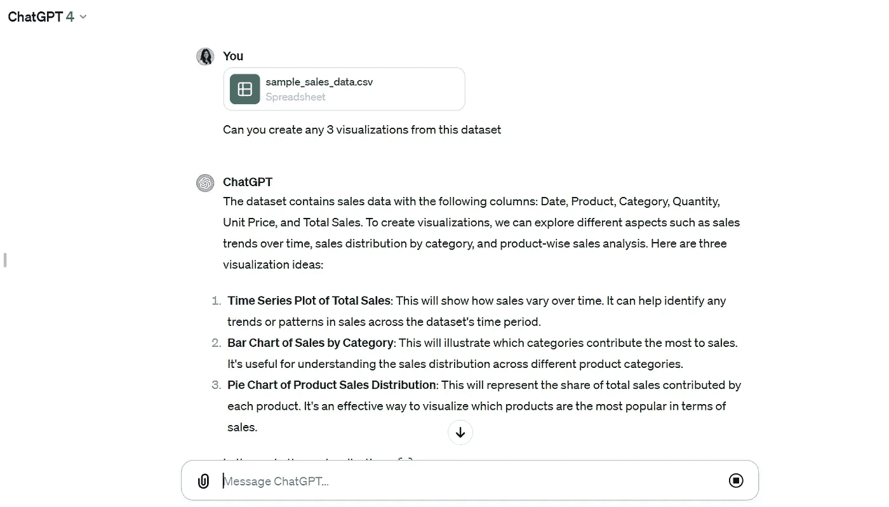
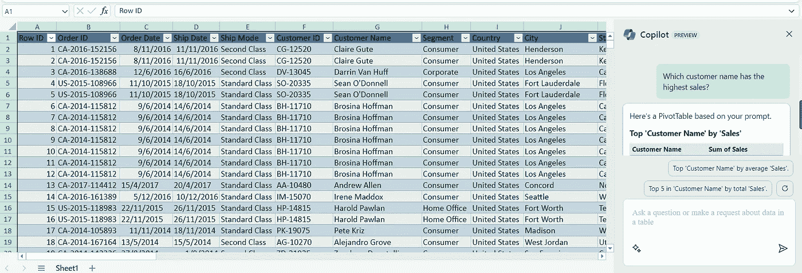

# 我是如何在 6 个月内获得数据分析师职位的

> 原文：[`towardsdatascience.com/how-i-got-a-data-analyst-job-in-6-months-cc6180de06c3`](https://towardsdatascience.com/how-i-got-a-data-analyst-job-in-6-months-cc6180de06c3)

## 以及你如何在 2023 年通过利用 ChatGPT 和生成性 AI 做同样的事情。

[](https://natassha6789.medium.com/?source=post_page-----cc6180de06c3--------------------------------)[](https://towardsdatascience.com/?source=post_page-----cc6180de06c3--------------------------------) [Natassha Selvaraj](https://natassha6789.medium.com/?source=post_page-----cc6180de06c3--------------------------------)

·发布于 [Towards Data Science](https://towardsdatascience.com/?source=post_page-----cc6180de06c3--------------------------------) ·10 分钟阅读·2023 年 11 月 18 日

--


图片来自 [Motion Array](https://motionarray.com/stock-photos/businesswoman-working-on-a-laptop-1344070/)

在 2019 年，我在国内一所最负盛名的大学攻读计算机科学学位——希望这能让我在数据行业找到一份工作。

然而，到我大学的第二年时，现实开始显现。

当我意识到我的学位**并没有为我在该领域的工作做好准备**时，我开始申请技术相关的实习——数据科学、数据分析和网页开发。

我不知道如何编程，缺乏解决商业问题所需的技术专长，也没有可以在简历上展示的市场技能。

在申请实习过程中经历了多次拒绝后，我意识到我不能再依靠我的学位来教会我获得技术行业工作的必要技能。

我花了所有的空闲时间参加在线课程并建立个人项目。

> 仅仅用了 6 个月的自学时间，我便获得了第一个数据分析师实习机会。

这次实习为我转型进入**数据科学**领域铺平了道路。现在我正在担任全职数据科学家。

在这篇文章中，我将分享我在 6 个月内自学数据分析的步骤。

想要视频版，请点击 [这里](https://youtu.be/pjypOeXAU7M?si=THxuArxvgJCURU3L)。

[视频版](https://youtu.be/pjypOeXAU7M?si=E3fE4Hy_RCVxRCIn)

# 为什么你应该成为数据分析师？

当我开始时，我的初衷是成为一名**数据科学家**。

然而，我发现作为数据分析师找工作要容易得多，因为这个角色的入门门槛比数据科学低。

这是因为大多数数据科学职位要求你拥有统计学或计算机科学等定量领域的硕士学位。

如果你没有技术背景，那么进入数据分析领域会比进入数据科学领域容易得多。

此外，大多数数据分析师职位并不要求你有**数学**或**机器学习**的背景——这两者都是数据科学家必须具备的技能。

# 数据分析师到底做什么？

虽然数据分析师的具体角色可能根据公司和行业有所不同，但这里是一般的工作流程：

你提取组织的电子表格或数据库中的数据，分析它，并向业务解释你的发现。

然后，公司会根据你的发现做出业务决策（与销售、营销、财务等相关）。

执行这种分析所用的工具会根据你的角色有所不同。有些角色只要求你掌握 Excel，而其他角色则要求你具备数据库和编程语言的知识。

# 我是如何在 6 个月内学习数据分析的？

这是我在 2020 年学习数据分析所采取的步骤：

## 1\. SQL

SQL 代表结构化查询语言。它是一种允许你与公司数据库进行沟通的语言。

它让你从大型数据库中提取数据，转换数据，并利用这些数据解决业务问题。

这是数据分析师职位招聘中最受欢迎的技术技能之一。

我在刚开始时参加了 Udacity 上的一个免费的课程，名为[SQL for Data Analysis](https://www.udacity.com/course/sql-for-data-analysis--ud198)。

这将教会你所有需要知道的概念，以便开始在关系数据库中处理数据——例如数据聚合、联接，甚至一些更复杂的主题，如子查询和窗口函数。

我推荐这个 Udacity 课程而不是互联网上成千上万的其他资源的原因是：

1.  这直接切入重点。它教授你成为数据分析师所需的所有 SQL 知识。其他课程深入探讨如 ER 图和创建数据库等主题，这些对数据分析师的工作实际上并不必要。

1.  每个主题之后都有练习题。你学习一个概念后，他们会给你一个业务问题。你需要编写 SQL 查询来解决这个问题，使用你刚学到的概念。

在我 3 年的技术经验中，我意识到通过实践你学到的东西要比仅仅从视频内容中获取信息多得多。

> 自己编写一行代码会比观看其他人输入 100 行程序学到更多东西。

我发现这个课程在理论和实践之间达到了完美的平衡。

## 2\. BI 工具

我做的第二件事是学习使用商业智能（BI）工具。

商业智能（BI）工具让你将原始数据转换为仪表板或人们可以轻松理解的可视化格式。

> 简单来说，BI 工具将数据转换为**可操作的见解**。

再次强调，这里有很多东西要学习——**数据可视化的基础**、**创建计算字段**、**构建仪表板**。

而且很容易在互联网上大量资源中迷失方向。

所以，我建议你这样做：

市场上两个最受欢迎的 BI 工具包括 Tableau 和 PowerBI，根据 2022 年的调查，[Tableau 的需求更高](https://www.udig.com/digging-in/power-bi-vs-tableau/)。

当你刚开始时，我建议你先参加一个 Tableau 在线课程，以学习基础知识。

完成此课程后，你将能够将原始数据转化为互动仪表板。

一旦你完成了这门课程，决定这是否是你想进一步学习的内容。

即使在数据分析领域，也有专门从事不同工作的人员。我认识一些分析师，他们的唯一工作就是使用 BI 工具构建仪表板。

如果你觉得自己更具创造力，喜欢创建可视化的过程，你可以深入研究并专注于仪表板。

你甚至可以获得[Tableau 专家](https://www.tableau.com/learn/certification/desktop-specialist)认证。

就我个人而言，我更像是一个通才。我做一点所有的工作，知道足够将原始数据转化为功能性仪表板。

## 3\. Python（可选）

最终，我学习了 Python 编程。

我认为这对于数据分析师来说是一个可选技能——它并不是大多数角色的严格前提。

## **你应该学习 Python 如果**：

1.  你计划将来转型到数据科学或其他更技术性的领域。

1.  你有时间。这个过程花费了我大约 4-5 个月的练习，而我已有一些计算机科学学位的编程知识。

1.  你想要争取更高的薪水。

对我来说，这绝对是值得的，因为学习编码为我打开了许多机会的大门。

> 我能够争取到更高的薪水，获得多个自由职业编程角色，并随后过渡到数据科学领域。

我还发现，一旦我学会了 Python，掌握其他编程语言就变得容易得多。

但是，如果你的唯一目标是尽快获得数据分析师的职位，你可以跳过这一步。

如果你确实想学 Python，你可以参加 Freecodecamp 的 [Python for Beginners](https://youtu.be/rfscVS0vtbw?si=-Wqf9see0gUW7CCF) 课程。然后跟着在 [Leetcode](https://leetcode.com/) 和 [Hackerrank](https://www.hackerrank.com/) 上的练习题。

这里有一篇更详细的文章，解释了如何从零开始学习编码。

# 如果我能在 2023 年重新开始，我会做些什么不同的事情？

现在你知道了我如何在 2023 年学习数据分析，如果我今天必须重新开始，这里是我会做的事情：

## 1\. 我会学习 Excel

当我作为数据分析师实习生加入我的第一家公司时，我被期望在 Excel 中进行并展示大量的分析。

这是因为 SQL 和 Python 对许多公司来说有些多余。他们中的很多人只是将数据存储在 Excel 文件中。

利益相关者和决策者也喜欢看到以 Excel 表格呈现的数据，因为他们对这种界面很熟悉。

他们中的大多数人不在乎你那些花哨的 Python 代码。

如果你时间紧迫，需要快速找到工作，或者确实没有精力学习太多工具，我建议你只学习 Excel。

一旦你真正掌握了在 Excel 中分析数据的技能，你可以获得许多入门级的数据分析师职位。

当然，这些工作可能比那些需要 SQL 和编程技能的工作薪资低，但这是一个很好的起点。

## 2\. 我会利用 ChatGPT 和 AI 学习数据分析

ChatGPT 对数据分析师来说是一个颠覆性工具。

它可以在几分钟内分析数据。

GPT-4 中的高级数据分析插件允许你上传数据集并自动化大量与 Excel 相关的工作。

它还可以创建可视化，生成 SQL 查询，并编写 Python 代码：



图片由作者提供（数据集由作者创建用于演示目的）

如果你不学习如何使用 ChatGPT 进行数据分析，你将比那些正在使用它的分析师处于劣势。

> 使用 ChatGPT，我能够将数据分析的速度提高了一倍。

365DataScience 有一个叫做 [使用 ChatGPT 进行数据分析](https://learn.365datascience.com/courses/preview/data-analysis-with-chatgpt/) 的课程，我强烈推荐。

此外，Microsoft Copilot 也是一个很棒的工具，可以使用简单的文本提示将数据转化为商业洞察。

你只需输入一个问题，例如“*哪个客户产生了最高的销售额*”，它就会为你创建一个图表——你不需要输入公式或进行任何手动分析。



图片由作者提供

ChatGPT 和 Copilot 在数据分析领域都是颠覆性工具。学会使用它们。

# 摘要：2023 年如何学习数据分析

好吧，让我们快速回顾一下。

如果你时间紧迫，只能学习一个工具，那么学习 **Excel** 和 **用于数据分析的 ChatGPT**。这些要求是进入该领域的最低标准。

如果你有时间全职学习 6 个月，学习 **Excel**、**SQL**、**BI 工具**、**ChatGPT**，以及可选的 **Python**。

# 求职申请流程

一旦你掌握了我之前列出的技能，你可以开始申请数据分析师的职位列表。

## 申请实习

我建议从实习开始，因为它们的门槛较低。公司实际上是付钱让你在为他们工作时学习。

如果一切顺利，实习可以迅速转变为全职工作机会。我的 6 个月实习在我大学毕业后变成了一个永久职位。

## 提高你被录用的机会

当我刚开始申请实习时，遇到了多次拒绝。

大多数公司在我通过 LinkedIn 和 Indeed 申请时根本没有回应。我经常被“幽灵”了。

当我这样做时，我的成功率显著提高：

1.  我列出了我所在地区招聘数据分析师的公司。

1.  我筛选了我想要工作的公司。

1.  我找到了该职位的招聘经理并给他们发送了个性化的邮件。

下面是我在申请数据分析师职位时发送的个性化邮件的一个例子：

```py
Hi *recruiter name*,

I am Natassha, currently a final year computer science student.
I am writing to you because I'd like to seek an internship in *company name* from March 2021, for a period of around 4-5 months. I am available for a full-time internship during this period.
I am currently doing a part time internship with *company name*, and have worked on data analytics projects with clients such as *client names*. I also am a prolific content writer in some of the top Medium publications, and am a top writer in the field of artificial intelligence.
I would love to have the opportunity to utilise my skills in my area of expertise, and learn while working closely with a team of dynamic individuals.
I will link my portfolio, along with my LinkedIn profile below. If you are interested in knowing more about the work I do, please do revert back to me. I will then share my resume with you and be happy to discuss further.
Portfolio site: https://natassha.github.io/natasshaselvaraj/
LinkedIn: https://www.linkedin.com/in/natassha-selvaraj-33430717a/

Thanks for taking your time to read this. I look forward to hearing back from you.

Regards,
Natassha
```

发送这封邮件后，我获得了面试机会，最终在公司获得了实习职位！

另一个增加你作为数据分析师被聘用机会的方法是**创建作品集项目**。

[这里](https://medium.datadriveninvestor.com/a-complete-data-analytics-project-with-python-9befabe278c3)是我的一个数据分析师作品集项目的例子。

随意从这个项目中汲取灵感并复制它，创造属于你自己的项目。

最后，我想通过谈论一个大多数人在学习困难内容时会遇到的问题来结束本文：**深入研究**。

如果你试图进入数据行业，互联网上可用的信息量可能令人畏惧。

这在生成式 AI 时代尤其如此——几乎每周都会推出新的 API 和与数据相关的功能。

仅在过去一年中，数据分析领域就因 Microsoft Copilot、Advanced Data Analysis、Noteable 和 Pandas AI 的引入而发生了显著变化。

虽然我总是推荐将 AI 融入你的工作流程，但几乎不可能跟上每个新功能的推出，尤其是如果你是该领域的完全初学者。

鉴于此，我建议使用本文之前提到的步骤来学习数据分析的基础知识。利用像 ChatGPT 这样的 AI 工具学习提示工程的基础，但不要在网上资源的海洋中迷失方向。

一旦你熟悉了分析师的核心工作流程，你可以随时开始引入新工具以最大化效率。

这样，你可以在熟悉基础知识的同时，利用最先进的技术使自己从其他分析师中脱颖而出。

这就是本文的全部内容，感谢阅读！
