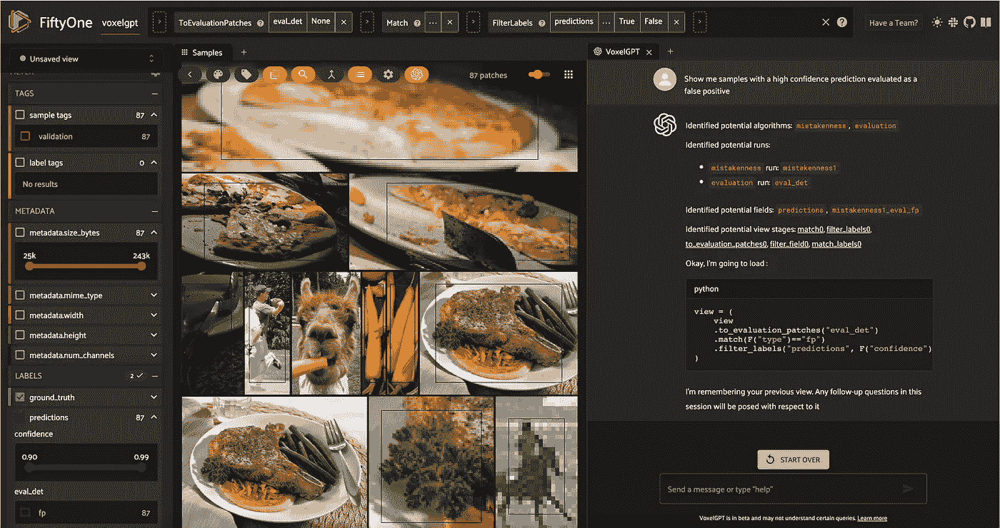
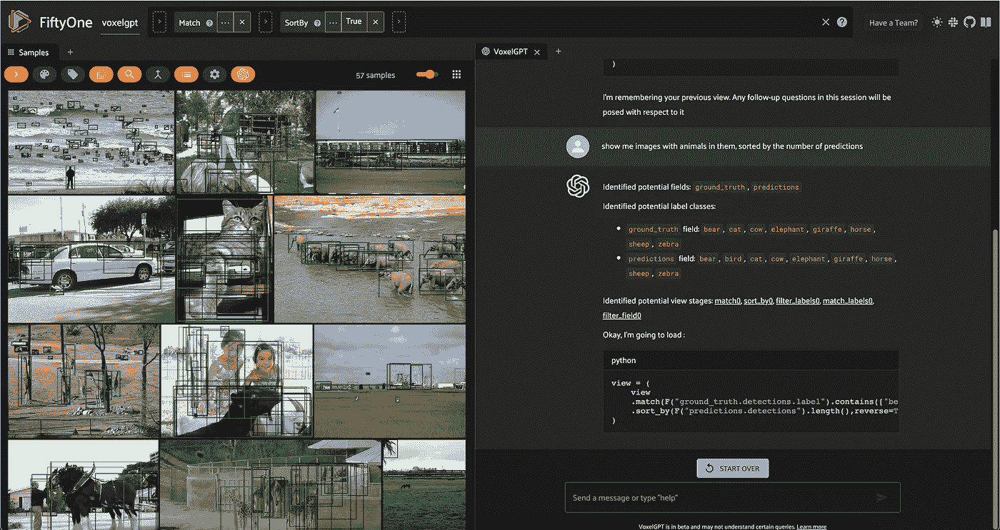
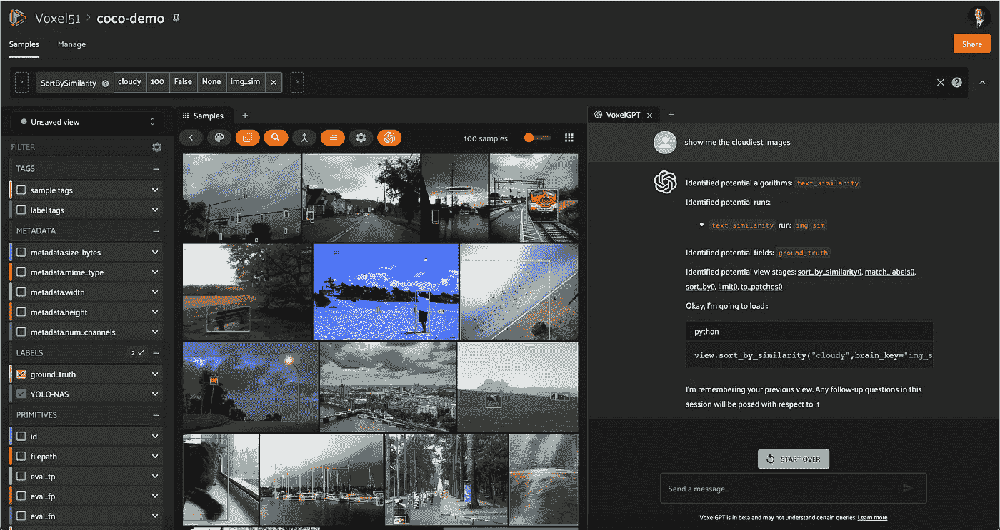
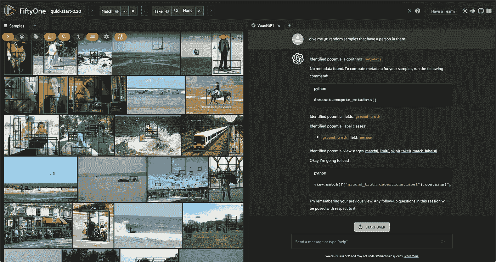

# 我是如何将 ChatGPT 转变为类似 SQL 的图像和视频数据集翻译器

> 原文：[`towardsdatascience.com/how-i-turned-chatgpt-into-an-sql-like-translator-for-image-and-video-datasets-7b22b318400a?source=collection_archive---------1-----------------------#2023-06-08`](https://towardsdatascience.com/how-i-turned-chatgpt-into-an-sql-like-translator-for-image-and-video-datasets-7b22b318400a?source=collection_archive---------1-----------------------#2023-06-08)

## 这是一个涉及提示工程、软件工程、试验和错误、以及辛勤工作的过程

[](https://medium.com/@jacob_marks?source=post_page-----7b22b318400a--------------------------------)[](https://towardsdatascience.com/?source=post_page-----7b22b318400a--------------------------------) [Jacob Marks, Ph.D.](https://medium.com/@jacob_marks?source=post_page-----7b22b318400a--------------------------------)

·

[关注](https://medium.com/m/signin?actionUrl=https%3A%2F%2Fmedium.com%2F_%2Fsubscribe%2Fuser%2Ff7dc0c0eae92&operation=register&redirect=https%3A%2F%2Ftowardsdatascience.com%2Fhow-i-turned-chatgpt-into-an-sql-like-translator-for-image-and-video-datasets-7b22b318400a&user=Jacob+Marks%2C+Ph.D.&userId=f7dc0c0eae92&source=post_page-f7dc0c0eae92----7b22b318400a---------------------post_header-----------) 发表在 [Towards Data Science](https://towardsdatascience.com/?source=post_page-----7b22b318400a--------------------------------) ·21 分钟阅读·2023 年 6 月 8 日[](https://medium.com/m/signin?actionUrl=https%3A%2F%2Fmedium.com%2F_%2Fvote%2Ftowards-data-science%2F7b22b318400a&operation=register&redirect=https%3A%2F%2Ftowardsdatascience.com%2Fhow-i-turned-chatgpt-into-an-sql-like-translator-for-image-and-video-datasets-7b22b318400a&user=Jacob+Marks%2C+Ph.D.&userId=f7dc0c0eae92&source=-----7b22b318400a---------------------clap_footer-----------)

--

[](https://medium.com/m/signin?actionUrl=https%3A%2F%2Fmedium.com%2F_%2Fbookmark%2Fp%2F7b22b318400a&operation=register&redirect=https%3A%2F%2Ftowardsdatascience.com%2Fhow-i-turned-chatgpt-into-an-sql-like-translator-for-image-and-video-datasets-7b22b318400a&source=-----7b22b318400a---------------------bookmark_footer-----------)

VoxelGPT 使用自然语言查询图像数据集。图片由作者提供。

与表格数据不同，*计算机视觉任务*的数据集是非结构化的——可以想象成一堆像素、大量标签、标签包以及一些有时结构化的元数据。然而，那些从事计算机视觉工作的人仍然需要能够高效地筛选这些数据宝库，以*理解*数据集，准备训练集和测试集，发现模式，识别边缘案例，并评估模型性能。

当我需要理解视觉数据时（这基本上是一直需要的），我使用开源库 FiftyOne，它定义了一种强大的 Python 语法来查询计算机视觉数据。这有点像计算机视觉数据的 SQL，它允许我以编程方式筛选、排序和语义切片由图像、视频甚至 3D 点云组成的数据集。

几个月前，随着 ChatGPT 热潮的全面爆发，我在 OpenAI 的网站上看到一个例子应用，[将自然语言输入转换为 SQL 查询](https://platform.openai.com/examples/default-sql-translate)。虽然这个应用程序相当基础，而计算机视觉数据则*复杂得多*，但这让我思考：是否可以为图像和视频数据集做类似的事情？换句话说：

*我们能否利用大型语言模型 (LLM) 的多功能性，将自然语言查询转换为对非结构化计算机视觉数据集的过滤视图？*

> 答案是？是的，我们可以！

将 LLM 的通用语言和推理能力与 FiftyOne 的查询语言相结合，我们在 Voxel51 的团队构建了 [**VoxelGPT**](https://github.com/voxel51/voxelgpt)：一个开源 AI 助手，可以让你*无需编写一行代码*即可全面查询计算机视觉数据集！

我们使用了 [langchain](https://github.com/hwchase17/langchain)、[tiktoken](https://github.com/openai/tiktoken) 和 [fiftyone](https://github.com/voxel51/fiftyone) 完成了这个任务。

> 你可以在 [gpt.fiftyone.ai](https://gpt.fiftyone.ai) 免费试用！

这篇文章将带你了解构建领域特定 LLM 应用程序的提示工程、软件工程和大量试错过程。

在这个过程中，我们多次遇到瓶颈，并担心任务是否不可行。如果你正在尝试并挣扎于构建一个 LLM 驱动的应用程序，我希望这篇文章能给你突破自己困境的灵感！

这篇文章的结构如下：

+   类似 SQL 的图像和视频查询

+   定义总体任务

+   为模型提供上下文

+   生成和利用示例

+   拆解问题

+   投入生产

# 查询语言



VoxelGPT 使用自然语言查询图像数据集。图片由作者提供。

在我们深入讨论如何使用 LLM 生成查询之前，值得花一点时间描述一下我们希望模型翻译的查询语言。以下是你需要的基本信息。有关更全面的概述，请参阅[FiftyOne 用户指南](https://docs.voxel51.com/user_guide/basics.html)。如果你已经熟悉这些语言，可以直接跳到下一部分。

+   **数据集：** `Dataset`是 SQL 中的`Table`或 pandas 中的`DataFrame`的计算机视觉类比。它包含与一组媒体文件相关的所有信息。

+   **样本：** `Sample`类似于数据表中的一行。样本是`Dataset`的基本元素。每个样本都有一个`filepath`，指向一个媒体文件，并存储与该数据片段相关的所有其他信息。

+   **字段：** `Field`类似于数据表中的列，因为它定义了样本的属性（例如，图像宽度、高度和文件路径）。然而，字段是灵活的，它们可以包含其他字段（见下文的`Label`）。

+   **标签：** `Label`是一个存储语义真实或预测信息的`Field`。例如，对象检测存储在`Detections`标签字段中，而分类存储在`Classification`标签字段中。

与 SQL 或 pandas 一样，你可以使用查询操作来过滤数据。例如，你可能想要查询数据表以获取：

*所有在“A”列中条目大于 0.5 的行*

然而，与数据表适合进行数字切片和过滤不同，非结构化计算机视觉数据更适合进行*语义切片*，例如：

*在至少有 3 个非“狗”地面真实检测的图像中，检索高置信度的“大”边界框“狗”预测*

对非结构化数据进行语义切片需要更大的灵活性。

为了实现这种灵活性，FiftyOne 定义了一组`ViewStage`方法，这些方法封装了允许的查询操作，如过滤、匹配、选择、排序和排除。这些方法大致类似于 SQL 中的`SELECT`、`WHERE`和`ORDER BY`，但由于查询的空间更大，方法数量也多得多，每个方法都有许多使用场景。有关详细讨论，请参见这个[视图备忘单](https://docs.voxel51.com/cheat_sheets/views_cheat_sheet.html)。

你可以通过将多个`ViewStage`操作按顺序组合来获取`Dataset`的任意子集，这个子集称为`DatasetView`。

下面是查询语言在实际操作中的样子：给定一个名为`my_dataset`的数据集，如果我们想要获取所有在包含“猫”的 10 张随机图片的`"predictions"`标签字段中的“狗”检测，我们可以使用以下查询：

```py
view = my_dataset.match(
        F("ground_truth.detections.label").contains(["cat"])
    ).filter_labels(
        "predictions", 
        F("label") == "dog"
    ).take(10)
```

`match()`限制为在`"ground_truth"`检测字段中包含“猫”的图像，然后`filter_labels()`深入到`"predictions"`字段中，仅检索“狗”检测，最后`take()`随机选择一个子集。

# 定义任务

当我们开始这个旅程时，我们并不知道 LLMs 能做什么。早在 2022 年 12 月，我曾玩过 ChatGPT，并撰写了一篇文章[计算机视觉中的隧道视野：ChatGPT 能看见吗？](https://medium.com/voxel51/tunnel-vision-in-computer-vision-can-chatgpt-see-e6ef037c535)，探讨了聊天机器人对计算机视觉概念的理解。当时，一个通用语言模型能为基本的图像处理任务编写*大部分*正确的 Python 代码已经令人印象深刻，但在计算机视觉应用中使用 GPT 生成的代码（*没有人工验证*）的想法似乎不切实际。

在看到文本到 SQL 的示例后，并阅读了 GPT-4 reportedly 以优异的成绩通过 BAR 考试（以及其他考试）的消息后，我决定再次尝试 GPT-for-CV。我让 GPT-4 生成了一些简单查询的 Python 代码，对其回应感到惊喜。GPT-4 的即用结果的真实性还有待提高，这是可以理解的，因为*我没有提供任何关于 FiftyOne 库的信息*。但使其有效的前景令人兴奋。

## 需要统一性

当我们实验不同的提示技术时（我们稍后会讨论），如果我们想将其纳入更大的管道中，立刻就显现出我们需要*明确任务*。

如果任由其自行运作，GPT 模型的回应在格式上会因提示而异。

这里只是两个例子，我们将很快进行分析：

**提示 1:**

*你的任务是将输入的自然语言查询转换为 Python 代码，以生成计算机视觉库 FiftyOne 的 ViewStages。*

*这是你的第一个自然语言查询：“仅包含狗的图像”*

*给我 FiftyOne 代码。*

**回应 1:**

*当然，这里是生成仅包含狗的图像的 FiftyOne 代码：*

```py
import fiftyone as fo
import fiftyone.zoo as foz

# Load the dataset
dataset = foz.load_zoo_dataset(
    "open-images-v6",
    split="validation",
    label_types=["detections"],
    classes=["Dog"],
)

# Create a view stage that filters out images without any dog detections
view_stage = fo.ViewStage("detections", fo.FilterField("detections", "label", "Dog"))

# Apply the view stage to the dataset
dataset = dataset.add_stage(view_stage)

# View the dataset
session = fo.launch_app(dataset)
```

*这段代码加载了 Open Images v6 验证数据集，仅包含“检测”标签类型的狗。然后，它创建了一个视图阶段，过滤掉没有狗检测的图像。最后，将视图阶段应用到数据集中，并在 FiftyOne 应用中启动。*

**提示 2:**

*你的任务是将输入的自然语言查询转换为 Python 代码，以生成 FiftyOne 机器学习库的 ViewStages。*

*这是你的第一个自然语言查询：“最独特的假阳性检测图像”*

*给我 FiftyOne 代码。*

**回应 2:**

*当然，这里是使用 FiftyOne 库在 Python 中生成“最独特的假阳性检测图像”自然语言查询的 FiftyOne 代码：*

```py
import fiftyone as fo
import fiftyone.zoo as foz

# Load your dataset
dataset = fo.load_dataset("your_dataset_name")

# Define your false positive detection model
model = foz.load_zoo_model("your_model_name")

# Define your pipeline
pipeline = [
    {"$set": {"predictions": {"$predict": model}}},
    {"$match": {"predictions.mistakes.false_positive": True}},
    {"$group": {"_id": "$filepath"}},
    {"$count": "num_images"},
    {"$sort": {"num_images": -1}},
]

# Run your pipeline and display the results in a view stage
view = dataset.aggregate(pipeline).limit(10).display()
```

*在这段代码中，我们首先加载 FiftyOne 库和任何必要的依赖项。然后，我们使用 fo.load_dataset()加载你的数据集。*

*接下来，我们使用 foz.load_zoo_model()定义你的假阳性检测模型。该函数从 FiftyOne Zoo Model Zoo 加载一个预训练模型，其中包括广泛的计算机视觉最先进模型。*

*之后，我们使用$set、$match、$group、$count 和$sort 聚合阶段定义我们的管道。管道首先使用$set 为数据集中每个样本添加一个包含模型预测的字段。然后，我们使用$match 过滤样本，仅包括那些检测到假阳性的样本。*

*接下来，我们使用$group 按文件路径对样本进行分组，并使用$count 计算每个组中的图像数量。最后，我们使用$sort 按图像数量的降序对组进行排序。*

*最后，我们在你的数据集上运行管道，并使用 limit()将结果限制为检测到最多假阳性的前 10 张图像。然后，我们使用 display()在视图阶段展示结果。*

尽管这两个示例的提示结构相同，但响应在几个关键方面有所不同。响应 1 尝试通过向数据集添加`ViewStage`来创建`DatasetView`。响应 2 定义并应用了一个[MongoDB 聚合管道](https://www.mongodb.com/docs/manual/core/aggregation-pipeline/)，随后使用`limit()`方法（应用`Limit`阶段）将视图限制为 10 个样本，并使用了一个不存在（即幻觉）`display()`方法。此外，尽管响应 1 加载了一个实际的数据集（Open Images V6），响应 2 实际上是模板代码，因为`"your_dataset_name"`和`"your_model_name"`需要填写。

这些示例还突出了以下问题：

1.  **模板代码**：一些响应包含了导入模块、实例化数据集（和模型）以及可视化视图（`session = fo.launch_app(dataset)`）的代码。

1.  **解释性文本**：在许多情况下——包括教育背景——模型解释其“推理”是一个积极的。如果我们希望代表用户执行查询，这些解释性文本就会成为障碍。一些查询甚至导致多个被文本分隔的代码块。

我们真正想要的是让 LLM 回应可以直接复制粘贴到 Python 进程中的代码，而不附带额外的负担。作为对模型进行提示的第一次尝试，我开始将以下文本作为前缀添加到任何自然语言查询中：

```py
Your task is to convert input natural language queries into Python code to generate ViewStages for the computer vision library FiftyOne.
Here are some rules:
- Avoid all header code like importing packages, and all footer code like saving the dataset or launching the FiftyOne App.
- Just give me the final Python code, no intermediate code snippets or explanation.
- always assume the dataset is stored in the Python variable `dataset`
- you can use the following ViewStages to generate your response, in any combination: exclude, exclude_by, exclude_fields, exclude_frames, …
```

关键是，我定义了一个*任务*，并设置了*规则*，指导模型允许和不允许做的事情。

*注意：随着响应格式的更加统一，我在这时从 ChatGPT 聊天界面转向使用 OpenAI 的 API 中的 GPT-4。*

## 限制范围

我们的团队还决定，至少在开始时，我们将限制我们要求 LLM 执行的范围。尽管 fiftyone 查询语言本身功能全面，但要求预训练模型在没有任何微调的情况下执行任意复杂的任务是令人失望的。开始时要简单，然后逐步增加复杂性。

对于此实验，我们施加了以下限制：

+   **仅限图像和视频**：不要指望 LLM 查询 3D 点云或分组数据集。

+   **忽略变化的** `**ViewStages**`：大多数 `ViewStages` 遵循相同的基本规则，但有一些例外。`Concat` 是唯一一个接受第二个 `DatasetView` 的 `ViewStages`；`Mongo` 使用 MongoDB 聚合语法；`GeoNear` 具有一个 `query` 参数，该参数接受一个 `fiftyone.utils.geojson.geo_within()` 对象；而 `GeoWithin` 需要一个 2D 数组来定义“within”适用的区域。我们决定忽略 `Concat`、`Mongo` 和 `GeoWithin`，并支持所有 `GeoNear` 的使用 *除了* `query` 参数。

+   **坚持两个阶段**：虽然模型能够组合任意数量的阶段是很好的，但在我见过的大多数工作流程中，一两个 `ViewStages` 就足以创建所需的 `DatasetView`。该项目的目标不是陷入细节，而是为计算机视觉从业者构建一些有用的东西。

# 提供上下文



VoxelGPT 使用自然语言查询图像数据集。图片由作者提供。

除了给模型一个明确的“任务”和提供清晰的指示外，我们发现通过提供有关 FiftyOne 查询语言如何工作的更多信息，可以提高性能。如果没有这些信息，LLM 就像在黑暗中盲目飞行，只是在抓取和伸手进入黑暗中。

例如，在提示 2 中，当我要求获取假阳性预测时，响应尝试用`predictions.mistakes.false_positive`来引用这些假阳性。就 ChatGPT 而言，这似乎是存储和访问假阳性信息的合理方法。

模型不知道在 FiftyOne 中，检测预测的真实性/虚假性是通过 `dataset.evaluate_detections()` 评估的，运行该评估后，你可以通过匹配 `eval_fp>0` 来检索所有具有假阳性的图像：

```py
images_with_fp = dataset.match(F("eval_fp")>0)
```

我尝试通过提供额外的规则来澄清任务，例如：

```py
- When a user asks for the most "unique" images, they are referring to the "uniqueness" field stored on samples.
- When a user asks for the most "wrong" or "mistaken" images, they are referring to the "mistakenness" field stored on samples.
- If a user doesn't specify a label field, e.g. "predictions" or "ground_truth" to which to apply certain operations, assume they mean "ground_truth" if a ground_truth field exists on the data.
```

我还提供了有关标签类型的信息：

```py
- Object detection bounding boxes are in [top-left-x, top-left-y, width, height] format, all relative to the image width and height, in the range [0, 1]
- possible label types include Classification, Classifications, Detection, Detections, Segmentation, Keypoint, Regression, and Polylines
```

此外，虽然通过提供允许的视图阶段列表，我能够推动模型使用这些阶段，但它并不知道

+   *当*给定阶段相关时，或者

+   *如何*以语法正确的方式使用阶段

为了填补这一空白，我想给 LLM 提供有关每个视图阶段的信息。我编写了代码来遍历视图阶段（你可以使用 `fiftyone.list_view_stages()` 列出这些阶段），存储文档字符串，然后将文档字符串的文本拆分为描述和输入/参数。

*然而，我很快遇到了一个问题：上下文长度。*

使用 OpenAI API 的基础 GPT-4 模型时，我已经接近了 8,192 令牌的上下文长度。这是在添加示例或任何有关数据集的信息之前！

OpenAI 确实有一个具有 32,768 令牌上下文的 GPT-4 模型，理论上我可以使用，但一个粗略的计算让我相信这可能会很贵。如果我们填满了整个 32k 令牌上下文，根据[OpenAI 的定价](https://openai.com/pricing)，每次查询大约需要 2 美元！

相反，我们的团队重新考虑了我们的方法，并进行了以下操作：

+   切换到 GPT-3.5

+   最小化令牌数

+   更加挑剔地选择输入信息

## 切换到 GPT-3.5

没有什么是免费的——这确实导致了稍微较低的性能，至少在初期。在项目过程中，我们通过提示工程恢复并远远超越了这一点！在我们的案例中，这个努力是值得的。在其他情况下，可能就不是这样了。

## 最小化令牌数

由于上下文长度成为限制因素，我使用了以下简单的技巧：*使用 ChatGPT 优化提示！*

一次处理一个`ViewStage`，我将原始描述和输入列表提供给 ChatGPT，并附上一个*要求 LLM 最小化文本的令牌数*的提示，同时*保留所有语义信息*。使用[tiktoken](https://github.com/openai/tiktoken)来计算原始和压缩版本中的令牌数，我能够将令牌数减少约 30%。

## 更加挑剔

尽管提供上下文对模型很有帮助，但某些信息比其他信息更有用，具体取决于任务。如果模型仅需要生成涉及两个`ViewStages`的 Python 查询，它可能不会从其他`ViewStages`的输入信息中获得太大帮助。

我们知道需要一种方法来根据输入的自然语言查询选择相关信息。然而，这不会像在描述和输入参数上执行相似性搜索那样简单，因为前者通常以与后者非常不同的语言出现。我们需要一种将输入和信息选择联系起来的方法。

结果发现，那个链接是*示例*。

# 示例

## 生成示例

如果你曾经使用过 ChatGPT 或其他 LLM，你可能亲身体验过，即使只提供一个相关的示例，也能大幅提高性能。

作为起点，我想出了 10 个完全合成的示例，并将这些示例通过在任务规则和`ViewStage`描述下方添加以下内容传递给 GPT-3.5：

以下是 A、B 形式的输入-输出对的一些示例：

```py
A) "Filepath starts with '/Users'"
B) `dataset.match(F("filepath").starts_with("/Users"))`

A) "Predictions with confidence > 0.95"
B) `dataset.filter_labels("predictions", F("confidence") > 0.95)`

…
```

仅凭这 10 个示例，模型响应的质量有了显著提高，因此我们的团队决定对此采取系统化的方式。

1.  首先，我们仔细检查了我们的文档，找出了通过`ViewStages`组合创建的所有视图示例。

1.  然后，我们查看了`ViewStages`的列表，并添加了示例，以便尽可能全面地覆盖用法语法。为此，我们确保每个参数或关键字至少有一个示例，以便为模型提供一个可遵循的模式。

1.  在覆盖了用法语法之后，我们更改了示例中字段和类的名称，以防止模型对名称与阶段之间的关联产生错误的假设。例如，我们不希望模型仅仅因为所有`match_labels()`的示例都包含“person”类，就强烈关联“person”类与`match_labels()`方法。

## 选择类似的示例

在这个示例生成过程结束时，我们已经有了数百个示例——远远超过了可以容纳的上下文长度。幸运的是，这些示例包含了（作为输入）自然语言查询，我们可以直接与用户的自然语言查询进行比较。

为了进行这种比较，我们使用 OpenAI 的[text-embedding-ada–002](https://openai.com/blog/new-and-improved-embedding-model)模型预计算了这些示例查询的嵌入。在运行时，用户的查询会使用相同的模型进行嵌入，然后选择与自然语言查询最相似的示例——通过余弦距离来确定。最初，我们使用了[ChromaDB](https://www.trychroma.com/)来构建内存中的向量数据库。然而，由于我们处理的是数百或数千个向量，而不是数十万或数百万个向量，实际上转而使用精确向量搜索更为合理（此外，我们还减少了依赖）。

管理这些示例和提示的组件变得越来越困难，因此我们在这时开始使用[LangChain 的 Prompts 模块](https://python.langchain.com/en/latest/modules/prompts.html)。最初，我们能够使用他们的[相似性示例选择器](https://python.langchain.com/en/latest/modules/prompts/example_selectors/examples/similarity.html)来选择最相关的示例，但最终我们不得不编写一个自定义的`ExampleSelector`，以便对预过滤有更多控制。

## 过滤适当的示例

在计算机视觉查询语言中，查询的适当语法可能取决于数据集中样本的媒体类型：例如，视频有时需要与图像不同地处理。为了避免通过给出看似矛盾的示例而使模型感到困惑，或通过迫使模型基于媒体类型推断而使任务复杂化，我们决定仅给出对给定数据集语法正确的示例。在向量搜索的上下文中，这被称为[预过滤](https://weaviate.io/developers/weaviate/concepts/prefiltering)。

这个想法效果很好，以至于我们最终将相同的考虑应用于数据集的其他特性。在某些情况下，差异仅仅是语法上的——在查询标签时，访问`Detections`标签的语法与访问`Classification`标签的语法不同。其他过滤器则更具战略性：有时我们不希望模型了解查询语言的某些特性。

例如，我们不想给 LLM 提供使用它无法访问的计算的示例。如果没有为特定数据集构建文本相似性索引，则向模型提供查找与自然语言查询最佳视觉匹配的示例是没有意义的。类似地，如果数据集中没有任何评估运行，则查询真实正例和假阳性将产生错误或空结果。

你可以在 GitHub 仓库中的[view_stage_example_selector.py](https://github.com/voxel51/voxelgpt/blob/main/links/view_stage_example_selector.py)中查看完整的示例预处理管道。

## 根据示例选择上下文信息

对于给定的自然语言查询，我们然后使用`ExampleSelector`选择的示例来决定在上下文中提供哪些额外信息。

特别是，我们统计了这些选择示例中每个`ViewStage`的出现次数，确定了出现频率最高的五个``ViewStages`，并在我们的提示中添加了关于这些`ViewStages`的描述和输入参数信息。这么做的理由是，如果一个阶段在类似的查询中频繁出现，它很可能（但不能保证）与该查询相关。

如果不相关，那么描述将帮助模型确定它不相关。如果相关，那么关于输入参数的信息将帮助模型生成语法正确的`ViewStage`操作。

# 分而治之



VoxelGPT 使用自然语言查询图像数据集。图片由作者提供。

到目前为止，我们专注于将尽可能多的相关信息——而且只是相关信息——挤进一个提示中。但这种方法已接近其极限。

即使不考虑每个数据集都有自己的字段和类名，可能的 Python 查询空间也太大了。

为了取得进展，我们需要将问题分解成更小的部分。借鉴近期的方法，包括[链式思考提示](https://arxiv.org/abs/2201.11903)和[选择推理提示](https://arxiv.org/abs/2205.09712)，我们将生成`DatasetView`的问题分成了四个不同的选择子问题。

1.  算法

1.  算法运行

1.  相关字段

1.  相关的类名

然后我们将这些选择“链接”串联起来，并将它们的输出传递给模型，在最终提示中用于`DatasetView`推理。

对于这些子任务，统一性和简洁性的原则适用。我们尽可能地回收现有示例中的自然语言查询，但明确简化了每个选择任务的所有输入和输出的格式。对一个链接来说最简单的东西可能对另一个链接并不是最简单的！

## 算法

在 FiftyOne 中，来自数据集计算的信息被存储为一个“运行”（“run”）。这包括诸如 `uniqueness` 这样的计算，它衡量每张图像相对于数据集中其他图像的独特性，以及 `hardness`，它量化模型在尝试学习此样本时会遇到的难度。它还包括 `similarity` 的计算，这涉及为与每个样本相关联的嵌入生成向量索引，甚至包括我们之前提到的 `evaluation` 计算。

每个这些计算生成不同类型的结果对象，每种结果对象都有自己的 API。此外，`ViewStages` 和这些计算之间没有一一对应的关系。以独特性（uniqueness）为例。

独特性计算结果存储在每张图像的一个浮点值字段中（默认值为 `"uniqueness"`）。这意味着根据情况，你可能希望按独特性排序：

```py
view = dataset.sort_by("uniqueness")
```

检索独特性高于某个阈值的样本：

```py
from fiftyone import ViewField as F
view = dataset.match(F("uniqueness") > 0.8)
```

或者仅显示独特性字段：

```py
view = dataset.select_fields("uniqueness")
```

在这个选择步骤中，我们任务 LLM 预测可能与用户自然语言查询相关的计算。这个任务的一个示例是：

```py
Query: "most unique images with a false positive"
Algorithms used: ["uniqueness", "evaluation"]
```

## 算法运行

一旦识别出可能相关的计算算法，我们会任务 LLM 选择每个计算的最合适运行。这是必需的，因为某些计算可以在同一数据集上使用不同配置运行多次，而 `ViewStage` 可能仅在正确的“运行”下才有意义。

一个很好的例子是相似度运行。假设你在你的数据上测试两个模型（InceptionV3 和 CLIP），并且你已经为每个模型在数据集中生成了向量相似度索引。当使用 `SortBySimilarity` 视图阶段时，哪些图像被确定为与哪些其他图像最相似可能会强烈依赖于嵌入模型，因此以下两个查询可能会生成不同的结果：

```py
## query A:
"show me the 10 most similar images to image 1 with CLIP"

## query B:
"show me the 10 most similar images to image 1 with InceptionV3"
```

这个运行选择过程对每种计算类型分别处理，因为每种计算需要修改后的任务规则和示例。

## 相关字段

链中的这个链接涉及识别所有与自然语言查询相关的字段名称，这些字段名称 *不* 与计算运行相关。例如，并非所有包含预测的 数据集 都将这些标签存储在名为 `"predictions"` 的字段下。根据个人、数据集和应用的不同，预测可能存储在名为 `"pred"`、`"resnet"`、`"fine-tuned"`、`"predictions_05_16_2023"` 或完全不同的名称的字段中。

此任务的示例包括查询、数据集中所有字段的名称和类型，以及相关字段的名称：

```py
Query: "Exclude model2 predictions from all samples"
Available fields: "[id: string, filepath: string, tags: list, ground_truth: Detections, model1_predictions: Detections, model2_predictions: Detections, model3_predictions: Detections]"
Required fields: "[model2_predictions]"
```

## 相关的类名

对于标签字段如分类和检测，将自然语言查询转换为 Python 代码需要使用数据集中实际类的名称。为此，我让 GPT-3.5 执行[命名实体识别](https://paperswithcode.com/task/named-entity-recognition-ner)以识别输入查询中的标签类。

在查询“样本中至少有一个牛预测且没有马”的情况下，模型的任务是识别`"horse"`和`"cow"`。这些识别出的名称随后与在之前步骤中选择的标签字段的类名进行比较——首先是区分大小写的，然后是不区分大小写的，最后是不区分复数的。

如果在数据集中未找到命名实体和类名之间的匹配，我们将退回到语义匹配：`"people"` → `"person"`，`"table"` → `"dining table"`，和`"animal"` → `[“cat”, “dog", “horse", …]`。

每当匹配不完全相同时，我们使用匹配的类名来更新传递给最终推断步骤的查询：

```py
query: "20 random images with a table"
## becomes:
query: "20 random images with a dining table"
```

## ViewStage 推断

一旦所有这些选择完成，类似的示例、相关的描述和相关的数据集信息（选择的算法运行、字段和类）将与（可能修改过的）查询一起传递给模型。

与其指示模型以`dataset.view1().view2()…viewn()`的形式返回代码，我们最终去掉了`dataset`部分，而是要求模型将`ViewStages`作为列表返回。当时，我对这种改进性能感到惊讶，但回想起来，它与任务拆分越多，LLM 表现越好的见解相一致。

# 使其可用

创建一个 LLM 驱动的玩具很酷，但将相同的内核转变为 LLM 驱动的应用程序则更酷。以下是我们如何做到这一点的简要概述。

## 单元测试

当我们将其从一个原则证明转变为一个稳健的工程系统时，我们使用单元测试来压力测试管道并识别薄弱点。链中链接的模块化特性意味着每一步可以单独进行单元测试、验证和迭代，而无需运行整个链。

这导致了*更快的改进*，因为在提示工程团队中，不同的个人或小组可以并行处理链中的不同链接。此外，这还导致了*成本减少*，因为理论上，你只需要运行 LLM 推断的单个步骤来优化链中的单个链接。

## 评估 LLM 生成的代码

我们使用 Python 的`eval()`函数将 GPT-3.5 的响应转换为`DatasetView`。然后，我们设置 FiftyOne App 的`session`状态以显示该视图。

## 输入验证

垃圾输入 → 垃圾输出。为了避免这种情况，我们运行验证以确保用户的自然语言查询是合理的。

首先，我们使用 [OpenAI 的审核端点](https://platform.openai.com/docs/guides/moderation/quickstart)。然后，我们将任何提示分类到以下四种情况之一：

**1:** 合理且完整：该提示可以合理地转换为用于查询数据集的 Python 代码。

*所有带狗检测的图像*

**2:** 合理但不完整：该提示合理，但在没有额外信息的情况下无法转换为 DatasetView。例如，如果我们有两个模型对数据进行预测，那么仅提到“我的模型”的提示是不足够的：

*检索我的模型的错误预测*

**3:** 超出范围：我们正在构建一个生成查询视图的应用程序，应用于计算机视觉数据集。虽然底层的 GPT-3.5 模型是通用 LLM，但我们的应用不应变成一个与数据集*相邻*的离线 ChatGPT 会话。如下提示应被拒绝：

*像我五岁一样解释量子计算*

**4:** 不合理：给定一个随机字符串，尝试生成数据集视图是不合适的——从哪里开始呢？！

*Azlsakjdbiayervbg*

在尝试将用户的输入查询转换为视图阶段序列之前，我们将输入传递到带有验证指令和示例的模型中。根据响应，我们要么提示用户提供更多信息或更合理的查询，要么继续进行数据集视图生成流程。

# 总结

VoxelGPT 实战！视频由作者提供。

一个简单的想法引发了一个疯狂的想法，这段旅程将那个疯狂的想法变成了现实。通过提示工程、一些真正的软件工程、大量的辛勤工作以及健康的黑魔法，我们的小团队创建了一个 LLM 驱动的应用程序，将自然语言查询转换为计算机视觉数据集的过滤视图。

要点很简单：定义任务、规定规则、限制范围、简化、选择一致性、分解问题，并保持相关性。

当我们将所有部分组合在一起时，它看起来像这样：

1.  验证查询

1.  查找类似的示例

1.  检索相关文档

1.  确定潜在的算法/计算

1.  选择这些算法最可能的运行结果

1.  确定在查询中访问/利用的字段（属性）

1.  推断每个标签字段的类名称

1.  生成查询的视图阶段列表

1.  组成视图阶段并返回过滤后的数据集视图

1.  胜利

VoxelGPT 远非完美。但这从未是目标。每一步都有改进的空间——更不用说更多的示例了！还可以将其作为构建 [AutoGPT](https://github.com/Significant-Gravitas/Auto-GPT) 风格的计算机视觉任务委托器的基础。

对 [VoxelGPT](https://github.com/voxel51/fiftyone-gpt) 的任何贡献都欢迎。它是免费的开源软件！🙂
