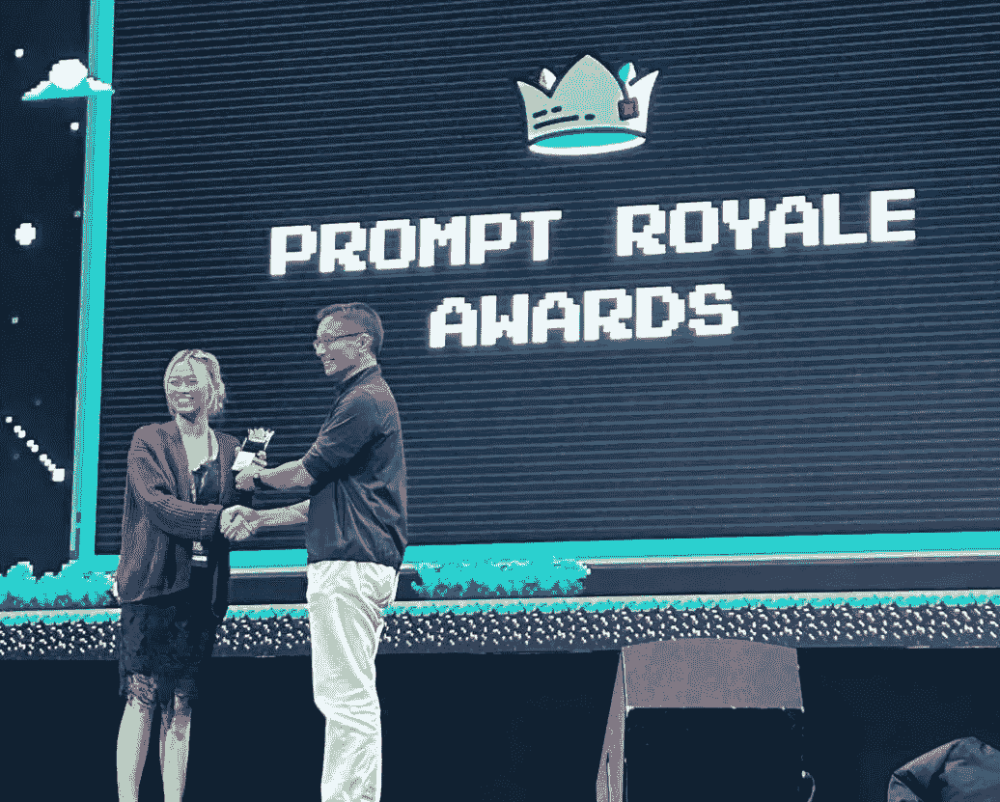

# 我如何赢得新加坡的 GPT-4 提示工程竞赛

> 原文：[`towardsdatascience.com/how-i-won-singapores-gpt-4-prompt-engineering-competition-34c195a93d41?source=collection_archive---------0-----------------------#2023-12-29`](https://towardsdatascience.com/how-i-won-singapores-gpt-4-prompt-engineering-competition-34c195a93d41?source=collection_archive---------0-----------------------#2023-12-29)

## 深入探讨我学到的利用大语言模型（LLMs）力量的策略

 [Sheila Teo](https://medium.com/@sheilateozy?source=post_page-----34c195a93d41--------------------------------)

·

[关注](https://medium.com/m/signin?actionUrl=https%3A%2F%2Fmedium.com%2F_%2Fsubscribe%2Fuser%2Ffca9db1c7da0&operation=register&redirect=https%3A%2F%2Ftowardsdatascience.com%2Fhow-i-won-singapores-gpt-4-prompt-engineering-competition-34c195a93d41&user=Sheila+Teo&userId=fca9db1c7da0&source=post_page-fca9db1c7da0----34c195a93d41---------------------post_header-----------) 发表在 [Towards Data Science](https://towardsdatascience.com/?source=post_page-----34c195a93d41--------------------------------) · 23 分钟阅读 · 2023 年 12 月 29 日

--

庆祝一个里程碑——真正的胜利是宝贵的学习经验！

上个月，我有幸赢得了新加坡首次举办的 GPT-4 提示工程竞赛，这场竞赛汇聚了 400 多位聪明的参与者，由新加坡政府科技局（GovTech）组织。

提示工程是一门将艺术与科学相结合的学科——它既涉及技术理解，也涉及创造力和战略思维。这是我在过程中学到的提示工程策略的汇编，能够推动任何 LLM 做到你所需要的，甚至更多！

> **作者注释：** 在撰写本文时，我试图避免传统的提示工程技术，这些技术已经在网上广泛讨论和记录。相反，我的目标是带来通过实验所学的新见解，以及对某些技术的不同个人理解和方法。希望你会喜欢这篇文章！

**本文涵盖了以下内容，其中** 🔵 **指的是初学者友好的提示技术，而** 🔴 **指的是高级策略：**
